# Khoj Database & API 模块设计文档

## 1. 模块概述

Khoj 的后端架构由两大核心层组成：**Database 层**和 **API 层**，分别基于 Django ORM 和 FastAPI 构建，通过 ASGI 协同工作。

### 1.1 Database 层（Django ORM + PostgreSQL/pgvector）

Database 层负责所有持久化数据的存储、查询与管理，核心技术栈为：

- **Django ORM**：提供对象关系映射，管理数据模型、迁移和数据库连接
- **PostgreSQL**：主数据库，存储结构化业务数据
- **pgvector**：PostgreSQL 扩展，支持向量相似度搜索（用于 Entry 和 UserMemory 的嵌入向量检索）
- **Django Admin (Unfold)**：提供后台管理界面

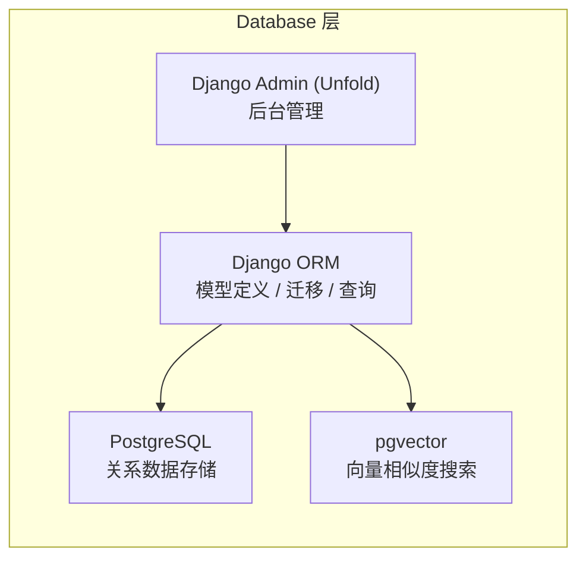

### 1.2 API 层（FastAPI）

API 层基于 FastAPI 构建，负责 HTTP/WebSocket 请求处理、认证、速率限制和业务逻辑编排：

- **FastAPI**：高性能异步 Web 框架，处理 REST API 和 WebSocket
- **Starlette Middleware**：认证、会话、连接管理等中间件
- **APScheduler**：定时任务调度（内容索引、遥测上传等）

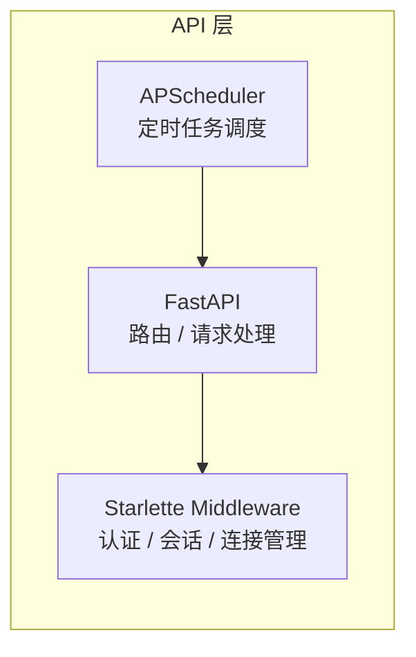

### 1.3 整体架构关系

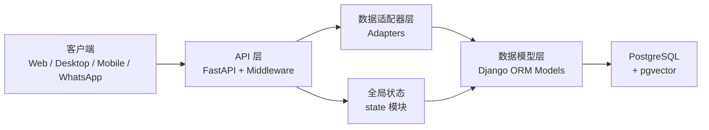

---

## 2. 核心数据模型

### 2.1 模型类图

```mermaid
classDiagram
    class DbBaseModel {
        +DateTimeField created_at
        +DateTimeField updated_at
    }

    class KhojUser {
        +UUIDField uuid
        +PhoneNumberField phone_number
        +BooleanField verified_phone_number
        +BooleanField verified_email
        +CharField email_verification_code
        +DateTimeField email_verification_code_expiry
    }

    class GoogleUser {
        +OneToOneField user
        +CharField sub
        +CharField azp
        +CharField email
        +CharField name
        +CharField given_name
        +CharField family_name
        +CharField picture
        +CharField locale
    }

    class KhojApiUser {
        +ForeignKey user
        +CharField token
        +CharField name
        +DateTimeField accessed_at
    }

    class Subscription {
        +OneToOneField user
        +CharField type
        +BooleanField is_recurring
        +DateTimeField renewal_date
        +DateTimeField enabled_trial_at
    }

    class ClientApplication {
        +CharField name
        +CharField client_id
        +CharField client_secret
    }

    class Conversation {
        +ForeignKey user
        +JSONField conversation_log
        +ForeignKey client
        +CharField slug
        +CharField title
        +ForeignKey agent
        +JSONField file_filters
        +UUIDField id
        +messages() List~ChatMessageModel~
        +pop_message() ChatMessageModel
    }

    class PublicConversation {
        +ForeignKey source_owner
        +JSONField conversation_log
        +CharField slug
        +CharField title
        +ForeignKey agent
    }

    class Agent {
        +ForeignKey creator
        +CharField name
        +TextField personality
        +ArrayField input_tools
        +ArrayField output_modes
        +BooleanField managed_by_admin
        +ForeignKey chat_model
        +CharField slug
        +CharField style_color
        +CharField style_icon
        +CharField privacy_level
        +BooleanField is_hidden
    }

    class Entry {
        +ForeignKey user
        +ForeignKey agent
        +VectorField embeddings
        +TextField raw
        +TextField compiled
        +CharField heading
        +CharField file_source
        +CharField file_type
        +CharField file_path
        +CharField file_name
        +URLField url
        +CharField hashed_value
        +UUIDField corpus_id
        +ForeignKey search_model
        +ForeignKey file_object
    }

    class EntryDates {
        +DateField date
        +ForeignKey entry
    }

    class FileObject {
        +CharField file_name
        +TextField raw_text
        +ForeignKey user
        +ForeignKey agent
    }

    class ChatModel {
        +IntegerField max_prompt_size
        +IntegerField subscribed_max_prompt_size
        +CharField tokenizer
        +CharField name
        +CharField friendly_name
        +CharField model_type
        +CharField price_tier
        +BooleanField vision_enabled
        +ForeignKey ai_model_api
        +TextField description
        +TextField strengths
    }

    class AiModelApi {
        +CharField name
        +CharField api_key
        +URLField api_base_url
    }

    class SearchModelConfig {
        +CharField name
        +CharField model_type
        +CharField bi_encoder
        +JSONField bi_encoder_model_config
        +CharField cross_encoder
        +CharField embeddings_inference_endpoint
        +CharField cross_encoder_inference_endpoint
        +FloatField bi_encoder_confidence_threshold
    }

    class ServerChatSettings {
        +ForeignKey chat_default
        +ForeignKey chat_advanced
        +ForeignKey think_free_fast
        +ForeignKey think_free_deep
        +ForeignKey think_paid_fast
        +ForeignKey think_paid_deep
        +ForeignKey web_scraper
        +IntegerField priority
        +CharField memory_mode
    }

    class TextToImageModelConfig {
        +CharField model_name
        +CharField model_type
        +CharField price_tier
        +CharField api_key
        +ForeignKey ai_model_api
    }

    class SpeechToTextModelOptions {
        +CharField model_name
        +CharField model_type
        +CharField price_tier
        +ForeignKey ai_model_api
    }

    class VoiceModelOption {
        +CharField model_id
        +CharField name
        +CharField price_tier
    }

    class UserConversationConfig {
        +OneToOneField user
        +ForeignKey setting
        +BooleanField enable_memory
    }

    class UserVoiceModelConfig {
        +OneToOneField user
        +ForeignKey setting
    }

    class UserTextToImageModelConfig {
        +OneToOneField user
        +ForeignKey setting
    }

    class ProcessLock {
        +CharField name
        +DateTimeField started_at
        +IntegerField max_duration_in_seconds
    }

    class UserMemory {
        +ForeignKey user
        +ForeignKey agent
        +VectorField embeddings
        +TextField raw
        +ForeignKey search_model
    }

    class ReflectiveQuestion {
        +CharField question
        +ForeignKey user
    }

    class DataStore {
        +CharField key
        +JSONField value
        +BooleanField private
        +ForeignKey owner
    }

    class McpServer {
        +CharField name
        +CharField path
        +CharField api_key
    }

    class RateLimitRecord {
        +CharField identifier
        +CharField slug
    }

    class UserRequests {
        +ForeignKey user
        +CharField slug
    }

    class WebScraper {
        +CharField name
        +CharField type
        +CharField api_key
        +URLField api_url
        +IntegerField priority
    }

    class NotionConfig {
        +CharField token
        +ForeignKey user
    }

    class GithubConfig {
        +CharField pat_token
        +ForeignKey user
    }

    class GithubRepoConfig {
        +CharField name
        +CharField owner
        +CharField branch
        +ForeignKey github_config
    }

    DbBaseModel <|-- KhojUser : AbstractUser
    DbBaseModel <|-- ClientApplication
    DbBaseModel <|-- Subscription
    DbBaseModel <|-- Conversation
    DbBaseModel <|-- PublicConversation
    DbBaseModel <|-- Agent
    DbBaseModel <|-- Entry
    DbBaseModel <|-- EntryDates
    DbBaseModel <|-- FileObject
    DbBaseModel <|-- ChatModel
    DbBaseModel <|-- AiModelApi
    DbBaseModel <|-- SearchModelConfig
    DbBaseModel <|-- ServerChatSettings
    DbBaseModel <|-- TextToImageModelConfig
    DbBaseModel <|-- SpeechToTextModelOptions
    DbBaseModel <|-- VoiceModelOption
    DbBaseModel <|-- UserConversationConfig
    DbBaseModel <|-- UserVoiceModelConfig
    DbBaseModel <|-- UserTextToImageModelConfig
    DbBaseModel <|-- ProcessLock
    DbBaseModel <|-- UserMemory
    DbBaseModel <|-- ReflectiveQuestion
    DbBaseModel <|-- DataStore
    DbBaseModel <|-- McpServer
    DbBaseModel <|-- RateLimitRecord
    DbBaseModel <|-- UserRequests
    DbBaseModel <|-- WebScraper
    DbBaseModel <|-- NotionConfig
    DbBaseModel <|-- GithubConfig
    DbBaseModel <|-- GithubRepoConfig

    KhojUser "1" --o "1" GoogleUser
    KhojUser "1" --o "many" KhojApiUser
    KhojUser "1" --o "1" Subscription
    KhojUser "1" --o "many" Conversation
    KhojUser "1" --o "many" Entry
    KhojUser "1" --o "1" UserConversationConfig
    KhojUser "1" --o "1" UserVoiceModelConfig
    KhojUser "1" --o "1" UserTextToImageModelConfig
    KhojUser "1" --o "many" UserMemory
    KhojUser "1" --o "many" UserRequests
    KhojUser "1" --o "many" FileObject
    KhojUser "1" --o "1" NotionConfig
    KhojUser "1" --o "1" GithubConfig

    Conversation "many" --o "1" Agent
    Conversation "many" --o "1" ClientApplication
    PublicConversation "many" --o "1" Agent

    Agent "1" --o "1" ChatModel
    Agent "1" --o "many" Entry
    Agent "1" --o "many" FileObject

    Entry "many" --o "1" SearchModelConfig
    Entry "many" --o "1" FileObject
    Entry "1" --o "many" EntryDates

    ChatModel "many" --o "0..1" AiModelApi
    ServerChatSettings "1" --o "many" ChatModel
    TextToImageModelConfig "many" --o "0..1" AiModelApi

    GithubConfig "1" --o "many" GithubRepoConfig
```

### 2.2 核心模型说明

| 模型 | 职责 | 关键特性 |
|------|------|----------|
| **KhojUser** | 用户主体，继承 AbstractUser | UUID 标识、手机号/邮箱验证、验证码机制 |
| **GoogleUser** | Google OAuth 关联 | OneToOne 关联 KhojUser，存储 Google profile 信息 |
| **KhojApiUser** | API Token 认证 | 生成 `kk-` 前缀 token，用于桌面/Emacs/Obsidian 客户端 |
| **Subscription** | 用户订阅状态 | trial/standard 两种类型，含续费日期和试用启用时间 |
| **Conversation** | 对话会话 | JSON 存储对话日志，关联 Agent 和 ClientApplication |
| **Entry** | 知识库条目 | pgvector 向量嵌入，支持多种文件类型和来源 |
| **Agent** | AI 代理 | 人格设定、输入/输出工具、隐私级别、关联 ChatModel |
| **ChatModel** | 聊天模型配置 | 支持 OpenAI/Anthropic/Google，含价格层级和视觉能力 |
| **ServerChatSettings** | 服务器全局聊天设置 | 6 个模型槽位（default/advanced/free_fast/free_deep/paid_fast/paid_deep） |
| **ProcessLock** | 进程锁 | 确保 index_content/scheduled_job 等操作的线程安全 |
| **UserMemory** | 用户长期记忆 | pgvector 向量嵌入，支持按 Agent 隔离 |
| **RateLimitRecord** | 速率限制记录 | 按 identifier + slug 索引，支持 IP 和邮箱维度 |
| **McpServer** | MCP 服务器配置 | 名称、路径、API 密钥 |

### 2.3 Pydantic 验证模型

Conversation 的 `conversation_log` JSON 字段通过 Pydantic 模型进行结构验证：

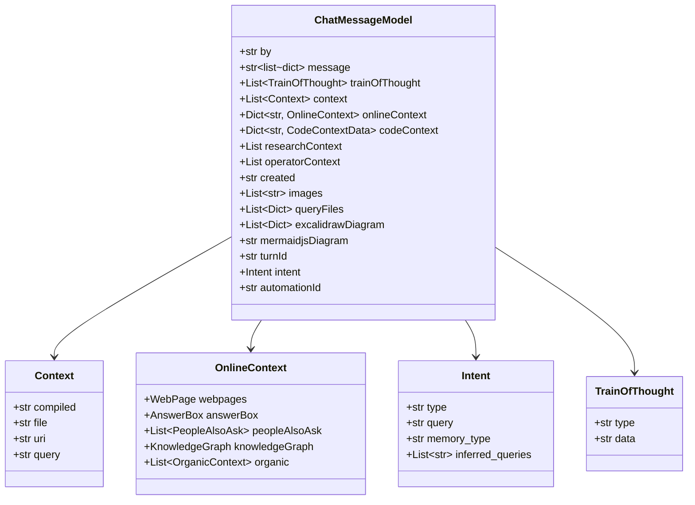

---

## 3. 数据适配器层

### 3.1 设计模式

适配器层采用**静态方法类**（Static Method Class）模式，每个领域对应一个 Adapter 类，所有方法均为 `@staticmethod` 或 `@classmethod`。同时提供同步和异步（`a` 前缀）两套方法。

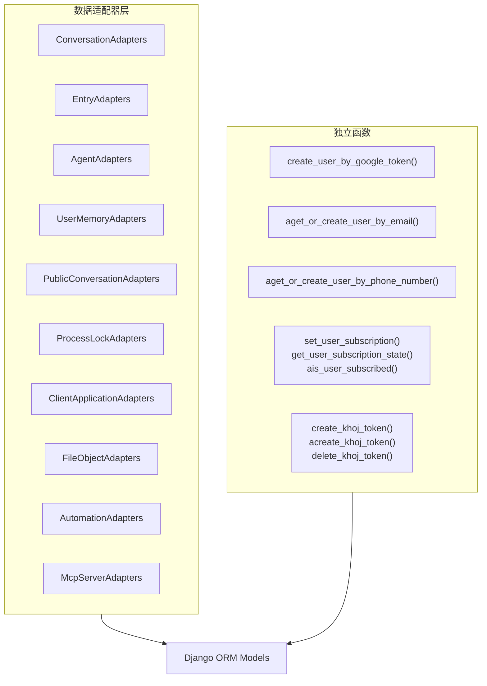

### 3.2 装饰器模式

适配器层使用两个核心装饰器确保用户参数有效性：

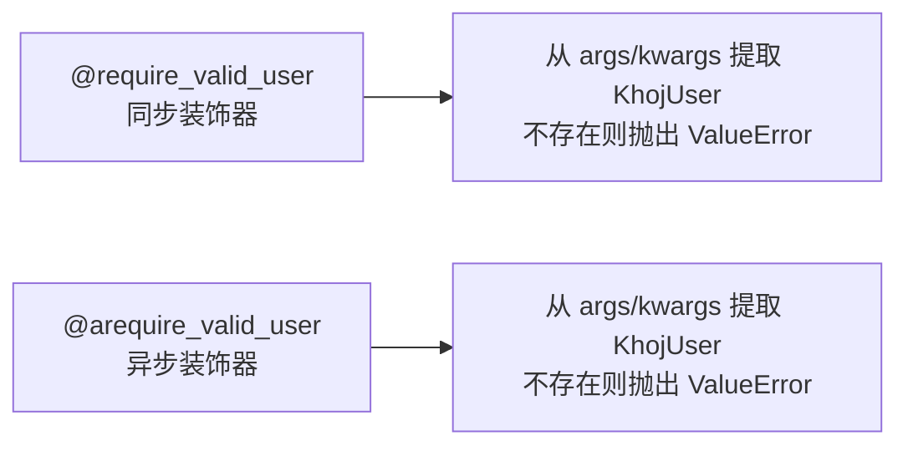

### 3.3 关键适配器详解

#### ConversationAdapters

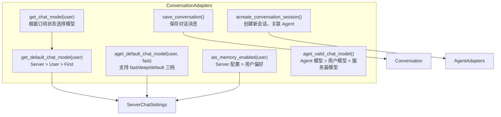

**ChatModel 选择优先级**：

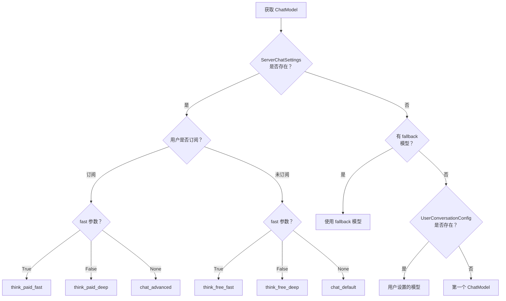

#### EntryAdapters

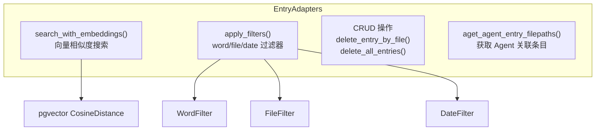

#### AgentAdapters

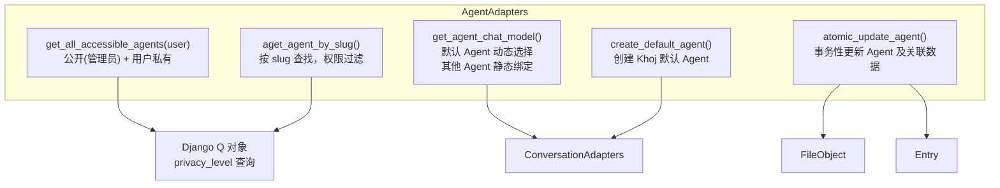

#### UserMemoryAdapters

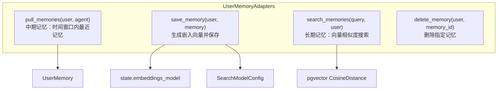

#### ProcessLockAdapters

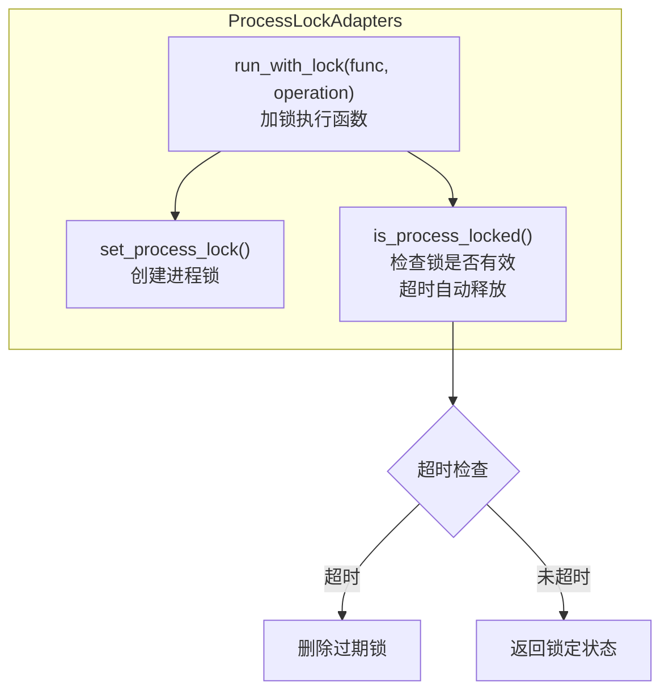

### 3.4 适配器方法汇总

| 适配器 | 核心方法 | 说明 |
|--------|----------|------|
| **ConversationAdapters** | `get_chat_model` / `aget_default_chat_model` | 根据订阅和速度偏好选择 ChatModel |
| | `save_conversation` / `acreate_conversation_session` | 对话持久化和会话创建 |
| | `ais_memory_enabled` | 检查记忆功能是否启用 |
| **EntryAdapters** | `search_with_embeddings` | pgvector 向量搜索 |
| | `apply_filters` | word/file/date 组合过滤 |
| | `adelete_all_entries` | 批量删除（分批处理） |
| **AgentAdapters** | `get_all_accessible_agents` | 获取用户可访问的 Agent 列表 |
| | `atomic_update_agent` | 事务性更新 Agent 及关联 FileObject/Entry |
| | `aget_agent_chat_model` | 获取 Agent 的 ChatModel（默认 Agent 动态选择） |
| **UserMemoryAdapters** | `pull_memories` / `search_memories` | 中期/长期记忆检索 |
| | `save_memory` | 生成嵌入并保存记忆 |
| **ProcessLockAdapters** | `run_with_lock` | 加锁执行，超时自动释放 |
| **PublicConversationAdapters** | `get_public_conversation_by_slug` | 按 slug 获取公开对话 |
| **ClientApplicationAdapters** | `aget_client_application_by_id` | WhatsApp 客户端认证 |

---

## 4. API 路由架构

### 4.1 路由组织结构

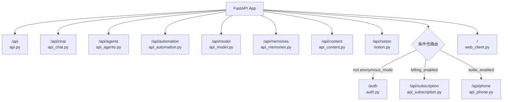

### 4.2 条件性路由注册逻辑

路由注册在 `configure.py` 的 `configure_routes()` 函数中完成，部分路由根据运行时配置条件性注册：

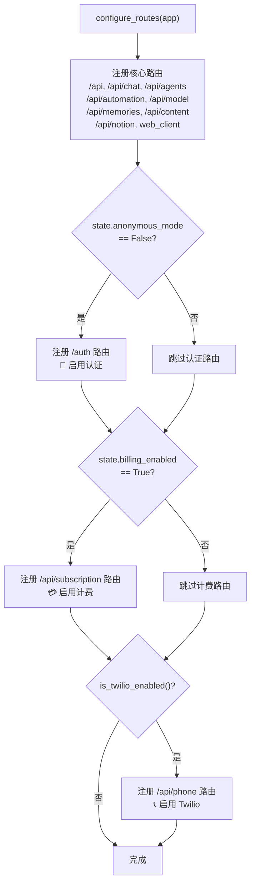

### 4.3 核心 API 端点

#### /api — 基础 API

| 方法 | 路径 | 认证 | 说明 |
|------|------|------|------|
| DELETE | `/self` | authenticated | 删除当前用户 |
| GET | `/search` | authenticated | 搜索知识库 |
| GET | `/update` | authenticated | 更新内容索引 |
| POST | `/transcribe` | authenticated | 语音转文字 |
| GET | `/settings` | authenticated | 获取用户设置 |
| PATCH | `/user/name` | authenticated | 设置用户名 |
| PATCH | `/user/memory` | authenticated | 启用/禁用记忆 |
| GET | `/health` | authenticated | 健康检查 |
| GET | `/v1/user` | authenticated | 获取用户信息 |

#### /api/chat — 聊天 API

| 方法 | 路径 | 认证 | 说明 |
|------|------|------|------|
| POST | `` | authenticated | 发送聊天消息（SSE 流式/非流式） |
| WebSocket | `/ws` | authenticated | WebSocket 聊天（支持中断） |
| GET | `/history` | authenticated | 获取对话历史 |
| GET | `/sessions` | authenticated | 获取会话列表 |
| POST | `/sessions` | authenticated | 创建新会话 |
| DELETE | `/history` | authenticated | 清除对话历史 |
| POST | `/share` | authenticated | 分享对话为公开 |
| GET | `/share/history` | 无需认证 | 获取公开对话 |
| POST | `/share/fork` | authenticated | 复制公开对话到私有 |
| GET | `/starters` | authenticated | 获取对话启动建议 |
| POST | `/speech` | authenticated | 文字转语音 |
| PATCH | `/title` | authenticated | 设置对话标题 |

#### /auth — 认证 API

| 方法 | 路径 | 说明 |
|------|------|------|
| GET/POST | `/login` | Google OAuth 登录 |
| POST | `/magic` | Magic Link 邮箱登录 |
| GET | `/magic` | Magic Link 验证 |
| GET/POST | `/redirect` | Google OAuth 回调 |
| POST | `/token` | 生成 API Token |
| GET | `/token` | 获取 API Token 列表 |
| DELETE | `/token` | 删除 API Token |
| GET | `/logout` | 登出 |

---

## 5. 认证流程时序图

### 5.1 Google OAuth Session 认证

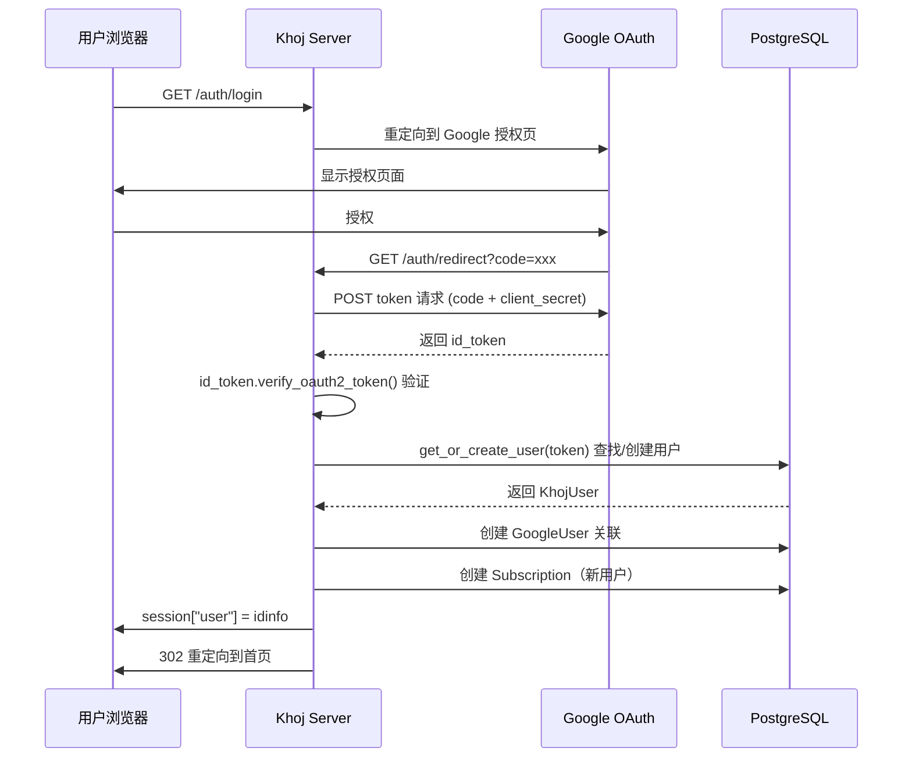

### 5.2 Magic Link 邮箱认证

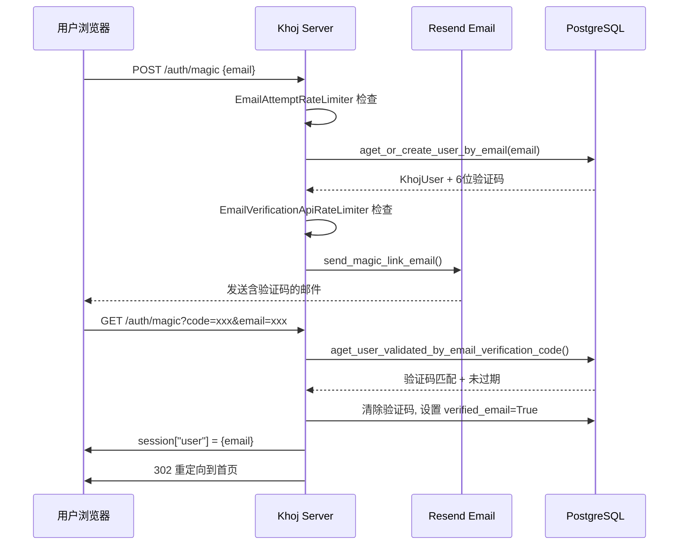

### 5.3 Bearer Token API 客户端认证

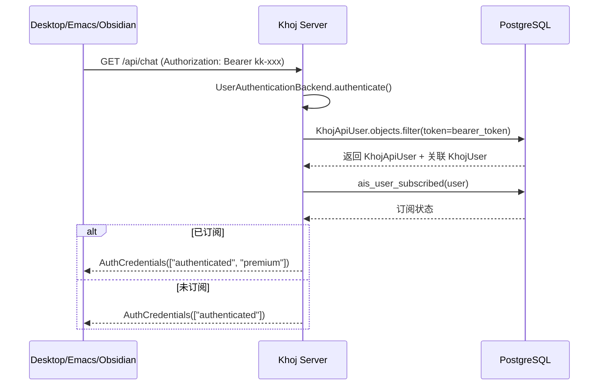

### 5.4 WhatsApp Client 认证

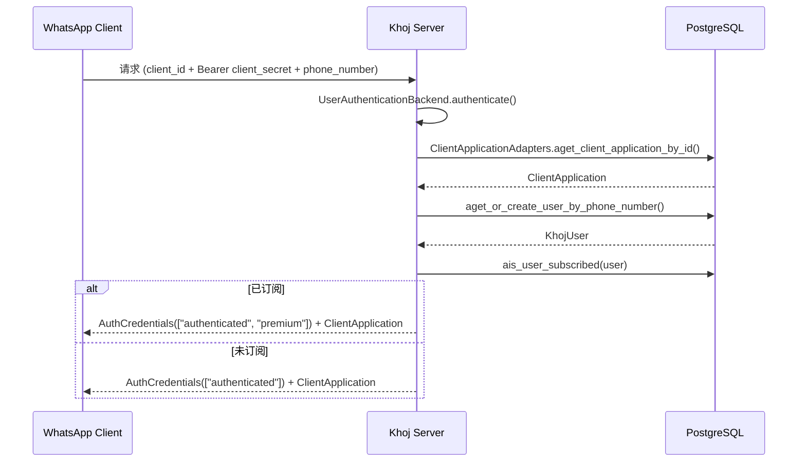

### 5.5 匿名模式认证

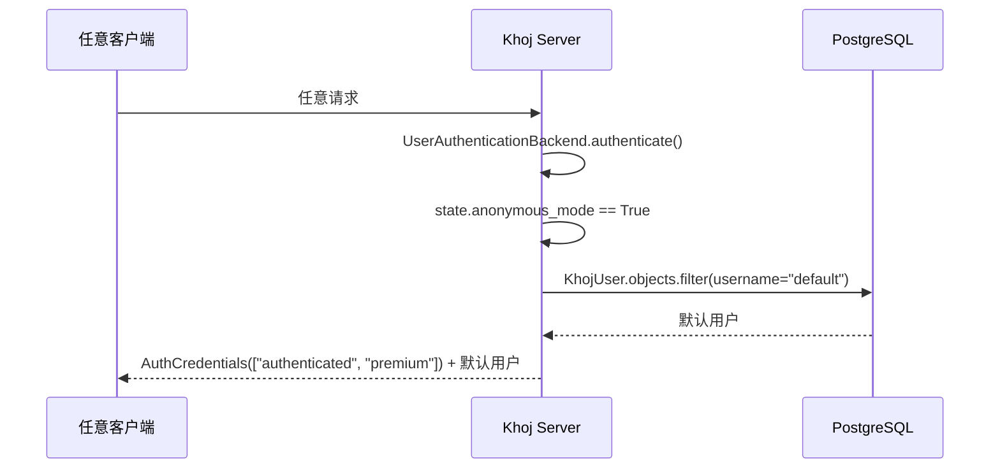

### 5.6 认证流程总览

```mermaid
flowchart TD
    Start["UserAuthenticationBackend.authenticate()"] --> CheckSession{"Session 中<br/>有 user email?"}
    CheckSession -->|是| QueryUser["查询 KhojUser<br/>检查订阅状态"]
    CheckSession -->|否| CheckBearer{"Authorization<br/>Bearer Token?"}
    CheckBearer -->|是| QueryToken["查询 KhojApiUser<br/>获取关联用户"]
    CheckBearer -->|否| CheckClient{"client_id<br/>查询参数?"}
    CheckClient -->|是| WhatsAppAuth["验证 ClientApplication<br/>获取/创建手机号用户"]
    CheckClient -->|否| CheckAnonymous{"anonymous_mode?"}
    CheckAnonymous -->|是| DefaultUser["使用默认用户<br/>premium 权限"]
    CheckAnonymous -->|否| Unauthenticated["UnauthenticatedUser"]

    QueryUser --> Subscribed{"已订阅?"}
    QueryToken --> Subscribed
    WhatsAppAuth --> Subscribed

    Subscribed -->|是| Premium["authenticated + premium"]
    Subscribed -->|否| AuthOnly["authenticated"]
```

---

## 6. 中间件链

### 6.1 中间件执行顺序

中间件按添加顺序的**逆序**执行（洋葱模型），即最后添加的中间件最先处理请求：

```mermaid
flowchart TD
    subgraph MiddlewareChain["请求处理中间件链（从外到内）"]
        direction TB
        M1["1. SessionMiddleware<br/>会话管理<br/>secret_key from env"]
        M2["2. NextJsMiddleware<br/>/_next 路径重写<br/>→ /static/_next"]
        M3["3. ServerErrorMiddleware<br/>5xx 错误处理<br/>Web 路由重定向到 /server/error"]
        M4["4. AuthenticationMiddleware<br/>用户认证<br/>UserAuthenticationBackend"]
        M5["5. AsyncCloseConnectionsMiddleware<br/>关闭旧数据库连接<br/>防止连接泄漏"]
        M6["6. SuppressClientDisconnectMiddleware<br/>抑制客户端断开异常<br/>返回 499 状态码"]
        M7["7. HTTPSRedirectMiddleware<br/>HTTP→HTTPS 重定向<br/>（仅 ssl_enabled 时）"]
    end

    M1 --> M2 --> M3 --> M4 --> M5 --> M6 --> M7
```

### 6.2 中间件执行流程

```mermaid
sequenceDiagram
    participant Client
    participant Session as SessionMiddleware
    participant NextJS as NextJsMiddleware
    participant ServerErr as ServerErrorMiddleware
    participant Auth as AuthenticationMiddleware
    participant CloseConn as AsyncCloseConnectionsMiddleware
    participant Suppress as SuppressClientDisconnectMiddleware
    participant App as FastAPI App

    Client->>Session: HTTP Request
    Session->>NextJS: 传递请求
    NextJS->>ServerErr: 传递请求
    ServerErr->>Auth: 传递请求
    Auth->>CloseConn: 传递请求
    CloseConn->>CloseConn: close_old_connections() x2
    CloseConn->>Suppress: 传递请求
    Suppress->>App: 传递请求
    App-->>Suppress: Response
    Suppress-->>CloseConn: Response
    CloseConn->>CloseConn: 可选 close_all connections
    CloseConn-->>Auth: Response
    Auth-->>ServerErr: Response
    ServerErr-->>NextJS: Response
    NextJS-->>Session: Response
    Session-->>Client: HTTP Response
```

### 6.3 各中间件职责

| 顺序 | 中间件 | 职责 | 关键行为 |
|------|--------|------|----------|
| 1 | **SessionMiddleware** | 会话管理 | 使用 `KHOJ_DJANGO_SECRET_KEY` 加密会话，存储 `user` 信息 |
| 2 | **NextJsMiddleware** | 静态资源路由 | 将 `/_next` 路径重写为 `/static/_next` |
| 3 | **ServerErrorMiddleware** | 服务器错误处理 | 5xx 错误时 Web 路由重定向到 `/server/error`，API 路由直接返回错误 |
| 4 | **AuthenticationMiddleware** | 用户认证 | 调用 `UserAuthenticationBackend.authenticate()` 解析用户身份 |
| 5 | **AsyncCloseConnectionsMiddleware** | 数据库连接管理 | 请求前后调用 `close_old_connections()`，防止 "connection already closed" 错误 |
| 6 | **SuppressClientDisconnectMiddleware** | 客户端断开处理 | 捕获 `ClientDisconnect` 异常，返回 499 状态码 |
| 7 | **HTTPSRedirectMiddleware** | HTTPS 重定向 | 仅在 `ssl_enabled=True` 时添加，自动 HTTP→HTTPS |

---

## 7. 速率限制

### 7.1 速率限制架构

Khoj 实现了多层次的速率限制机制，基于 `UserRequests` 和 `RateLimitRecord` 两个数据模型：

```mermaid
flowchart TB
    subgraph RateLimitSystem["速率限制系统"]
        direction TB
        APIUser["ApiUserRateLimiter<br/>API 请求频率限制"]
        ConvCmd["ConversationCommandRateLimiter<br/>对话命令频率限制"]
        EmailAttempt["EmailAttemptRateLimiter<br/>邮箱登录尝试限制"]
        EmailVerify["EmailVerificationApiRateLimiter<br/>邮箱验证频率限制"]
        ImageLimit["ApiImageRateLimiter<br/>图片数量/大小限制"]
        WSConn["WebSocketConnectionManager<br/>WebSocket 连接数限制"]
    end

    APIUser --> UserRequests
    ConvCmd --> UserRequests
    EmailVerify --> UserRequests
    EmailAttempt --> RateLimitRecord
```

### 7.2 速率限制器详解

#### ApiUserRateLimiter

```mermaid
flowchart TD
    Start["ApiUserRateLimiter.__call__()"] --> CheckBilling{"billing_enabled?"}
    CheckBilling -->|否| Pass["跳过限制"]
    CheckBilling -->|是| CheckAuth{"用户已认证?"}
    CheckAuth -->|否| Pass
    CheckAuth -->|是| CheckSub{"用户已订阅?"}
    CheckSub -->|是| CountSub["统计窗口内请求数"]
    CheckSub -->|否| CountFree["统计窗口内请求数"]
    CountSub --> CheckSubLimit{"count >= subscribed_requests?"}
    CountFree --> CheckFreeLimit{"count >= requests?"}
    CheckSubLimit -->|是| HTTP429["HTTP 429"]
    CheckSubLimit -->|否| Record["记录请求"]
    CheckFreeLimit -->|是| HTTP429
    CheckFreeLimit -->|否| Record
```

#### 速率限制配置

| 限制器 | 适用场景 | 免费用户限制 | 订阅用户限制 | 时间窗口 |
|--------|----------|-------------|-------------|----------|
| **ApiUserRateLimiter** (chat_minute) | 聊天 API | 20 次/分钟 | 20 次/分钟 | 60s |
| **ApiUserRateLimiter** (chat_day) | 聊天 API | 100 次/天 | 600 次/天 | 86400s |
| **ApiUserRateLimiter** (transcribe_minute) | 语音转文字 | 20 次/分钟 | 20 次/分钟 | 60s |
| **ApiUserRateLimiter** (transcribe_day) | 语音转文字 | 60 次/天 | 600 次/天 | 86400s |
| **ConversationCommandRateLimiter** (command) | Research 命令 | 20 次/天 | 75 次/天 | 86400s |
| **EmailAttemptRateLimiter** | Magic Link 登录 | 20 次/天/IP | - | 86400s |
| **EmailVerificationApiRateLimiter** | 邮箱验证 | 10 次/天/用户 | - | 86400s |
| **ApiImageRateLimiter** | 图片上传 | 10 张/消息, 20MB | 10 张/消息, 20MB | 每消息 |
| **WebSocketConnectionManager** | WebSocket 连接 | 5 个连接 | 10 个连接 | 持久 |

### 7.3 速率限制数据清理

```mermaid
flowchart LR
    Schedule["@schedule.every(31).minutes<br/>delete_old_user_requests()"] --> DeleteUser["delete_user_requests()<br/>删除 >1天 的 UserRequests"]
    Schedule --> DeleteRate["delete_ratelimit_records()<br/>删除 >1天 的 RateLimitRecord"]
```

### 7.4 速率限制流程（以聊天 API 为例）

```mermaid
sequenceDiagram
    participant Client
    participant FastAPI
    participant RateLimiter as ApiUserRateLimiter
    participant DB as PostgreSQL

    Client->>FastAPI: POST /api/chat
    FastAPI->>RateLimiter: chat_minute 限制器检查
    RateLimiter->>DB: 查询 UserRequests (user, slug, window=60s)
    DB-->>RateLimiter: count
    alt count >= 20
        RateLimiter-->>Client: HTTP 429 Rate Limit
    end
    RateLimiter->>DB: 创建 UserRequests 记录

    FastAPI->>RateLimiter: chat_day 限制器检查
    RateLimiter->>DB: 查询 UserRequests (user, slug, window=86400s)
    DB-->>RateLimiter: count
    alt 免费用户 count >= 100
        RateLimiter-->>Client: HTTP 429 + 升级提示
    else 订阅用户 count >= 600
        RateLimiter-->>Client: HTTP 429
    end
    RateLimiter->>DB: 创建 UserRequests 记录

    FastAPI->>FastAPI: 处理聊天请求
    FastAPI-->>Client: 返回响应
```

---

## 8. Agent 系统

### 8.1 Agent 模型设计

Agent 是 Khoj 中的 AI 代理抽象，每个 Agent 拥有独立的人格、工具配置和模型绑定：

```mermaid
classDiagram
    class Agent {
        +ForeignKey creator
        +CharField name
        +TextField personality
        +ArrayField input_tools
        +ArrayField output_modes
        +BooleanField managed_by_admin
        +ForeignKey chat_model
        +CharField slug
        +CharField style_color
        +CharField style_icon
        +CharField privacy_level
        +BooleanField is_hidden
    }

    class AgentStyleColorTypes {
        <<enumeration>>
        BLUE
        GREEN
        RED
        YELLOW
        ORANGE
        PURPLE
        PINK
        TEAL
        CYAN
        LIME
        INDIGO
        FUCHSIA
        ROSE
        SKY
        AMBER
        EMERALD
    }

    class AgentStyleIconTypes {
        <<enumeration>>
        LIGHTBULB
        HEALTH
        ROBOT
        APERTURE
        GRADUATION_CAP
        CODE
        HEART
        LEAF
        ...
    }

    class AgentPrivacyLevel {
        <<enumeration>>
        PUBLIC
        PRIVATE
        PROTECTED
    }

    class AgentInputToolOptions {
        <<enumeration>>
        GENERAL
        ONLINE
        NOTES
        WEBPAGE
        CODE
    }

    class AgentOutputModeOptions {
        <<enumeration>>
        IMAGE
        DIAGRAM
    }

    Agent --> AgentStyleColorTypes
    Agent --> AgentStyleIconTypes
    Agent --> AgentPrivacyLevel
    Agent --> AgentInputToolOptions
    Agent --> AgentOutputModeOptions
```

### 8.2 Agent 与对话的关联

```mermaid
erDiagram
    KhojUser ||--o{ Conversation : "拥有"
    KhojUser ||--o{ Agent : "创建"
    Agent ||--o{ Conversation : "参与"
    Agent ||--o{ Entry : "知识库"
    Agent ||--o{ FileObject : "参考文件"
    Agent ||--o{ UserMemory : "记忆"
    Agent }o--|| ChatModel : "使用"
    Conversation }o--o| ClientApplication : "来自"

    Agent {
        int id PK
        string name
        string slug UK
        string personality
        string privacy_level
        boolean managed_by_admin
        boolean is_hidden
        int chat_model_id FK
        int creator_id FK
    }

    Conversation {
        uuid id PK
        json conversation_log
        string slug
        string title
        json file_filters
        int user_id FK
        int agent_id FK
        int client_id FK
    }
```

### 8.3 Agent 访问控制

```mermaid
flowchart TD
    Start["获取 Agent"] --> CheckPrivacy{"privacy_level?"}
    CheckPrivacy -->|PUBLIC| Accessible["✅ 所有人可访问"]
    CheckPrivacy -->|PROTECTED| ProtectedAccess["✅ 所有人可访问<br/>（只读）"]
    CheckPrivacy -->|PRIVATE| CheckCreator{"creator == user?"}
    CheckCreator -->|是| Accessible
    CheckCreator -->|否| Denied["❌ 不可访问"]

    subgraph AgentList["get_all_accessible_agents()"]
        PublicQuery["公开 Agent<br/>managed_by_admin=True<br/>privacy_level=PUBLIC"]
        UserQuery["用户私有 Agent<br/>creator=user<br/>is_hidden=False"]
    end
```

### 8.4 默认 Agent 机制

```mermaid
flowchart TD
    Start["create_default_agent()"] --> CheckExist{"Khoj Agent<br/>已存在?"}
    CheckExist -->|是| Update["更新默认 Agent<br/>personality + chat_model + slug"]
    CheckExist -->|否| Create["创建默认 Agent<br/>name=Khoj, slug=khoj<br/>privacy_level=PUBLIC<br/>managed_by_admin=True"]
    Create --> Migrate["迁移无 Agent 的对话<br/>Conversation.agent=None → Khoj Agent"]
    Update --> Done
    Migrate --> Done

    subgraph DefaultAgentBehavior["默认 Agent 特殊行为"]
        DynamicModel["动态选择 ChatModel<br/>不使用静态绑定的 chat_model<br/>而是通过 ConversationAdapters<br/>根据用户/服务器设置动态选择"]
    end
```

### 8.5 Agent 在对话中的角色

```mermaid
sequenceDiagram
    participant User
    participant ChatAPI as /api/chat
    participant ConvAdapter as ConversationAdapters
    participant AgentAdapter as AgentAdapters
    participant DB as PostgreSQL

    User->>ChatAPI: POST /api/chat {q, conversation_id}
    ChatAPI->>ConvAdapter: aget_conversation_by_user()
    ConvAdapter->>DB: 查询 Conversation
    DB-->>ConvAdapter: Conversation + Agent
    ConvAdapter-->>ChatAPI: conversation

    ChatAPI->>AgentAdapter: aget_default_agent()
    AgentAdapter->>DB: 查询默认 Agent
    DB-->>AgentAdapter: Khoj Agent

    alt conversation.agent == default_agent
        ChatAPI->>AgentAdapter: aget_agent_chat_model(agent, user)
        AgentAdapter->>ConvAdapter: get_default_chat_model(user)
        Note over ChatAPI,ConvAdapter: 默认 Agent 动态选择模型
    else conversation.agent != default_agent
        ChatAPI->>AgentAdapter: aget_agent_chat_model(agent, user)
        AgentAdapter-->>ChatAPI: agent.chat_model（静态绑定）
    end

    ChatAPI->>ChatAPI: 使用 Agent 的 personality 作为系统提示
    ChatAPI->>ChatAPI: 使用 Agent 的 input_tools/output_modes 控制工具选择
    ChatAPI->>ChatAPI: 搜索 Agent 关联的 Entry 作为知识库
    ChatAPI->>ChatAPI: 搜索 Agent 关联的 UserMemory 作为记忆
```

### 8.6 Hidden Agent 机制

Khoj 支持**隐藏 Agent**（`is_hidden=True`），用于内部自动化场景：

```mermaid
flowchart TD
    Start["aupdate_hidden_agent()"] --> GenerateName["生成随机内部名称<br/>generate_random_internal_agent_name()"]
    GenerateName --> SetPrivacy["privacy_level=PRIVATE<br/>style_icon=LIGHTBULB<br/>style_color=BLUE"]
    SetPrivacy --> SetHidden["is_hidden=True"]
    SetHidden --> Update["调用 aupdate_agent()"]
```

隐藏 Agent 不会出现在用户的 Agent 列表中，但可以关联到对话，用于特定场景（如自动化任务）的隔离人格设定。

### 8.7 Agent 创建验证

通过 Django `pre_save` 信号实现 Agent 名称唯一性验证：

```mermaid
flowchart TD
    Start["Agent.pre_save 信号"] --> IsNew{"新实例?"}
    IsNew -->|否| Pass["通过"]
    IsNew -->|是| CheckPublic{"同名 PUBLIC Agent<br/>已存在?"}
    CheckPublic -->|是| Error1["ValidationError<br/>公开 Agent 名称重复"]
    CheckPublic -->|否| CheckPrivate{"同名私有 Agent<br/>同 creator 已存在?"}
    CheckPrivate -->|是| Error2["ValidationError<br/>私有 Agent 名称重复"]
    CheckPrivate -->|否| Pass
```

---

## 附录：Django Admin 配置

Django Admin 使用 Unfold 主题，注册了所有核心模型：

| 模型 | Admin 类 | 特殊功能 |
|------|----------|----------|
| KhojUser | KhojUserAdmin | 自定义过滤器（Google Auth、注册时间）、邮箱登录 URL 操作 |
| Conversation | ConversationAdmin | CSV 导出（完整/精简）、仅超级用户可导出 |
| Agent | AgentAdmin | 按 privacy_level 过滤 |
| Entry | EntryAdmin | 按文件类型、用户邮箱、搜索模型过滤 |
| Subscription | KhojUserSubscriptionAdmin | 按订阅类型过滤 |
| ChatModel | ChatModelAdmin | 显示 AI Model API 关联 |
| ServerChatSettings | ServerChatSettingsAdmin | 按 priority 排序 |
| WebScraper | WebScraperAdmin | 按 priority 排序 |
| UserConversationConfig | UserConversationConfigAdmin | 显示用户邮箱、聊天模型、订阅类型 |
| DjangoJob | KhojDjangoJobAdmin | 显示 Job Info、支持搜索 |
