# Khoj 整体架构设计 (design.md)

## 1. 架构总览

Khoj 采用 **FastAPI + Django 混合架构**，FastAPI 作为主 Web 框架处理异步 API 请求，Django 作为 ORM 层管理数据持久化和 Admin 后台。两者通过 ASGI 协议在同一进程中运行。

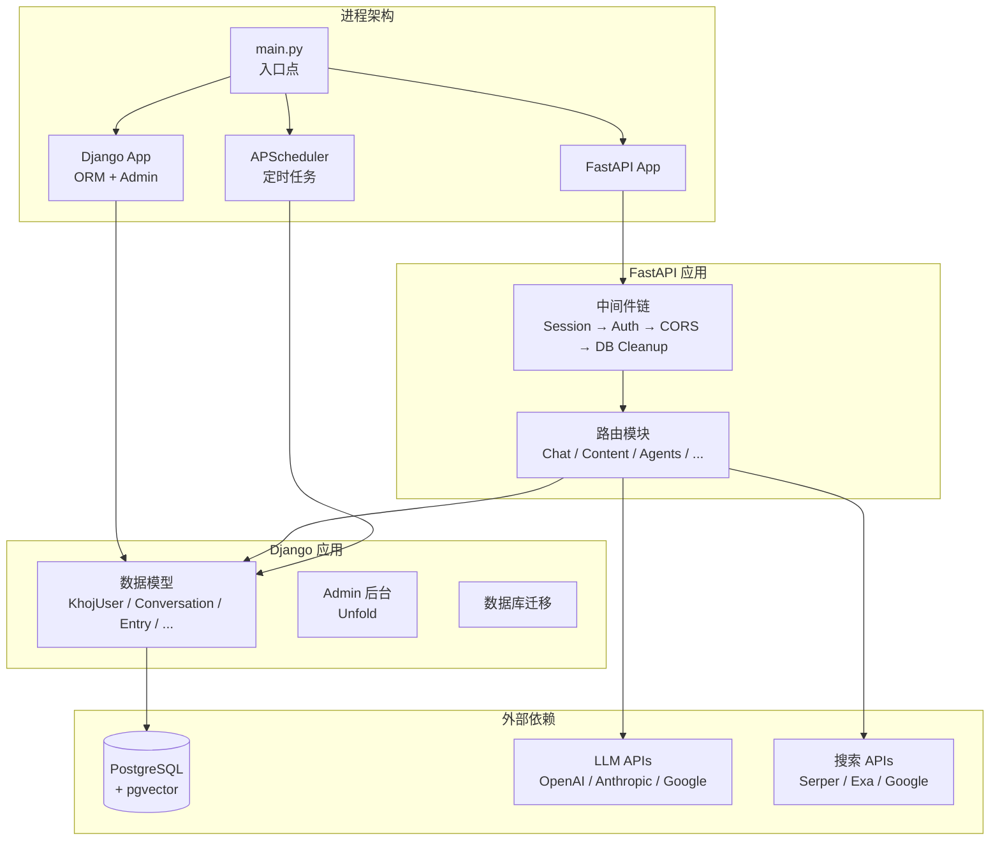

---

## 2. 启动流程

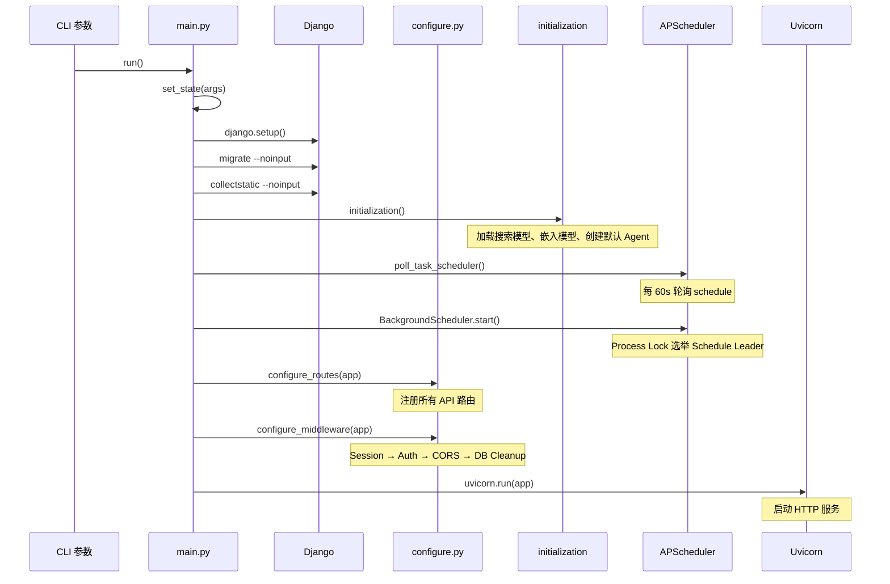

---

## 3. 请求处理流程

### 3.1 中间件链

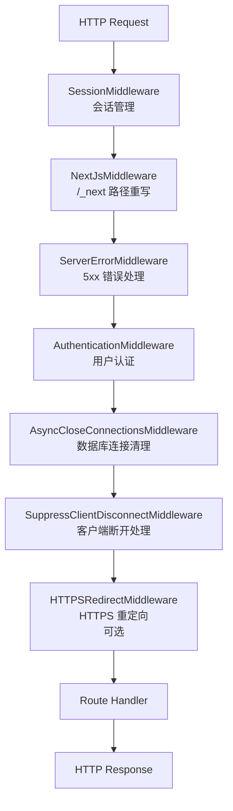

### 3.2 认证决策流程

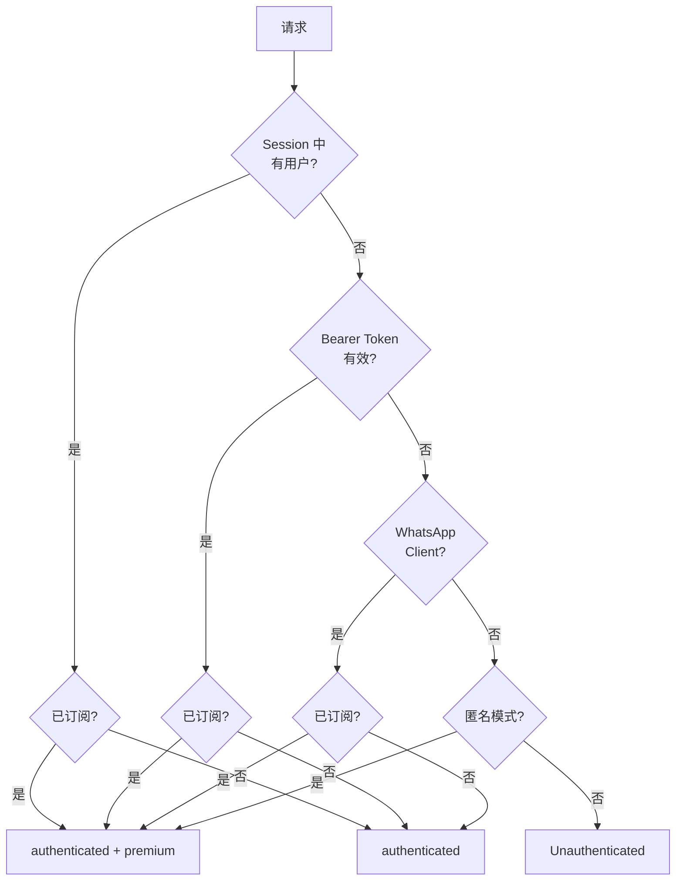

---

## 4. 核心模块交互

### 4.1 对话请求完整流程

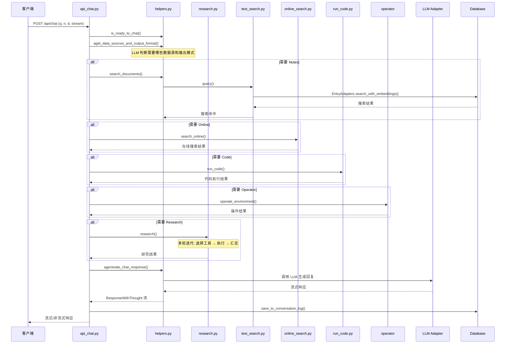

### 4.2 内容索引流程

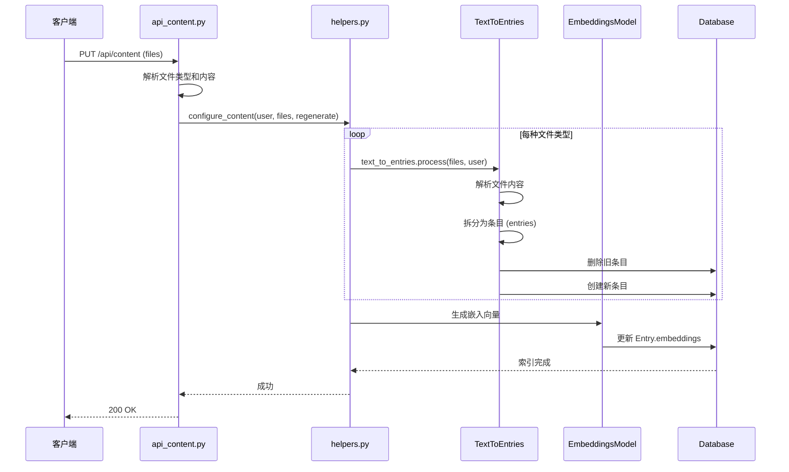

---

## 5. 模块依赖关系

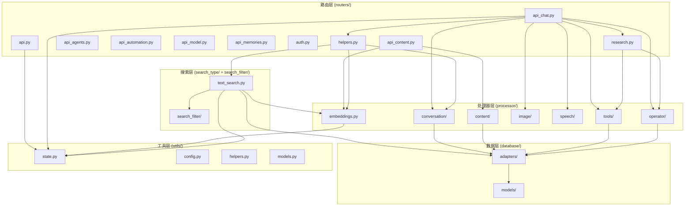

---

## 6. 状态管理

### 6.1 全局状态 (state.py)

Khoj 使用模块级全局变量管理应用状态：

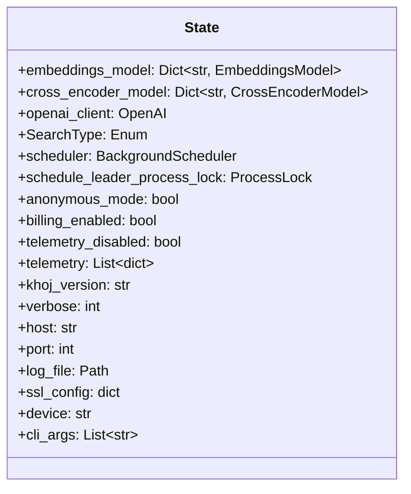

### 6.2 搜索模型初始化

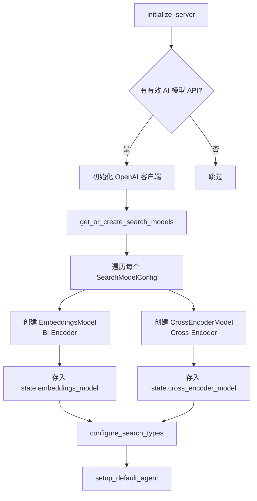

---

## 7. 定时任务

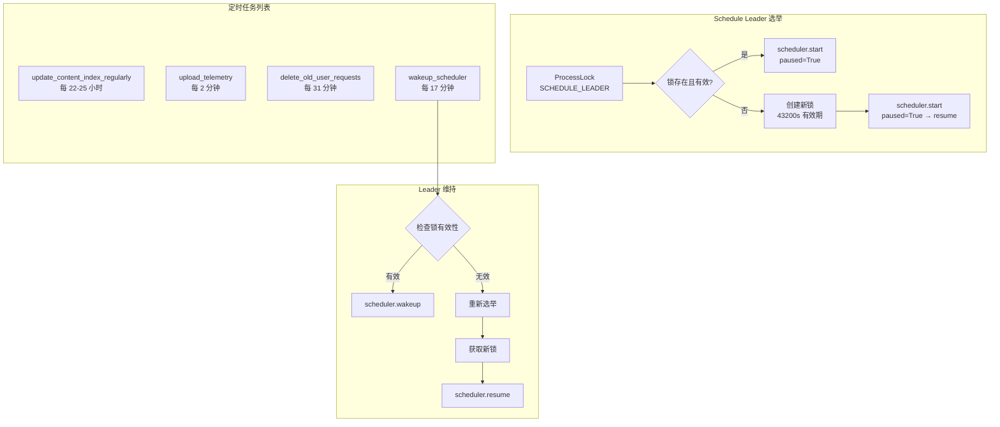

---

## 8. 错误处理策略

### 8.1 LLM 调用回退

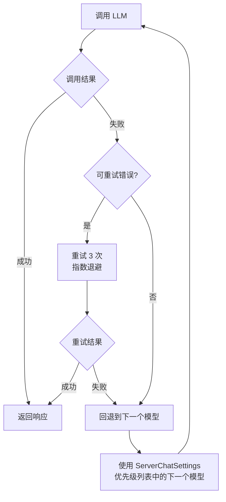

### 8.2 可重试错误类型

| 提供商 | 可重试错误 |
|--------|-----------|
| OpenAI | RateLimitError, InternalServerError, APITimeoutError |
| Anthropic | RateLimitError, APIError |
| Google | 429, 500, 502, 503, 504 错误码 |
| 通用 | httpx.TimeoutException, httpx.NetworkError, ValueError |

---

## 9. 关键设计决策

### 9.1 FastAPI + Django 混合架构

**决策**: 使用 FastAPI 作为主 Web 框架，Django 仅作为 ORM 和 Admin 层。

**原因**:
- FastAPI 原生支持异步，适合 LLM 流式响应
- Django ORM 成熟稳定，Admin 后台开箱即用
- Django 的迁移系统可靠管理数据库 Schema 演化

**代价**:
- 需要手动管理数据库连接清理（AsyncCloseConnectionsMiddleware）
- 两个框架的中间件链独立运行

### 9.2 pgvector 向量搜索

**决策**: 使用 PostgreSQL + pgvector 而非独立向量数据库。

**原因**:
- 减少运维复杂度（单一数据库）
- 事务一致性（向量与业务数据在同一数据库）
- pgvector 对 Khoj 的数据规模足够高效

### 9.3 全局状态管理

**决策**: 使用模块级全局变量（state.py）管理应用状态。

**原因**:
- 嵌入模型加载耗时，需要全局缓存
- 搜索模型配置在运行时不变
- 简单直接，适合单进程部署

**代价**:
- 不适合多进程共享（需要 Process Lock 机制）
- 测试时需要手动重置状态

### 9.4 Process Lock 分布式调度

**决策**: 使用数据库 ProcessLock 实现分布式调度 Leader 选举。

**原因**:
- 避免多 Worker 重复执行定时任务
- 基于数据库实现，无需额外依赖（如 Redis）
- 自动过期机制防止死锁

---

## 10. 核心模块设计文档索引

| 模块 | 文档路径 | 核心内容 |
|------|----------|----------|
| Conversation | [conversation-module-design.md](./conversation-module-design.md) | 对话流程、多模型适配、流式响应、上下文管理、工具调用 |
| Search | [search-module-design.md](./search-module-design.md) | 双编码器架构、向量搜索、过滤器、结果排序 |
| Content | [content-module-design.md](./content-module-design.md) | 文档解析、TextToEntries 基类、增量索引 |
| Database & API | [database-api-module-design.md](./database-api-module-design.md) | 数据模型、适配器层、认证流程、速率限制、Agent 系统 |
| Tools & Operator | [tools-operator-module-design.md](./tools-operator-module-design.md) | 在线搜索、代码执行、MCP、Operator 架构、Research 模块 |
