# Khoj Search 模块设计文档

## 1. 模块概述

Search 模块是 Khoj 系统的核心检索引擎，负责将用户的自然语言查询转化为语义向量，在知识库中进行高效检索，并返回最相关的文档片段。该模块采用 **双编码器（Bi-Encoder + Cross-Encoder）** 两阶段搜索架构，结合 PostgreSQL + pgvector 实现向量存储与检索，并支持日期、文件、关键词等多种过滤器对搜索结果进行精确筛选。

### 核心职责

| 职责 | 说明 |
|------|------|
| 语义嵌入 | 将文本转化为高维向量表示，支持本地模型和远程推理服务 |
| 向量检索 | 基于 pgvector 的余弦距离进行近似最近邻搜索 |
| 结果重排序 | 使用 Cross-Encoder 对初筛结果进行精排 |
| 过滤筛选 | 支持日期范围、文件路径、关键词的精确过滤 |
| 查询推断 | 从用户对话中推断出最优搜索查询 |
| 结果去重 | 基于 corpus_id 和 hashed_value 去除重复结果 |

### 模块架构总览

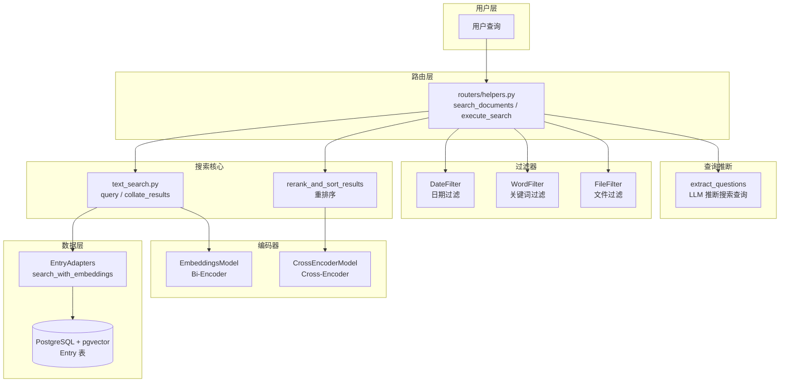

---

## 2. 核心组件

### 2.1 关键类

```mermaid
classDiagram
    class BaseEncoder {
        <<abstract>>
        +__init__(model_name, device, **kwargs)
        +encode(entries, device, **kwargs) Tensor
    }

    class OpenAI {
        +model_name: str
        +openai_client: OpenAI
        +embedding_dimensions: int
        +encode(entries, device, **kwargs) Tensor
    }

    class EmbeddingsModel {
        +model_name: str
        +inference_endpoint: str
        +api_key: str
        +inference_endpoint_type: ApiType
        +embeddings_model: SentenceTransformer
        +query_encode_kwargs: dict
        +docs_encode_kwargs: dict
        +embed_query(query) Tensor
        +embed_documents(docs) List
        +embed_with_hf(docs) List
        +embed_with_openai(docs) List
    }

    class CrossEncoderModel {
        +model_name: str
        +inference_endpoint: str
        +api_key: str
        +cross_encoder_model: CrossEncoder
        +inference_server_enabled() bool
        +predict(query, hits, key) List
    }

    class BaseFilter {
        <<abstract>>
        +get_filter_terms(query) List~str~
        +can_filter(raw_query) bool
        +defilter(query) str
    }

    class DateFilter {
        +entry_key: str
        +date_to_entry_ids: defaultdict
        +cache: LRU
        +extract_dates(content) List
        +get_query_date_range(query) List
        +extract_date_range(query) List
        +parse(date_str) Tuple
        +date_to_daterange(parsed_date, date_str) Tuple
    }

    class WordFilter {
        +entry_key: str
        +word_to_entry_index: defaultdict
        +cache: LRU
    }

    class FileFilter {
        +entry_key: str
        +file_to_entry_map: defaultdict
        +cache: LRU
        +convert_to_regex(file_filter) str
    }

    class SearchModelConfig {
        +name: CharField
        +model_type: CharField
        +bi_encoder: CharField
        +bi_encoder_model_config: JSONField
        +bi_encoder_query_encode_config: JSONField
        +bi_encoder_docs_encode_config: JSONField
        +cross_encoder: CharField
        +cross_encoder_model_config: JSONField
        +embeddings_inference_endpoint: CharField
        +embeddings_inference_endpoint_api_key: CharField
        +embeddings_inference_endpoint_type: CharField
        +cross_encoder_inference_endpoint: CharField
        +cross_encoder_inference_endpoint_api_key: CharField
        +bi_encoder_confidence_threshold: FloatField
    }

    class Entry {
        +user: FK~KhojUser~
        +agent: FK~Agent~
        +embeddings: VectorField
        +raw: TextField
        +compiled: TextField
        +heading: CharField
        +file_source: CharField
        +file_type: CharField
        +file_path: CharField
        +file_name: CharField
        +url: URLField
        +hashed_value: CharField
        +corpus_id: UUIDField
        +search_model: FK~SearchModelConfig~
    }

    class EntryDates {
        +date: DateField
        +entry: FK~Entry~
    }

    class SearchResponse {
        +entry: str
        +score: float
        +cross_score: float
        +additional: dict
        +corpus_id: str
    }

    class SearchType {
        <<enumeration>>
        All
        Org
        Markdown
        Image
        Pdf
        Github
        Notion
        Plaintext
        Docx
    }

    BaseEncoder <|-- OpenAI
    BaseFilter <|-- DateFilter
    BaseFilter <|-- WordFilter
    BaseFilter <|-- FileFilter
    Entry "1" --> "*" EntryDates : embeddings_dates
    Entry --> SearchModelConfig : search_model
```

### 2.2 关键函数

| 函数 | 所在文件 | 说明 |
|------|----------|------|
| `query()` | `text_search.py` | 核心搜索入口，编码查询并执行向量检索 |
| `collate_results()` | `text_search.py` | 将数据库命中结果转换为 SearchResponse，去重 |
| `rerank_and_sort_results()` | `text_search.py` | 两阶段排序：Cross-Encoder 重排 + Bi-Encoder 排序 |
| `cross_encoder_score()` | `text_search.py` | 使用 Cross-Encoder 对候选结果打分 |
| `sort_results()` | `text_search.py` | 按 cross_score 和 score 排序 |
| `compute_embeddings()` | `text_search.py` | 计算并保存文档嵌入向量 |
| `search_documents()` | `routers/helpers.py` | 路由层搜索入口，协调查询推断与搜索执行 |
| `execute_search()` | `routers/helpers.py` | 执行搜索：编码查询 → 过滤 → 检索 → 重排 |
| `defilter_query()` | `conversation/utils.py` | 从查询中移除过滤表达式，提取纯语义查询 |
| `search_with_embeddings()` | `adapters/__init__.py` | 数据库层向量搜索，使用 pgvector CosineDistance |
| `apply_filters()` | `adapters/__init__.py` | 应用所有过滤器构建 Django Q 查询 |

---

## 3. 搜索流程时序图

### 3.1 完整搜索流程

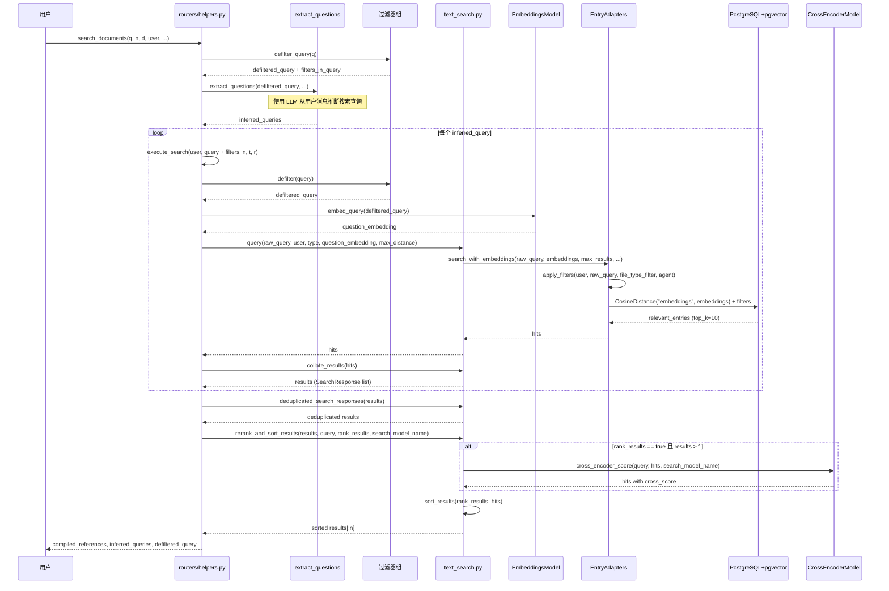

### 3.2 搜索流程状态图

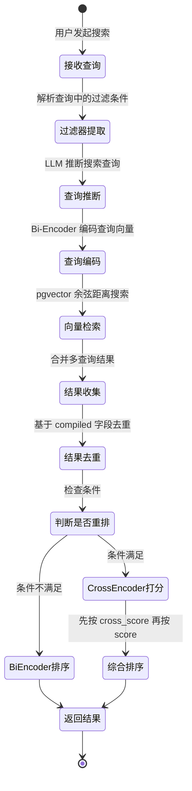

---

## 4. 双编码器架构

Khoj 搜索模块采用经典的 **Bi-Encoder + Cross-Encoder** 两阶段架构，在检索精度与计算效率之间取得平衡。

### 4.1 架构总览

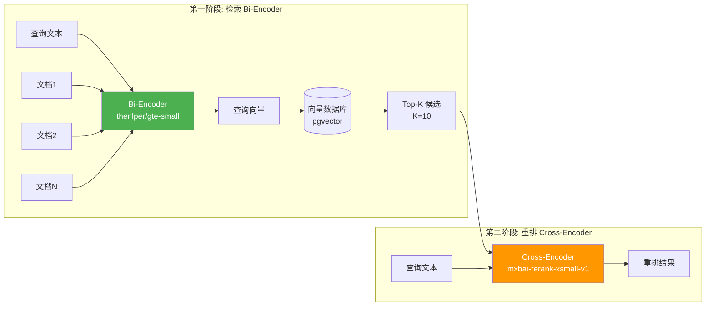

### 4.2 Bi-Encoder（检索阶段）

**职责**：将查询和文档分别编码为独立向量，通过向量相似度快速检索候选集。

**特点**：
- 查询和文档编码相互独立，可预计算文档向量
- 使用余弦距离（Cosine Distance）衡量相似度
- 默认模型：`thenlper/gte-small`
- 向量归一化后可用点积加速检索

**工作流程**：

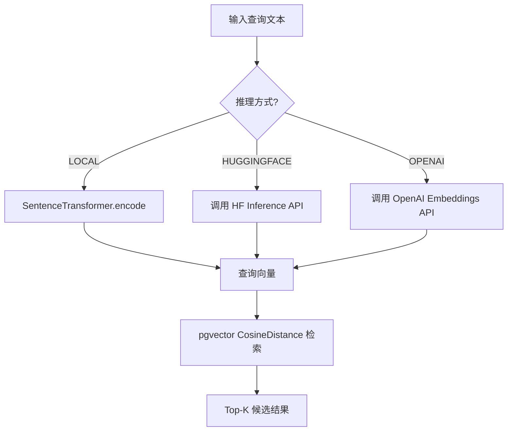

**编码配置**：
- `query_encode_kwargs`：查询编码参数，默认 `show_progress_bar=False, normalize_embeddings=True`
- `docs_encode_kwargs`：文档编码参数，默认 `show_progress_bar=True, normalize_embeddings=True`
- 远程 API 调用时按 1000 条分批处理，避免速率限制

### 4.3 Cross-Encoder（重排阶段）

**职责**：将查询与每个候选文档联合编码，计算更精确的相关性分数，对候选结果重新排序。

**特点**：
- 查询与文档联合输入，捕捉细粒度交互特征
- 精度更高但计算成本更大，仅对 Top-K 候选执行
- 默认模型：`mixedbread-ai/mxbai-rerank-xsmall-v1`
- 使用 Sigmoid 激活函数将分数映射到 [0, 1]

**触发条件**：

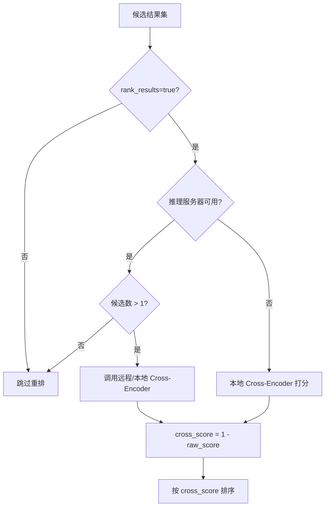

### 4.4 两阶段对比

| 维度 | Bi-Encoder | Cross-Encoder |
|------|-----------|---------------|
| 输入方式 | 查询和文档分别编码 | 查询-文档对联合编码 |
| 计算复杂度 | O(n) 编码 + O(n) 相似度 | O(k) 编码（k << n） |
| 检索速度 | 快（向量索引） | 慢（逐对计算） |
| 精度 | 中等 | 高 |
| 适用阶段 | 初筛（召回） | 精排 |
| 默认模型 | thenlper/gte-small | mxbai-rerank-xsmall-v1 |
| 输出 | 向量表示 | 相关性分数 |

---

## 5. 向量搜索实现

### 5.1 pgvector 存储架构

```mermaid
erDiagram
    Entry {
        uuid id PK
        uuid corpus_id "文档片段唯一标识"
        vector embeddings "嵌入向量 (pgvector)"
        text raw "原始文本"
        text compiled "编译后文本"
        varchar heading "标题"
        varchar file_source "文件来源"
        varchar file_type "文件类型"
        varchar file_path "文件路径"
        varchar file_name "文件名"
        url url "来源URL"
        varchar hashed_value "内容哈希"
        fk search_model_id "搜索模型配置"
        fk user_id "所属用户"
        fk agent_id "所属Agent"
    }

    EntryDates {
        uuid id PK
        date date "日期"
        fk entry_id "关联Entry"
    }

    SearchModelConfig {
        uuid id PK
        varchar name "模型配置名"
        varchar bi_encoder "Bi-Encoder模型"
        varchar cross_encoder "Cross-Encoder模型"
        float bi_encoder_confidence_threshold "置信度阈值"
    }

    Entry ||--o{ EntryDates : "embeddings_dates"
    Entry }o--|| SearchModelConfig : "search_model"
```

### 5.2 向量检索流程

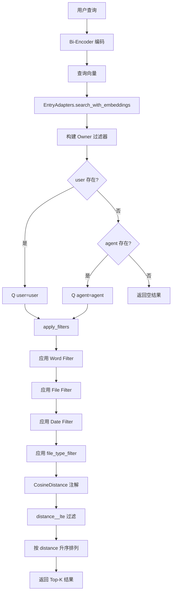

### 5.3 核心查询实现

`search_with_embeddings` 方法的数据库查询核心逻辑：

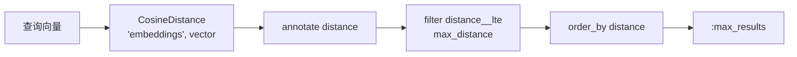

关键参数：
- **CosineDistance**：pgvector 提供的余弦距离函数，值域 [0, 2]，0 表示完全相同
- **max_distance**：默认使用 `bi_encoder_confidence_threshold`（0.18），超过此距离的结果被过滤
- **max_results**：默认 top_k = 10

### 5.4 嵌入向量的生命周期

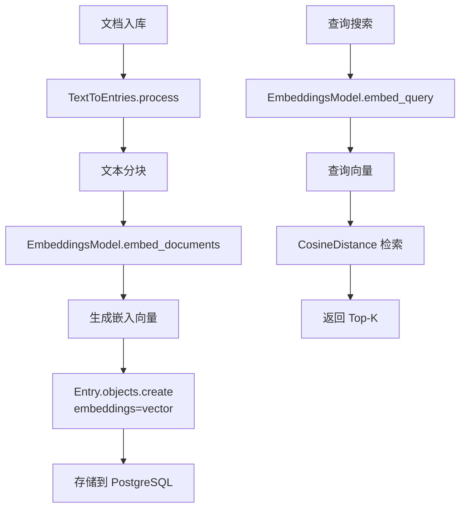

---

## 6. 搜索过滤器

### 6.1 过滤器架构

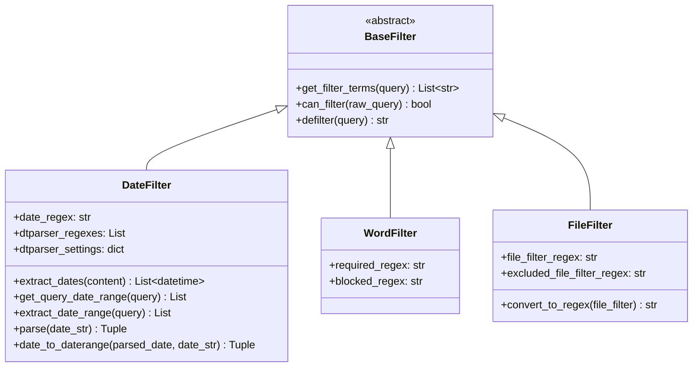

### 6.2 过滤器处理流程

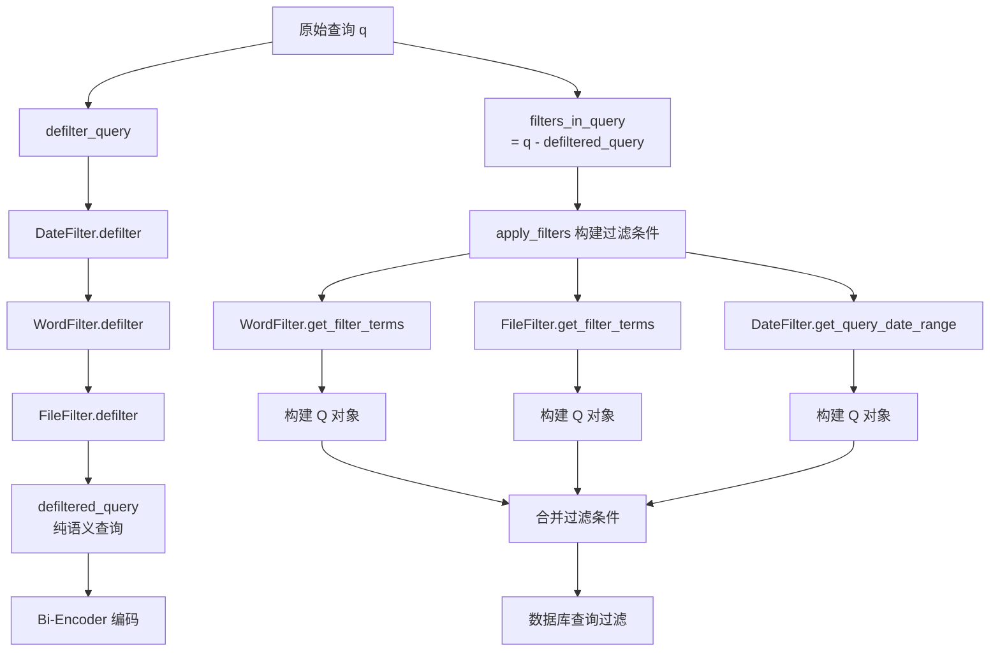

### 6.3 DateFilter 日期过滤器

**语法**：`dt[操作符]"日期表达式"`

| 操作符 | 含义 | 示例 |
|--------|------|------|
| `>=` | 大于等于 | `dt>="last week"` |
| `>` | 大于 | `dt>"yesterday"` |
| `<=` | 小于等于 | `dt<="tomorrow"` |
| `<` | 小于 | `dt<"next month"` |
| `=` / `:` / `==` | 等于 | `dt:"2 years ago"` |

**日期解析流程**：

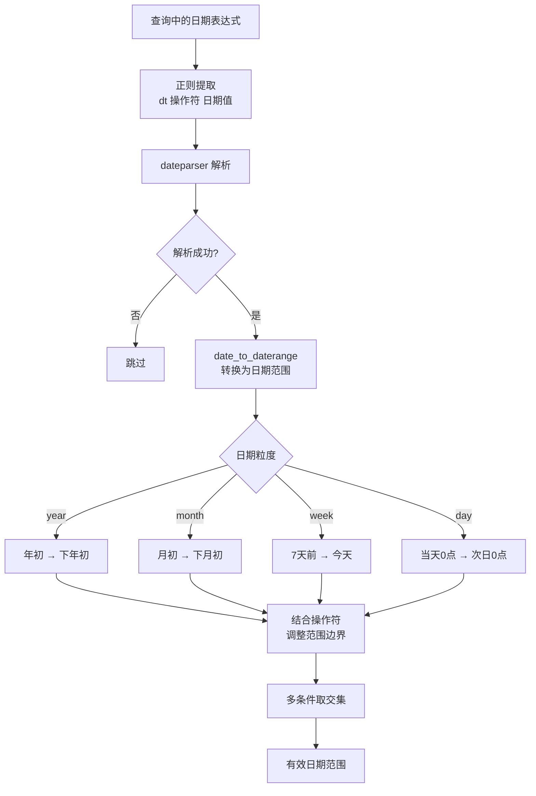

**支持的日期格式**：
- 结构化日期：`1984-04-01`、`1984/04/01`、`01.04.1984`
- 自然日期：`1st April 1984`、`Apr 4th 1984`
- 部分日期：`January 2021`、`Jan 21`
- 相对日期：`yesterday`、`last week`、`2 years ago`

### 6.4 WordFilter 关键词过滤器

**语法**：
- 必须包含：`+"关键词"`
- 排除包含：`-"关键词"`

**实现逻辑**：

```mermaid
flowchart TD
    A[查询文本] --> B[正则提取 required_terms<br>\\+&quot;word&quot;]
    A --> C[正则提取 blocked_terms<br>\\-&quot;word&quot;]
    B --> D[构建 Q(raw__icontains=term)]
    C --> E[构建 ~Q(raw__icontains=term)]
    D --> F[AND 组合]
    E --> F
    F --> G[数据库过滤]
```

**示例**：
- `machine learning +"python" -"java"` → 必须包含 "python"，排除 "java"

### 6.5 FileFilter 文件过滤器

**语法**：
- 包含文件：`file:"文件名模式"`
- 排除文件：`-file:"文件名模式"`

**实现逻辑**：

```mermaid
flowchart TD
    A[查询文本] --> B[正则提取 required_files<br>file:&quot;pattern&quot;]
    A --> C[正则提取 excluded_files<br>-file:&quot;pattern&quot;]
    B --> D[convert_to_regex<br>. → \\.  * → .*]
    C --> E[convert_to_regex]
    D --> F[Q(file_path__regex=pattern)<br>OR 组合]
    E --> G[~Q(file_path__regex=pattern)<br>AND 组合]
    F & G --> H[数据库过滤]
```

**示例**：
- `notes file:"*.md"` → 仅搜索 .md 文件
- `data -file:"temp*"` → 排除 temp 开头的文件

### 6.6 过滤器在数据库层的应用

`apply_filters` 方法将所有过滤器转换为 Django Q 对象并组合：

```mermaid
flowchart TD
    A[apply_filters] --> B[WordFilter.get_filter_terms]
    A --> C[FileFilter.get_filter_terms]
    A --> D[DateFilter.get_query_date_range]

    B --> E{词过滤}
    E -->|+term| F[Q raw__icontains<br>AND 组合]
    E -->|-term| G[~Q raw__icontains<br>AND 组合]

    C --> H{文件过滤}
    H -->|required| I[Q file_path__regex<br>OR 组合]
    H -->|excluded| J[~Q file_path__regex<br>AND 组合]

    D --> K{日期过滤}
    K -->|min_date| L[Q embeddings_dates__date__gte]
    K -->|max_date| M[Q embeddings_dates__date__lte]

    F & G & I & J & L & M --> N[Owner Filter<br>Q user=user | Q agent=agent]
    N --> O[Entry.objects.filter<br>.filter q_filter_terms]
    O --> P[返回过滤后的 QuerySet]
```

---

## 7. 搜索结果排序

### 7.1 排序流程

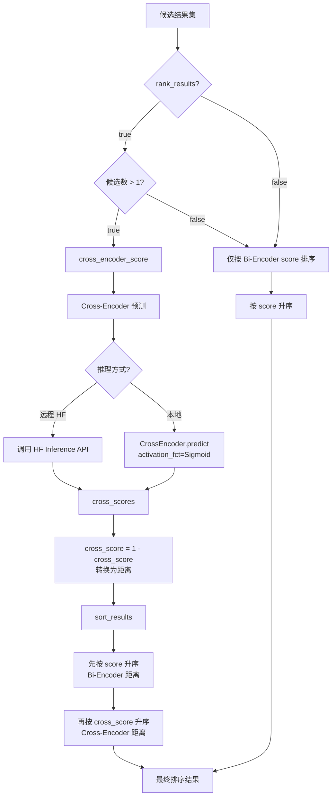

### 7.2 分数含义

| 分数 | 来源 | 含义 | 排序方向 |
|------|------|------|----------|
| `score` | Bi-Encoder | 余弦距离，越小越相关 | 升序 |
| `cross_score` | Cross-Encoder | `1 - sigmoid(raw_score)`，越小越相关 | 升序 |

### 7.3 排序策略

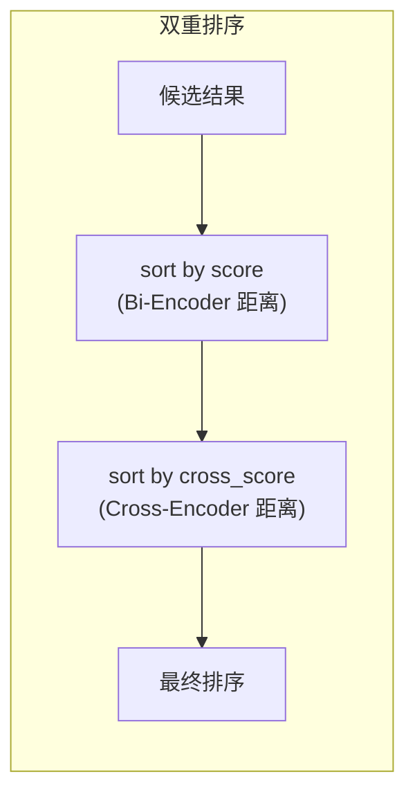

Python 的 `list.sort()` 是稳定排序，因此：
1. 先按 `score`（Bi-Encoder 距离）升序排列
2. 再按 `cross_score`（Cross-Encoder 距离）升序排列
3. 由于稳定排序，`cross_score` 相同时保持 `score` 的相对顺序

### 7.4 结果去重

搜索结果经过两层去重：

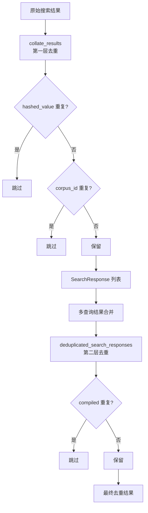

---

## 8. 嵌入模型管理

### 8.1 模型初始化流程

```mermaid
sequenceDiagram
    participant App as 应用启动
    participant Adapter as get_or_create_search_models
    participant DB as SearchModelConfig
    participant State as state 全局状态
    participant EM as EmbeddingsModel
    participant CE as CrossEncoderModel

    App->>Adapter: get_or_create_search_models()
    Adapter->>DB: SearchModelConfig.objects.all()
    DB-->>Adapter: search_models

    loop 每个 search_model
        App->>EM: EmbeddingsModel(model_name, endpoint, api_key, ...)
        Note over EM: 根据 inference_endpoint_type 选择:<br/>LOCAL → SentenceTransformer<br/>HUGGINGFACE → HF API<br/>OPENAI → OpenAI API
        EM-->>State: state.embeddings_model[name] = EM

        App->>CE: CrossEncoderModel(model_name, endpoint, api_key, ...)
        Note over CE: 加载 CrossEncoder 模型<br/>默认 mxbai-rerank-xsmall-v1
        CE-->>State: state.cross_encoder_model[name] = CE
    end
```

### 8.2 EmbeddingsModel 详细架构

```mermaid
flowchart TD
    subgraph EmbeddingsModel
        A[初始化] --> B{inference_endpoint_type?}
        B -->|LOCAL| C[SentenceTransformer<br>本地加载模型]
        B -->|HUGGINGFACE| D[配置 HF API]
        B -->|OPENAI| E[配置 OpenAI API]

        F[embed_query] --> G{推理方式?}
        G -->|LOCAL| H[SentenceTransformer.encode<br>单条查询]
        G -->|HUGGINGFACE| I[embed_with_hf<br>HF Inference API]
        G -->|OPENAI| J[embed_with_openai<br>OpenAI Embeddings API]

        K[embed_documents] --> L{推理方式?}
        L -->|LOCAL| M[SentenceTransformer.encode<br>批量文档]
        L -->|HUGGINGFACE| N[embed_with_hf<br>分批 1000 条]
        L -->|OPENAI| O[embed_with_openai<br>分批 1000 条]
    end
```

**远程 API 调用策略**：
- 使用 `tenacity` 库实现自动重试
- 重试条件：HTTPError
- 等待策略：随机指数退避（1s ~ 10s）
- 最大重试次数：5 次
- 文档编码按 1000 条分批，避免速率限制

### 8.3 CrossEncoderModel 详细架构

```mermaid
flowchart TD
    subgraph CrossEncoderModel
        A[初始化] --> B[CrossEncoder 加载<br>默认 mxbai-rerank-xsmall-v1]

        C[predict] --> D{inference_server_enabled?}
        D -->|是 且 HF| E[调用 HF Reranker API<br>inputs: query + passages]
        D -->|否| F[本地 CrossEncoder.predict<br>activation_fct=Sigmoid]

        G[inference_server_enabled] --> H{api_key 且 endpoint<br>均不为 None?}
    end
```

**Cross-Encoder 推理方式**：
- **本地推理**：构建 `[query, passage]` 对列表，使用 Sigmoid 激活函数输出分数
- **远程推理**：调用 HuggingFace Reranker API，传入 query 和 passages 列表

### 8.4 模型配置管理

```mermaid
flowchart TD
    A[SearchModelConfig] --> B[name: 模型配置名<br>default]
    A --> C[bi_encoder: Bi-Encoder 模型<br>thenlper/gte-small]
    A --> D[cross_encoder: Cross-Encoder 模型<br>mxbai-rerank-xsmall-v1]
    A --> E[bi_encoder_confidence_threshold<br>0.18]
    A --> F[embeddings_inference_endpoint<br>远程推理端点]
    A --> G[embeddings_inference_endpoint_type<br>LOCAL/HUGGINGFACE/OPENAI]
    A --> H[cross_encoder_inference_endpoint<br>远程推理端点]
    A --> I[bi_encoder_model_config<br>模型构造参数]
    A --> J[bi_encoder_query_encode_config<br>查询编码参数]
    A --> K[bi_encoder_docs_encode_config<br>文档编码参数]

    L[get_default_search_model] --> M[查找 name=default]
    M --> N{存在?}
    N -->|是| O[返回该配置]
    N -->|否| P[创建默认配置]
    P --> O
```

### 8.5 全局状态管理

搜索模型实例存储在全局 `state` 模块中，以模型配置名为键：

```mermaid
flowchart LR
    subgraph state 模块
        A["embeddings_model: Dict[str, EmbeddingsModel]"]
        B["cross_encoder_model: Dict[str, CrossEncoderModel]"]
        C["query_cache: Dict[str, LRU]"]
    end

    D[SearchModelConfig<br>name=default] --> A
    D --> B

    E[用户查询] --> C
    C --> F{缓存命中?}
    F -->|是| G[返回缓存结果]
    F -->|否| H[执行搜索]
    H --> I[写入缓存]
```

**查询缓存**：
- 缓存键：`{query}-{n}-{type}-{rank}-{max_distance}-{dedupe}`
- 每个用户维护独立的 LRU 缓存
- 缓存命中时直接返回，跳过编码和检索步骤

---

## 附录：SearchType 与 EntryType 映射

```mermaid
flowchart LR
    subgraph SearchType
        A[All]
        B[Org]
        C[Markdown]
        D[Plaintext]
        E[Pdf]
        F[Github]
        G[Notion]
    end

    subgraph Entry.EntryType
        H[None]
        I[ORG]
        J[MARKDOWN]
        K[PLAINTEXT]
        L[PDF]
        M[GITHUB]
        N[NOTION]
    end

    A --> H
    B --> I
    C --> J
    D --> K
    E --> L
    F --> M
    G --> N
```

搜索时 `SearchType` 被转换为 `EntryType` 作为 `file_type_filter` 传入数据库查询，`SearchType.All` 对应 `None`（不过滤类型）。
