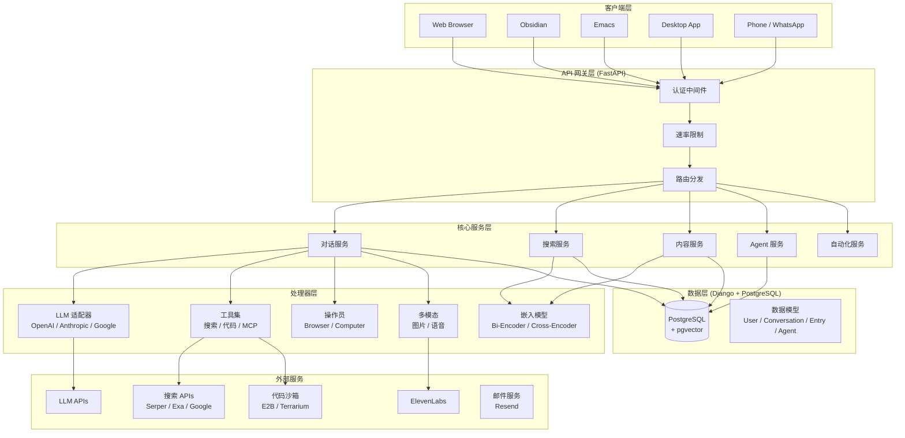
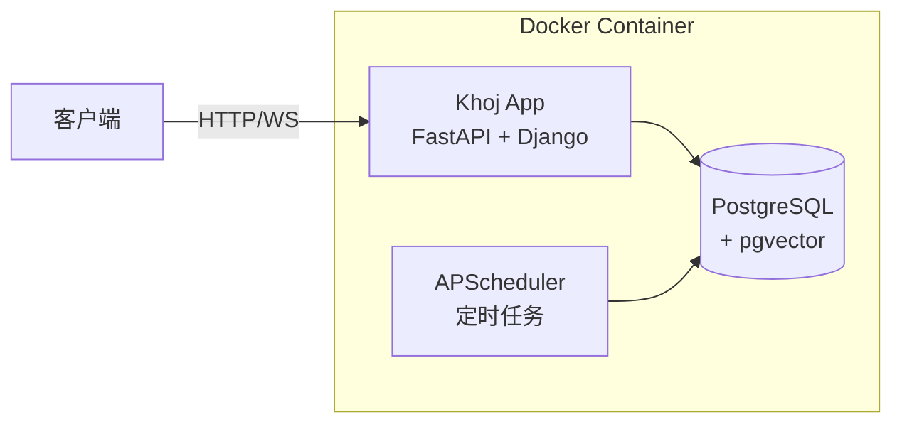
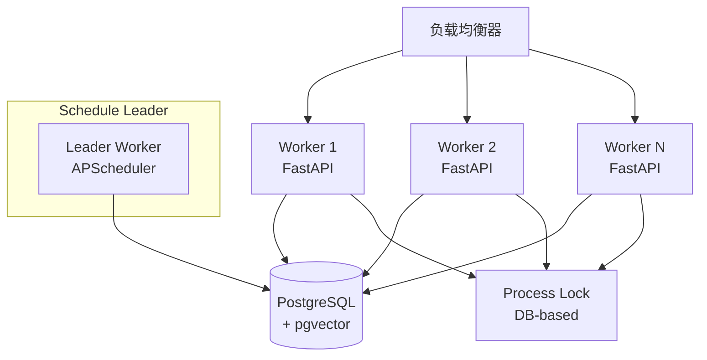

# Khoj 项目规格说明 (spec.md)

## 1. 项目概述

**Khoj** 是一个开源的个人 AI 应用，定位为"你的第二大脑"（Your AI Second Brain）。它能够从本地设备平滑扩展到云端企业级 AI，支持与任意本地或在线 LLM 对话，从互联网和个人文档中获取答案，并通过多种客户端（浏览器、Obsidian、Emacs、桌面、手机、WhatsApp）访问。

- **项目仓库**: https://github.com/khoj-ai/khoj
- **许可证**: AGPL-3.0-or-later
- **技术栈**: Python 3.10-3.12 / Django 5.1 / FastAPI / PostgreSQL + pgvector / Next.js / PyTorch
- **当前状态**: Production/Stable

---

## 2. 核心功能

### 2.1 对话系统
- 支持多 LLM 提供商（OpenAI、Anthropic、Google Gemini、本地模型）
- 流式响应（SSE + WebSocket）
- 多轮对话上下文管理
- 推理模型支持（o1/o3、Claude 思维链、Gemini Thinking）
- 工具调用（搜索、代码执行、在线搜索、计算机操作）

### 2.2 语义搜索
- 双编码器架构（Bi-Encoder 检索 + Cross-Encoder 重排序）
- 基于 pgvector 的向量搜索
- 多格式文档支持（PDF、Markdown、Org-mode、Word、图片、纯文本）
- 搜索过滤器（日期、文件、关键词）

### 2.3 内容索引
- 多格式文档解析与索引
- 外部数据源集成（GitHub、Notion）
- 增量索引（新增、更新、删除）
- 定时自动索引（每 22-25 小时）

### 2.4 Agent 系统
- 自定义 Agent（人格、知识库、工具、模型）
- 默认 Agent 和隐藏 Agent
- Agent 市场与共享

### 2.5 自动化
- 定时任务（Cron 表达式）
- 自动化研究（自动搜索、总结、通知）
- 邮件/推送通知

### 2.6 多模态
- 图片生成（OpenAI DALL-E、Replicate、Google Imagen）
- 语音合成（ElevenLabs）
- 图片理解（视觉模型）
- Mermaid 图表生成

### 2.7 计算机操作（Operator）
- 浏览器自动化（Playwright）
- 计算机操作（Docker 沙箱）
- 多模型 Agent（Anthropic CUA、OpenAI CUA、Binary Agent）

### 2.8 MCP 协议
- Model Context Protocol 集成
- SSE 和 Stdio 两种连接方式
- 动态工具发现与调用

---

## 3. 系统架构

### 3.1 整体架构



### 3.2 技术选型

| 层级 | 技术 | 说明 |
|------|------|------|
| Web 框架 | FastAPI + Uvicorn | 异步高性能 API 服务 |
| ORM | Django 5.1 + PostgreSQL | 数据持久化与 Admin 管理 |
| 向量搜索 | pgvector | PostgreSQL 向量扩展 |
| 嵌入模型 | sentence-transformers | Bi-Encoder 文本嵌入 |
| 前端 | Next.js + Tailwind CSS | Web 客户端 |
| 任务调度 | APScheduler + Django-APScheduler | 定时任务管理 |
| 认证 | Django Session + OAuth + Bearer Token | 多种认证方式 |
| 代码沙箱 | E2B / Terrarium | 安全代码执行 |
| 浏览器自动化 | Playwright | Operator 浏览器环境 |
| 容器化 | Docker + Docker Compose | 部署方案 |

---

## 4. 数据模型

### 4.1 核心实体关系

```mermaid
erDiagram
    KhojUser ||--o{ Conversation : has
    KhojUser ||--o{ Entry : owns
    KhojUser ||--o{ Agent : creates
    KhojUser ||--o{ Subscription : subscribes
    KhojUser ||--o{ UserMemory : has
    KhojUser ||--o{ ClientApplication : uses
    KhojUser ||--o{ GoogleUser : links
    KhojUser ||--o{ KhojApiUser : has_token

    Conversation }o--|| Agent : uses
    Conversation ||--o{ ChatMessage : contains

    Entry }o--|| Agent : belongs_to
    Entry }o--|| SearchModelConfig : indexed_by

    Agent ||--o{ Entry : has_knowledge
    Agent }o--|| ChatModel : uses_model

    PublicConversation }o--|| Conversation : shared_from
    PublicConversation }o--|| Agent : uses

    SearchModelConfig ||--|| EmbeddingsModel : uses_bi_encoder
    SearchModelConfig ||--|| CrossEncoderModel : uses_cross_encoder

    ServerChatSettings ||--o{ ChatModel : defines
    ServerChatSettings ||--o{ TextToImageModelConfig : defines

    ProcessLock ||--|| Scheduler : protects

    KhojUser {
        uuid id PK
        string username
        string email
        string phone_number
        string uuid
        datetime email_verification_code_expiry
    }

    Conversation {
        uuid id PK
        json conversation_log
        string slug
        string title
        fk agent_id FK
        fk user_id FK
        list file_filters
    }

    Entry {
        uuid id PK
        text raw
        vector embeddings
        string compiled
        string file_path
        string file_source
        string file_type
        string heading
        float distance
        uuid corpus_id
        fk user_id FK
        fk agent_id FK
        fk search_model_id FK
    }

    Agent {
        uuid id PK
        string name
        string slug
        string personality
        json input_tools
        json output_modes
        fk chat_model_id FK
        fk creator_id FK
        string style_color
        string style_icon
        boolean is_hidden
    }

    ChatModel {
        uuid id PK
        string name
        string model_type
        fk ai_model_api_id FK
        integer max_prompt_size
        boolean vision_enabled
    }

    SearchModelConfig {
        uuid id PK
        string name
        string bi_encoder
        string cross_encoder
        float bi_encoder_confidence_threshold
    }

    Subscription {
        uuid id PK
        string type
        datetime renewal_date
        boolean enabled
        fk user_id FK
    }
```

---

## 5. API 接口规范

### 5.1 路由前缀

| 路由前缀 | 模块 | 说明 |
|----------|------|------|
| `/api/chat` | 对话 | 聊天、历史、分享 |
| `/api/content` | 内容 | 文件上传、索引、删除 |
| `/api/agents` | Agent | Agent CRUD |
| `/api/automation` | 自动化 | 定时任务管理 |
| `/api/model` | 模型 | 模型配置 |
| `/api/memories` | 记忆 | 用户记忆管理 |
| `/api/notion` | Notion | Notion 集成 |
| `/api/subscription` | 订阅 | 付费管理 |
| `/api/phone` | 电话 | WhatsApp/短信 |
| `/auth` | 认证 | 登录、注册、OAuth |

### 5.2 核心接口

#### 对话接口

| 方法 | 路径 | 说明 |
|------|------|------|
| POST | `/api/chat` | 发送消息（支持流式/非流式） |
| WebSocket | `/api/chat/ws` | WebSocket 对话 |
| GET | `/api/chat/history` | 获取对话历史 |
| GET | `/api/chat/sessions` | 获取对话列表 |
| POST | `/api/chat/sessions` | 创建新对话 |
| DELETE | `/api/chat/history` | 删除对话 |
| POST | `/api/chat/share` | 分享对话 |
| POST | `/api/chat/speech` | 语音合成 |
| GET | `/api/chat/starters` | 获取开场白 |

#### 内容接口

| 方法 | 路径 | 说明 |
|------|------|------|
| PUT | `/api/content` | 全量索引文件 |
| PATCH | `/api/content` | 增量索引文件 |
| DELETE | `/api/content/file` | 删除文件 |
| GET | `/api/content/files` | 获取文件列表 |
| POST | `/api/content/convert` | 转换文档 |
| POST | `/api/content/github` | 配置 GitHub |
| POST | `/api/content/notion` | 配置 Notion |

---

## 6. 认证与授权

### 6.1 认证方式

| 方式 | 适用场景 | 实现机制 |
|------|----------|----------|
| Google OAuth | Web 客户端 | Session Cookie |
| Magic Link | Web 客户端 | 邮件链接 + Session |
| Bearer Token | API 客户端（Obsidian/Emacs/Desktop） | Authorization Header |
| WhatsApp Client | WhatsApp | client_id + client_secret + phone_number |
| 匿名模式 | 本地部署 | 默认用户 |

### 6.2 授权级别

| Scope | 说明 |
|-------|------|
| `authenticated` | 已认证用户 |
| `premium` | 付费订阅用户 |

---

## 7. 部署架构

### 7.1 单机部署



### 7.2 分布式部署



### 7.3 环境变量

| 变量 | 说明 | 默认值 |
|------|------|--------|
| `KHOJ_DOMAIN` | 服务域名 | `app.khoj.dev` |
| `KHOJ_NO_HTTPS` | 禁用 HTTPS | `false` |
| `POSTGRES_HOST` | 数据库主机 | `localhost` |
| `POSTGRES_PORT` | 数据库端口 | `5432` |
| `POSTGRES_DB` | 数据库名 | `khoj` |
| `KHOJ_DJANGO_SECRET_KEY` | Django 密钥 | `!secret` |
| `KHOJ_ADMIN_EMAIL` | 管理员邮箱 | - |
| `KHOJ_ADMIN_PASSWORD` | 管理员密码 | - |

---

## 8. 非功能需求

### 8.1 性能
- 流式响应首 Token 延迟 < 2s
- 搜索响应 < 500ms（1000 条目以内）
- 支持 WebSocket 长连接（ping timeout 300s）

### 8.2 可靠性
- Process Lock 机制保证分布式调度一致性
- 数据库连接自动清理（AsyncCloseConnectionsMiddleware）
- LLM 调用失败自动回退（多级 fallback）

### 8.3 安全
- CORS 白名单
- CSRF 保护
- 速率限制（分钟级 + 天级）
- 图片上传限制（10 张 / 20MB）
- Bearer Token 认证

### 8.4 可扩展性
- 多 LLM 提供商适配
- MCP 协议动态工具集成
- Agent 自定义（人格、工具、模型）
- 搜索模型可配置

---

## 9. 核心模块索引

| 模块 | 设计文档 | 说明 |
|------|----------|------|
| Conversation | [conversation-module-design.md](./conversation-module-design.md) | 对话系统设计 |
| Search | [search-module-design.md](./search-module-design.md) | 搜索系统设计 |
| Content | [content-module-design.md](./content-module-design.md) | 内容处理设计 |
| Database & API | [database-api-module-design.md](./database-api-module-design.md) | 数据库与 API 设计 |
| Tools & Operator | [tools-operator-module-design.md](./tools-operator-module-design.md) | 工具与操作员设计 |
