# Khoj Tools 与 Operator 模块设计文档

## 1. 模块概述

### 1.1 Tools 模块

Tools 模块是 Khoj 的工具系统核心，负责为 AI Agent 提供与外部世界交互的能力。该模块包含三大工具：

| 工具 | 文件 | 职责 |
|------|------|------|
| **在线搜索** | `online_search.py` | 搜索互联网、读取网页、提取和去重信息 |
| **代码执行** | `run_code.py` | 生成 Python 代码并在沙箱中安全执行 |
| **MCP 协议** | `mcp.py` | 通过 Model Context Protocol 连接外部工具服务器 |

### 1.2 Operator 模块

Operator 模块实现了 Khoj 的计算机/浏览器自动化操作能力，使 AI 能够像人类一样操控图形界面完成任务。该模块采用 **Agent-Environment** 分离架构：

- **Agent 层**：负责感知环境状态、决策下一步动作
- **Environment 层**：负责执行动作、返回环境状态
- **Action 层**：定义标准化的操作动作模型

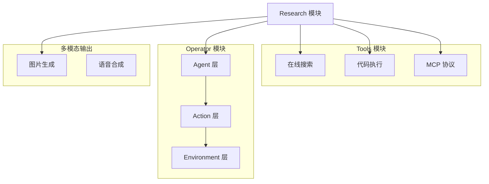

---

## 2. 工具系统架构

### 2.1 工具选择与调用流程

Khoj 的工具选择采用两级路由机制：

1. **第一级**：`aget_data_sources_and_output_format` — 判断用户查询需要哪些数据源和输出模式
2. **第二级**：`apick_next_tool` — 在 Research 模式中，由 LLM 选择具体工具及参数

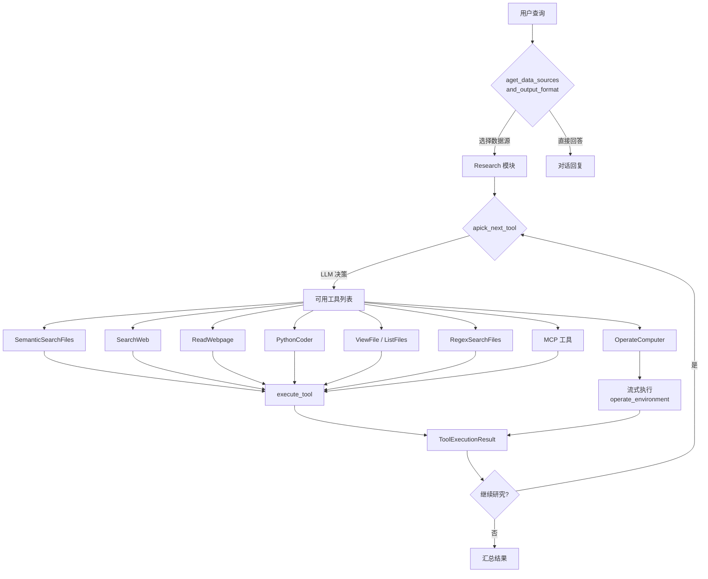

### 2.2 工具可用性判断

工具的可用性由多个条件动态决定：

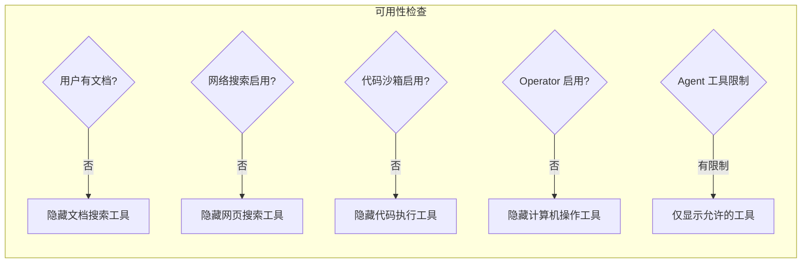

---

## 3. 在线搜索工具

### 3.1 搜索流程

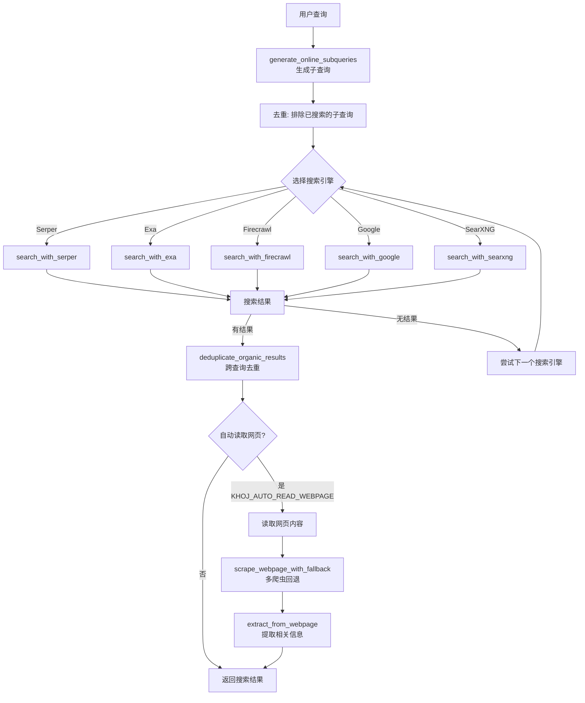

### 3.2 搜索引擎支持

| 引擎 | API | 特点 |
|------|-----|------|
| **Serper** | `google.serper.dev` | 支持 answerBox、knowledgeGraph、peopleAlsoAsk |
| **Exa** | `api.exa.ai` | 支持内容直接返回，减少二次请求 |
| **Firecrawl** | `api.firecrawl.dev/v2/search` | 支持 Markdown 内容直接返回 |
| **Google** | `customsearch/v1` | 支持知识图谱 |
| **SearXNG** | 自托管实例 | 隐私友好，HTML 解析 |

### 3.3 网页读取与信息提取

网页读取采用**多爬虫回退**策略：

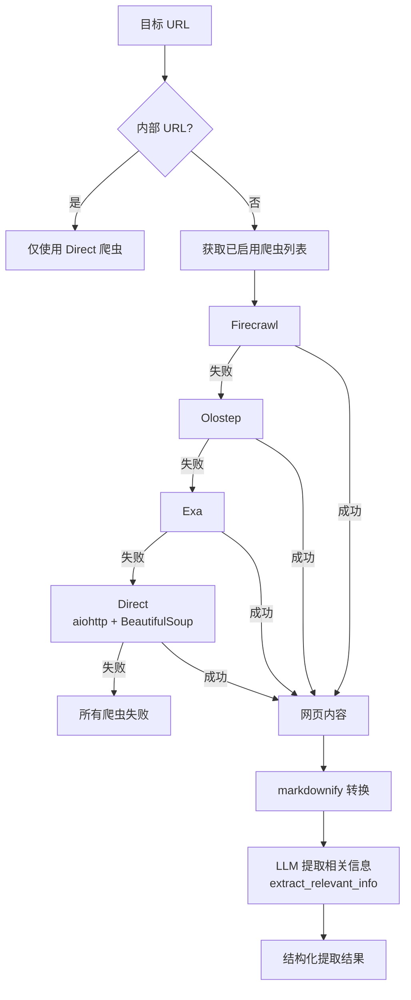

### 3.4 结果去重

`deduplicate_organic_results` 函数基于链接 URL 在所有查询间去重，确保同一链接只出现一次：

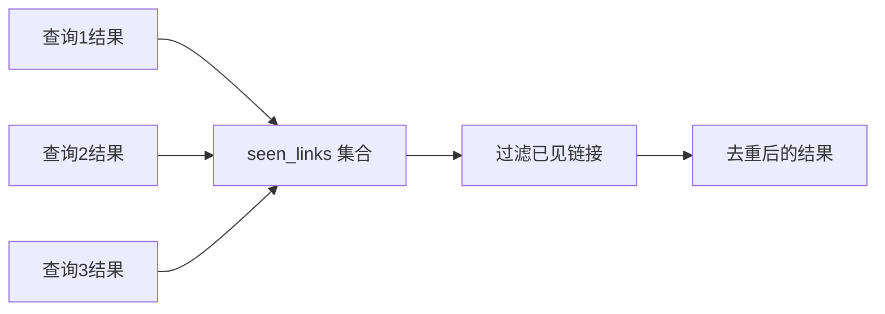

---

## 4. 代码执行工具

### 4.1 代码执行流程

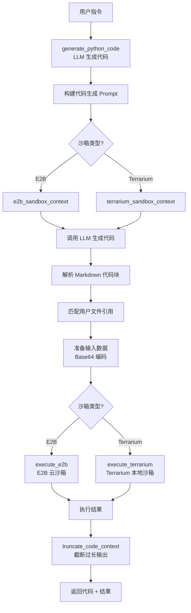

### 4.2 沙箱执行对比

| 特性 | E2B | Terrarium |
|------|-----|-----------|
| 执行环境 | 云端沙箱 | 本地 Docker |
| 网络访问 | 支持 | 不支持 |
| 文件 I/O | 原生支持 | Base64 传输 |
| 超时 | 60s（代码）+ 120s（沙箱） | 30s |
| 重试 | 3次，指数退避 | 3次，指数退避 |

---

## 5. MCP 协议集成

### 5.1 MCP 客户端架构

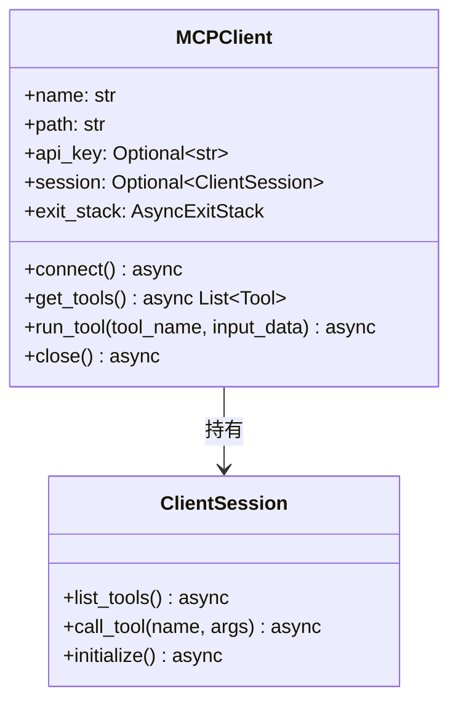

### 5.2 连接方式

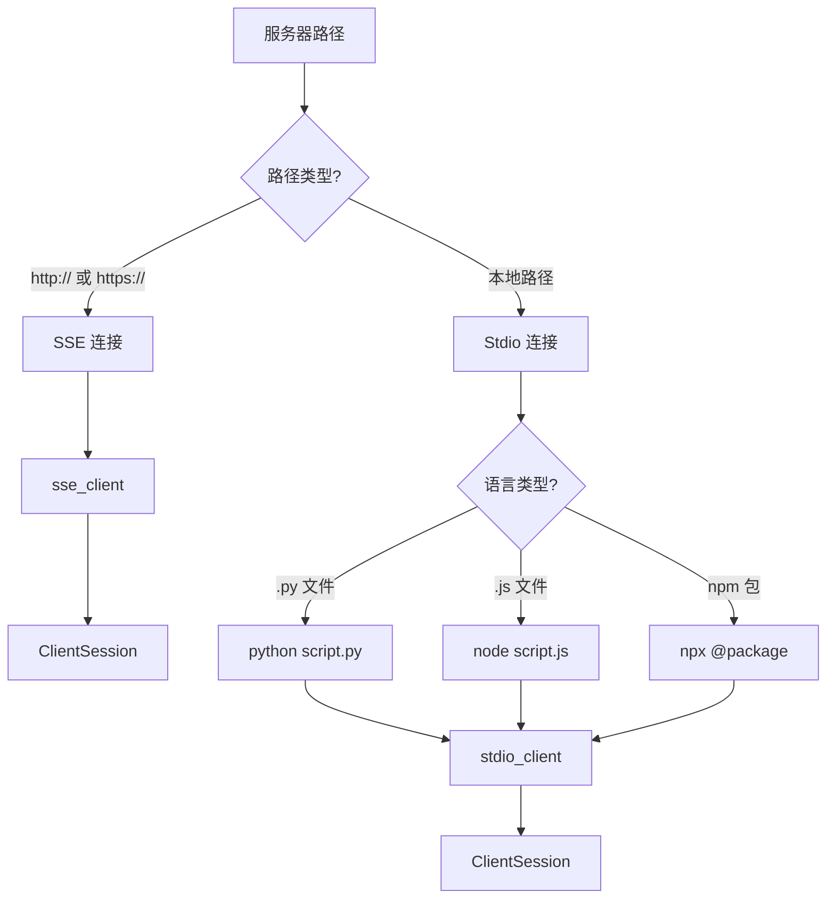

---

## 6. Operator 系统架构

### 6.1 类继承体系

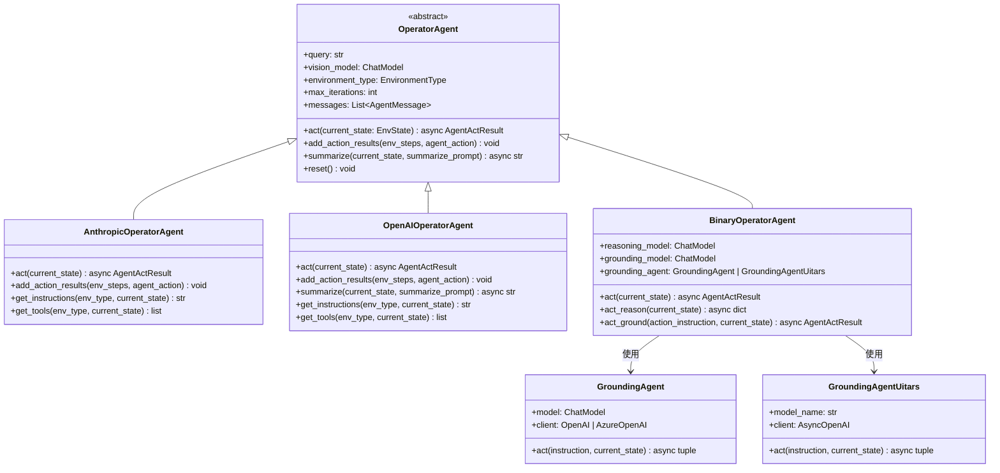

### 6.2 环境类继承体系

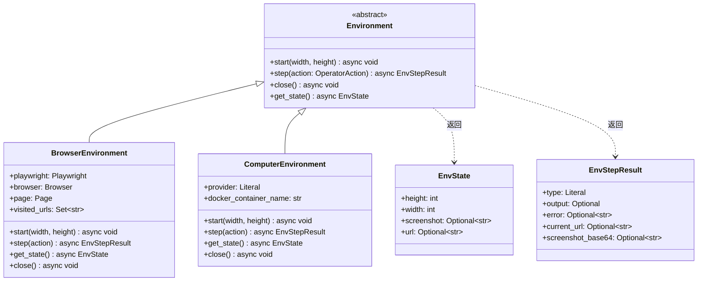

---

## 7. 操作员执行流程

### 7.1 主循环时序图

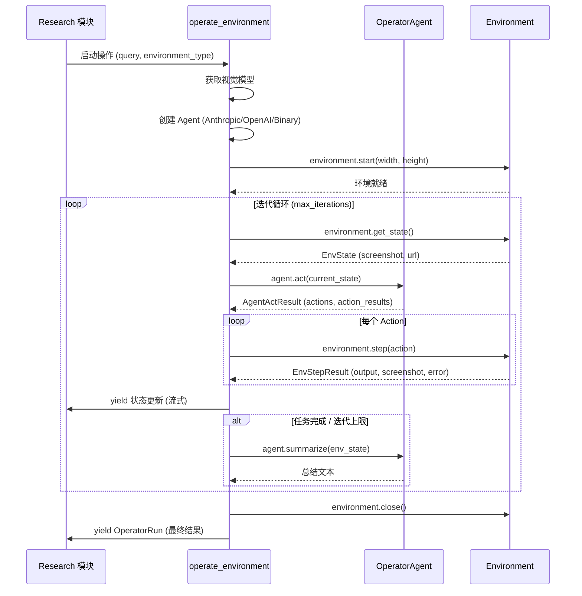

### 7.2 Binary Agent 双模型协作

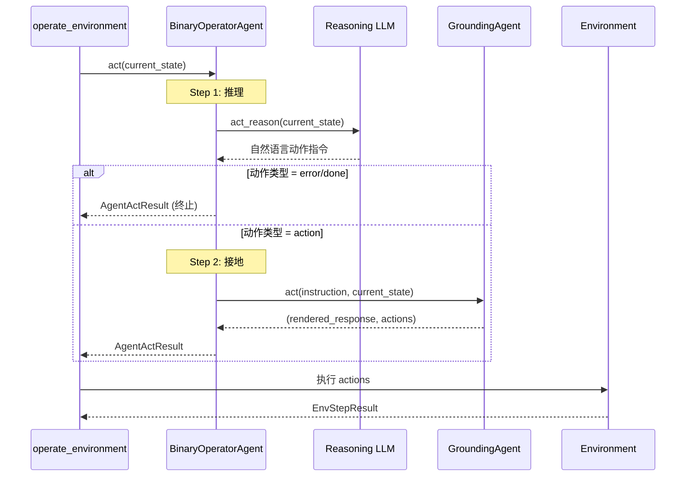

---

## 8. Research 模块

### 8.1 多轮研究迭代流程

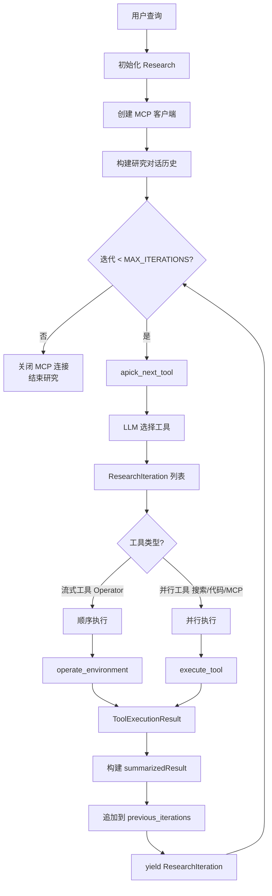

---

## 9. 图片生成和语音合成

### 9.1 图片生成流程

```mermaid
flowchart TD
    MSG[用户消息] --> CONFIG[获取图片生成配置]
    CONFIG -->|未配置| ERR[返回 501 错误]
    CONFIG -->|已配置| MODEL{text2image_model]

    MODEL --> MULTI{多模态模型?}
    MULTI -->|否| ENHANCE[generate_better_image_prompt<br/>LLM 增强提示词]
    MULTI -->|是| DIRECT[直接使用原始消息]

    ENHANCE --> API{模型类型?}
    DIRECT --> API
    API -->|OpenAI| OPENAI[generate_image_with_openai]
    API -->|Replicate| REPLICATE[generate_image_with_replicate]
    API -->|Google| GOOGLE[generate_image_with_google]

    OPENAI --> WEBP[转换为 WebP]
    REPLICATE --> WEBP
    GOOGLE --> WEBP

    WEBP --> S3[上传到 S3]
    S3 -->|成功| URL[返回图片 URL]
    S3 -->|失败| B64[返回 Base64 图片]
```

### 9.2 语音合成

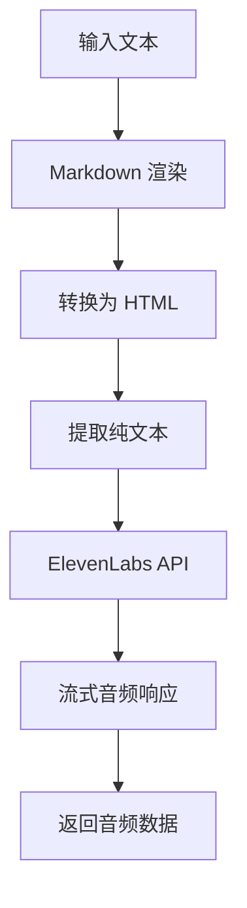

---

## 附录：模块依赖关系

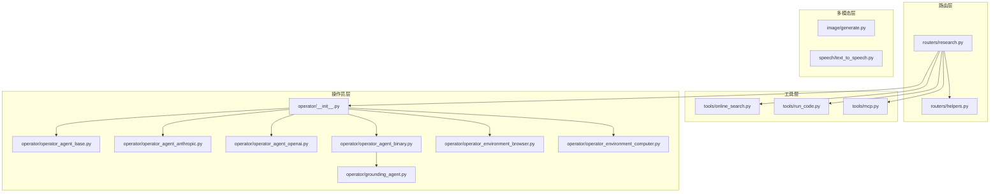
