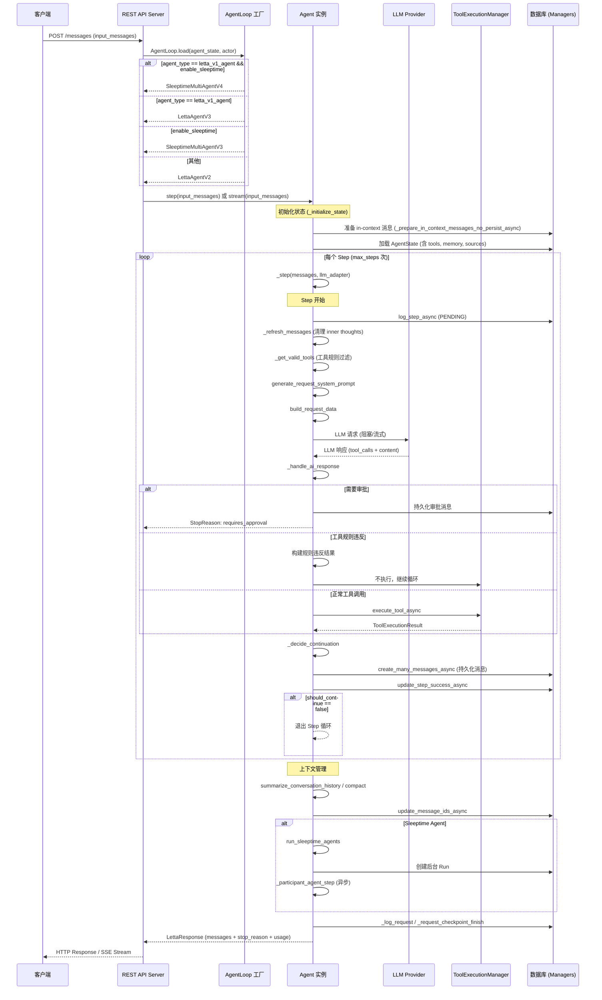
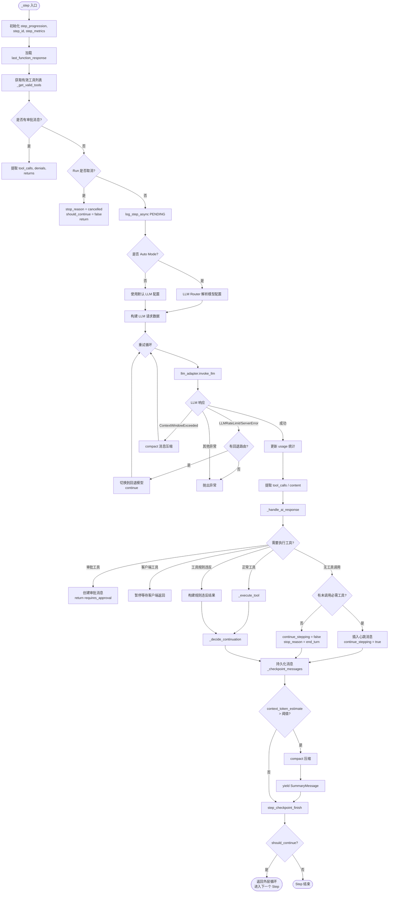
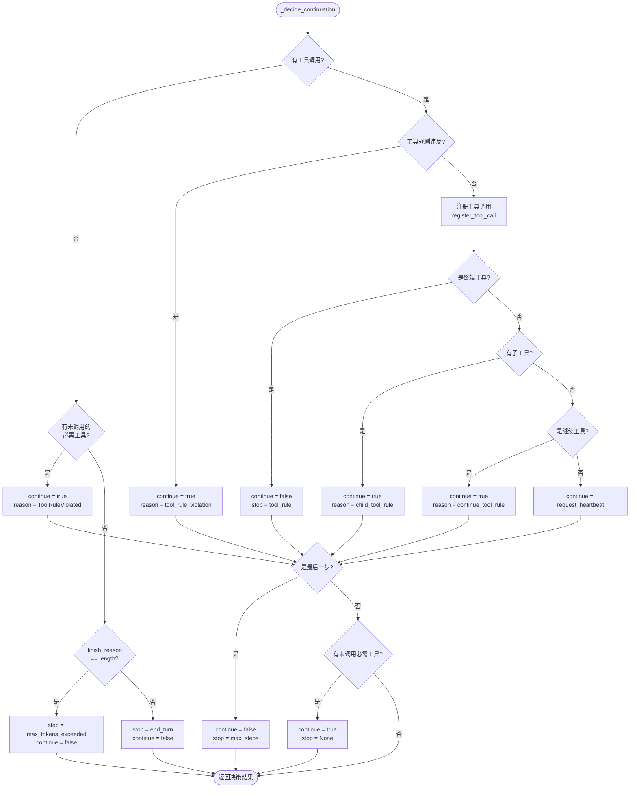
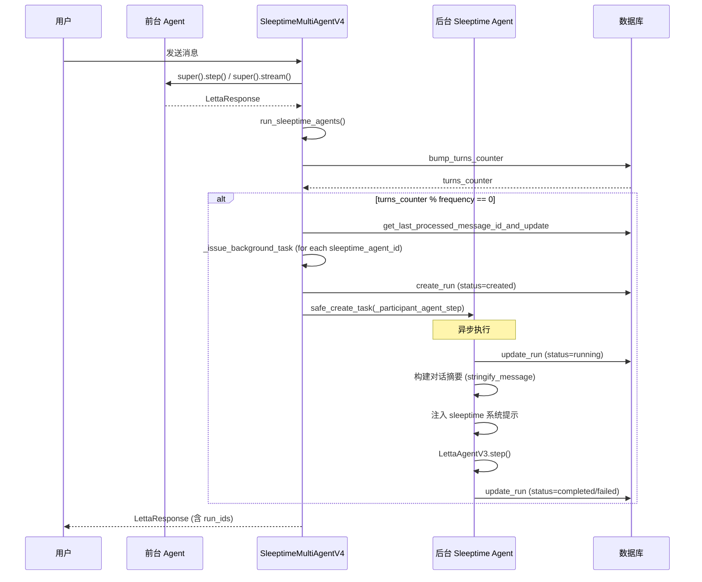
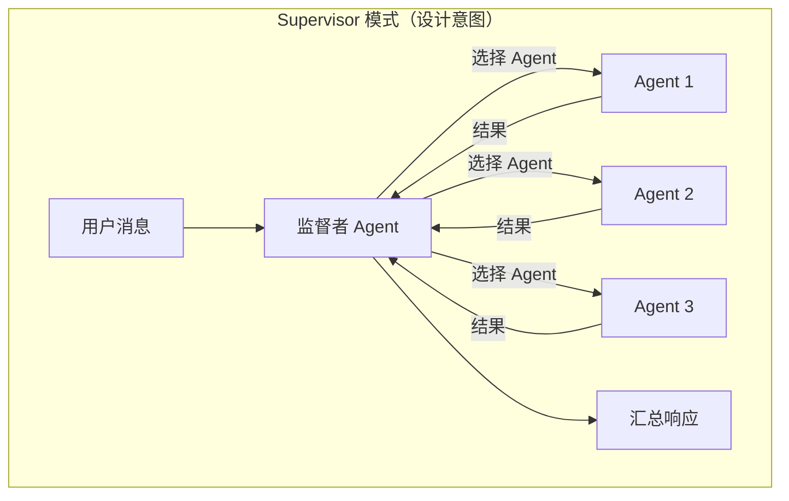
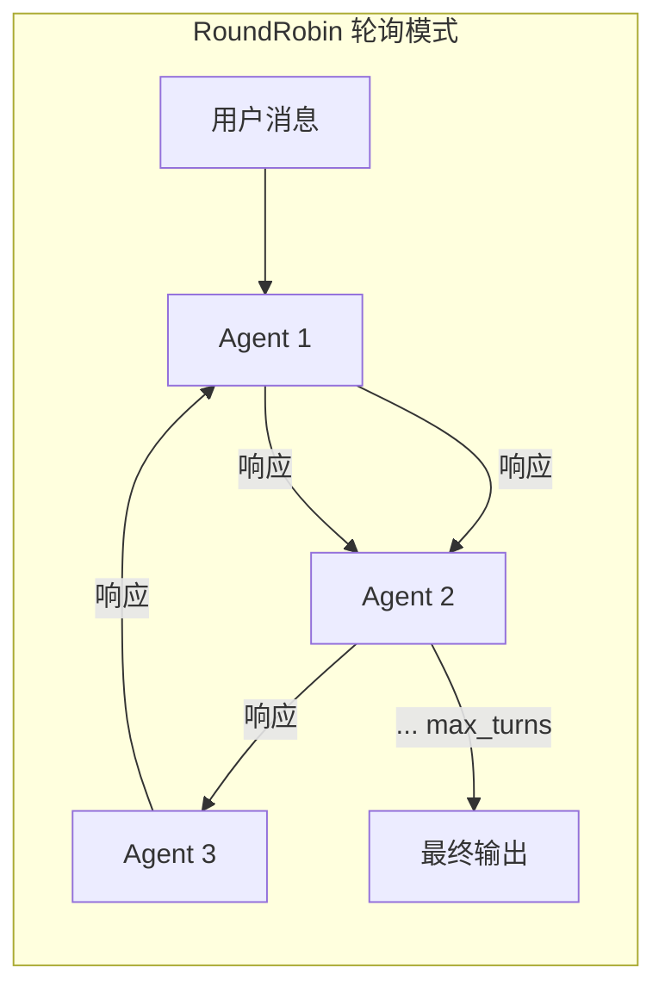
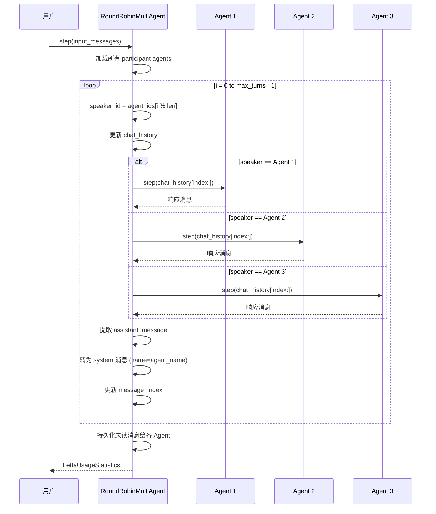
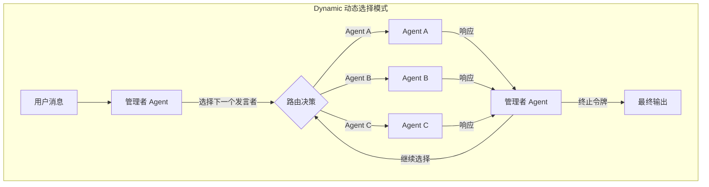
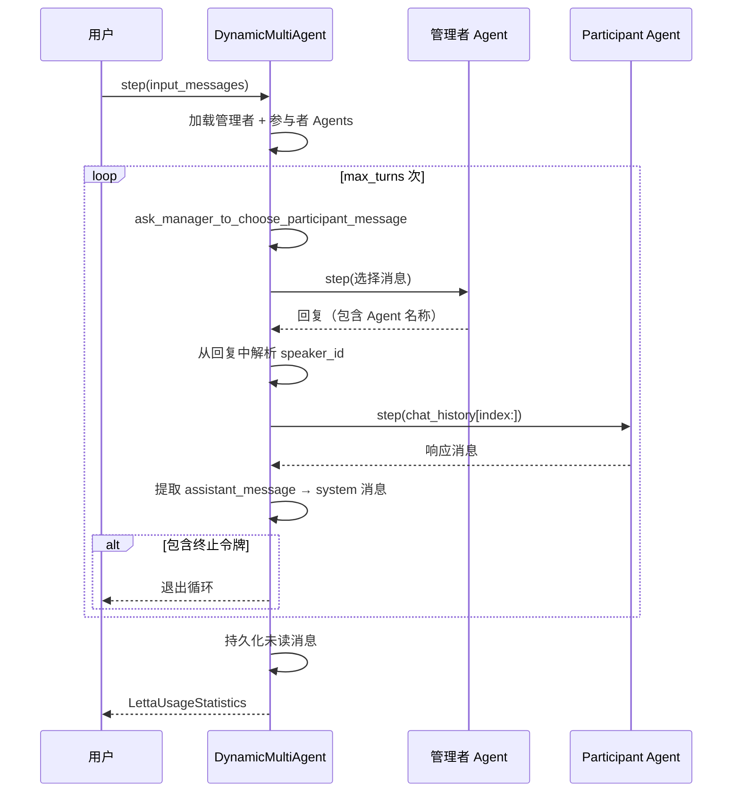

# Letta Agent 系统模块设计文档

## 1. 模块概述

Letta Agent 系统是整个 Letta 平台的核心执行引擎，负责管理 AI Agent 的完整生命周期——从创建、消息处理、LLM 调用、工具执行到上下文管理。该系统采用分层抽象设计，通过基类定义统一接口，子类实现不同版本和类型的 Agent 行为。

### 核心职责

| 职责 | 说明 |
|------|------|
| **LLM 交互** | 构建请求、调用 LLM API、处理流式/非流式响应 |
| **工具执行** | 解析工具调用、执行工具函数、返回结果 |
| **上下文管理** | 维护 in-context 消息窗口、自动摘要/压缩、内存重建 |
| **工具规则** | 基于 ToolRulesSolver 约束工具调用顺序、终端工具、审批工具 |
| **多 Agent 协作** | 支持 Sleeptime、Supervisor、RoundRobin、Dynamic 等协作模式 |
| **可观测性** | 集成 OpenTelemetry 追踪、Step 指标记录、用量统计 |

### 模块结构

```
letta/
├── agents/                          # Agent 核心实现
│   ├── base_agent.py                # V1 基类（遗留）
│   ├── base_agent_v2.py             # V2 基类（当前主接口）
│   ├── letta_agent.py               # V1 Agent 实现（遗留）
│   ├── letta_agent_v2.py            # V2 Agent 实现
│   ├── letta_agent_v3.py            # V3 Agent 实现（最新）
│   ├── agent_loop.py                # Agent 工厂
│   ├── ephemeral_agent.py           # 临时无状态 Agent
│   ├── voice_agent.py               # 语音 Agent
│   └── helpers.py                   # 共享辅助函数
├── groups/                          # 多 Agent 协作
│   ├── sleeptime_multi_agent_v3.py  # Sleeptime V3（基于 V2 Agent）
│   ├── sleeptime_multi_agent_v4.py  # Sleeptime V4（基于 V3 Agent）
│   ├── supervisor_multi_agent.py    # 监督者模式（未完成）
│   ├── round_robin_multi_agent.py   # 轮询模式
│   └── dynamic_multi_agent.py       # 动态选择模式
└── adapters/                        # LLM 适配器
    ├── letta_llm_adapter.py         # 适配器基类
    ├── letta_llm_request_adapter.py # 阻塞式请求适配器
    ├── letta_llm_stream_adapter.py  # 流式适配器（V2）
    ├── simple_llm_request_adapter.py # 简化阻塞适配器（V3）
    └── simple_llm_stream_adapter.py  # 简化流式适配器（V3）
```

---

## 2. 类继承体系

```mermaid
classDiagram
    direction TB

    class BaseAgent {
        <<abstract>>
        +agent_id: str
        +openai_client: AsyncClient
        +message_manager: MessageManager
        +agent_manager: AgentManager
        +actor: User
        +step(input_messages, max_steps) LettaResponse*
        +step_stream(input_messages, max_steps) AsyncGenerator*
        +pre_process_input_message(input_messages) Any$
        +_rebuild_memory_async(in_context_messages, agent_state) List~Message~
        +get_finish_chunks_for_stream(usage, stop_reason) list
    }

    class BaseAgentV2 {
        <<abstract>>
        +agent_state: AgentState
        +actor: User
        +agent_id: str$
        +step(input_messages, max_steps, ...) LettaResponse*
        +stream(input_messages, max_steps, ...) AsyncGenerator*
        +build_request(input_messages, ...) dict*
    }

    class EphemeralAgent {
        +step(input_messages) List~Message~
        +step_stream(input_messages) AsyncGenerator
    }

    class VoiceAgent {
        +block_manager: BlockManager
        +run_manager: RunManager
        +passage_manager: PassageManager
        +step(input_messages, max_steps) LettaResponse
        +step_stream(input_messages, max_steps) AsyncGenerator
        +init_summarizer(agent_state) Summarizer
        -_handle_ai_response(...) bool
        -_execute_tool(...) ToolExecutionResult
        -_search_memory(...) str
    }

    class LettaAgent {
        +block_manager: BlockManager
        +job_manager: JobManager
        +passage_manager: PassageManager
        +step_manager: StepManager
        +summarizer: Summarizer
        +step(input_messages, max_steps, ...) LettaResponse
        +step_stream(input_messages, max_steps, ...) AsyncGenerator
        +step_stream_no_tokens(...) AsyncGenerator
        -_step(agent_state, input_messages, ...) tuple
        -_handle_ai_response(tool_call, ...) tuple
        -_decide_continuation(...) tuple
        -_execute_tool(...) ToolExecutionResult
        -_build_and_request_from_llm(...) tuple
        -_build_and_request_from_llm_streaming(...) tuple
        -_create_llm_request_data_async(...) tuple
        -_rebuild_context_window(...) list
    }

    class LettaAgentV2 {
        +llm_client: LLMClient
        +tool_rules_solver: ToolRulesSolver
        +summarizer: Summarizer
        +should_continue: bool
        +stop_reason: LettaStopReason
        +usage: LettaUsageStatistics
        +step(input_messages, max_steps, ...) LettaResponse
        +stream(input_messages, max_steps, ...) AsyncGenerator
        +build_request(input_messages, ...) dict
        -_step(messages, llm_adapter, ...) AsyncGenerator
        -_handle_ai_response(tool_call, ...) tuple
        -_decide_continuation(...) tuple
        -_execute_tool(...) ToolExecutionResult
        -_refresh_messages(messages) list
        -_rebuild_memory(in_context_messages, ...) list
        -_get_valid_tools() list
        -_initialize_state() void
    }

    class LettaAgentV3 {
        +context_token_estimate: int
        +in_context_messages: list
        +conversation_id: str
        +client_tools: list
        +client_skills: list
        +logprobs: ChoiceLogprobs
        +turns: list
        +step(input_messages, max_steps, ...) LettaResponse
        +stream(input_messages, max_steps, ...) AsyncGenerator
        +build_request(input_messages, ...) dict
        +compact(messages, ...) tuple
        -_step(messages, llm_adapter, ...) AsyncGenerator
        -_handle_ai_response(tool_calls, ...) tuple
        -_decide_continuation(...) tuple
        -_get_valid_tools() list
        -_checkpoint_messages(run_id, step_id, ...) void
        -_check_for_system_prompt_overflow(system_message) void
        -_create_compaction_event_message(...) EventMessage
        -_create_summary_result_message(...) list
    }

    class SleeptimeMultiAgentV3 {
        +group: Group
        +group_manager: GroupManager
        +step(input_messages, ...) LettaResponse
        +stream(input_messages, ...) AsyncGenerator
        +run_sleeptime_agents(billing_context) void
        -_issue_background_task(...) str
        -_participant_agent_step(...) LettaResponse
    }

    class SleeptimeMultiAgentV4 {
        +group: Group
        +group_manager: GroupManager
        +step(input_messages, ...) LettaResponse
        +stream(input_messages, ...) AsyncGenerator
        +run_sleeptime_agents(billing_context) list
        -_issue_background_task(...) str
        -_participant_agent_step(...) LettaResponse
    }

    class SupervisorMultiAgent {
        +group_id: str
        +agent_ids: List~str~
        +description: str
        NOTE: step() 方法已注释，未完成
    }

    class RoundRobinMultiAgent {
        +group_id: str
        +agent_ids: List~str~
        +max_turns: int
        +step(input_messages, ...) LettaUsageStatistics
        -load_participant_agent(agent_id) LettaAgent
    }

    class DynamicMultiAgent {
        +group_id: str
        +agent_ids: List~str~
        +max_turns: int
        +termination_token: str
        +step(input_messages, ...) LettaUsageStatistics
        -load_manager_agent() Agent
        -load_participant_agent(agent_id) Agent
        -ask_manager_to_choose_participant_message(...) MessageCreate
    }

    class AgentLoop {
        <<factory>>
        +load(agent_state, actor) BaseAgentV2$
    }

    BaseAgent <|-- EphemeralAgent
    BaseAgent <|-- VoiceAgent
    BaseAgent <|-- LettaAgent
    BaseAgentV2 <|-- LettaAgentV2
    LettaAgentV2 <|-- LettaAgentV3
    LettaAgentV2 <|-- SleeptimeMultiAgentV3
    LettaAgentV3 <|-- SleeptimeMultiAgentV4

    BaseAgent <|-- SupervisorMultiAgent
    BaseAgent <|-- RoundRobinMultiAgent
    BaseAgent <|-- DynamicMultiAgent

    AgentLoop ..> BaseAgentV2 : creates
    AgentLoop ..> LettaAgentV2 : creates
    AgentLoop ..> LettaAgentV3 : creates
    AgentLoop ..> SleeptimeMultiAgentV3 : creates
    AgentLoop ..> SleeptimeMultiAgentV4 : creates
```



### 继承体系说明

| 层次 | 类 | 说明 |
|------|------|------|
| **V1 遗留层** | `BaseAgent` → `LettaAgent` / `EphemeralAgent` / `VoiceAgent` | 早期设计，直接持有 openai_client 和各 Manager 实例 |
| **V2 核心层** | `BaseAgentV2` → `LettaAgentV2` | 引入 AgentState、LLMClient、ToolRulesSolver、适配器模式 |
| **V3 增强层** | `LettaAgentV2` → `LettaAgentV3` | 支持非工具返回、并行工具调用、会话隔离、主动压缩、LLM 路由 |
| **多 Agent 层** | `LettaAgentV2` → `SleeptimeMultiAgentV3` / `LettaAgentV3` → `SleeptimeMultiAgentV4` | 在单 Agent 基础上叠加后台 Sleeptime Agent |
| **遗留多 Agent 层** | `BaseAgent` → `SupervisorMultiAgent` / `RoundRobinMultiAgent` / `DynamicMultiAgent` | 早期多 Agent 实现，使用旧式 AgentInterface |

---

## 3. Agent 生命周期



### 生命周期阶段说明

| 阶段 | 说明 |
|------|------|
| **1. 工厂创建** | `AgentLoop.load()` 根据 `agent_type` 和 `enable_sleeptime` 决定实例化哪个 Agent 类 |
| **2. 状态初始化** | `_initialize_state()` 重置 `should_continue`、`stop_reason`、`usage`、`response_messages` 等 |
| **3. 消息准备** | 从 DB 加载 in-context 消息，将新输入消息转换为 Message 对象 |
| **4. Step 循环** | 每轮：刷新消息 → 构建请求 → 调用 LLM → 处理响应 → 执行工具 → 决定是否继续 |
| **5. 上下文管理** | 循环结束后，根据 token 用量触发摘要/压缩 |
| **6. Sleeptime 处理** | （仅 SleeptimeMultiAgent）异步启动后台 Agent 处理对话记录 |
| **7. 清理与返回** | 记录请求指标、更新 Agent 最后运行时间、返回 LettaResponse |

---

## 4. Agent Loop 执行流程

### 4.1 V2/V3 统一 Step 执行流程



### 4.2 _decide_continuation 决策逻辑



### 4.3 V1 vs V2 vs V3 关键差异

| 特性 | V1 (LettaAgent) | V2 (LettaAgentV2) | V3 (LettaAgentV3) |
|------|-----------------|-------------------|-------------------|
| **基类** | BaseAgent | BaseAgentV2 | LettaAgentV2 |
| **LLM 交互** | 直接调用 LLMClient | 适配器模式 (LettaLLMAdapter) | 简化适配器 (SimpleLLM*) |
| **流式接口** | OpenAI/Anthropic StreamingInterface | LettaLLMStreamAdapter | SimpleLLMStreamAdapter |
| **工具调用** | 仅单个工具调用 | 仅单个工具调用 | 支持并行工具调用 |
| **非工具返回** | 不支持（强制工具调用） | 不支持（强制工具调用） | 支持（end_turn） |
| **心跳机制** | request_heartbeat 驱动 | request_heartbeat 驱动 | 无心跳，工具调用即继续 |
| **上下文压缩** | Summarizer (static_buffer/partial_evict) | Summarizer (同 V1) | compact_messages (新压缩引擎) |
| **会话隔离** | 无 | 无 | conversation_id + ConversationManager |
| **客户端工具** | 不支持 | 不支持 | ClientToolSchema 支持 |
| **LLM 路由** | 无 | 无 | Auto Mode + Fallback 路由 |
| **SGLang 支持** | 无 | 无 | SGLangNativeAdapter (RL 训练) |
| **消息检查点** | 无 | 无 | _checkpoint_messages (原子性持久化) |
| **压缩事件** | 无 | 无 | EventMessage/SummaryMessage |

---

## 5. 多 Agent 协作模式

### 5.1 Sleeptime 模式

Sleeptime 模式是一种异步后台处理模式：前台 Agent 处理用户对话，后台 Sleeptime Agent 在对话完成后异步处理对话记录，执行记忆管理等操作。



#### Sleeptime V3 vs V4 差异

| 特性 | V3 (SleeptimeMultiAgentV3) | V4 (SleeptimeMultiAgentV4) |
|------|---------------------------|---------------------------|
| **基类** | LettaAgentV2 | LettaAgentV3 |
| **前台 Agent** | V2 执行引擎 | V3 执行引擎 |
| **后台 Agent** | LettaAgentV3 | LettaAgentV3 |
| **系统提示** | 直接传递消息文本 | 注入 sleeptime 角色说明 |
| **会话隔离** | 不支持 | 支持 conversation_id |
| **客户端工具** | 不支持 | 支持 |

### 5.2 Supervisor 模式

> **注意：SupervisorMultiAgent 的 `step()` 方法当前已被注释，属于未完成实现。**



**设计意图**：监督者 Agent 拥有 `send_message_to_all_agents_in_group` 工具，通过工具规则约束先调用广播工具，再调用 `send_message` 终端工具。

### 5.3 RoundRobin 模式





### 5.4 Dynamic 模式





### 5.5 四种模式对比

| 特性 | Sleeptime | Supervisor | RoundRobin | Dynamic |
|------|-----------|------------|------------|---------|
| **实现状态** | ✅ 完整 (V3/V4) | ❌ 未完成 | ⚠️ 遗留实现 | ⚠️ 遗留实现 |
| **基类** | LettaAgentV2/V3 | BaseAgent (旧) | BaseAgent (旧) | BaseAgent (旧) |
| **Agent 选择** | 无（固定后台） | 监督者决定 | 轮询顺序 | 管理者动态选择 |
| **执行方式** | 前台同步 + 后台异步 | 同步 | 同步 | 同步 |
| **消息传递** | 对话摘要 → 后台 | 广播工具 | 顺序传递 | 管理者路由 |
| **终止条件** | 前台完成 | 终端工具 | max_turns | 终止令牌 / max_turns |
| **流式支持** | ✅ | ❌ | ❌ | ❌ |

---

## 6. 关键设计决策分析

### 6.1 适配器模式统一 LLM 交互

**决策**：V2 引入 `LettaLLMAdapter` 适配器层，V3 进一步简化为 `SimpleLLMRequestAdapter` / `SimpleLLMStreamAdapter`。

**动机**：
- V1 中 LLM 交互逻辑与 Agent 循环深度耦合，`step`、`step_stream`、`step_stream_no_tokens` 各自维护独立的 LLM 调用路径
- 适配器模式将 LLM 交互（阻塞/流式/token 流式）与 Agent 循环逻辑解耦
- V3 的 `_step` 方法成为统一入口，通过注入不同适配器实现不同执行模式

**权衡**：
- ✅ 减少代码重复，V2/V3 的 `_step` 方法同时服务于 `step()` 和 `stream()`
- ✅ 便于扩展新的 LLM 提供商（如 SGLangNativeAdapter）
- ❌ 适配器层增加了间接调用开销
- ❌ 适配器接口需要保持兼容性，增加维护成本

### 6.2 V3 去除心跳机制

**决策**：V3 不再使用 `request_heartbeat` 参数控制循环继续，改为"有工具调用就继续，无工具调用就结束"。

**动机**：
- V1/V2 中 `request_heartbeat` 是一个隐式状态，LLM 需要在工具参数中显式设置，容易出错
- 新的规则更直觉：Agent 调用工具 → 继续执行；Agent 直接回复 → 结束
- 简化了 `_decide_continuation` 逻辑

**权衡**：
- ✅ 更简洁的循环控制语义
- ✅ 减少对 LLM 输出格式的依赖
- ❌ 与 V1/V2 行为不兼容，需要 Agent 类型区分
- ❌ 某些场景下可能需要更多 step 才能达到相同效果

### 6.3 并行工具调用支持

**决策**：V3 支持单次 LLM 响应中的多个工具调用，并通过 `enable_parallel_execution` 标记控制工具的并行/串行执行。

**动机**：
- 现代 LLM（如 Claude、GPT-4）支持 parallel tool calling
- 多个独立工具调用可以并发执行，降低延迟
- 通过 `ToolRulesSolver` 在 Agent 创建/更新时校验：有工具规则时强制 `parallel_tool_calls=false`

**权衡**：
- ✅ 降低多工具场景延迟
- ✅ 更好地利用 LLM 的并行能力
- ❌ 增加了消息创建和持久化的复杂度
- ❌ 需要客户端配合处理多工具返回

### 6.4 消息检查点机制

**决策**：V3 引入 `_checkpoint_messages` 方法，仅在 step 成功完成后才持久化消息和更新 in-context 消息列表。

**动机**：
- V1/V2 中消息在 `_handle_ai_response` 内立即持久化，如果后续步骤失败，已持久化的消息会导致状态不一致
- V3 采用"先执行、后检查点"模式：所有新消息先保存在内存中，step 成功后原子性写入
- 异常时回滚到上一个检查点，保证 Agent 状态一致性

**权衡**：
- ✅ 更强的状态一致性保证
- ✅ 异常恢复更简单（直接丢弃未检查点的消息）
- ❌ 内存占用略高（消息在 step 期间保存在内存中）
- ❌ 需要额外的检查点逻辑

### 6.5 主动压缩 vs 被动压缩

**决策**：V3 在每个 step 完成后主动检查 `context_token_estimate` 是否超过压缩阈值，而非仅在 `ContextWindowExceededError` 时被动压缩。

**动机**：
- 被动压缩（V1/V2）依赖 LLM API 返回错误，可能导致请求浪费和延迟增加
- 主动压缩在接近上下文窗口限制时提前触发，避免 LLM 调用失败
- 使用 `compaction_trigger_threshold`（通常为 context_window 的 80-90%）作为触发阈值

**权衡**：
- ✅ 减少 LLM 调用失败率
- ✅ 更平滑的上下文管理体验
- ❌ 可能过早压缩，丢失有用上下文
- ❌ `context_token_estimate` 是近似值，可能不准确

### 6.6 Sleeptime Agent 异步执行

**决策**：Sleeptime Agent 通过 `safe_create_task` 在后台异步执行，前台 Agent 立即返回响应。

**动机**：
- Sleeptime Agent 主要执行记忆管理（更新 memory block），不需要阻塞用户请求
- 异步执行降低用户感知延迟
- 通过 `RunManager` 跟踪后台任务状态

**权衡**：
- ✅ 零额外延迟的用户体验
- ✅ 后台处理不影响前台交互
- ❌ 后台任务失败对用户不可见
- ❌ 需要额外的 Run 状态管理
- ❌ 可能产生竞态条件（后台 Agent 修改前台 Agent 的 memory block）

### 6.7 遗留多 Agent 模式的技术债务

**决策**：`SupervisorMultiAgent`、`RoundRobinMultiAgent`、`DynamicMultiAgent` 仍基于旧版 `BaseAgent`，使用 `AgentInterface` 而非新的适配器模式。

**现状**：
- `SupervisorMultiAgent.step()` 已完全注释掉
- `RoundRobinMultiAgent` 和 `DynamicMultiAgent` 仍使用旧式 `LettaAgent`（V1）
- 不支持流式、不支持 V2/V3 新特性

**建议**：
- 这些模式应迁移到 `BaseAgentV2` / `LettaAgentV3` 体系
- 参考 `SleeptimeMultiAgentV4` 的实现模式（继承 V3 Agent，覆写 step/stream）
- 迁移后可获得：适配器模式、并行工具调用、主动压缩、会话隔离等新特性

### 6.8 AgentLoop 工厂模式

**决策**：使用静态工厂方法 `AgentLoop.load()` 根据 `agent_type` 和 `enable_sleeptime` 决定实例化哪个 Agent 类。

**路由逻辑**：

```
agent_type == letta_v1_agent && enable_sleeptime && group != None
  → SleeptimeMultiAgentV4

agent_type == letta_v1_agent
  → LettaAgentV3

enable_sleeptime && group != None && agent_type != voice_convo_agent
  → SleeptimeMultiAgentV3

其他
  → LettaAgentV2
```

**权衡**：
- ✅ 集中化的实例化逻辑，调用方无需关心具体类
- ✅ 便于添加新的 Agent 类型
- ❌ 工厂方法中的条件逻辑较复杂
- ❌ 缺少对 `voice_convo_agent` 的显式路由（由 V2 默认路径处理）
