# Letta 整体架构设计文档 (Design)

> 版本: 0.16.8 | 生成日期: 2026-06-07

## 1. 架构总览

Letta 采用**分层架构**设计，从上到下分为 API 层、服务层、Agent 层、基础设施层四个层次，各层之间通过明确的接口解耦。

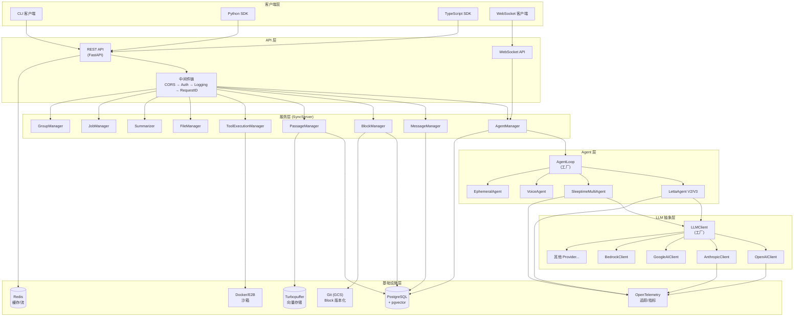

## 2. 核心数据流

### 2.1 消息处理主流程

用户发送消息到 Agent 的完整数据流：

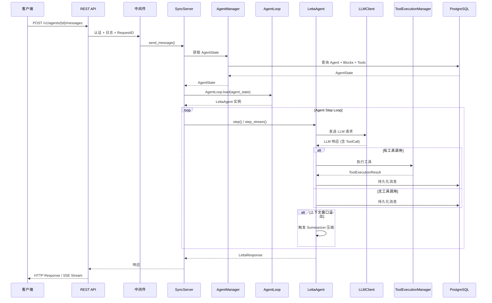

### 2.2 记忆读写数据流

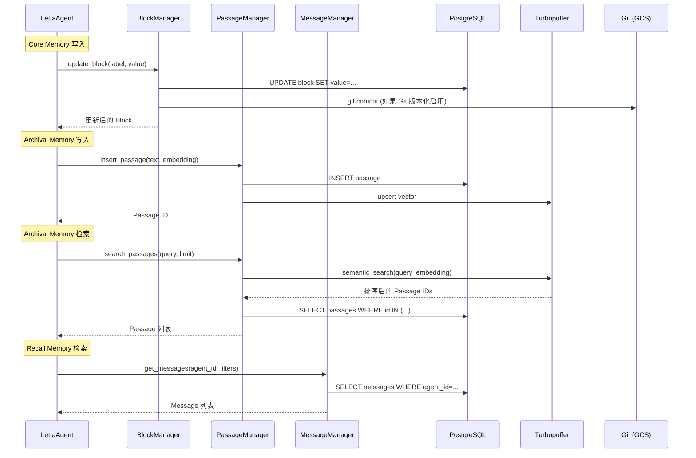

## 3. 核心架构模式

### 3.1 分层架构

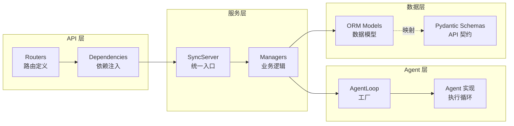

**关键约束**:
- API 层只做参数校验和路由，不含业务逻辑
- 服务层 (Manager) 是业务逻辑的唯一归属
- Agent 层通过 Manager 访问数据，不直接操作 ORM
- ORM Model 与 Pydantic Schema 严格分离，通过 `to_pydantic()` / `to_orm()` 转换

### 3.2 工厂模式

项目中大量使用工厂模式实现解耦：

| 工厂 | 位置 | 用途 |
|------|------|------|
| `AgentLoop.load()` | agents/agent_loop.py | 根据 AgentType 创建对应 Agent 实例 |
| `LLMClient.create()` | llm_api/llm_client.py | 根据 ProviderType 创建对应 LLM 客户端 |
| `create_token_counter()` | services/context_window_calculator/ | 根据模型创建 Token 计数器 |

### 3.3 适配器模式

LLM 层使用适配器将不同 Provider 的请求/响应格式统一：

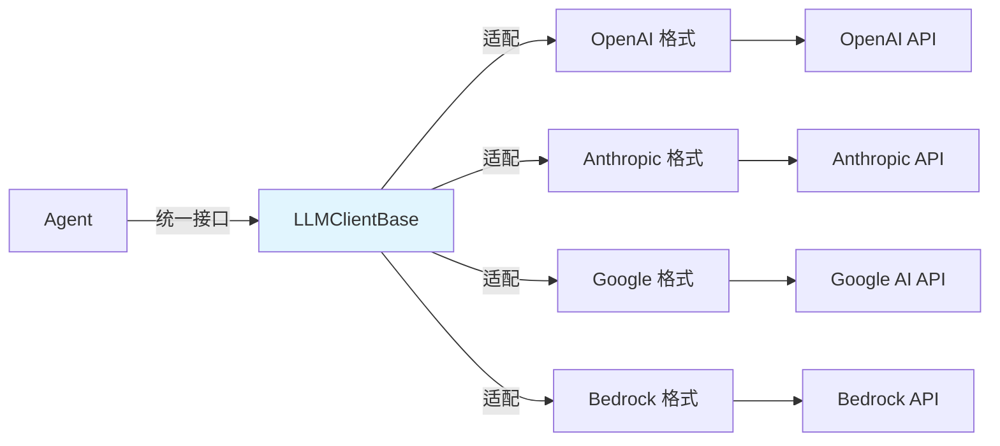

所有 Provider 的响应最终归一化为 `OpenAI ChatCompletionResponse` 格式，作为系统内部的"通用语言"。

### 3.4 观察者/事件模式

流式响应使用事件驱动模式：

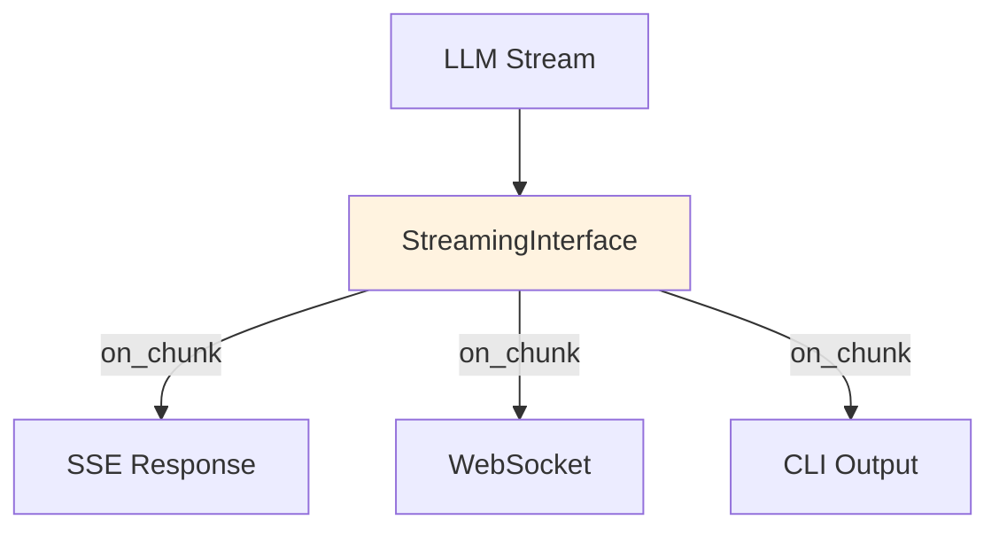

## 4. 核心子系统交互

### 4.1 Agent 执行循环

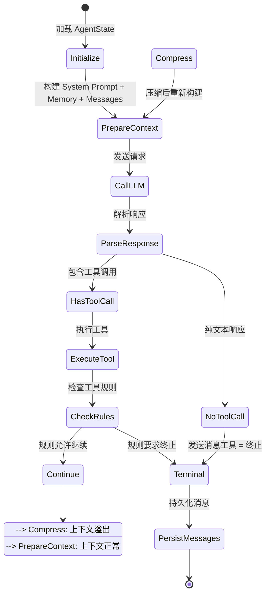

### 4.2 多 Agent 协作模式

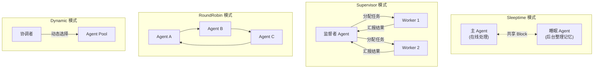

### 4.3 上下文窗口管理

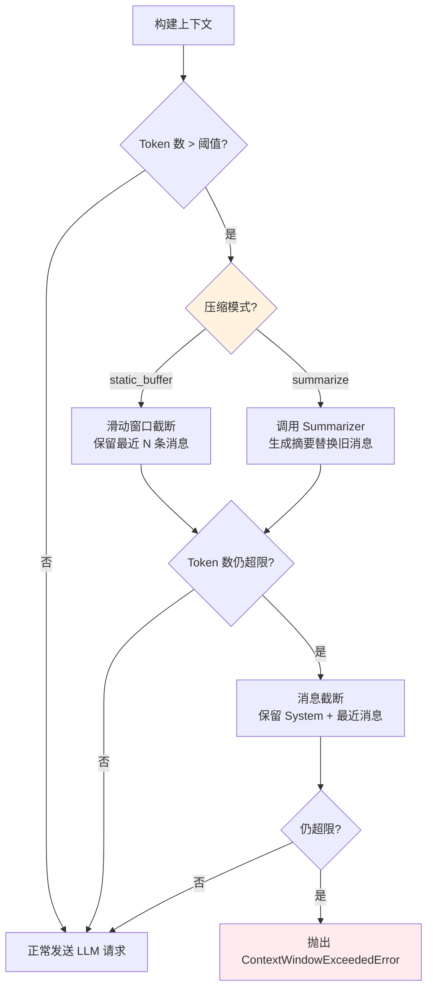

## 5. 数据模型关系

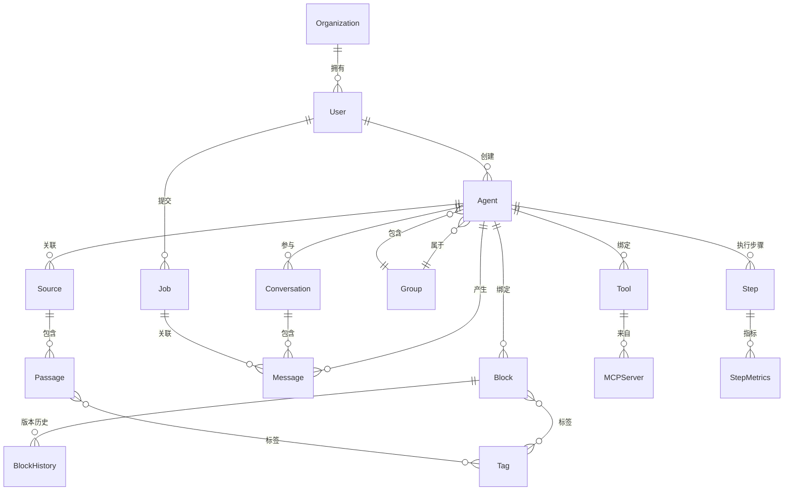

## 6. 部署架构

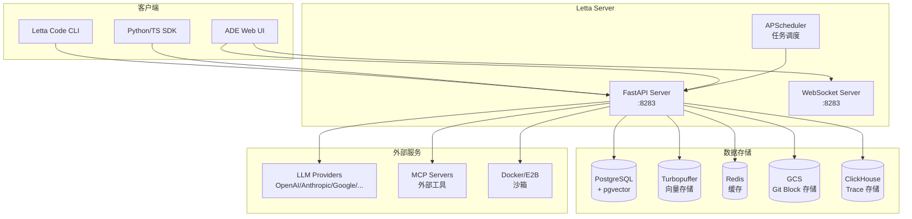

## 7. 关键设计决策

| # | 决策 | 选择 | 理由 |
|---|------|------|------|
| 1 | 响应格式归一化 | 统一为 OpenAI ChatCompletionResponse | OpenAI 格式是事实标准，减少下游转换 |
| 2 | ORM/Schema 分离 | SQLAlchemy Model + Pydantic Schema 双层 | ORM 负责持久化，Schema 负责 API 契约，关注点分离 |
| 3 | Agent 工厂模式 | AgentLoop.load() 按 AgentType 创建 | 解耦 Agent 类型和实例化逻辑 |
| 4 | 流式接口抽象 | StreamingInterface 事件驱动 | 统一 SSE/WebSocket/CLI 多种输出通道 |
| 5 | 记忆三层架构 | Core/Recall/Archival | 模拟人类记忆系统，平衡延迟和容量 |
| 6 | 上下文压缩降级链 | 滑动窗口 → 摘要 → 截断 | 优雅降级，优先保证功能可用 |
| 7 | 多 Agent 共享 Block | Sleeptime Agent 通过 Block 传递记忆 | 简单高效，避免引入额外消息通道 |
| 8 | 工具规则声明式 | ToolRule 约束工具调用顺序 | 声明式比命令式更易理解和维护 |
| 9 | MCP 集成 | 双层（注册+运行时发现） | 支持动态工具发现，保持 Schema 一致性 |
| 10 | 软删除 | is_deleted 标记 | 保留审计追踪，支持数据恢复 |

## 8. 模块依赖关系

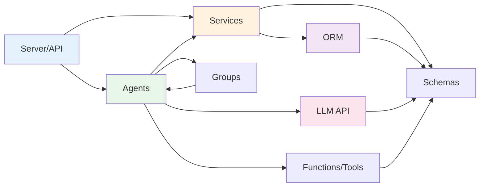

## 9. 详细设计文档索引

| 模块 | 文档 | 核心内容 |
|------|------|----------|
| Agent 系统 | [agent-system.md](./agent-system.md) | 类继承体系、生命周期、执行循环、多 Agent 协作 |
| LLM 抽象层 | [llm-abstraction.md](./llm-abstraction.md) | Provider 路由、请求流程、流式响应、适配器模式 |
| Memory 记忆系统 | [memory-system.md](./memory-system.md) | 三层架构、Block 管理、上下文压缩、记忆检索 |
| Server/API 层 | [server-api.md](./server-api.md) | REST/WebSocket、流式推送、认证中间件、异常处理 |
| ORM 持久化层 | [orm-persistence.md](./orm-persistence.md) | ER 关系、Schema 映射、多租户、软删除 |
| Tool/Function 系统 | [tool-function.md](./tool-function.md) | 工具注册/执行、MCP 集成、规则系统、沙箱 |
