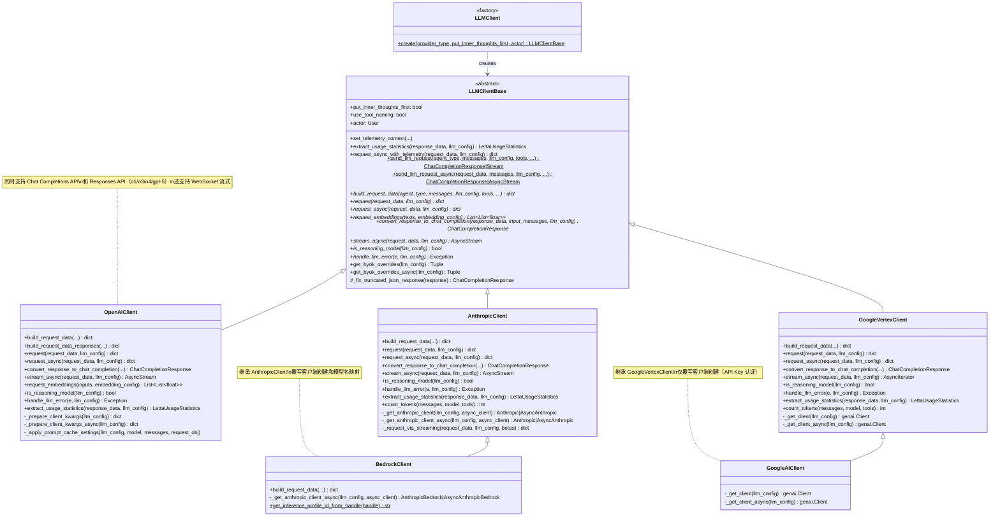
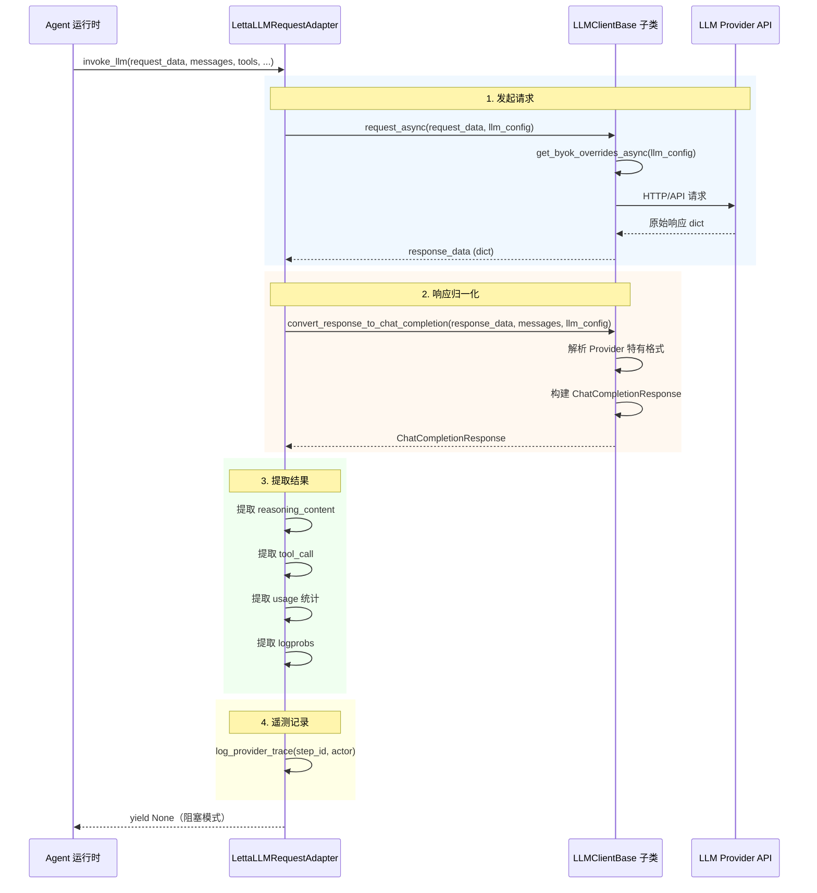
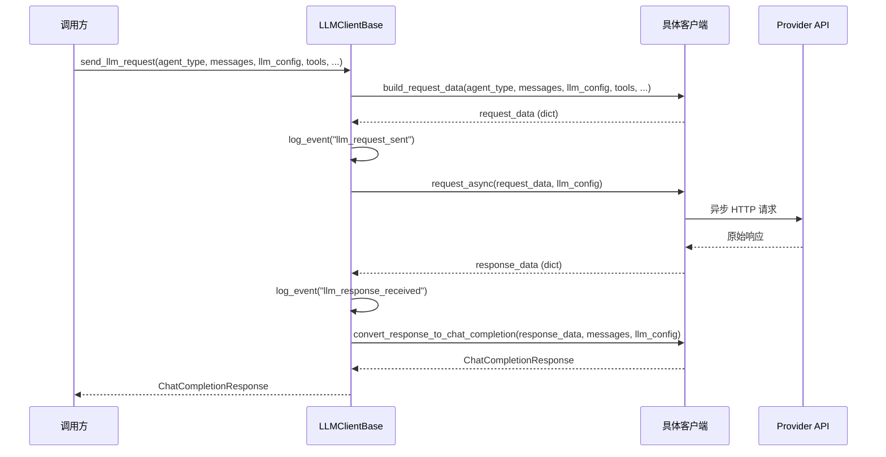
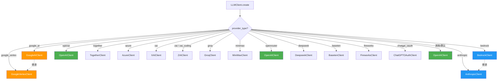
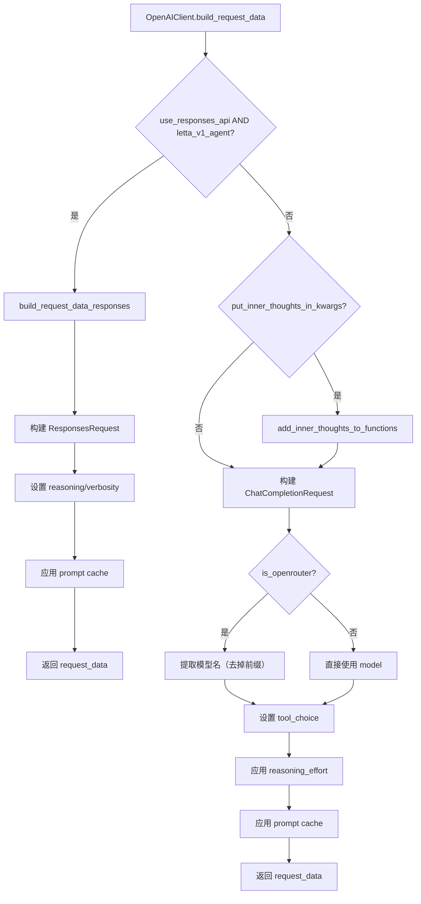
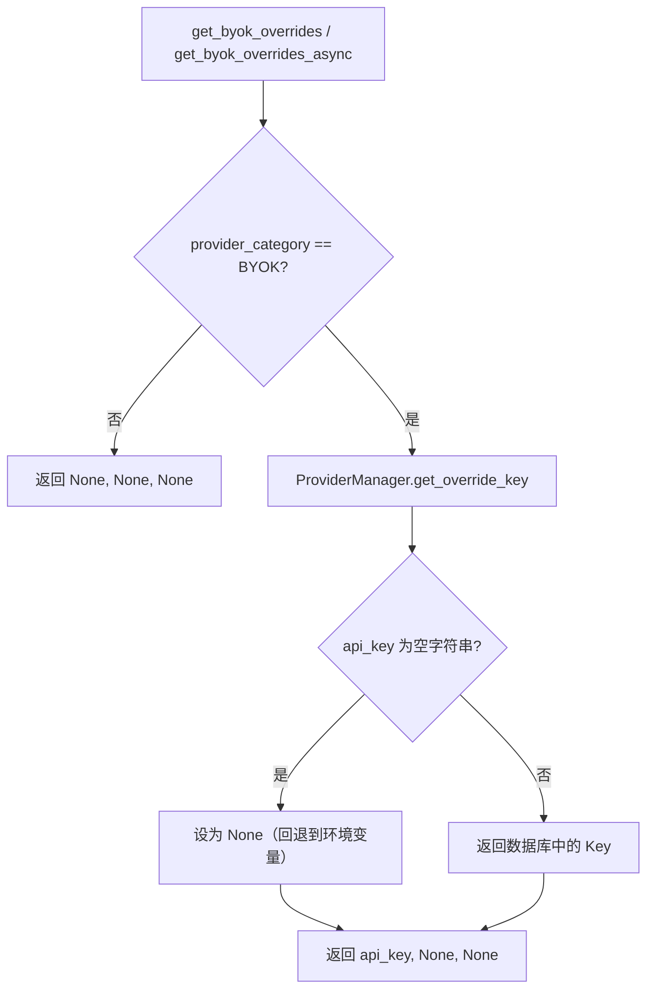
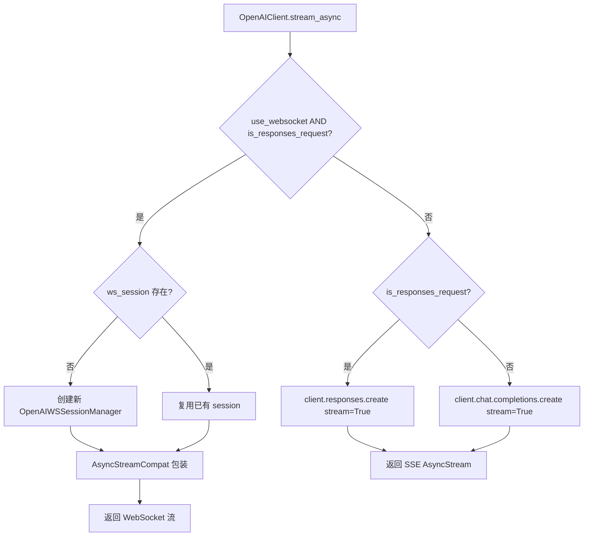
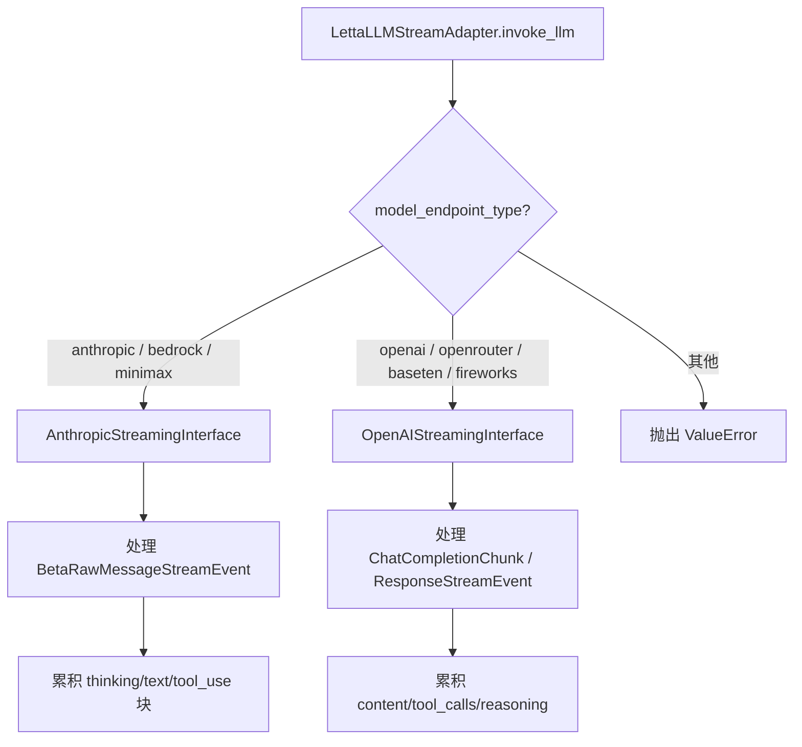

# Letta LLM 抽象层模块设计文档

## 1. 模块概述

### 1.1 定位

LLM 抽象层是 Letta 项目中连接 Agent 运行时与底层大语言模型服务的核心中间层。它屏蔽了不同 LLM Provider（OpenAI、Anthropic、Google AI、Bedrock 等）的 API 差异，向上层提供统一的请求构建、响应解析和流式处理接口。

### 1.2 核心职责

| 职责 | 说明 |
|------|------|
| **Provider 路由** | 根据 `ProviderType` 枚举值，将请求路由到对应的 LLM 客户端实现 |
| **请求构建** | 将统一的 `LLMConfig` + `Message` + `Tool` 转换为各 Provider 特有的请求格式 |
| **响应归一化** | 将各 Provider 的原生响应格式统一转换为 OpenAI ChatCompletionResponse 兼容格式 |
| **流式处理** | 支持异步流式响应，通过 Provider 特有的 Streaming Interface 实时产出 Token |
| **错误映射** | 将 Provider 特有的异常类型映射为统一的 `LLMError` 层次结构 |
| **遥测追踪** | 通过 `TelemetryManager` 记录请求/响应的 Provider Trace |
| **BYOK 支持** | 支持 Bring-Your-Own-Key 模式，从数据库获取用户自定义 API Key |

### 1.3 模块结构

```
letta/
├── llm_api/                          # LLM 客户端层
│   ├── llm_client.py                 # 工厂类 LLMClient
│   ├── llm_client_base.py            # 抽象基类 LLMClientBase
│   ├── openai_client.py              # OpenAI 客户端（含 Responses API）
│   ├── anthropic_client.py           # Anthropic 客户端
│   ├── google_ai_client.py           # Google AI 客户端（继承 Vertex）
│   ├── google_vertex_client.py       # Google Vertex 客户端
│   ├── bedrock_client.py             # AWS Bedrock 客户端（继承 Anthropic）
│   ├── helpers.py                    # 辅助函数（inner thoughts、structured output）
│   ├── llm_api_tools.py              # 旧版 LLM API 工具（含重试逻辑）
│   └── ...                           # 其他 Provider 客户端
├── adapters/                         # 适配器层
│   ├── letta_llm_adapter.py          # 抽象适配器基类
│   ├── letta_llm_request_adapter.py  # 阻塞式请求适配器
│   └── letta_llm_stream_adapter.py   # 流式请求适配器
└── schemas/
    ├── llm_config.py                 # LLM 配置模型
    └── providers/                    # Provider Schema 定义
```

---

## 2. 类继承体系



### 2.1 其他 Provider 客户端

以下客户端均继承自 `OpenAIClient`（使用 OpenAI 兼容 API）：

| 客户端 | ProviderType | 说明 |
|--------|-------------|------|
| `AzureClient` | `azure` | Azure OpenAI 服务 |
| `TogetherClient` | `together` | Together AI |
| `XAIClient` | `xai` | xAI (Grok) |
| `ZAIClient` | `zai` / `zai_coding` | 智谱 AI |
| `GroqClient` | `groq` | Groq |
| `MiniMaxClient` | `minimax` | MiniMax |
| `DeepseekClient` | `deepseek` | DeepSeek |
| `BasetenClient` | `baseten` | Baseten |
| `FireworksClient` | `fireworks` | Fireworks AI |
| `ChatGPTOAuthClient` | `chatgpt_oauth` | ChatGPT OAuth |

> **注意**：`OpenRouter` 类型直接复用 `OpenAIClient`，未创建独立子类。

---

## 3. 请求处理流程

### 3.1 阻塞式请求完整流程



### 3.2 通过 send_llm_request 的简化流程



---

## 4. 多 Provider 路由机制

### 4.1 Provider 选择与客户端创建



### 4.2 请求构建路由（以 OpenAI 为例）



### 4.3 BYOK 密钥解析流程



---

## 5. 流式响应处理

### 5.1 流式请求完整时序

```mermaid
sequenceDiagram
    participant Agent as Agent 运行时
    participant StreamAdapter as LettaLLMStreamAdapter
    participant Client as LLMClientBase 子类
    participant Interface as Streaming Interface
    participant Provider as LLM Provider API

    Agent->>StreamAdapter: invoke_llm(request_data, messages, tools, ...)
    StreamAdapter->>StreamAdapter: 存储 request_data

    rect rgb(240, 248, 255)
        Note over StreamAdapter,Provider: 1. 创建 Streaming Interface
        StreamAdapter->>StreamAdapter: 根据 model_endpoint_type 选择 Interface
        Note right of StreamAdapter: anthropic/bedrock → AnthropicStreamingInterface<br/>openai/openrouter → OpenAIStreamingInterface
    end

    rect rgb(255, 248, 240)
        Note over StreamAdapter,Provider: 2. 发起流式请求
        StreamAdapter->>Client: stream_async(request_data, llm_config)
        Client->>Provider: SSE / WebSocket 连接
        Provider-->>Client: AsyncStream
        Client-->>StreamAdapter: stream
    end

    rect rgb(240, 255, 240)
        Note over StreamAdapter,Interface,Provider: 3. 逐块处理并实时产出
        loop 对每个 chunk
            StreamAdapter->>Interface: process(stream) → async for chunk
            Interface-->>StreamAdapter: yield LettaMessage
            StreamAdapter-->>Agent: yield LettaMessage（实时推送）
        end
    end

    rect rgb(255, 255, 230)
        Note over StreamAdapter,Interface: 4. 流结束后提取汇总数据
        StreamAdapter->>Interface: get_tool_call_object()
        StreamAdapter->>Interface: get_reasoning_content()
        StreamAdapter->>Interface: get_usage_statistics()
        StreamAdapter->>StreamAdapter: log_provider_trace(step_id, actor)
    end
```

### 5.2 OpenAI 双通道流式（HTTP SSE vs WebSocket）



### 5.3 Streaming Interface 选择逻辑



---

## 6. 关键设计决策分析

### 6.1 统一响应格式：OpenAI ChatCompletionResponse 作为 Lingua Franca

**决策**：所有 Provider 的响应最终都归一化为 `ChatCompletionResponse`（兼容 OpenAI 格式）。

**理由**：
- OpenAI 的 Chat Completions 格式已成为事实上的行业标准
- 上层 Agent 逻辑只需处理一种响应结构，大幅降低复杂度
- 工具调用、推理内容等扩展字段通过 `reasoning_content`、`reasoning_content_signature` 等附加字段承载

**代价**：
- 某些 Provider 特有能力（如 Anthropic 的 `redacted_thinking`）需要通过扩展字段传递
- 响应转换逻辑在每个客户端中存在大量 Provider 特定代码

### 6.2 工厂模式 + 策略模式：LLMClient.create 的延迟导入

**决策**：`LLMClient.create()` 使用 `match/case` 语句，每个分支内执行延迟导入（`from letta.llm_api.xxx import XxxClient`）。

**理由**：
- 避免启动时加载所有 Provider SDK（如 `anthropic`、`google.genai`），减少冷启动时间
- 用户可能只使用一种 Provider，无需安装其他 SDK 依赖
- 默认分支（`case _`）回退到 `OpenAIClient`，兼容 OpenAI 兼容 API 的 Provider

**代价**：
- 新增 Provider 需要修改工厂类的 `match/case` 语句（违反开闭原则）
- 延迟导入使得类型检查器无法在模块级别推断完整类型

### 6.3 继承复用：BedrockClient 继承 AnthropicClient

**决策**：`BedrockClient` 继承 `AnthropicClient`，仅覆写客户端创建和模型名映射；`GoogleAIClient` 继承 `GoogleVertexClient`，仅覆写认证方式。

**理由**：
- Bedrock 底层运行 Anthropic 模型，请求/响应格式与 Anthropic API 高度一致
- Google AI 和 Google Vertex 共享 Gemini 模型的请求/响应格式
- 避免大量代码重复

**代价**：
- 子类与父类耦合较紧，父类变更可能意外影响子类
- Bedrock 的 `build_request_data` 需要删除 `disable_parallel_tool_use` 字段，这种"先构建再删除"的模式不够优雅

### 6.4 双 API 支持：OpenAI Chat Completions + Responses API

**决策**：`OpenAIClient` 同时支持 Chat Completions API 和 Responses API，通过 `use_responses_api()` 判断是否路由到 Responses API。

**理由**：
- OpenAI 的推理模型（o1/o3/o4/gpt-5）推荐使用 Responses API
- Responses API 提供更好的 reasoning 支持（`encrypted_content`、`summary`）
- 仅对 `letta_v1_agent` 类型启用 Responses API，避免影响其他 Agent 类型

**代价**：
- `OpenAIClient` 代码量显著增加（两个 `build_request_data` 变体）
- 流式处理需要同时支持 SSE 和 WebSocket 两种通道

### 6.5 Inner Thoughts 机制：Kwargs 注入 vs 原生推理

**决策**：提供两种"内心独白"实现——将 inner_thoughts 作为函数参数注入（`put_inner_thoughts_in_kwargs=True`），或使用模型原生推理能力（`enable_reasoner=True`）。

**理由**：
- 早期模型（GPT-4、Claude 3 Haiku）缺乏原生推理能力，需要通过函数参数注入来引导模型"先思考再行动"
- 新一代推理模型（o1/o3、Claude Sonnet 4、Gemini 2.5）具有原生 thinking 能力，无需注入
- `letta_v1_agent` 强制关闭 kwargs 注入，统一使用原生推理

**代价**：
- `add_inner_thoughts_to_functions` 和 `unpack_all_inner_thoughts_from_kwargs` 增加了请求/响应处理的复杂度
- 不同 Agent 类型对 inner thoughts 的处理策略不同，增加了配置复杂度

### 6.6 错误映射：Provider 异常到统一 LLMError

**决策**：每个客户端实现 `handle_llm_error()` 方法，将 Provider SDK 特有的异常映射为 `LLMError` 层次结构。

```
LLMError (基类)
├── ContextWindowExceededError   # 上下文窗口溢出
├── LLMRateLimitError            # 速率限制
├── LLMAuthenticationError       # 认证失败
├── LLMConnectionError           # 连接错误
├── LLMTimeoutError              # 超时
├── LLMBadRequestError           # 请求格式错误
├── LLMNotFoundError             # 资源未找到
├── LLMPermissionDeniedError     # 权限不足
├── LLMServerError               # 服务端错误
├── LLMEmptyResponseError        # 空响应
├── LLMProviderOverloaded        # Provider 过载
├── LLMInsufficientCreditsError  # 额度不足
└── LLMUnprocessableEntityError  # 不可处理实体
```

**理由**：
- 上层逻辑可以统一处理错误（如 `ContextWindowExceededError` 触发上下文压缩）
- BYOK 标记（`is_byok`）附加到错误详情中，便于区分托管和自带密钥场景

**代价**：
- 每个客户端需要维护大量错误映射代码
- 某些错误类型在不同 Provider 中的触发条件不完全一致

### 6.7 遥测与追踪：双重记录机制

**决策**：同时存在两套遥测记录路径——`LLMClientBase.request_async_with_telemetry()` 和 `LettaLLMAdapter.log_provider_trace()`。

**理由**：
- `request_async_with_telemetry` 在客户端层记录，覆盖所有请求（包括错误）
- `log_provider_trace` 在适配器层记录，包含更丰富的上下文（agent_id、run_id、billing_context）
- 适配器层使用 fire-and-forget 模式（`safe_create_task`），不阻塞主流程

**代价**：
- 存在重复记录的风险
- 两套记录路径的配置条件不同（`settings.track_provider_trace` vs `step_id/actor 非空`）

### 6.8 LLMConfig 的模型验证器链

**决策**：`LLMConfig` 使用多个 `model_validator(mode="before")` 来设置模型特定的默认值和约束。

```
redirect_deprecated_google_models  → 重定向已弃用的 Google 模型名
set_model_specific_defaults        → 设置 max_tokens、context_window 等默认值
set_default_enable_reasoner        → 设置推理模型默认值
set_default_put_inner_thoughts     → 设置 inner_thoughts 策略
validate_codex_reasoning_effort    → 验证 Codex 模型的 reasoning_effort
```

**理由**：
- 不同模型有不同的默认参数和约束，验证器链确保配置始终一致
- 用户只需提供 `model` 名称，系统自动推断合理的默认值

**代价**：
- 验证器链的执行顺序依赖 Pydantic 的定义顺序，调试困难
- 验证器中引用了 `openai_client` 的函数，造成循环依赖风险

### 6.9 适配器模式的引入：LettaLLMAdapter

**决策**：在 LLM 客户端和 Agent 之间引入 `LettaLLMAdapter` 抽象层，分为阻塞式（`LettaLLMRequestAdapter`）和流式（`LettaLLMStreamAdapter`）两种实现。

**理由**：
- 将"如何调用 LLM"（客户端职责）与"如何处理结果"（适配器职责）分离
- 流式适配器可以实时 yield `LettaMessage`，阻塞式适配器一次性返回
- 适配器持有完整的请求/响应状态（`tool_call`、`reasoning_content`、`usage`），供 Agent 后续使用

**代价**：
- 增加了一层间接调用
- 适配器和客户端之间存在部分职责重叠（如遥测记录）
