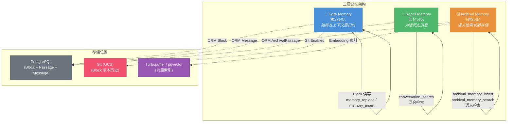
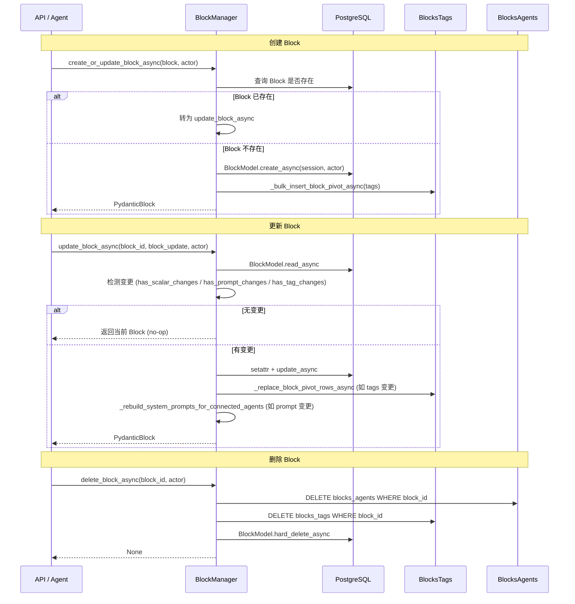
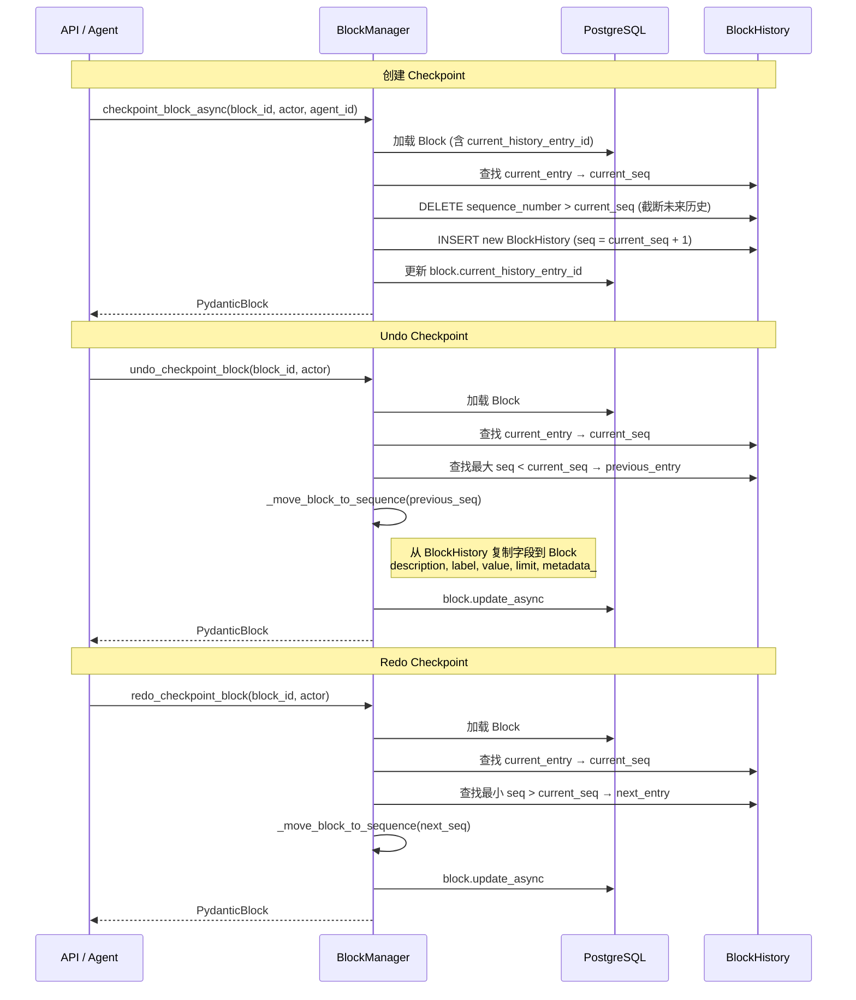
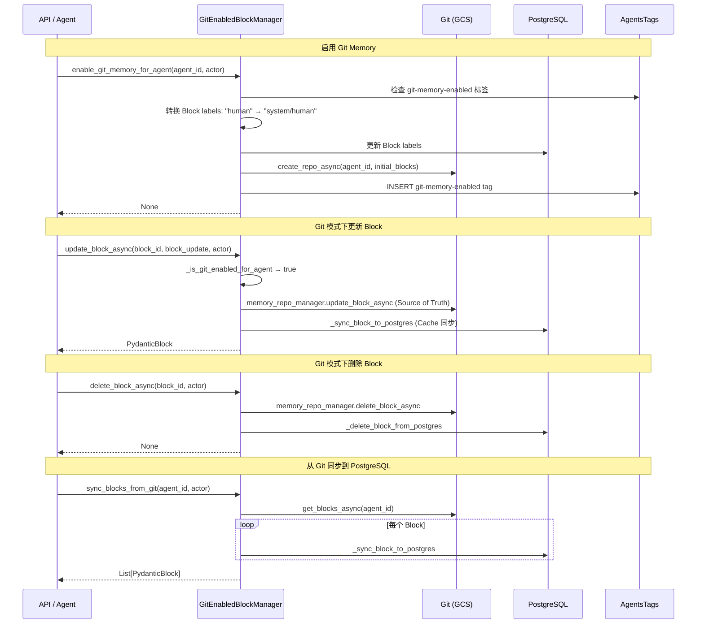
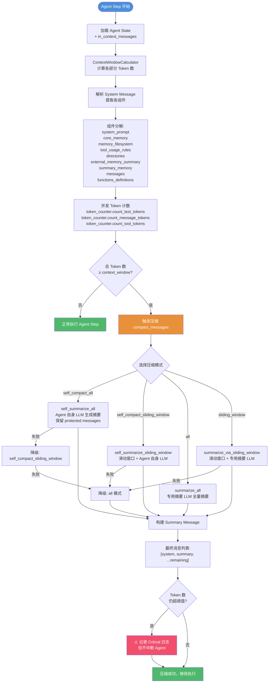
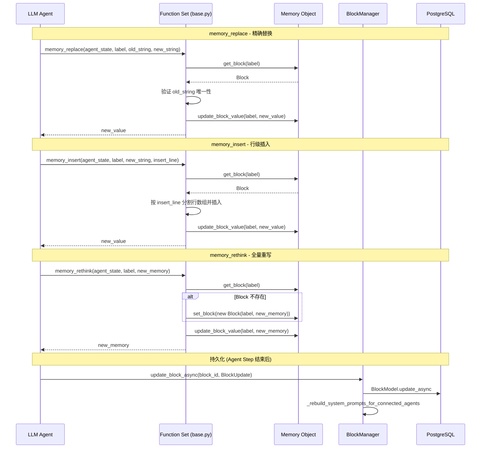
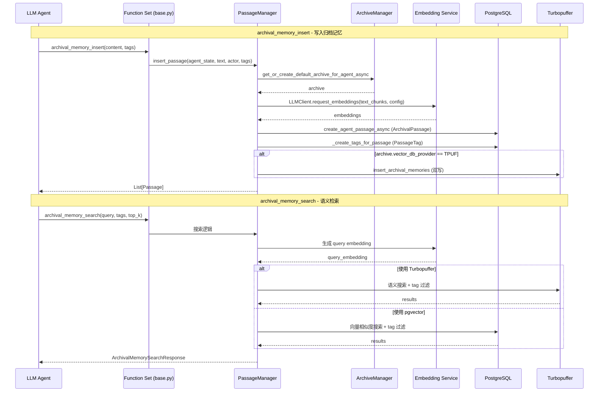
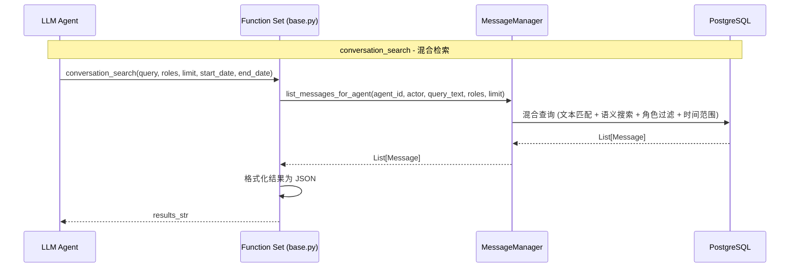

# Letta Memory 记忆系统模块设计文档

## 1. 模块概述

### 1.1 系统定位

Letta Memory 系统是整个 Agent 架构的核心基础设施，负责管理 Agent 的全部记忆状态。它实现了类人脑的三层记忆架构，使 Agent 能够在有限的上下文窗口内高效地存储、检索和压缩信息。

### 1.2 核心职责

| 职责 | 说明 |
|------|------|
| **记忆存储** | 管理三层记忆（Core / Recall / Archival）的持久化与生命周期 |
| **上下文渲染** | 将记忆内容编译为 LLM 可消费的系统提示词格式 |
| **版本控制** | 支持 Block 级别的 Checkpoint / Undo / Redo 以及 Git 版本化存储 |
| **上下文压缩** | 当上下文窗口溢出时，通过摘要策略自动压缩对话历史 |
| **语义检索** | 基于向量嵌入的 Archival Memory 语义搜索 |
| **对话隔离** | 支持 Conversation 级别的 Block 隔离，实现多对话并发 |

### 1.3 核心文件索引

| 层次 | 文件 | 职责 |
|------|------|------|
| Schema | `letta/schemas/memory.py` | Memory 数据模型与渲染逻辑 |
| Schema | `letta/schemas/block.py` | Block 数据模型（BaseBlock / Block / FileBlock / Human / Persona） |
| Schema | `letta/schemas/passage.py` | Passage 数据模型（Archival / Source） |
| ORM | `letta/orm/block.py` | Block 数据库映射，含版本锁与历史关联 |
| ORM | `letta/orm/passage.py` | Passage 数据库映射（ArchivalPassage / SourcePassage） |
| ORM | `letta/orm/conversation.py` | Conversation 数据库映射 |
| Service | `letta/services/block_manager.py` | Block CRUD、Checkpoint、批量更新 |
| Service | `letta/services/block_manager_git.py` | Git 版本化 Block 管理器 |
| Service | `letta/services/conversation_manager.py` | 对话管理、消息关联、隔离 Block |
| Service | `letta/services/passage_manager.py` | Passage CRUD、嵌入生成、双写（PG + Turbopuffer） |
| Service | `letta/services/summarizer/` | 摘要器模块（多种压缩策略） |
| Service | `letta/services/context_window_calculator/` | 上下文窗口 Token 计算器 |
| Function | `letta/functions/function_sets/base.py` | Agent 可调用的内存工具函数 |

---

## 2. 记忆层次架构

Letta 的记忆系统采用三层架构，分别对应不同的存储位置、访问方式和生命周期：



### 2.1 Core Memory（核心记忆）

- **存储位置**：始终位于 LLM 上下文窗口的系统提示词中
- **数据结构**：由多个 `Block` 组成，每个 Block 有 `label`、`value`、`limit`、`description`
- **访问方式**：Agent 通过 `memory_replace`、`memory_insert`、`memory_rethink`、`memory_apply_patch` 等工具直接读写
- **渲染格式**：XML 风格的 `<memory_blocks>` 标签包裹，每个 Block 渲染为 `<label>` 标签
- **典型 Block**：`human`（用户画像）、`persona`（Agent 人设）、自定义 Block

### 2.2 Recall Memory（回忆记忆）

- **存储位置**：数据库中的 Message 表，通过 `ConversationMessage` 关联
- **数据结构**：完整的对话消息历史（user / assistant / tool / system）
- **访问方式**：`conversation_search` 混合检索（文本 + 语义）
- **上下文管理**：仅最近的消息保留在上下文窗口中，旧消息通过摘要压缩

### 2.3 Archival Memory（归档记忆）

- **存储位置**：`ArchivalPassage` 表 + 向量数据库（pgvector / Turbopuffer）
- **数据结构**：`Passage` 对象，包含 `text`、`embedding`、`tags`、`metadata`
- **访问方式**：`archival_memory_search` 语义检索 + `archival_memory_insert` 写入
- **存储后端**：双写策略——PostgreSQL 作为主存储，Turbopuffer 作为向量索引

---

## 3. Block 管理流程

### 3.1 Block CRUD 流程



### 3.2 Block Checkpoint / Undo / Redo 流程



### 3.3 Git 版本化 Block 管理流程



---

## 4. 上下文窗口管理

### 4.1 上下文窗口结构

上下文窗口由以下部分组成，按顺序排列：

```
┌─────────────────────────────────────────────────┐
│              System Message                       │
│  ┌───────────────────────────────────────────┐  │
│  │  System Prompt (base_instructions)        │  │
│  ├───────────────────────────────────────────┤  │
│  │  Core Memory (<memory_blocks>)            │  │
│  │    <human>...</human>                     │  │
│  │    <persona>...</persona>                 │  │
│  ├───────────────────────────────────────────┤  │
│  │  Memory Filesystem (<memory_filesystem>)  │  │
│  ├───────────────────────────────────────────┤  │
│  │  Tool Usage Rules                         │  │
│  ├───────────────────────────────────────────┤  │
│  │  Directories (Sources)                    │  │
│  ├───────────────────────────────────────────┤  │
│  │  External Memory Summary                  │  │
│  └───────────────────────────────────────────┘  │
├─────────────────────────────────────────────────┤
│  Summary Memory (position 1, optional)           │
├─────────────────────────────────────────────────┤
│  Conversation Messages (position 2+)             │
│    user → assistant → tool → assistant → ...     │
└─────────────────────────────────────────────────┘
```

### 4.2 上下文窗口计算与压缩流程



### 4.3 摘要策略详解

| 模式 | 描述 | LLM 来源 | 适用场景 |
|------|------|----------|----------|
| `self_compact_all` | Agent 使用自身 LLM 全量摘要 | Agent LLM | 需要最高摘要质量 |
| `self_compact_sliding_window` | Agent 自身 LLM + 滑动窗口 | Agent LLM | 长对话渐进压缩 |
| `all` | 专用摘要 LLM 全量摘要 | Summarizer LLM | 轻量级默认方案 |
| `sliding_window` | 专用摘要 LLM + 滑动窗口 | Summarizer LLM | 平衡质量与成本 |

**降级链**：`self_compact_all` → `self_compact_sliding_window` → `all`

**滑动窗口算法**：
1. 从 `eviction_percentage`（默认 30%）开始
2. 找到截断点后第一个 `assistant` 消息
3. 计算截断后剩余消息的 Token 数
4. 若仍超 `goal_tokens`，增加 10% 淘汰率，重复
5. 对淘汰部分生成摘要，保留截断点之后的消息

---

## 5. 记忆检索流程

### 5.1 Core Memory 读写流程



### 5.2 Archival Memory 存储与检索流程



### 5.3 Recall Memory 检索流程



---

## 6. 关键设计决策分析

### 6.1 Block 与 Agent 的多对多关系

**决策**：Block 通过 `blocks_agents` 中间表与 Agent 建立多对多关系，一个 Block 可被多个 Agent 共享。

**理由**：
- 支持 Block 模板化复用（如多个 Agent 共享同一个 persona Block）
- 减少存储冗余，统一更新
- 通过 `BlocksAgents.block_label` 保留每个 Agent 对 Block 的自定义标签

**权衡**：
- 更新 Block 时需遍历所有关联 Agent 重建系统提示词（`_rebuild_system_prompts_for_connected_agents`）
- 删除 Block 时需先清理中间表再删除 Block 本身

### 6.2 Git 版本化存储的双写架构

**决策**：`GitEnabledBlockManager` 采用 Git (GCS) 作为 Source of Truth，PostgreSQL 作为 Cache。

**理由**：
- Git 提供完整的版本历史和 diff 能力，适合审计和回溯
- PostgreSQL 提供高性能的随机读取，适合 Agent 运行时查询
- 写入路径：先写 Git → 再同步 PostgreSQL，保证数据一致性

**权衡**：
- 写入延迟增加（两次写入）
- 需要处理 Git 与 PostgreSQL 的数据不一致场景（`sync_blocks_from_git`）
- 标签（Tags）仅存储在 PostgreSQL，不纳入 Git 版本控制

### 6.3 Block 历史的线性 Checkpoint 模型

**决策**：Block 的版本历史采用线性 Checkpoint 模型（非分支），通过 `BlockHistory` 表存储快照。

**理由**：
- 简化 Undo / Redo 逻辑——只需在序列号上前后移动
- `checkpoint_block_async` 时截断所有"未来" Checkpoint，保证线性
- 使用 SQLAlchemy 的 `version_id_col` 实现乐观锁，防止并发冲突

**权衡**：
- Undo 后的新写入会丢失 Redo 历史（截断策略）
- 不支持分支/合并等高级版本控制操作

### 6.4 Archival Memory 的双写策略

**决策**：Archival Memory 同时写入 PostgreSQL 和 Turbopuffer（或 pgvector）。

**理由**：
- PostgreSQL 作为主存储保证数据持久性
- Turbopuffer / pgvector 提供高效的向量相似度搜索
- 写入时先生成 Embedding，再双写；删除时双删
- `strict_mode` 参数控制双写失败时是否抛出异常

**权衡**：
- 写入延迟和存储成本翻倍
- 需要处理双写不一致（Turbopuffer 写入失败时仅记日志）
- Embedding 维度需 padding 到 `MAX_EMBEDDING_DIM` 以兼容 pgvector

### 6.5 上下文压缩的降级链设计

**决策**：压缩策略采用多级降级链，确保在任何情况下都能完成压缩。

**降级链**：
```
self_compact_all → self_compact_sliding_window → all → (Critical Warning)
```

**理由**：
- Agent 自身 LLM 生成的摘要质量最高（理解上下文最深）
- 但自身 LLM 可能上下文溢出，需要降级到专用摘要 LLM
- 专用摘要 LLM 也可能失败，此时使用 `middle_truncate_text` 硬截断
- 最终仍超阈值时记录 Critical 日志但不中断 Agent（避免 Agent 不可用）

**权衡**：
- 降级过程中摘要质量递减
- 多次 LLM 调用增加延迟和成本
- `ContextWindowExceededError` 不降级，直接抛出（避免无限循环）

### 6.6 Conversation 级别的 Block 隔离

**决策**：Conversation 可创建 `isolated_block_labels`，为特定对话生成独立的 Block 副本。

**理由**：
- 支持多对话并发——不同对话可修改同一 Block 而不互相干扰
- 通过 `blocks_conversations` 中间表关联
- `apply_isolated_blocks_to_agent_state` 在运行时替换 Agent State 中的 Block

**权衡**：
- 隔离 Block 增加存储开销
- 删除 Conversation 时需额外清理隔离 Block（硬删除，因 Block 不支持软删除）
- 隔离 Block 的变更不会传播回 Agent 的主 Block

### 6.7 Memory 渲染的多模式支持

**决策**：`Memory.compile()` 支持三种渲染模式：Standard、Line-Numbered、Git。

| 模式 | 触发条件 | 特点 |
|------|----------|------|
| Standard | 默认 | XML 标签包裹，含 description / metadata / value |
| Line-Numbered | Anthropic + 特定 Agent 类型 | 每行加行号前缀 `1→`，辅助精确编辑 |
| Git | `git_enabled=True` | 结构化 `<self>` + `<memory>` 渲染，含 `<projection>` 路径 |

**理由**：
- 不同 LLM 提供商对上下文格式的理解能力不同
- Anthropic 模型对行号标注的编辑准确率更高
- Git 模式下将 Block label 映射为文件路径（如 `system/persona` → `$MEMORY_DIR/system/persona.md`），支持文件系统隐喻

**权衡**：
- 三套渲染逻辑增加维护成本
- Line-Numbered 模式下 Agent 可能误将行号包含在编辑参数中（需 `memory_replace` 中额外校验）

### 6.8 乐观锁与并发控制

**决策**：Block ORM 使用 SQLAlchemy 的 `version_id_col` 实现乐观锁。

**实现**：
- `Block.version` 字段，每次更新自增
- SQLAlchemy 自动在 UPDATE 语句中加入 `WHERE version = :old_version`
- 若版本不匹配，更新失败抛出异常

**理由**：
- 避免分布式锁的性能开销
- 适合读多写少的 Block 操作模式
- 与 `checkpoint_block_async` 配合，防止并发 Checkpoint 导致数据不一致

**权衡**：
- 并发写入时后到者需重试
- 需要在业务层处理乐观锁异常
