# Letta ORM 数据持久化层 — 模块设计文档

> 生成日期：2026-06-07
> 项目根目录：`/Users/lixiangyang/Desktop/代码/letta`

---

## 1. 模块概述

### 1.1 定位

Letta ORM 数据持久化层是整个 Letta 系统的**数据访问核心**，位于 Pydantic Schema（业务视图）与关系型数据库之间，承担以下职责：

| 职责 | 说明 |
|------|------|
| **数据映射** | 将关系型数据库行映射为 Python 对象，通过 SQLAlchemy 2.0 Declarative Mapping 实现 |
| **CRUD 抽象** | 在 `SqlalchemyBase` 中提供统一的 `create_async` / `read_async` / `update_async` / `delete_async` / `list_async` / `size_async` 异步操作 |
| **Schema 桥接** | 通过 `__pydantic_model__` 声明与 `to_pydantic()` 方法，将 ORM 对象转换为 Pydantic Schema |
| **多租户隔离** | 通过 `OrganizationMixin` + `apply_access_predicate()` 实现组织级数据隔离 |
| **软删除** | 通过 `is_deleted` 字段实现逻辑删除，避免物理删除导致的数据丢失 |
| **并发控制** | 死锁重试（3 次指数退避）、乐观锁（Block 的 `version` 字段）、超时处理 |
| **错误转译** | 将数据库原生错误（PostgreSQL / SQLite）转译为领域级异常 |

### 1.2 架构分层

```mermaid
flowchart TB
    subgraph API["API 层 (FastAPI)"]
        A1[Router / Endpoint]
    end

    subgraph Service["服务层"]
        B1[AgentService]
        B2[MessageService]
        B3[BlockService]
    end

    subgraph ORM["ORM 持久化层"]
        C1[SqlalchemyBase<br/>CRUD 模板方法]
        C2[Mixins<br/>组织/用户/Agent 归属]
        C3[Custom Columns<br/>JSON 序列化策略]
        C4[Error Translation<br/>数据库异常 → 领域异常]
    end

    subgraph Schema["Pydantic Schema 层"]
        D1[AgentState]
        D2[Message]
        D3[Block]
    end

    subgraph DB["数据库"]
        E1[(PostgreSQL<br/>+ pgvector)]
        E2[(SQLite<br/>开发模式)]
    end

    A1 --> B1 --> C1
    B2 --> C1
    B3 --> C1
    C1 --> C2
    C1 --> C3
    C1 --> C4
    C1 <-->|to_pydantic()| D1
    C1 <-->|to_pydantic()| D2
    C1 <-->|to_pydantic()| D3
    C1 --> E1
    C1 --> E2
```

### 1.3 关键文件索引

| 文件 | 职责 |
|------|------|
| `letta/orm/base.py` | `Base` 声明基类 + `CommonSqlalchemyMetaMixins`（审计字段 + 软删除） |
| `letta/orm/sqlalchemy_base.py` | `SqlalchemyBase` — CRUD 模板方法、分页、访问控制、异常转译 |
| `letta/orm/mixins.py` | `OrganizationMixin` / `UserMixin` / `AgentMixin` 等外键混入类 |
| `letta/orm/errors.py` | 领域级数据库异常定义 |
| `letta/orm/custom_columns.py` | 自定义列类型（LLMConfigColumn、EmbeddingConfigColumn 等） |
| `letta/orm/agent.py` | Agent ORM 模型 |
| `letta/orm/block.py` | Block ORM 模型（含乐观锁） |
| `letta/orm/message.py` | Message ORM 模型（含序列 ID 自动生成） |
| `letta/orm/passage.py` | Passage ORM 模型（SourcePassage / ArchivalPassage） |
| `letta/orm/source.py` | Source ORM 模型 |
| `letta/orm/tool.py` | Tool ORM 模型 |
| `letta/orm/conversation.py` | Conversation ORM 模型 |
| `letta/orm/user.py` | User ORM 模型 |
| `letta/orm/organization.py` | Organization ORM 模型（顶层实体） |
| `letta/orm/group.py` | Group ORM 模型（多 Agent 编组） |
| `letta/server/db.py` | 数据库连接管理、会话工厂、连接池配置 |

---

## 2. 数据模型关系

### 2.1 核心实体关系图

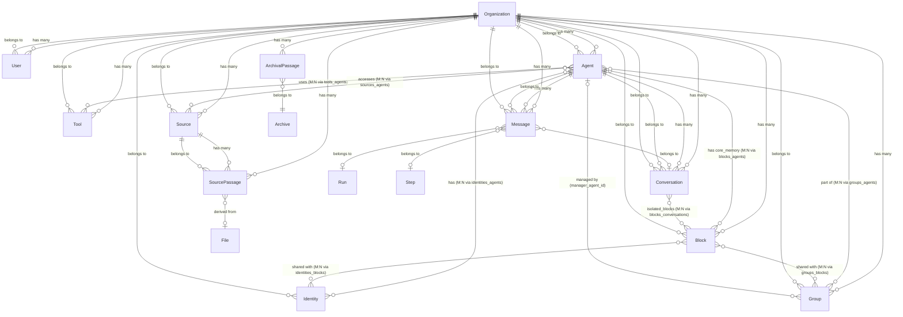

### 2.2 关联表（Junction Tables）

系统使用多个关联表实现多对多关系：

| 关联表 | 连接实体 | 说明 |
|--------|----------|------|
| `tools_agents` | Tool ↔ Agent | Agent 可使用的工具集 |
| `sources_agents` | Source ↔ Agent | Agent 可访问的数据源 |
| `blocks_agents` | Block ↔ Agent | Agent 的核心记忆块 |
| `identities_agents` | Identity ↔ Agent | Agent 关联的身份 |
| `groups_agents` | Group ↔ Agent | Group 中的 Agent 成员 |
| `identities_blocks` | Identity ↔ Block | Identity 共享的 Block |
| `groups_blocks` | Group ↔ Block | Group 共享的 Block |
| `blocks_conversations` | Block ↔ Conversation | 会话隔离的记忆块 |

### 2.3 继承体系

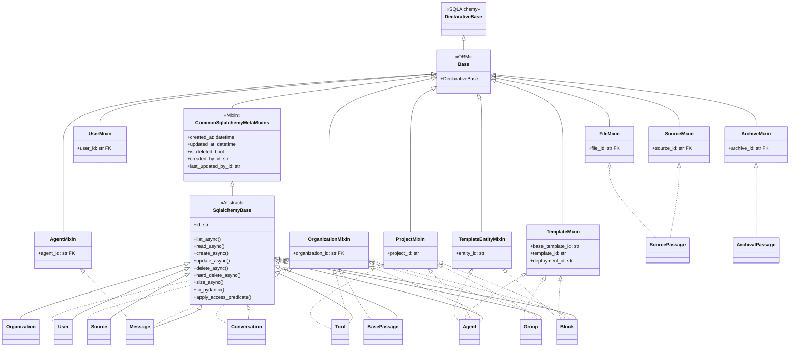

---

## 3. 数据访问模式

### 3.1 创建 Agent 的完整流程

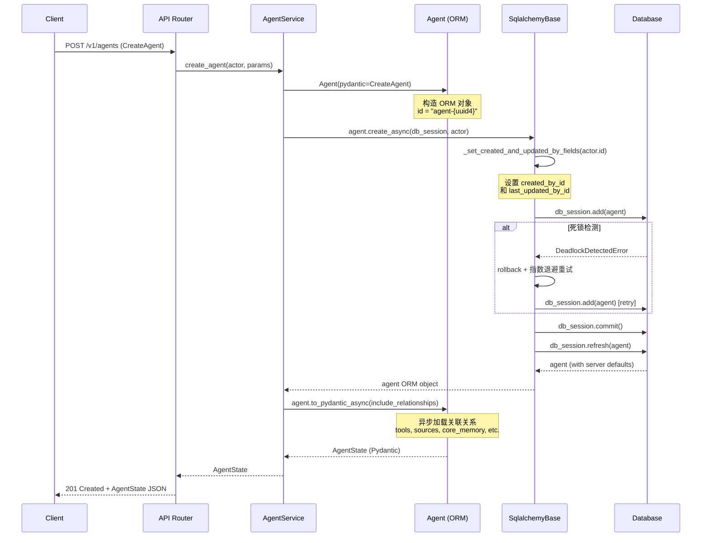

### 3.2 查询消息列表（带分页）

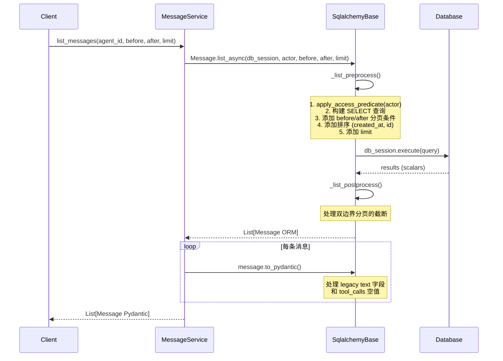

### 3.3 软删除流程

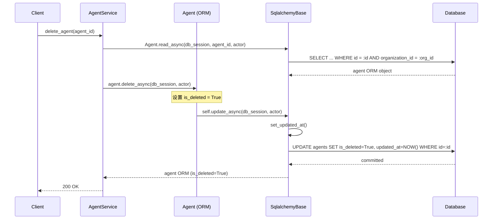

### 3.4 批量创建（Batch Create）

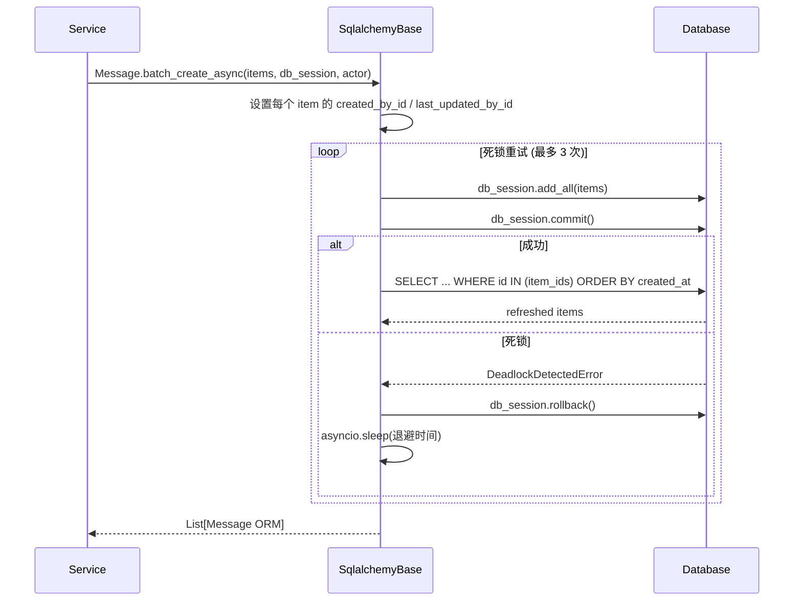

---

## 4. Schema 双层架构

### 4.1 ORM Model 与 Pydantic Schema 的映射关系

```mermaid
classDiagram
    direction LR

    class ORM_Layer {
        <<Package letta/orm>>
    }

    class Pydantic_Layer {
        <<Package letta/schemas>>
    }

    class AgentORM {
        +id: str "agent-{uuid4}"
        +agent_type: AgentType
        +name: str
        +system: str
        +message_ids: List~str~ JSON
        +llm_config: LLMConfig LLMConfigColumn
        +embedding_config: EmbeddingConfig EmbeddingConfigColumn
        +tool_rules: List~ToolRule~ ToolRulesColumn
        +metadata_: dict JSON
        +organization_id: str FK
        +is_deleted: bool
        +created_at: datetime
        +updated_at: datetime
        +__pydantic_model__ = AgentState
        +to_pydantic() AgentState
        +to_pydantic_async() AgentState
    }

    class AgentState {
        +id: str
        +agent_type: AgentType
        +name: str
        +system: str
        +message_ids: List~str~
        +llm_config: LLMConfig
        +embedding_config: EmbeddingConfig
        +tool_rules: List~ToolRule~
        +metadata: dict
        +model: str "派生自 llm_config.handle"
        +embedding: str "派生自 embedding_config.handle"
        +memory: Memory
        +tools: List~Tool~
        +sources: List~Source~
        +tags: List~str~
        +identity_ids: List~str~
    }

    class BlockORM {
        +id: str
        +label: str
        +value: str
        +limit: int
        +metadata_: dict JSON
        +version: int "乐观锁"
        +organization_id: str FK
        +__pydantic_model__ = Block
        +to_pydantic() Block|Human|Persona
    }

    class BlockSchema {
        +id: str
        +label: str
        +value: str
        +limit: int
        +metadata: dict
        +tags: List~str~
    }

    class Human {
        +label = "human"
    }

    class Persona {
        +label = "persona"
    }

    class MessageORM {
        +id: str
        +role: str
        +text: str "legacy"
        +content: List~MessageContent~ MessageContentColumn
        +tool_calls: List~OpenAIToolCall~ ToolCallColumn
        +tool_returns: List~ToolReturn~ ToolReturnColumn
        +sequence_id: int "单调递增"
        +agent_id: str FK
        +organization_id: str FK
        +__pydantic_model__ = Message
        +to_pydantic() Message
    }

    class MessageSchema {
        +id: str
        +role: MessageRole
        +content: List~LettaMessageContentUnion~
        +tool_calls: List~OpenAIToolCall~
        +tool_returns: List~ToolReturn~
        +agent_id: str
        +created_at: datetime
    }

    AgentORM --> AgentState : "to_pydantic()"
    BlockORM --> BlockSchema : "to_pydantic()"
    BlockORM --> Human : "label=human"
    BlockORM --> Persona : "label=persona"
    MessageORM --> MessageSchema : "to_pydantic()"

    BlockSchema <|-- Human
    BlockSchema <|-- Persona
```

### 4.2 字段映射规则

ORM 与 Pydantic 之间的字段映射遵循以下规则：

| 映射场景 | ORM 侧 | Pydantic 侧 | 机制 |
|----------|---------|-------------|------|
| **同名字段** | `name`, `system`, `is_deleted` | 同名 | `model_validate(from_attributes=True)` 自动映射 |
| **metadata 重命名** | `metadata_` (避免与 SQLAlchemy `metadata` 冲突) | `metadata` | `to_pydantic()` 中显式赋值 |
| **JSON 自定义列** | `LLMConfigColumn`, `ToolRulesColumn` 等 | 对应 Pydantic 类型 | `TypeDecorator.process_bind_param / process_result_value` |
| **派生字段** | `llm_config.handle` | `model` | `to_pydantic()` 中计算赋值 |
| **关联关系** | `self.tools` (relationship) | `List[Tool]` | `to_pydantic_async()` 中按需加载 |
| **ID 前缀** | `f"agent-{uuid4()}"` | `id: str` | ORM 构造时生成，Pydantic `generate_id_field()` 也生成 |

### 4.3 自定义列类型（Custom Columns）

```mermaid
classDiagram
    class TypeDecorator {
        <<SQLAlchemy>>
        +process_bind_param(value, dialect)
        +process_result_value(value, dialect)
    }

    class LLMConfigColumn {
        +impl = JSON
        +process_bind_param() serialize_llm_config()
        +process_result_value() deserialize_llm_config()
    }

    class EmbeddingConfigColumn {
        +impl = JSON
        +process_bind_param() serialize_embedding_config()
        +process_result_value() deserialize_embedding_config()
    }

    class CompactionSettingsColumn {
        +impl = JSON
    }

    class ToolRulesColumn {
        +impl = JSON
    }

    class MessageContentColumn {
        +impl = JSON
    }

    class ToolCallColumn {
        +impl = JSON
    }

    class ToolReturnColumn {
        +impl = JSON
    }

    class ApprovalsColumn {
        +impl = JSON
    }

    class ResponseFormatColumn {
        +impl = JSON
    }

    class CommonVector {
        +impl = BINARY
        "SQLite 向量存储"
    }

    TypeDecorator <|-- LLMConfigColumn
    TypeDecorator <|-- EmbeddingConfigColumn
    TypeDecorator <|-- CompactionSettingsColumn
    TypeDecorator <|-- ToolRulesColumn
    TypeDecorator <|-- MessageContentColumn
    TypeDecorator <|-- ToolCallColumn
    TypeDecorator <|-- ToolReturnColumn
    TypeDecorator <|-- ApprovalsColumn
    TypeDecorator <|-- ResponseFormatColumn
    TypeDecorator <|-- CommonVector
```

所有自定义列类型均继承自 SQLAlchemy `TypeDecorator`，以 JSON 为底层存储，通过 `process_bind_param`（写入时序列化）和 `process_result_value`（读取时反序列化）实现复杂类型的透明持久化。

---

## 5. 多租户与软删除

### 5.1 多租户隔离机制

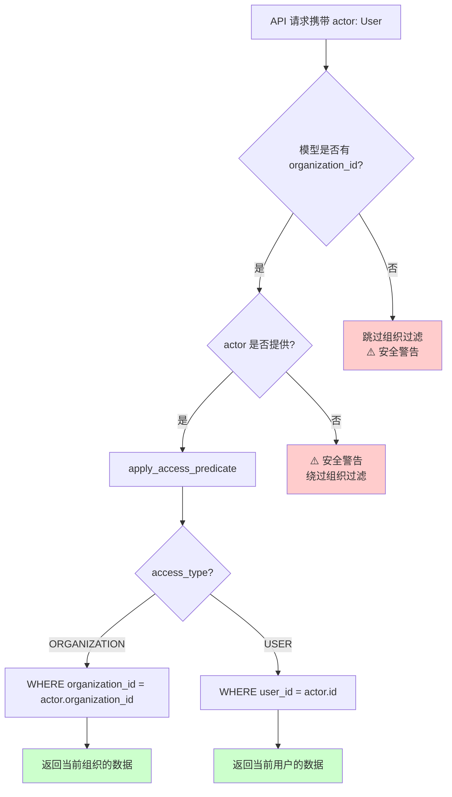

**关键实现细节：**

1. **`OrganizationMixin`**：所有需要组织隔离的模型均混入此类，自动获得 `organization_id` 外键列
2. **`apply_access_predicate()`**：在 `SqlalchemyBase` 中作为类方法实现，为所有查询自动注入 `WHERE organization_id = :org_id` 条件
3. **安全审计**：当 `actor` 为 `None` 但模型拥有 `organization_id` 时，系统会记录 `SECURITY` 级别警告日志
4. **AccessType 枚举**：支持 `ORGANIZATION`（默认）和 `USER` 两种访问粒度

### 5.2 软删除机制

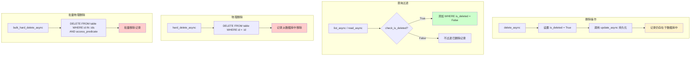

**软删除设计要点：**

| 特性 | 说明 |
|------|------|
| **字段来源** | `CommonSqlalchemyMetaMixins.is_deleted`，默认值 `FALSE` |
| **软删除方法** | `delete_async()` — 设置 `is_deleted = True` 后调用 `update_async()` |
| **硬删除方法** | `hard_delete_async()` — 执行物理 `DELETE` |
| **批量硬删除** | `bulk_hard_delete_async()` — 带 `apply_access_predicate` 的批量删除 |
| **查询过滤** | `check_is_deleted` 参数控制是否过滤已删除记录（默认不过滤） |
| **级联行为** | SQLAlchemy `cascade="all, delete-orphan"` 在 ORM 层级联删除关联对象 |

### 5.3 审计追踪

```mermaid
flowchart LR
    A[操作请求] --> B{actor 是否提供?}
    B -->|是| C[设置 created_by_id = actor.id<br/>（仅首次）]
    C --> D[设置 last_updated_by_id = actor.id<br/>（每次更新）]
    D --> E[设置 updated_at = NOW()]
    B -->|否| F[审计字段为 NULL]

    style C fill:#ccffcc
    style D fill:#ccffcc
```

审计字段通过 `CommonSqlalchemyMetaMixins` 自动提供：
- `created_at` / `updated_at`：由数据库 `server_default=func.now()` 自动维护
- `created_by_id`：仅在首次创建时设置
- `last_updated_by_id`：每次更新操作时设置
- ID 前缀校验：`_user_id_setter()` 断言值必须以 `user-` 开头

---

## 6. 关键设计决策分析

### 6.1 异步优先（Async-First）

**决策**：所有 CRUD 操作仅提供 `*_async` 版本，不再维护同步方法。

**理由**：
- Letta 服务端基于 FastAPI + asyncio 运行，同步数据库操作会阻塞事件循环
- 使用 `asyncpg` 驱动 PostgreSQL，原生支持异步协议
- `AsyncSession` + `expire_on_commit=False` 避免延迟加载问题

**影响**：调用方必须在 async 上下文中使用 ORM 层。

### 6.2 死锁重试策略

**决策**：在 `create_async` / `update_async` / `hard_delete_async` 中实现 3 次指数退避重试。

```python
_DEADLOCK_MAX_RETRIES = 3
_DEADLOCK_BASE_DELAY = 0.1  # 100ms, 200ms, 400ms
```

**理由**：
- PostgreSQL 在高并发场景下可能产生死锁（错误码 40P01）
- 大多数死锁在短暂等待后重试即可成功
- 重试前执行 `rollback()` 释放锁，并恢复列值快照

**影响**：调用方需注意重试可能导致操作耗时增加。

### 6.3 乐观锁（Block 模型）

**决策**：Block 模型使用 SQLAlchemy 内置的 `version_id_col` 实现乐观锁。

```python
class Block(SqlalchemyBase, ...):
    version: Mapped[int] = mapped_column(Integer, nullable=False, default=1, server_default="1")
    __mapper_args__ = {"version_id_col": version}
```

**理由**：
- Block 是 Agent 核心记忆，可能被并发修改（工具调用 + 用户操作）
- 乐观锁避免了悲观锁的性能开销
- 当版本不匹配时，SQLAlchemy 抛出 `StaleDataError`，被转译为 `ConcurrentUpdateError`

**影响**：并发更新同一 Block 时，后到的更新会失败并抛出 `ConcurrentUpdateError`。

### 6.4 自定义列类型 vs 关联表

**决策**：复杂配置对象（`LLMConfig`、`EmbeddingConfig`、`ToolRule` 等）使用自定义 `TypeDecorator` 以 JSON 存储，而非拆分为关联表。

**理由**：
- 这些对象总是随父对象一起读写，不需要独立查询
- JSON 存储避免了多表 JOIN 的性能开销
- `TypeDecorator` 提供了透明的序列化/反序列化，对业务层无感

**权衡**：
- ✅ 简化数据模型，减少关联表数量
- ✅ 读写性能更优（单行操作）
- ❌ 无法对这些字段建立数据库级约束
- ❌ 无法直接对这些字段进行 SQL 级查询过滤

### 6.5 Passage 继承策略

**决策**：使用 `BasePassage`（抽象基类）→ `SourcePassage` / `ArchivalPassage` 的类继承，映射为独立的物理表（`__abstract__ = True` + 各自的 `__tablename__`）。

**理由**：
- SourcePassage 和 ArchivalPassage 有不同的外键关联（Source vs Archive）和索引策略
- 独立表避免了 NULL 列和 UNION 查询
- 共享基类减少了 `text`、`embedding`、`embedding_config` 等公共字段的重复定义

**影响**：查询时需明确指定子类型，无法跨类型统一查询。

### 6.6 向量存储双引擎

**决策**：Passage 的 `embedding` 字段根据 `settings.database_engine` 动态选择列类型。

```python
if settings.database_engine is DatabaseChoice.POSTGRES:
    embedding = mapped_column(Vector(MAX_EMBEDDING_DIM), nullable=True)  # pgvector
else:
    embedding = Column(CommonVector, nullable=True)  # SQLite BINARY
```

**理由**：
- 开发环境使用 SQLite（零配置），生产环境使用 PostgreSQL + pgvector
- pgvector 提供原生的余弦距离排序（`embedding.cosine_distance()`）
- SQLite 使用自定义 `CommonVector`（BINARY 类型）+ Python 端距离计算

**影响**：向量搜索性能差异显著，生产环境必须使用 PostgreSQL。

### 6.7 Message 序列 ID 生成

**决策**：Message 使用 `sequence_id`（BigInteger，单调递增）实现高效分页和排序。

- **PostgreSQL**：使用 `server_default=FetchedValue()` 由数据库序列自动生成
- **SQLite**：通过 `before_insert` 事件监听器 + `message_sequence` 辅助表手动生成

**理由**：
- 基于 `created_at` 的分页在并发场景下可能产生排序不稳定
- 单调递增的整数序列保证了确定的全局排序
- SQLite 不支持 PostgreSQL 序列，需要特殊处理

### 6.8 连接池与超时管理

**决策**：`letta/server/db.py` 中的 `DatabaseRegistry` 实现了精细的连接管理策略。

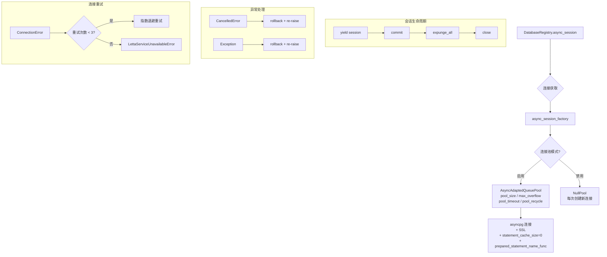

**关键配置：**
- `expire_on_commit=False`：提交后对象不过期，避免延迟加载问题
- `autocommit=False, autoflush=False`：手动控制事务边界
- `statement_cache_size=0`：避免 asyncpg 预处理语句缓存导致的兼容性问题
- 连接重试：3 次指数退避，最终抛出 `LettaServiceUnavailableError`

### 6.9 超时处理装饰器

**决策**：使用 `@handle_db_timeout` 装饰器统一处理数据库超时。

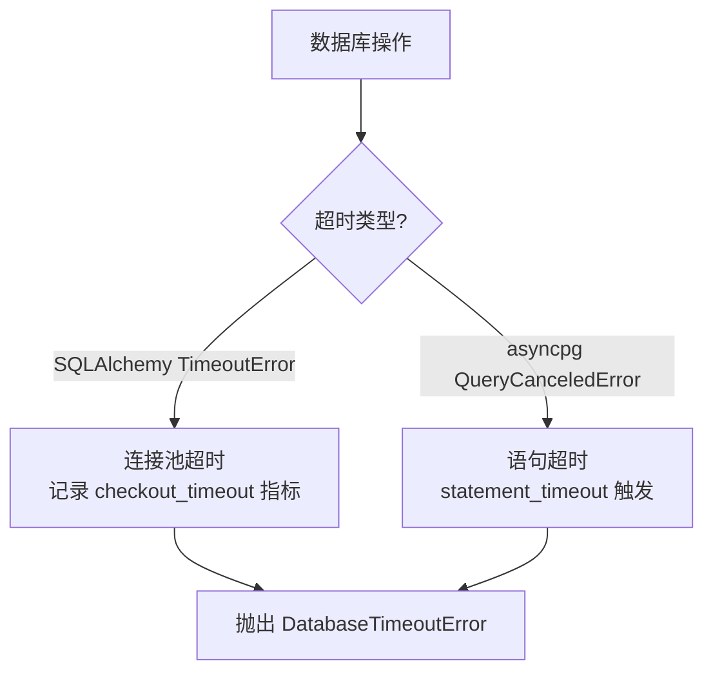

该装饰器同时支持同步和异步函数（通过 `inspect.iscoroutinefunction` 判断），确保所有数据库操作都有超时保护。

---

## 附录 A：异常转译映射

| 数据库错误 | PostgreSQL 错误码 | ORM 异常类 |
|-----------|-------------------|-----------|
| 唯一约束违反 | 23505 / `UNIQUE constraint failed` | `UniqueConstraintViolationError` |
| 外键约束违反 | 23503 / `FOREIGN KEY constraint failed` | `ForeignKeyConstraintViolationError` |
| 死锁检测 | 40P01 | `DatabaseDeadlockError` |
| 锁不可用 | 55P03 | `DatabaseLockNotAvailableError` |
| 查询超时 | — / `QueryCanceledError` | `DatabaseTimeoutError` |
| 连接池超时 | `TimeoutError` | `DatabaseTimeoutError` |
| 记录未找到 | — | `NoResultFound` |
| 乐观锁冲突 | `StaleDataError` | `ConcurrentUpdateError` |

## 附录 B：ID 生成策略

| 模型 | ID 格式 | 生成时机 |
|------|---------|---------|
| Agent | `agent-{uuid4}` | ORM 构造时（`default=lambda`） |
| Message | `message-{uuid4}` | Pydantic Schema `generate_id_field()` |
| Block | `block-{uuid4}` | Pydantic Schema `generate_id_field()` |
| Organization | `organization-{uuid4}` | Pydantic Schema `generate_id_field()` |
| User | `user-{uuid4}` | Pydantic Schema `generate_id_field()` |
| Tool | `tool-{uuid4}` | Pydantic Schema `generate_id_field()` |
| Source | `source-{uuid4}` | Pydantic Schema `generate_id_field()` |
| Conversation | `conv-{uuid4}` | ORM 构造时（`default=lambda`） |
| Group | `group-{uuid4}` | ORM 构造时（`default=lambda`） |

## 附录 C：索引策略

| 模型 | 索引 | 用途 |
|------|------|------|
| Agent | `(created_at, id)` | 分页排序 |
| Agent | `(organization_id, deployment_id)` | 组织+部署查询 |
| Agent | `(organization_id, _created_by_id)` | 组织+创建者查询 |
| Message | `(agent_id, created_at)` | Agent 消息时间线 |
| Message | `(agent_id, conversation_id, sequence_id)` | 会话消息序列 |
| Message | `(run_id, sequence_id)` | Run 消息序列 |
| Block | `(id, label)` UNIQUE | 复合外键约束 |
| Source | `(name, organization_id)` UNIQUE | 组织内名称唯一 |
| Tool | `(name, organization_id)` UNIQUE | 组织内工具名唯一 |
