# Letta Server/API 层模块设计文档

## 1. 模块概述

Letta Server/API 层是整个 Letta 系统的对外接口层，负责接收外部请求、协调内部服务、管理 Agent 生命周期并返回响应。其核心职责包括：

- **请求路由与分发**：基于 FastAPI 框架，将 HTTP/WebSocket 请求路由到对应的业务处理器
- **Agent 生命周期管理**：创建、更新、删除、导出/导入 Agent 实例
- **消息处理**：同步/异步/流式三种消息处理模式，支持 SSE 流式推送
- **工具管理**：自定义工具的 CRUD、MCP 服务器集成与 OAuth 流程
- **数据源管理**：文件上传、解析、向量化与归档存储
- **认证与安全**：密码中间件、API Key 验证、请求级日志追踪
- **数据库连接池**：基于 SQLAlchemy AsyncEngine 的 PostgreSQL 异步连接管理

### 核心组件一览

| 组件 | 文件路径 | 职责 |
|------|---------|------|
| SyncServer | `server/server.py` | 业务逻辑核心，协调所有 Manager |
| FastAPI App | `rest_api/app.py` | 应用入口、中间件注册、异常处理 |
| StreamingServerInterface | `rest_api/interface.py` | 流式响应的 chunk 处理与缓冲 |
| StreamingResponseWithStatusCode | `rest_api/streaming_response.py` | 支持 SSE + 动态状态码的流式响应 |
| WebSocketServer | `ws_api/server.py` | WebSocket 独立服务 |
| DatabaseRegistry | `server/db.py` | 数据库连接池与会话管理 |

---

## 2. API 架构

### 2.1 整体架构图

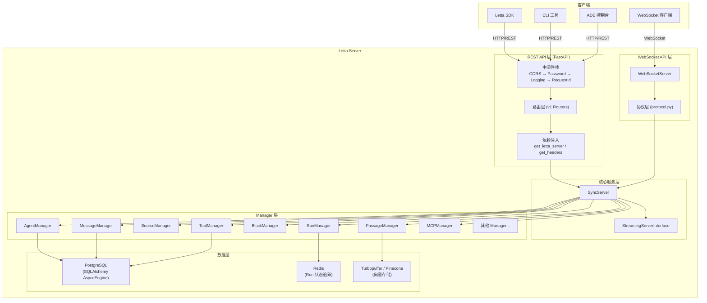

### 2.2 REST API 路由结构

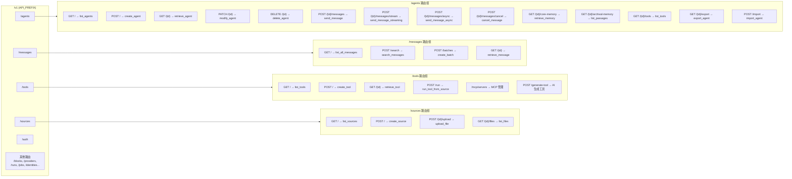

---

## 3. 请求处理流程

### 3.1 Agent 消息请求完整处理流程

以 `POST /v1/agents/{agent_id}/messages` 为例，展示从 HTTP 请求到响应的完整流程：

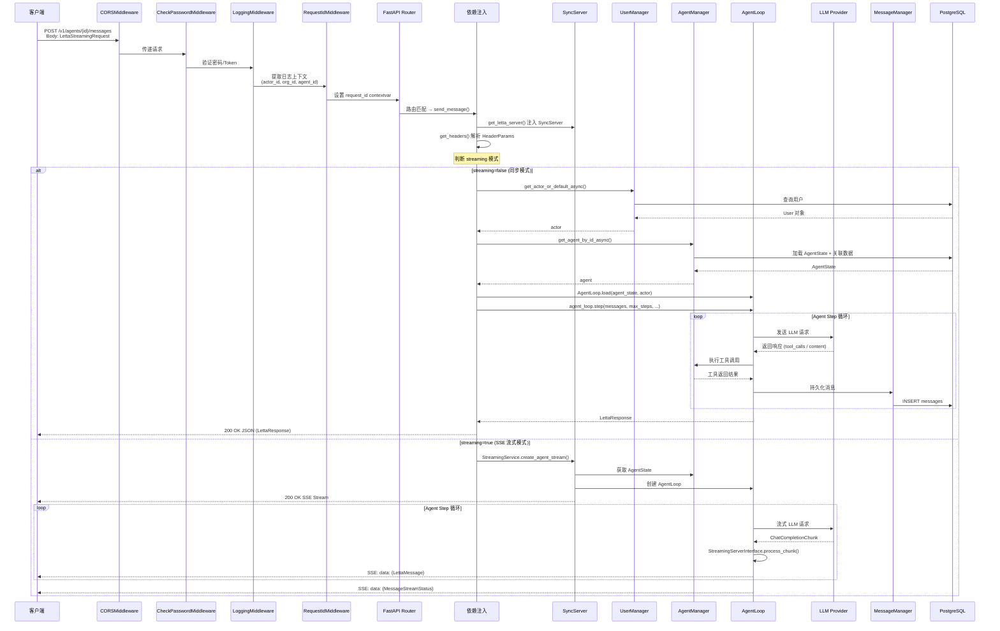

### 3.2 异步消息处理流程

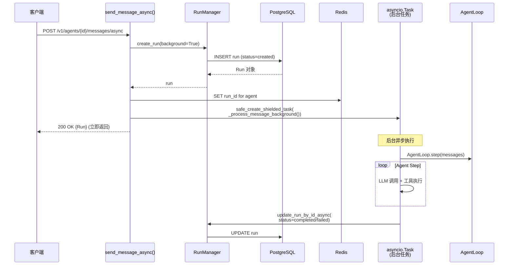

---

## 4. 流式响应机制

### 4.1 SSE 流式推送架构

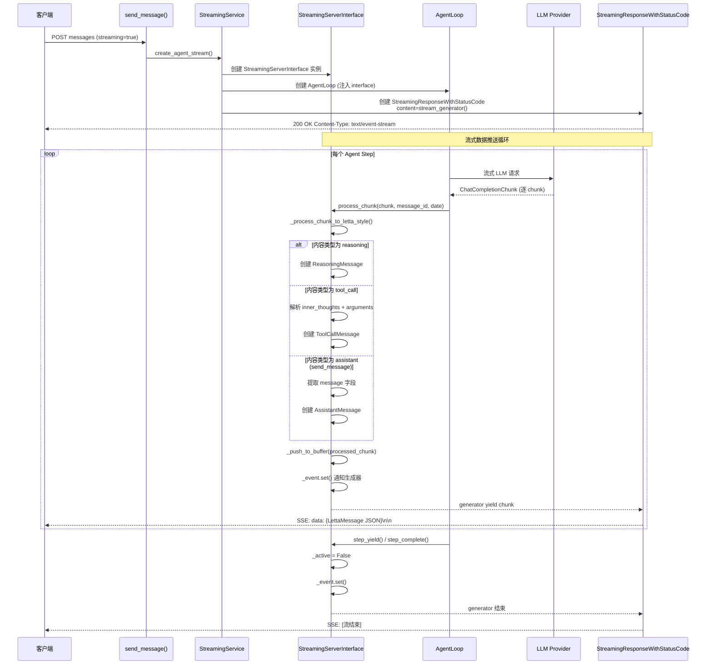

### 4.2 StreamingServerInterface 内部状态机

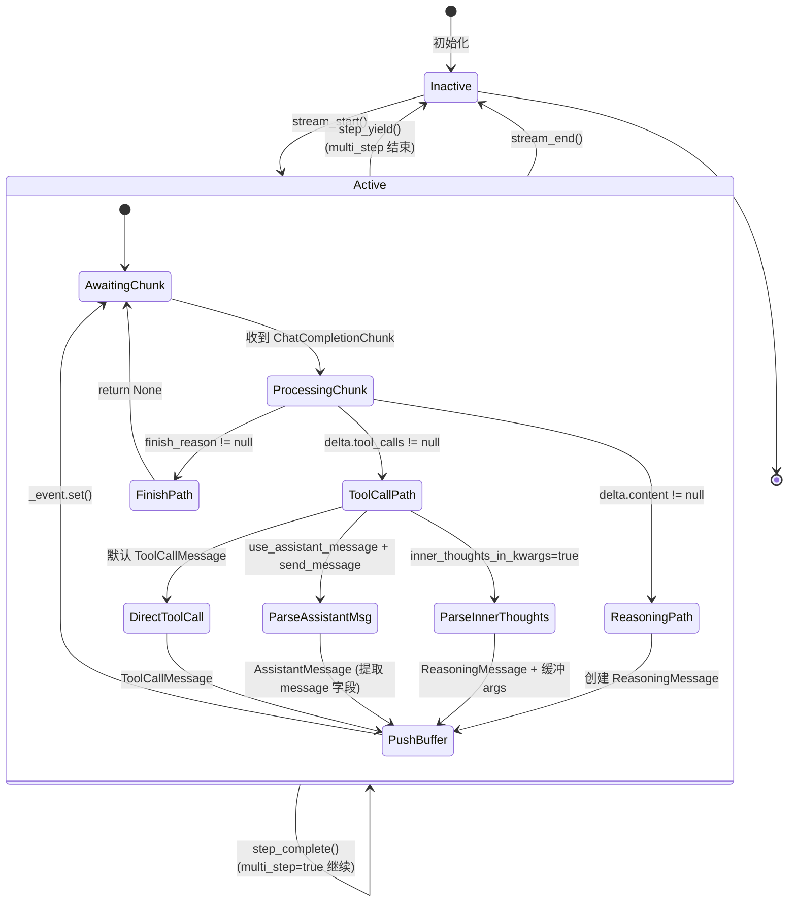

### 4.3 Keepalive 与取消机制

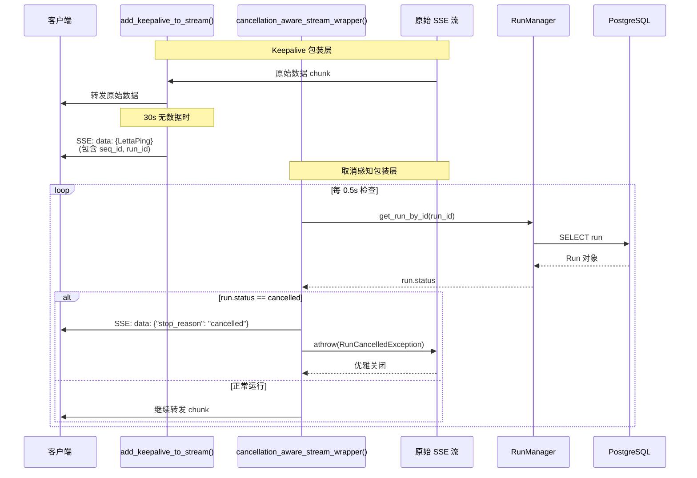

---

## 5. WebSocket 通信协议

### 5.1 WebSocket 通信流程

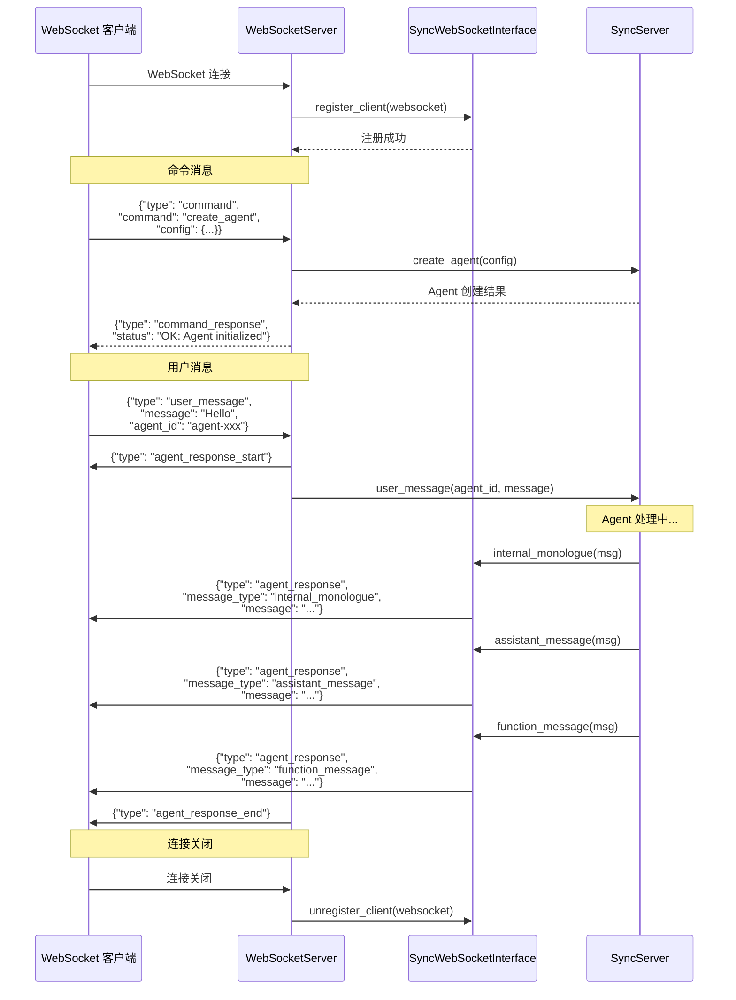

### 5.2 WebSocket 消息协议

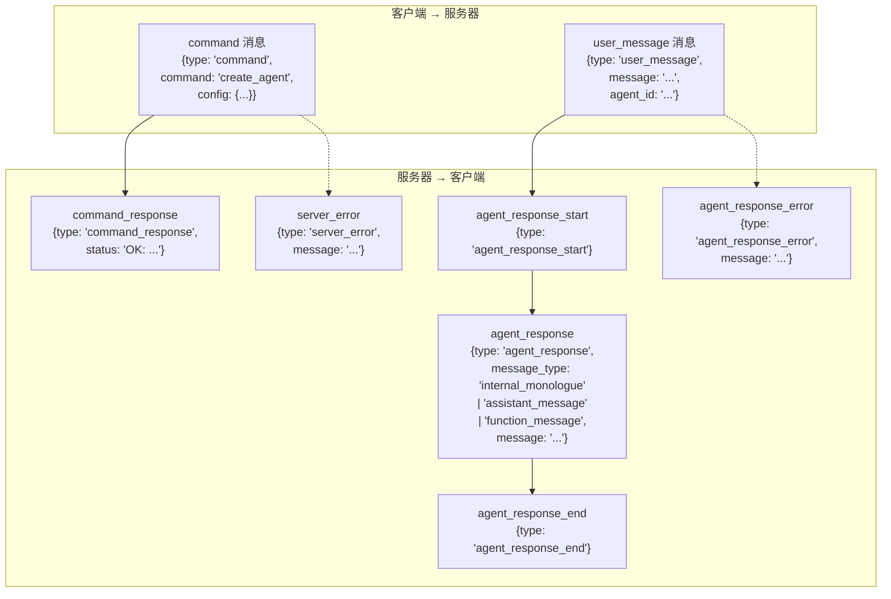

---

## 6. 认证与中间件

### 6.1 中间件处理链

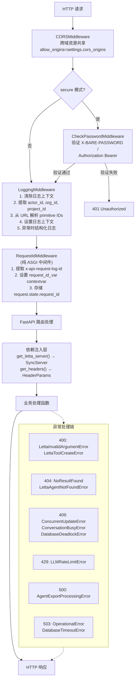

### 6.2 认证流程详解

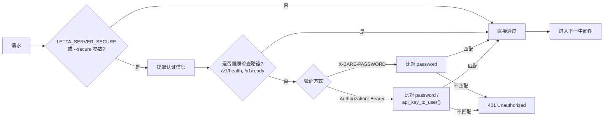

---

## 7. 关键设计决策分析

### 7.1 单例 SyncServer + 依赖注入模式

**决策**：全局创建一个 `SyncServer` 实例，通过 FastAPI 的 `Depends(get_letta_server)` 注入到每个路由处理函数。

**理由**：
- SyncServer 持有所有 Manager 实例（AgentManager、ToolManager 等），Manager 本身是无状态的，共享实例可避免重复初始化
- 启动时自动同步 Provider 模型列表、创建默认用户/组织，确保系统就绪
- 依赖注入使测试时可以替换为 Mock 对象

**权衡**：
- 全局单例在多 Worker 模式下每个 Worker 各持一份，需要通过数据库保证一致性
- SyncServer 构造函数较重（初始化 20+ Manager），启动时间较长

### 7.2 三种消息处理模式

**决策**：提供同步（`/messages`）、流式（`/messages` + `streaming=true`）、异步（`/messages/async`）三种模式。

| 模式 | 适用场景 | 响应方式 | 超时风险 |
|------|---------|---------|---------|
| 同步 | 短对话、调试 | 完整 JSON | 高（阻塞等待） |
| 流式 SSE | 实时交互、长对话 | 逐 chunk 推送 | 低（keepalive 保活） |
| 异步 | 批量处理、后台任务 | 立即返回 Run ID | 无（后台执行） |

**关键实现**：
- 流式模式通过 `StreamingServerInterface` 的 `_chunks` deque + `asyncio.Event` 实现生产者-消费者模式
- `StreamingResponseWithStatusCode` 扩展了 Starlette 的 `StreamingResponse`，支持动态状态码和 `asyncio.shield` 保护
- 异步模式使用 `safe_create_shielded_task` 创建受保护的后台任务，防止客户端断连导致任务取消

### 7.3 流式响应的 chunk 解析策略

**决策**：`StreamingServerInterface` 实现了复杂的 chunk 解析状态机，支持多种 LLM 输出格式。

**核心处理逻辑**：
1. **inner_thoughts_in_kwargs**：当 LLM 将内部思考放在工具调用的参数中时，通过 `JSONInnerThoughtsExtractor` 增量解析 JSON，将 inner_thoughts 提取为 `ReasoningMessage`，其余参数作为 `ToolCallMessage`
2. **use_assistant_message**：将 `send_message` 工具调用转换为 `AssistantMessage`，对前端更友好
3. **OptimisticJSONParser**：乐观解析不完整的 JSON，提前提取关键字段（如 message 内容），减少流式延迟

**权衡**：
- 解析逻辑复杂，存在多种分支组合，维护成本高
- 但这是实现低延迟流式体验的必要代价

### 7.4 中间件分层设计

**决策**：采用四层中间件，从外到内依次为 CORS → Password → Logging → RequestId。

**设计考量**：
- **CORS 最外层**：确保预检请求（OPTIONS）不被其他中间件拦截
- **Password 次外层**：在日志记录之前拦截未授权请求，减少无效日志
- **Logging 中间层**：使用 `BaseHTTPMiddleware`，通过 `update_log_context()` 设置结构化日志上下文
- **RequestId 最内层**：使用纯 ASGI 中间件而非 `BaseHTTPMiddleware`，因为后者在流式响应中无法正确传播 `contextvars`

**关键细节**：`RequestIdMiddleware` 同时将 request_id 存入 `contextvars` 和 `request.state`，因为流式响应的生成器运行在不同的上下文中，`contextvars` 可能无法传播。

### 7.5 数据库连接池管理

**决策**：使用 SQLAlchemy AsyncEngine + asyncpg，模块级创建单例引擎。

**关键配置**：
- `pool_size` / `max_overflow`：控制连接池大小
- `statement_cache_size=0`：禁用 asyncpg 的预处理语句缓存，避免多 Worker 场景下的语句冲突
- `pool_pre_ping=True`：每次从池中取连接时验证连接有效性
- `DatabaseRegistry.async_session()` 实现了自动重试（3次）和 `CancelledError` 的特殊处理（显式 rollback 防止连接泄漏）

### 7.6 异常处理策略

**决策**：在 FastAPI App 层注册大量细粒度的异常处理器，将领域异常映射为标准 HTTP 状态码。

**分类**：

| HTTP 状态码 | 对应异常 | 语义 |
|------------|---------|------|
| 400 | `LettaInvalidArgumentError`, `ValueError` | 请求参数错误 |
| 404 | `NoResultFound`, `LettaAgentNotFoundError` | 资源不存在 |
| 409 | `ConcurrentUpdateError`, `ConversationBusyError`, `DatabaseDeadlockError` | 并发冲突 |
| 429 | `LLMRateLimitError` | 速率限制 |
| 503 | `OperationalError`, `DatabaseTimeoutError` | 服务暂时不可用 |
| 504 | `LLMTimeoutError` | LLM 请求超时 |

**特殊处理**：
- 数据库死锁（`DatabaseDeadlockError`）返回 409 + `Retry-After: 1` 头，提示客户端重试
- 客户端断连（`anyio.BrokenResourceError`）返回 499（非标准但广泛使用的状态码）
- `RequestValidationError` 对路径参数中的 UUID 格式错误提供友好的错误消息和示例 ID

### 7.7 WebSocket API 的定位

**决策**：WebSocket API 作为独立服务运行，与 REST API 分离。

**当前状态**：WebSocket API 功能较简单，仅支持 `create_agent` 和 `user_message` 两种操作，使用 `SyncWebSocketInterface` 进行同步式消息推送。

**与 REST API 的对比**：

| 维度 | REST API | WebSocket API |
|------|---------|--------------|
| 框架 | FastAPI + Uvicorn/Granian | websockets 库 |
| 端口 | 默认 8283 | 默认 8284 |
| 消息格式 | JSON Request/Response | JSON 文本帧 |
| 流式支持 | SSE (Server-Sent Events) | 原生双向流 |
| 认证 | Header-based | 无 |
| 功能完整度 | 完整 | 基础 |

### 7.8 运行时监控与可观测性

**决策**：集成多层可观测性工具。

- **OpenTelemetry**：分布式追踪（`setup_tracing`）+ 指标收集（`setup_metrics`）
- **Sentry**：异常上报（`sentry_sdk.capture_exception`）
- **Datadog**：APM 追踪 + LLMObs + Profiling（可选）
- **Event Loop Watchdog**：监控事件循环阻塞（15s 阈值）
- **DB Pool Monitoring**：SQLAlchemy 连接池状态监控
- **Readiness State**：通过 `readiness_state` 管理启动/关闭状态，支持优雅启停

### 7.9 版本兼容性策略

**决策**：通过 Header 检测 SDK 版本，动态调整响应格式。

- `is_1_0_sdk_version(headers)` 检测客户端 SDK 版本
- 1.0+ SDK：`include_relationships` 默认为空（不加载关联数据），`attach_tool` 返回 `None`
- 旧 SDK：默认加载所有关联数据，`attach_tool` 返回完整 `AgentState`
- 同时维护 `/v1/` 和 `/latest/` 前缀，`/latest/` 不出现在 OpenAPI 文档中
