# Letta Tool/Function 系统模块设计文档

## 1. 模块概述

Tool/Function 系统是 Letta Agent 框架的核心子系统，负责定义、注册、发现、调度和执行 Agent 可调用的工具函数。该系统使 LLM 能够通过结构化的函数调用（Function Calling）与外部世界交互，包括操作内存、搜索对话历史、调用 MCP 外部工具、执行沙箱代码等。

### 核心职责

| 职责 | 说明 |
|------|------|
| **Tool 定义与 Schema 生成** | 从 Python 源码/Pydantic 模型/MCP 协议自动生成 OpenAI 兼容的 JSON Schema |
| **Tool 类型体系** | 区分内置核心工具、内存工具、文件工具、多 Agent 工具、MCP 外部工具、自定义沙箱工具 |
| **Tool 注册与发现** | 通过模块加载、MCP 服务发现等方式注册工具，支持语义搜索 |
| **Tool 执行调度** | 基于 ToolType 的工厂模式分派到不同执行器（进程内/沙箱/MCP 客户端） |
| **Tool 规则约束** | 通过 ToolRule 体系控制工具调用顺序、终止条件、审批流程等 |
| **Schema 验证** | 验证 JSON Schema 是否符合 OpenAI strict mode 要求 |

### 目录结构

```
letta/
├── functions/                    # Tool 函数核心定义
│   ├── functions.py              # 源码解析、Schema 推导、模块加载
│   ├── helpers.py                # MCP/LangChain 包装器、Pydantic 模型转换
│   ├── schema_generator.py       # 核心 Schema 生成器（Python→JSON Schema）
│   ├── schema_validator.py       # OpenAI strict mode Schema 验证
│   ├── types.py                  # Pydantic 请求模型（SearchTask, FileOpenRequest）
│   ├── interface.py              # 多 Agent 消息接口
│   ├── function_sets/            # 内置工具函数集
│   │   ├── base.py               # 内存/消息/检索核心工具
│   │   ├── builtin.py            # 代码执行/Web 搜索/网页抓取
│   │   ├── files.py              # 文件操作工具
│   │   ├── multi_agent.py        # 多 Agent 通信工具
│   │   └── voice.py              # 语音/睡眠时工具
│   └── mcp_client/               # MCP 客户端类型
│       ├── types.py              # MCPTool、服务器配置（SSE/STDIO/StreamableHTTP）
│       └── exceptions.py         # MCP 超时异常
├── schemas/
│   ├── tool.py                   # Tool/ToolCreate/ToolUpdate 数据模型
│   └── tool_rule.py              # ToolRule 类型体系
├── services/
│   └── tool_executor/            # Tool 执行器
│       ├── tool_executor_base.py # 抽象基类
│       ├── tool_execution_manager.py  # 执行管理器 + 工厂
│       ├── core_tool_executor.py      # 核心工具执行器
│       ├── builtin_tool_executor.py   # 内置工具执行器
│       ├── files_tool_executor.py     # 文件工具执行器
│       ├── mcp_tool_executor.py       # MCP 工具执行器
│       └── sandbox_tool_executor.py   # 沙箱工具执行器
└── helpers/
    ├── tool_execution_helper.py  # Schema strict mode / pre-execution message
    ├── tool_helpers.py           # Tool 哈希 / Modal 函数名生成
    └── tool_rule_solver.py       # Tool 规则求解器
```

---

## 2. Tool 类型体系

### 2.1 类型继承关系

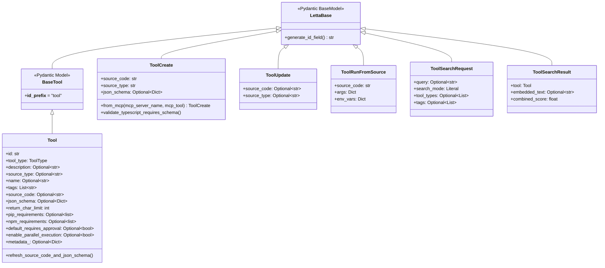

### 2.2 ToolType 枚举

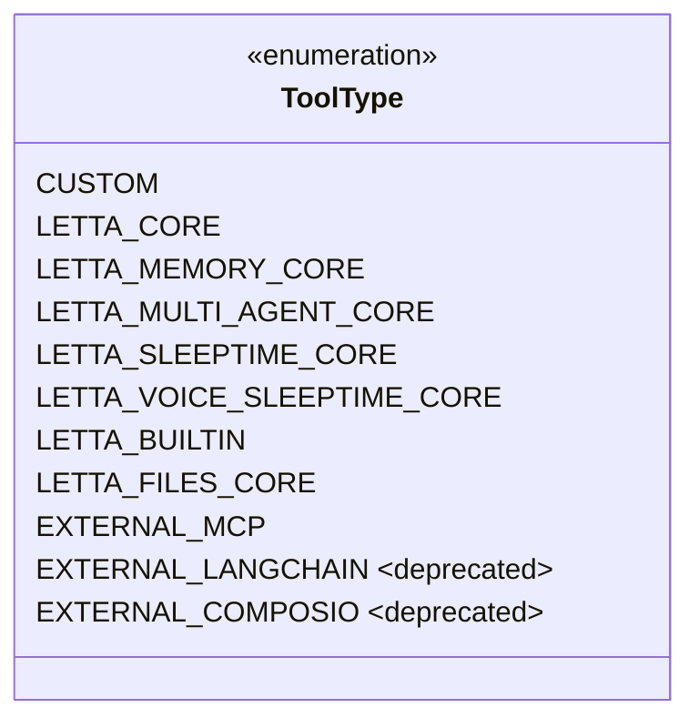

### 2.3 ToolRule 类型体系

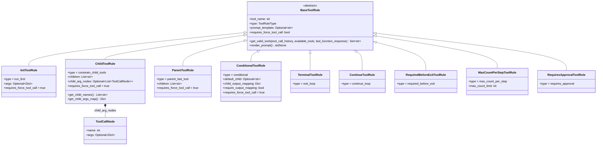

---

## 3. Tool 注册与发现

### 3.1 注册流程

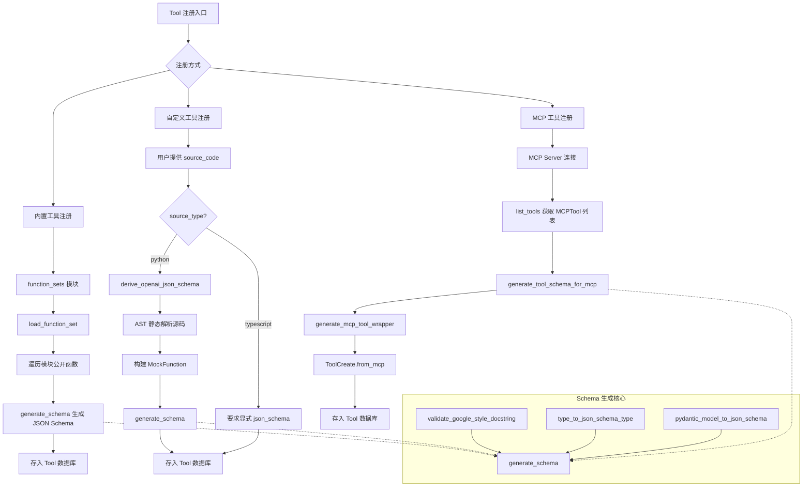

### 3.2 Schema 生成详解

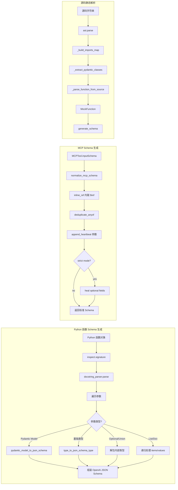

### 3.3 Tool 发现机制

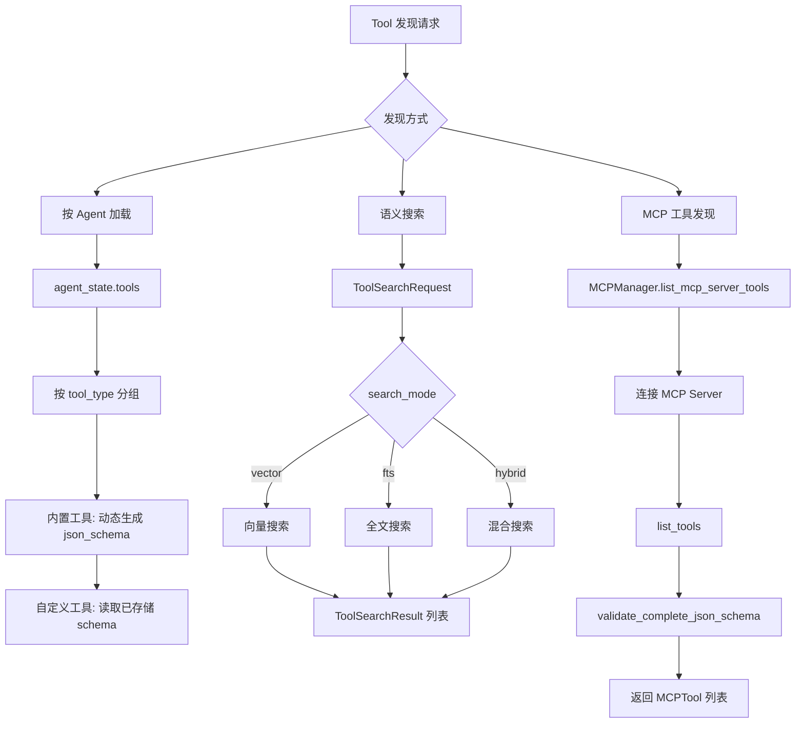

---

## 4. Tool 执行流程

### 4.1 完整执行时序图

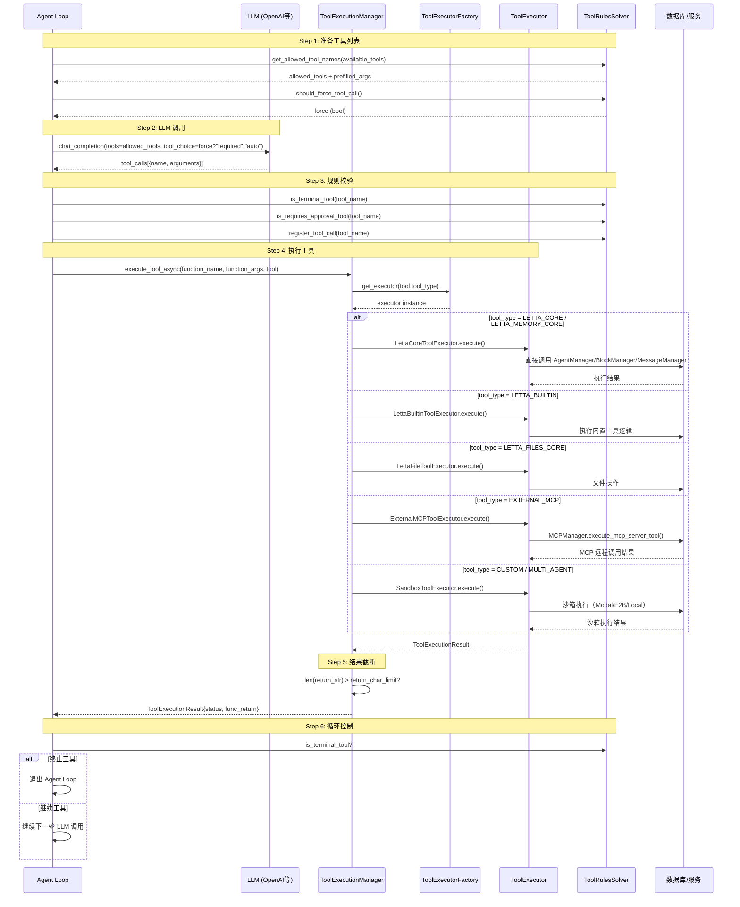

### 4.2 执行器分派策略

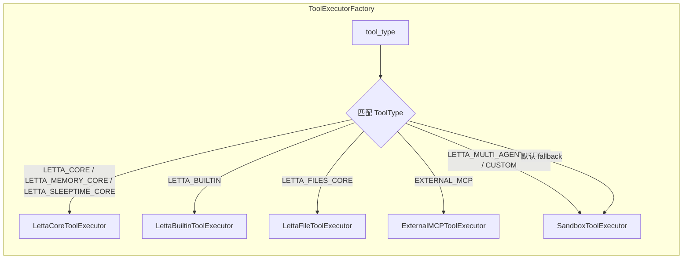

### 4.3 沙箱执行策略

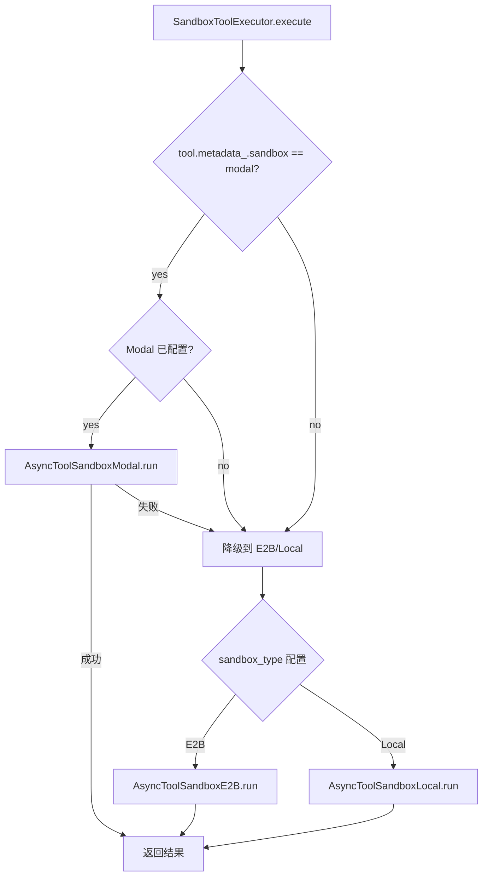

---

## 5. MCP 工具集成

### 5.1 MCP 连接、发现与执行流程

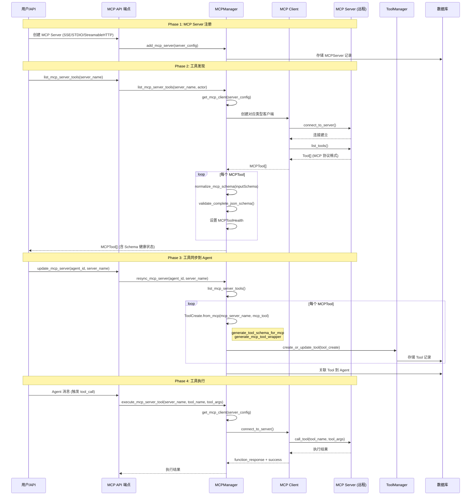

### 5.2 MCP 服务器配置类型

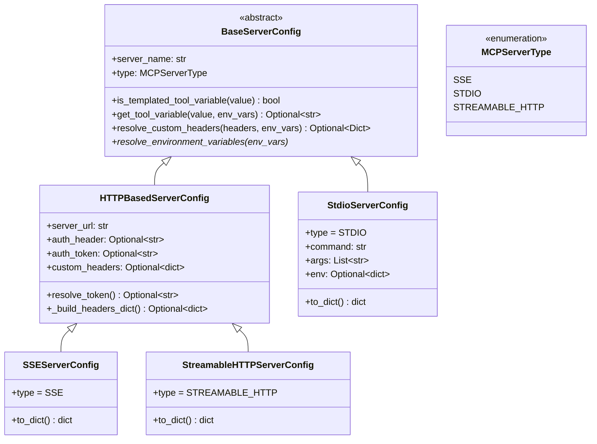

### 5.3 MCP Schema 健康检查

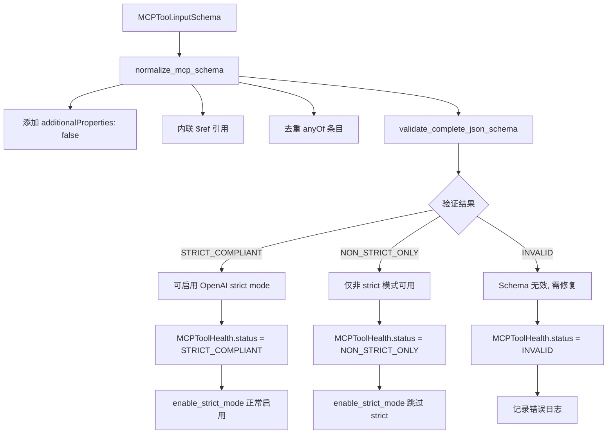

---

## 6. Tool 规则系统

### 6.1 ToolRulesSolver 求解逻辑

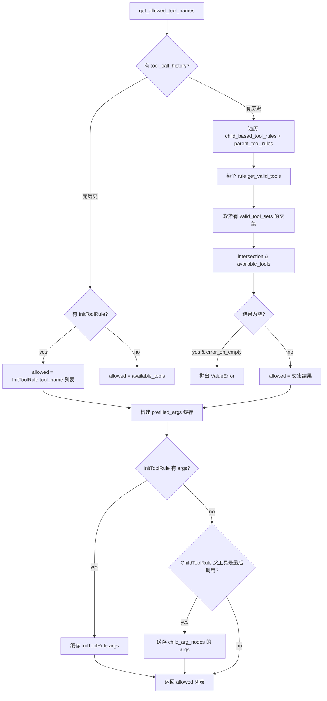

### 6.2 各规则类型行为

```mermaid
flowchart TD
    subgraph InitToolRule
        I1[无历史时] --> I2[仅允许 InitToolRule 指定的工具]
        I2 --> I3[强制 tool_choice = required]
        I3 --> I4[可选预填参数 args]
    end

    subgraph ChildToolRule
        C1[父工具最后被调用] --> C2[仅允许 children 列表中的工具]
        C1 --> C3[强制 tool_choice = required]
        C2 --> C4[可选 child_arg_nodes 预填参数]
    end

    subgraph ParentToolRule
        P1[父工具最后被调用] --> P2[仅允许 children 工具]
        P1 --> P3[父工具未被调用] --> P4[从可用工具中排除 children]
    end

    subgraph ConditionalToolRule
        CO1[工具最后被调用] --> CO2[解析 last_function_response]
        CO2 --> CO3[匹配 child_output_mapping]
        CO3 --> CO4[返回匹配的子工具]
        CO3 --> CO5[无匹配 → default_child 或全部]
    end

    subgraph TerminalToolRule
        T1[工具被调用] --> T2[标记为终止工具]
        T2 --> T3[Agent Loop 退出]
    end

    subgraph ContinueToolRule
        CR1[工具被调用] --> CR2[标记为继续工具]
        CR2 --> CR3[Agent Loop 继续]
    end

    subgraph MaxCountPerStepToolRule
        MC1[调用次数 < max_count] --> MC2[工具仍可用]
        MC1 --> MC3[调用次数 >= max_count] --> MC4[从可用工具中移除]
    end

    subgraph RequiredBeforeExitToolRule
        RB1[Agent Loop 退出前] --> RB2[检查是否已调用]
        RB2 --> RB3[未调用 → 阻止退出]
    end

    subgraph RequiresApprovalToolRule
        RA1[工具被调用] --> RA2[触发人工审批流程]
    end
```

### 6.3 规则在 Agent Loop 中的集成

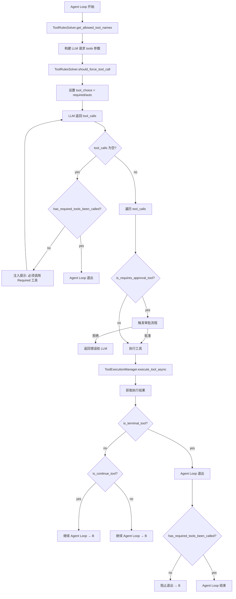

---

## 7. 关键设计决策分析

### 7.1 AST 静态解析 vs 运行时反射

**决策**：自定义 Python 工具的 Schema 生成采用 AST 静态解析（`_parse_function_from_source`），而非运行时 `import` + `inspect`。

**原因**：
- **安全性**：避免执行用户提交的任意 Python 代码
- **沙箱隔离**：源码可能引用不可用的依赖，运行时 import 会失败
- **兼容性**：支持 Pydantic 模型定义在源码中的内联解析

**代价**：
- 复杂嵌套 Pydantic 模型的 forward reference 支持有限
- 仅支持基本 `Field()` 定义（description、Ellipsis）
- 需要维护 AST 解析逻辑的健壮性

### 7.2 内置工具的"声明+实现"分离

**决策**：内置工具（`function_sets/`）中的函数体通常为 `raise NotImplementedError`，实际实现在对应的 `ToolExecutor` 中。

**原因**：
- **Schema 生成**：函数签名和 docstring 用于自动生成 JSON Schema，供 LLM 理解工具能力
- **执行解耦**：实际执行逻辑需要访问服务层（AgentManager、BlockManager 等），不适合在函数体内直接实现
- **安全边界**：确保 Schema 生成过程不依赖任何运行时状态

**影响**：
- `generate_schema` 从函数签名提取参数信息
- `LettaCoreToolExecutor` 通过 `function_map` 分派到实际实现方法
- 修改工具行为需要同时更新声明（Schema）和实现（Executor）

### 7.3 MCP Schema 规范化与 Strict Mode 适配

**决策**：对 MCP 工具的 inputSchema 进行多层规范化处理（`normalize_mcp_schema` → `inline_ref` → `deduplicate_anyof` → `enable_strict_mode`）。

**原因**：
- MCP Server 返回的 Schema 质量参差不齐，可能缺少 `additionalProperties`、使用 `$ref` 引用等
- OpenAI strict mode 要求所有属性必须 `required`、`additionalProperties: false`
- 需要在保持语义正确性的前提下适配 strict mode

**策略**：
1. `normalize_mcp_schema`：添加 `additionalProperties: false`，解析 `$ref` 类型
2. `inline_ref`：递归内联所有 `$ref`，避免 OpenAI 不支持 `$defs`
3. `enable_strict_mode`：将可选字段加入 `required` 并添加 `null` 类型
4. `SchemaHealth` 分级：STRICT_COMPLIANT / NON_STRICT_ONLY / INVALID

### 7.4 ToolRule 的声明式约束模型

**决策**：采用声明式规则（ToolRule）而非命令式逻辑控制工具调用流程。

**原因**：
- **可序列化**：规则可持久化到数据库，随 Agent 配置存储
- **可组合**：多条规则通过集合交集自然组合，无需复杂的状态机
- **可审计**：每条规则可独立 `render_prompt()` 生成自然语言约束提示
- **可扩展**：新增规则类型只需继承 `BaseToolRule` 并实现 `get_valid_tools`

**规则组合语义**：
- `child_based_tool_rules` + `parent_tool_rules`：取所有规则 `get_valid_tools` 返回集合的**交集**
- `InitToolRule`：仅在无历史时生效，覆盖其他规则
- `TerminalToolRule` / `ContinueToolRule`：不限制可用工具，控制循环流程
- `RequiresApprovalToolRule`：不限制可用工具，触发审批流程

### 7.5 执行器工厂模式

**决策**：使用 `ToolExecutorFactory` 根据 `ToolType` 分派到不同的执行器实现。

**原因**：
- **隔离关注点**：每种工具类型有不同的执行环境和依赖
- **可测试性**：每种执行器可独立测试
- **可扩展**：新增工具类型只需注册新的执行器

**执行器映射**：

| ToolType | 执行器 | 执行环境 |
|----------|--------|----------|
| LETTA_CORE / LETTA_MEMORY_CORE / LETTA_SLEEPTIME_CORE | LettaCoreToolExecutor | 进程内，直接调用服务层 |
| LETTA_BUILTIN | LettaBuiltinToolExecutor | 进程内 |
| LETTA_FILES_CORE | LettaFileToolExecutor | 进程内 |
| EXTERNAL_MCP | ExternalMCPToolExecutor | 通过 MCP Client 远程调用 |
| CUSTOM / MULTI_AGENT | SandboxToolExecutor | Modal / E2B / Local 沙箱 |

### 7.6 沙箱执行的多层降级

**决策**：SandboxToolExecutor 支持 Modal → E2B → Local 三层降级策略。

**原因**：
- **云优先**：Modal 提供更好的隔离和弹性扩展
- **兼容性**：E2B 作为备选云沙箱
- **本地开发**：Local 沙箱方便开发和调试

**安全措施**：
- 沙箱执行前深拷贝 `agent_state`，移除 `tools` 和 `tool_rules` 防止嵌套执行
- 执行后验证内存完整性（`orig_memory_str == new_memory_str`）
- 凭证通过 `SandboxCredentialsService` 安全注入

### 7.7 MCP 工具的"占位源码"模式

**决策**：MCP 工具注册时存储一个抛出 `RuntimeError` 的占位函数作为 `source_code`，实际执行通过 MCP Client 远程调用。

**原因**：
- **统一存储**：所有工具在数据库中使用相同的 Schema，`source_code` 字段必须非空
- **执行路径分离**：MCP 工具不通过源码执行，而是通过 `ExternalMCPToolExecutor` 路由到 MCP Server
- **防误用**：占位函数的 `RuntimeError` 确保不会被意外直接执行

**标识机制**：MCP 工具通过 `tags` 中的 `mcp_tool:{server_name}` 标签关联到对应的 MCP Server。
