# Mem0 系统设计文档 (Design Document)

## 1. 系统架构总览

### 1.1 宏观架构

Mem0 采用分层架构设计，从上到下分为 API 层、核心逻辑层、Provider 层和存储层：

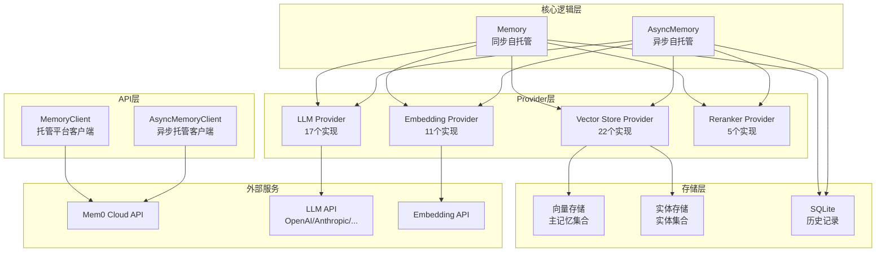
```mermaid
flowchart TB
    subgraph API层
        MC[MemoryClient<br/>托管平台客户端]
        AMC[AsyncMemoryClient<br/>异步托管客户端]
    end

    subgraph 核心逻辑层
        M[Memory<br/>同步自托管]
        AM[AsyncMemory<br/>异步自托管]
    end

    subgraph Provider层
        LLM[LLM Provider<br/>17个实现]
        EMB[Embedding Provider<br/>11个实现]
        VS[Vector Store Provider<br/>22个实现]
        RR[Reranker Provider<br/>5个实现]
    end

    subgraph 存储层
        VSTORE[向量存储<br/>主记忆集合]
        ESTORE[实体存储<br/>实体集合]
        SQLITE[SQLite<br/>历史记录]
    end

    subgraph 外部服务
        API[Mem0 Cloud API]
        LLM_API[LLM API<br/>OpenAI/Anthropic/...]
        EMB_API[Embedding API]
    end

    MC --> API
    AMC --> API
    M --> LLM
    M --> EMB
    M --> VS
    M --> RR
    AM --> LLM
    AM --> EMB
    AM --> VS
    AM --> RR
    LLM --> LLM_API
    EMB --> EMB_API
    VS --> VSTORE
    VS --> ESTORE
    M --> SQLITE
    AM --> SQLITE
```

### 1.2 双模式架构

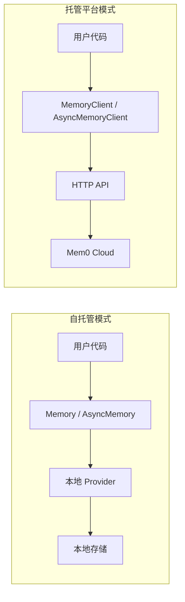
```mermaid
flowchart LR
    subgraph 自托管模式
        direction TB
        A1[用户代码] --> M1[Memory / AsyncMemory]
        M1 --> P1[本地 Provider]
        P1 --> S1[本地存储]
    end

    subgraph 托管平台模式
        direction TB
        A2[用户代码] --> M2[MemoryClient / AsyncMemoryClient]
        M2 --> H1[HTTP API]
        H1 --> C1[Mem0 Cloud]
    end
```

---

## 2. 核心模块设计

### 2.1 Memory 类设计

#### 2.1.1 类层次

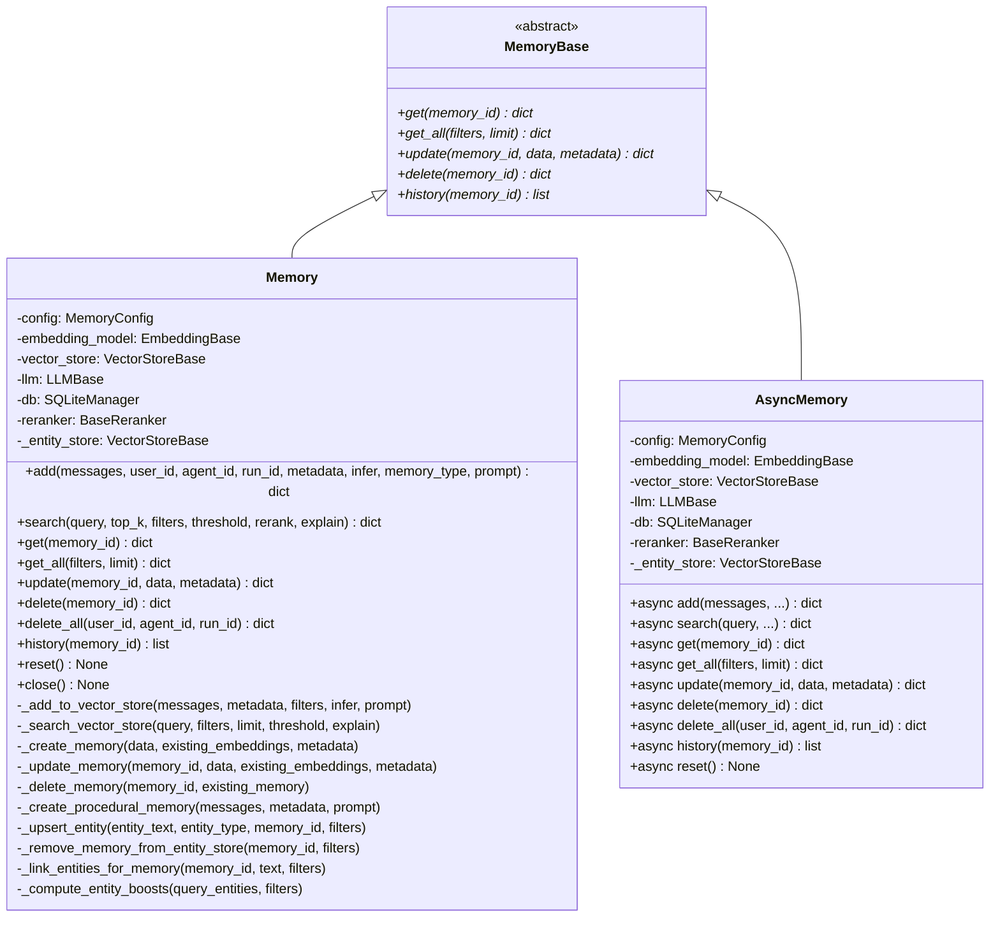
```mermaid
classDiagram
    class MemoryBase {
        <<abstract>>
        +get(memory_id)* dict
        +get_all(filters, limit)* dict
        +update(memory_id, data, metadata)* dict
        +delete(memory_id)* dict
        +history(memory_id)* list
    }

    class Memory {
        -config: MemoryConfig
        -embedding_model: EmbeddingBase
        -vector_store: VectorStoreBase
        -llm: LLMBase
        -db: SQLiteManager
        -reranker: BaseReranker
        -_entity_store: VectorStoreBase
        +add(messages, user_id, agent_id, run_id, metadata, infer, memory_type, prompt) dict
        +search(query, top_k, filters, threshold, rerank, explain) dict
        +get(memory_id) dict
        +get_all(filters, limit) dict
        +update(memory_id, data, metadata) dict
        +delete(memory_id) dict
        +delete_all(user_id, agent_id, run_id) dict
        +history(memory_id) list
        +reset() None
        +close() None
        -_add_to_vector_store(messages, metadata, filters, infer, prompt)
        -_search_vector_store(query, filters, limit, threshold, explain)
        -_create_memory(data, existing_embeddings, metadata)
        -_update_memory(memory_id, data, existing_embeddings, metadata)
        -_delete_memory(memory_id, existing_memory)
        -_create_procedural_memory(messages, metadata, prompt)
        -_upsert_entity(entity_text, entity_type, memory_id, filters)
        -_remove_memory_from_entity_store(memory_id, filters)
        -_link_entities_for_memory(memory_id, text, filters)
        -_compute_entity_boosts(query_entities, filters)
    }

    class AsyncMemory {
        -config: MemoryConfig
        -embedding_model: EmbeddingBase
        -vector_store: VectorStoreBase
        -llm: LLMBase
        -db: SQLiteManager
        -reranker: BaseReranker
        -_entity_store: VectorStoreBase
        +async add(messages, ...) dict
        +async search(query, ...) dict
        +async get(memory_id) dict
        +async get_all(filters, limit) dict
        +async update(memory_id, data, metadata) dict
        +async delete(memory_id) dict
        +async delete_all(user_id, agent_id, run_id) dict
        +async history(memory_id) list
        +async reset() None
    }

    MemoryBase <|-- Memory
    MemoryBase <|-- AsyncMemory
```

#### 2.1.2 add() 方法 - V3 批量管线设计

add() 方法采用 8 阶段流水线架构，优先批量操作、失败回退逐个：

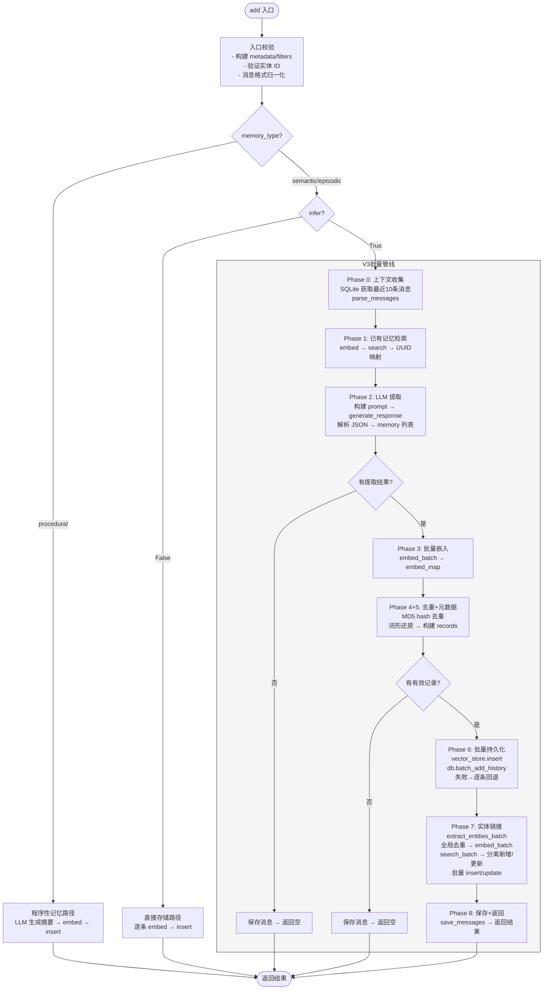
```mermaid
flowchart TB
    START([add 入口]) --> PRE[入口校验<br/>- 构建 metadata/filters<br/>- 验证实体 ID<br/>- 消息格式归一化]

    PRE --> TYPE{memory_type?}

    TYPE -->|procedural| PROC[程序性记忆路径<br/>LLM 生成摘要 → embed → insert]
    TYPE -->|semantic/episodic| INFER{infer?}

    INFER -->|False| DIRECT[直接存储路径<br/>逐条 embed → insert]
    INFER -->|True| P0

    subgraph V3批量管线
        P0[Phase 0: 上下文收集<br/>SQLite 获取最近10条消息<br/>parse_messages]
        P0 --> P1[Phase 1: 已有记忆检索<br/>embed → search → UUID映射]
        P1 --> P2[Phase 2: LLM 提取<br/>构建 prompt → generate_response<br/>解析 JSON → memory 列表]
        P2 --> P2CHECK{有提取结果?}
        P2CHECK -->|否| SAVE1[保存消息 → 返回空]
        P2CHECK -->|是| P3[Phase 3: 批量嵌入<br/>embed_batch → embed_map]
        P3 --> P4[Phase 4+5: 去重+元数据<br/>MD5 hash 去重<br/>词形还原 → 构建 records]
        P4 --> P4CHECK{有有效记录?}
        P4CHECK -->|否| SAVE2[保存消息 → 返回空]
        P4CHECK -->|是| P6[Phase 6: 批量持久化<br/>vector_store.insert<br/>db.batch_add_history<br/>失败→逐条回退]
        P6 --> P7[Phase 7: 实体链接<br/>extract_entities_batch<br/>全局去重 → embed_batch<br/>search_batch → 分离新增/更新<br/>批量 insert/update]
        P7 --> P8[Phase 8: 保存+返回<br/>save_messages → 返回结果]
    end

    PROC --> END([返回结果])
    DIRECT --> END
    SAVE1 --> END
    SAVE2 --> END
    P8 --> END

    style V3批量管线 fill:#f5f5f5,stroke:#333
```

#### 2.1.3 add() 时序图

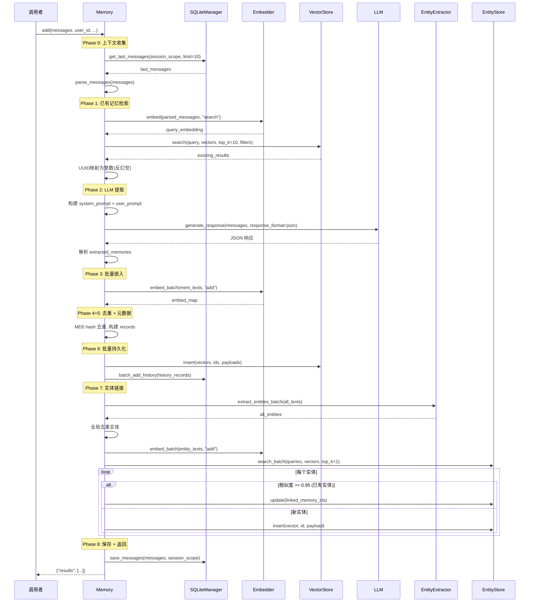
```mermaid
sequenceDiagram
    participant User as 调用者
    participant M as Memory
    participant DB as SQLiteManager
    participant Emb as Embedder
    participant VS as VectorStore
    participant LLM as LLM
    participant Ent as EntityExtractor
    participant ES as EntityStore

    User->>M: add(messages, user_id, ...)

    Note over M: Phase 0: 上下文收集
    M->>DB: get_last_messages(session_scope, limit=10)
    DB-->>M: last_messages
    M->>M: parse_messages(messages)

    Note over M: Phase 1: 已有记忆检索
    M->>Emb: embed(parsed_messages, "search")
    Emb-->>M: query_embedding
    M->>VS: search(query, vectors, top_k=10, filters)
    VS-->>M: existing_results
    M->>M: UUID映射为整数(反幻觉)

    Note over M: Phase 2: LLM 提取
    M->>M: 构建 system_prompt + user_prompt
    M->>LLM: generate_response(messages, response_format=json)
    LLM-->>M: JSON 响应
    M->>M: 解析 extracted_memories

    Note over M: Phase 3: 批量嵌入
    M->>Emb: embed_batch(mem_texts, "add")
    Emb-->>M: embed_map

    Note over M: Phase 4+5: 去重 + 元数据
    M->>M: MD5 hash 去重, 构建 records

    Note over M: Phase 6: 批量持久化
    M->>VS: insert(vectors, ids, payloads)
    M->>DB: batch_add_history(history_records)

    Note over M: Phase 7: 实体链接
    M->>Ent: extract_entities_batch(all_texts)
    Ent-->>M: all_entities
    M->>M: 全局去重实体
    M->>Emb: embed_batch(entity_texts, "add")
    M->>ES: search_batch(queries, vectors, top_k=1)

    loop 每个实体
        alt 相似度 >= 0.95 (已有实体)
            M->>ES: update(linked_memory_ids)
        else 新实体
            M->>ES: insert(vector, id, payload)
        end
    end

    Note over M: Phase 8: 保存 + 返回
    M->>DB: save_messages(messages, session_scope)
    M-->>User: {"results": [...]}
```

#### 2.1.4 search() 方法 - 混合检索设计

search() 方法融合三路信号：语义搜索、BM25 关键词搜索、实体增强：

```mermaid
flowchart TB
    START([search 入口]) --> VAL[参数验证<br/>- threshold ∈ 0,1<br/>- top_k ≥ 0<br/>- filters 含实体 ID]

    VAL --> PRE[查询预处理<br/>- lemmatize_for_bm25<br/>- extract_entities]

    PRE --> EMB[查询嵌入<br/>embed(query, search)]

    EMB --> SEM[语义搜索<br/>vector_store.search<br/>top_k = max limit*4, 60]

    SEM --> BM25{VectorStore<br/>支持 BM25?}
    BM25 -->|是| KW[keyword_search<br/>BM25 稀疏向量搜索]
    BM25 -->|否| NOKW[跳过关键词搜索]

    KW --> NORM[BM25 分数归一化<br/>Sigmoid 变换]
    NOKW --> ENT
    NORM --> ENT{查询实体非空?}

    ENT -->|是| EBOOST[实体增强<br/>embed_batch → EntityStore.search<br/>similarity * BOOST_WEIGHT * count_weight]
    ENT -->|否| NOBOOST[无实体增强]

    EBOOST --> SCORE
    NOBOOST --> SCORE[score_and_rank<br/>融合三路信号<br/>阈值过滤 + 截断]

    SCORE --> RERANK{rerank=True<br/>且 Reranker 可用?}
    RERANK -->|是| RR[reranker.rerank<br/>精排 top_k 结果]
    RERANK -->|否| FMT[结果格式化<br/>MemoryItem + promoted keys]

    RR --> FMT
    FMT --> END([返回结果])

    style START fill:#e1f5fe
    style END fill:#c8e6c9
```

#### 2.1.5 search() 时序图

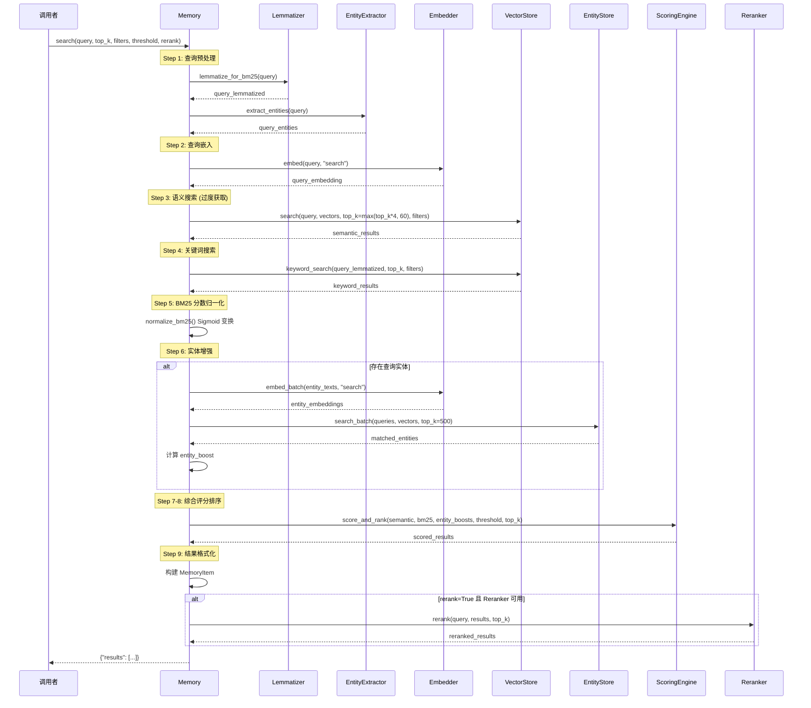
```mermaid
sequenceDiagram
    participant User as 调用者
    participant M as Memory
    participant Lem as Lemmatizer
    participant Ent as EntityExtractor
    participant Emb as Embedder
    participant VS as VectorStore
    participant ES as EntityStore
    participant Score as ScoringEngine
    participant RR as Reranker

    User->>M: search(query, top_k, filters, threshold, rerank)

    Note over M: Step 1: 查询预处理
    M->>Lem: lemmatize_for_bm25(query)
    Lem-->>M: query_lemmatized
    M->>Ent: extract_entities(query)
    Ent-->>M: query_entities

    Note over M: Step 2: 查询嵌入
    M->>Emb: embed(query, "search")
    Emb-->>M: query_embedding

    Note over M: Step 3: 语义搜索 (过度获取)
    M->>VS: search(query, vectors, top_k=max(top_k*4, 60), filters)
    VS-->>M: semantic_results

    Note over M: Step 4: 关键词搜索
    M->>VS: keyword_search(query_lemmatized, top_k, filters)
    VS-->>M: keyword_results

    Note over M: Step 5: BM25 分数归一化
    M->>M: normalize_bm25() Sigmoid 变换

    Note over M: Step 6: 实体增强
    alt 存在查询实体
        M->>Emb: embed_batch(entity_texts, "search")
        Emb-->>M: entity_embeddings
        M->>ES: search_batch(queries, vectors, top_k=500)
        ES-->>M: matched_entities
        M->>M: 计算 entity_boost
    end

    Note over M: Step 7-8: 综合评分排序
    M->>Score: score_and_rank(semantic, bm25, entity_boosts, threshold, top_k)
    Score-->>M: scored_results

    Note over M: Step 9: 结果格式化
    M->>M: 构建 MemoryItem

    alt rerank=True 且 Reranker 可用
        M->>RR: rerank(query, results, top_k)
        RR-->>M: reranked_results
    end

    M-->>User: {"results": [...]}
```

---

## 2.2 Provider 架构设计

### 2.2.1 Provider 插件化架构

所有 Provider 类别采用统一的插件化架构：

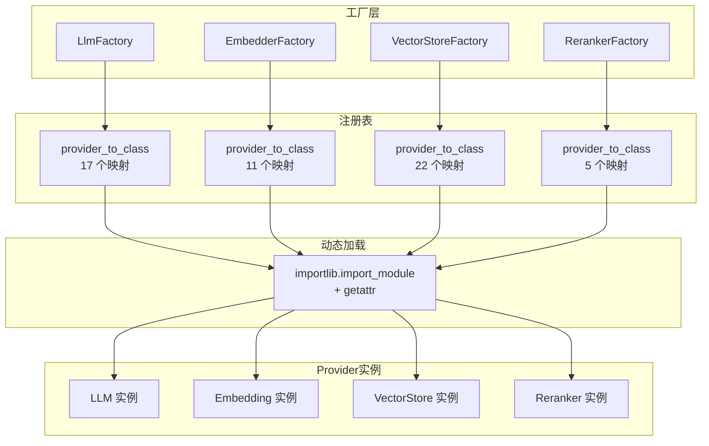
```mermaid
flowchart TB
    subgraph 工厂层
        LF[LlmFactory]
        EF[EmbedderFactory]
        VSF[VectorStoreFactory]
        RF[RerankerFactory]
    end

    subgraph 注册表
        LR[provider_to_class<br/>17 个映射]
        ER[provider_to_class<br/>11 个映射]
        VSR[provider_to_class<br/>22 个映射]
        RR[provider_to_class<br/>5 个映射]
    end

    subgraph 动态加载
        IL[importlib.import_module<br/>+ getattr]
    end

    subgraph Provider实例
        LLM_INST[LLM 实例]
        EMB_INST[Embedding 实例]
        VS_INST[VectorStore 实例]
        RR_INST[Reranker 实例]
    end

    LF --> LR
    EF --> ER
    VSF --> VSR
    RF --> RR
    LR --> IL
    ER --> IL
    VSR --> IL
    RR --> IL
    IL --> LLM_INST
    IL --> EMB_INST
    IL --> VS_INST
    IL --> RR_INST
```

### 2.2.2 LLM Provider 类层次

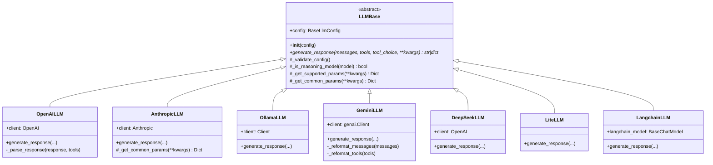
```mermaid
classDiagram
    class LLMBase {
        <<abstract>>
        +config: BaseLlmConfig
        +__init__(config)
        +generate_response(messages, tools, tool_choice, **kwargs)* str|dict
        #_validate_config()
        #_is_reasoning_model(model) bool
        #_get_supported_params(**kwargs) Dict
        #_get_common_params(**kwargs) Dict
    }

    class OpenAILLM {
        +client: OpenAI
        +generate_response(...)
        -_parse_response(response, tools)
    }

    class AnthropicLLM {
        +client: Anthropic
        +generate_response(...)
        #_get_common_params(**kwargs) Dict
    }

    class OllamaLLM {
        +client: Client
        +generate_response(...)
    }

    class GeminiLLM {
        +client: genai.Client
        +generate_response(...)
        -_reformat_messages(messages)
        -_reformat_tools(tools)
    }

    class DeepSeekLLM {
        +client: OpenAI
        +generate_response(...)
    }

    class LiteLLM {
        +generate_response(...)
    }

    class LangchainLLM {
        +langchain_model: BaseChatModel
        +generate_response(...)
    }

    LLMBase <|-- OpenAILLM
    LLMBase <|-- AnthropicLLM
    LLMBase <|-- OllamaLLM
    LLMBase <|-- GeminiLLM
    LLMBase <|-- DeepSeekLLM
    LLMBase <|-- LiteLLM
    LLMBase <|-- LangchainLLM
```

### 2.2.3 LLM 调用时序图

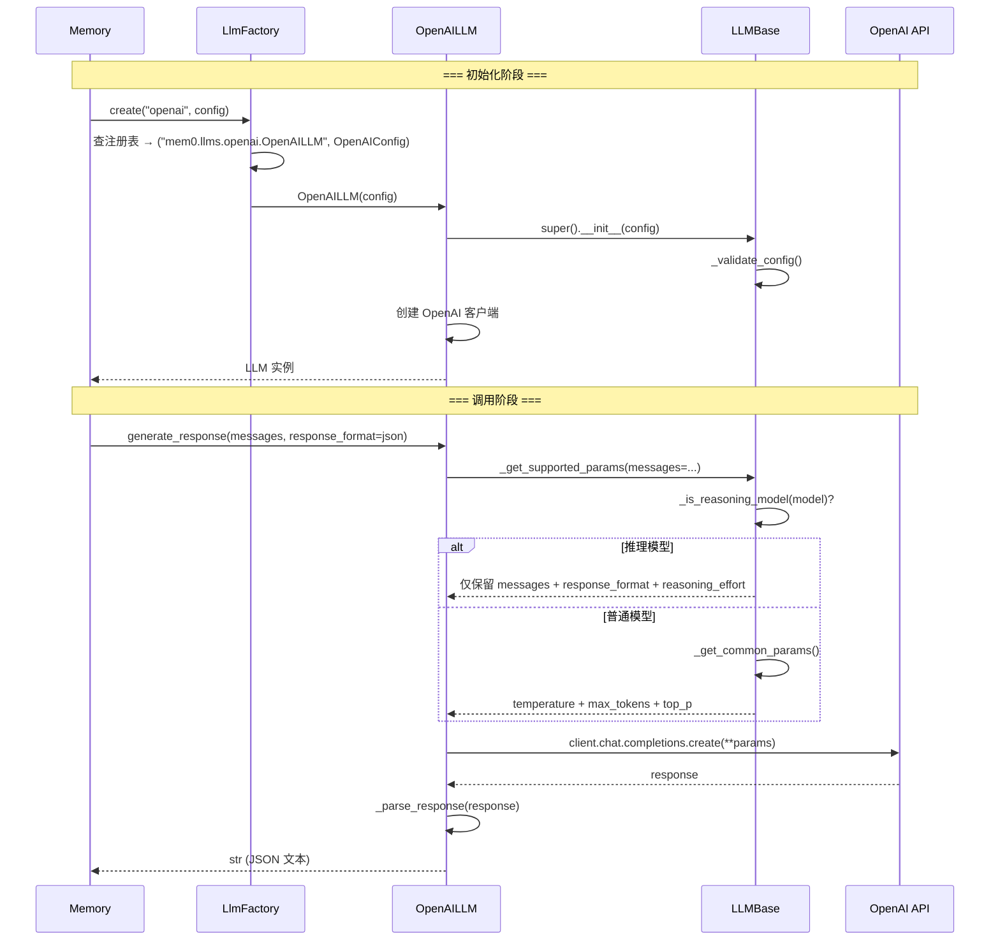
```mermaid
sequenceDiagram
    participant Memory
    participant Factory as LlmFactory
    participant LLM as OpenAILLM
    participant Base as LLMBase
    participant API as OpenAI API

    Note over Memory,API: === 初始化阶段 ===
    Memory->>Factory: create("openai", config)
    Factory->>Factory: 查注册表 → ("mem0.llms.openai.OpenAILLM", OpenAIConfig)
    Factory->>LLM: OpenAILLM(config)
    LLM->>Base: super().__init__(config)
    Base->>Base: _validate_config()
    LLM->>LLM: 创建 OpenAI 客户端
    LLM-->>Memory: LLM 实例

    Note over Memory,API: === 调用阶段 ===
    Memory->>LLM: generate_response(messages, response_format=json)
    LLM->>Base: _get_supported_params(messages=...)
    Base->>Base: _is_reasoning_model(model)?
    alt 推理模型
        Base-->>LLM: 仅保留 messages + response_format + reasoning_effort
    else 普通模型
        Base->>Base: _get_common_params()
        Base-->>LLM: temperature + max_tokens + top_p
    end
    LLM->>API: client.chat.completions.create(**params)
    API-->>LLM: response
    LLM->>LLM: _parse_response(response)
    LLM-->>Memory: str (JSON 文本)
```

### 2.2.4 Embedding Provider 类层次

```mermaid
classDiagram
    class EmbeddingBase {
        <<abstract>>
        +config: BaseEmbedderConfig
        +embed(text, memory_action)* list~float~
        +embed_batch(texts, memory_action) list~list~float~~
    }

    class OpenAIEmbedding {
        +client: OpenAI
        +embed(text, memory_action) list~float~
        +embed_batch(texts, memory_action) list~list~float~~
    }

    class OllamaEmbedding {
        +client: Client
        +embed(text, memory_action) list~float~
        -_ensure_model_exists()
    }

    class AzureOpenAIEmbedding {
        +client: AzureOpenAI
        +embed(text, memory_action) list~float~
    }

    class HuggingFaceEmbedding
    class GeminiEmbedding
    class VertexAIEmbedding
    class TogetherEmbedding
    class LMStudioEmbedding
    class LangchainEmbedding
    class AWSBedrockEmbedding
    class FastEmbedEmbedding
    class MockEmbeddings

    EmbeddingBase <|-- OpenAIEmbedding
    EmbeddingBase <|-- OllamaEmbedding
    EmbeddingBase <|-- AzureOpenAIEmbedding
    EmbeddingBase <|-- HuggingFaceEmbedding
    EmbeddingBase <|-- GeminiEmbedding
    EmbeddingBase <|-- VertexAIEmbedding
    EmbeddingBase <|-- TogetherEmbedding
    EmbeddingBase <|-- LMStudioEmbedding
    EmbeddingBase <|-- LangchainEmbedding
    EmbeddingBase <|-- AWSBedrockEmbedding
    EmbeddingBase <|-- FastEmbedEmbedding
    EmbeddingBase <|-- MockEmbeddings
```

### 2.2.5 Vector Store Provider 类层次

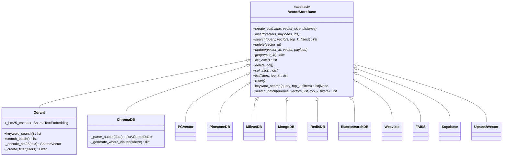
```mermaid
classDiagram
    class VectorStoreBase {
        <<abstract>>
        +create_col(name, vector_size, distance)*
        +insert(vectors, payloads, ids)*
        +search(query, vectors, top_k, filters)* list
        +delete(vector_id)*
        +update(vector_id, vector, payload)*
        +get(vector_id)* dict
        +list_cols()* list
        +delete_col()*
        +col_info()* dict
        +list(filters, top_k)* list
        +reset()*
        +keyword_search(query, top_k, filters) list|None
        +search_batch(queries, vectors_list, top_k, filters) list
    }

    class Qdrant {
        +_bm25_encoder: SparseTextEmbedding
        +keyword_search() list
        +search_batch() list
        -_encode_bm25(text) SparseVector
        -_create_filter(filters) Filter
    }

    class ChromaDB {
        -_parse_output(data) List~OutputData~
        -_generate_where_clause(where) dict
    }

    class PGVector
    class PineconeDB
    class MilvusDB
    class MongoDB
    class RedisDB
    class ElasticsearchDB
    class Weaviate
    class FAISS
    class Supabase
    class UpstashVector

    VectorStoreBase <|-- Qdrant
    VectorStoreBase <|-- ChromaDB
    VectorStoreBase <|-- PGVector
    VectorStoreBase <|-- PineconeDB
    VectorStoreBase <|-- MilvusDB
    VectorStoreBase <|-- MongoDB
    VectorStoreBase <|-- RedisDB
    VectorStoreBase <|-- ElasticsearchDB
    VectorStoreBase <|-- Weaviate
    VectorStoreBase <|-- FAISS
    VectorStoreBase <|-- Supabase
    VectorStoreBase <|-- UpstashVector
```

### 2.2.6 Reranker Provider 类层次

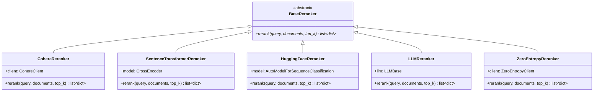
```mermaid
classDiagram
    class BaseReranker {
        <<abstract>>
        +rerank(query, documents, top_k)* list~dict~
    }

    class CohereReranker {
        +client: CohereClient
        +rerank(query, documents, top_k) list~dict~
    }

    class SentenceTransformerReranker {
        +model: CrossEncoder
        +rerank(query, documents, top_k) list~dict~
    }

    class HuggingFaceReranker {
        +model: AutoModelForSequenceClassification
        +rerank(query, documents, top_k) list~dict~
    }

    class LLMReranker {
        +llm: LLMBase
        +rerank(query, documents, top_k) list~dict~
    }

    class ZeroEntropyReranker {
        +client: ZeroEntropyClient
        +rerank(query, documents, top_k) list~dict~
    }

    BaseReranker <|-- CohereReranker
    BaseReranker <|-- SentenceTransformerReranker
    BaseReranker <|-- HuggingFaceReranker
    BaseReranker <|-- LLMReranker
    BaseReranker <|-- ZeroEntropyReranker
```

---

## 3. Entity Store 设计（轻量级图结构）

### 3.1 架构设计

Entity Store 复用 Vector Store 基础设施，提供实体级别的关联和增强：

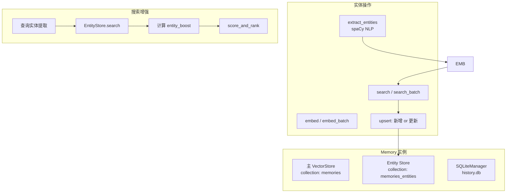
```mermaid
flowchart TB
    subgraph Memory 实例
        VS[主 VectorStore<br/>collection: memories]
        ES[Entity Store<br/>collection: memories_entities]
        DB[SQLiteManager<br/>history.db]
    end

    subgraph 实体操作
        EXTRACT[extract_entities<br/>spaCy NLP]
        EMBED[embed / embed_batch]
        SEARCH[search / search_batch]
        UPSERT[upsert: 新增 or 更新]
    end

    EXTRACT --> EMB
    EMB --> SEARCH
    SEARCH --> UPSERT
    UPSERT --> ES

    subgraph 搜索增强
        Q_ENT[查询实体提取]
        E_SEARCH[EntityStore.search]
        BOOST[计算 entity_boost]
        RANK[score_and_rank]
    end

    Q_ENT --> E_SEARCH
    E_SEARCH --> BOOST
    BOOST --> RANK
```

### 3.2 实体-记忆关联时序图

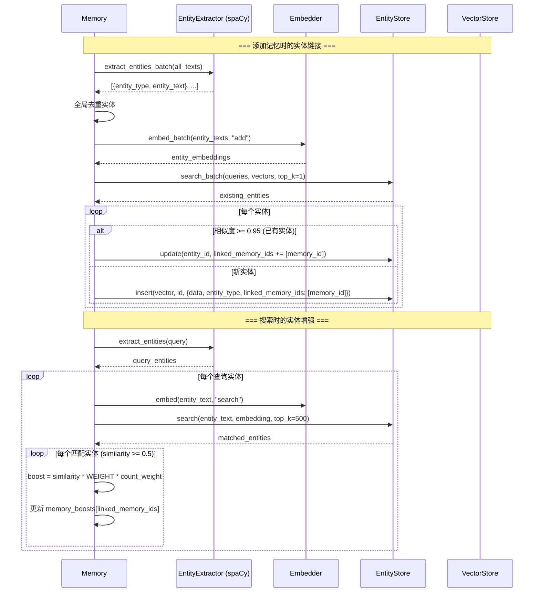
```mermaid
sequenceDiagram
    participant M as Memory
    participant Ent as EntityExtractor (spaCy)
    participant Emb as Embedder
    participant ES as EntityStore
    participant VS as VectorStore

    Note over M,VS: === 添加记忆时的实体链接 ===
    M->>Ent: extract_entities_batch(all_texts)
    Ent-->>M: [{entity_type, entity_text}, ...]
    M->>M: 全局去重实体

    M->>Emb: embed_batch(entity_texts, "add")
    Emb-->>M: entity_embeddings

    M->>ES: search_batch(queries, vectors, top_k=1)
    ES-->>M: existing_entities

    loop 每个实体
        alt 相似度 >= 0.95 (已有实体)
            M->>ES: update(entity_id, linked_memory_ids += [memory_id])
        else 新实体
            M->>ES: insert(vector, id, {data, entity_type, linked_memory_ids: [memory_id]})
        end
    end

    Note over M,VS: === 搜索时的实体增强 ===
    M->>Ent: extract_entities(query)
    Ent-->>M: query_entities

    loop 每个查询实体
        M->>Emb: embed(entity_text, "search")
        M->>ES: search(entity_text, embedding, top_k=500)
        ES-->>M: matched_entities

        loop 每个匹配实体 (similarity >= 0.5)
            M->>M: boost = similarity * WEIGHT * count_weight
            M->>M: 更新 memory_boosts[linked_memory_ids]
        end
    end
```

---

## 4. 配置系统设计

### 4.1 配置层次结构

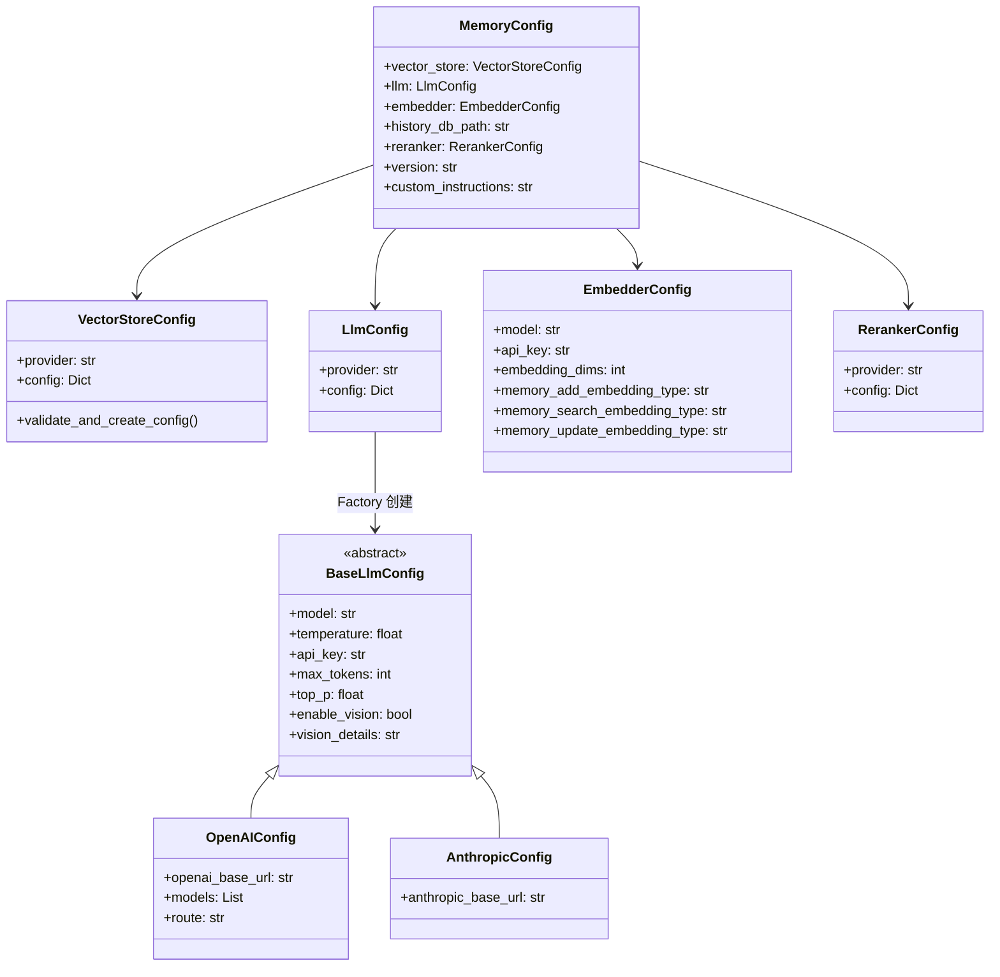
```mermaid
classDiagram
    class MemoryConfig {
        +vector_store: VectorStoreConfig
        +llm: LlmConfig
        +embedder: EmbedderConfig
        +history_db_path: str
        +reranker: RerankerConfig
        +version: str
        +custom_instructions: str
    }

    class VectorStoreConfig {
        +provider: str
        +config: Dict
        +validate_and_create_config()
    }

    class LlmConfig {
        +provider: str
        +config: Dict
    }

    class EmbedderConfig {
        +model: str
        +api_key: str
        +embedding_dims: int
        +memory_add_embedding_type: str
        +memory_search_embedding_type: str
        +memory_update_embedding_type: str
    }

    class RerankerConfig {
        +provider: str
        +config: Dict
    }

    class BaseLlmConfig {
        <<abstract>>
        +model: str
        +temperature: float
        +api_key: str
        +max_tokens: int
        +top_p: float
        +enable_vision: bool
        +vision_details: str
    }

    class OpenAIConfig {
        +openai_base_url: str
        +models: List
        +route: str
    }

    class AnthropicConfig {
        +anthropic_base_url: str
    }

    MemoryConfig --> VectorStoreConfig
    MemoryConfig --> LlmConfig
    MemoryConfig --> EmbedderConfig
    MemoryConfig --> RerankerConfig
    LlmConfig --> BaseLlmConfig : Factory 创建
    BaseLlmConfig <|-- OpenAIConfig
    BaseLlmConfig <|-- AnthropicConfig
```

### 4.2 配置到实例的映射流程

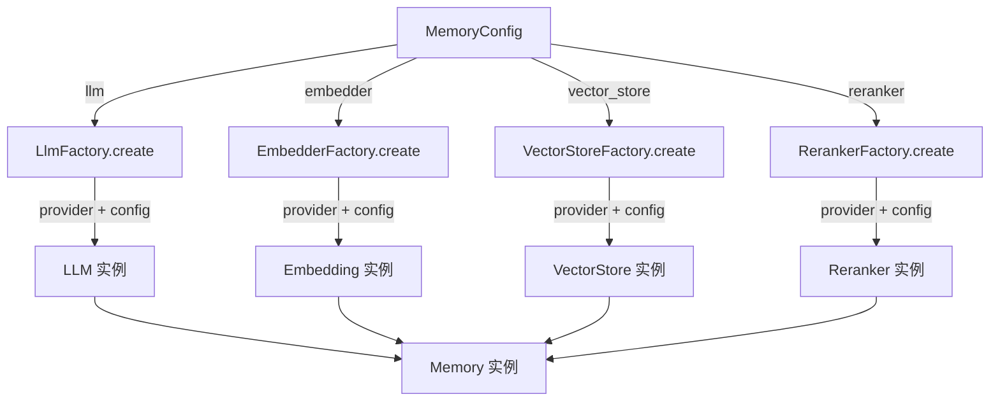
```mermaid
flowchart TB
    MC[MemoryConfig] --> |"llm"| LF[LlmFactory.create]
    MC --> |"embedder"| EF[EmbedderFactory.create]
    MC --> |"vector_store"| VSF[VectorStoreFactory.create]
    MC --> |"reranker"| RF[RerankerFactory.create]

    LF --> |"provider + config"| LLM_INST[LLM 实例]
    EF --> |"provider + config"| EMB_INST[Embedding 实例]
    VSF --> |"provider + config"| VS_INST[VectorStore 实例]
    RF --> |"provider + config"| RR_INST[Reranker 实例]

    LLM_INST --> M[Memory 实例]
    EMB_INST --> M
    VS_INST --> M
    RR_INST --> M
```

---

## 5. MemoryClient 设计（托管平台）

### 5.1 架构对比

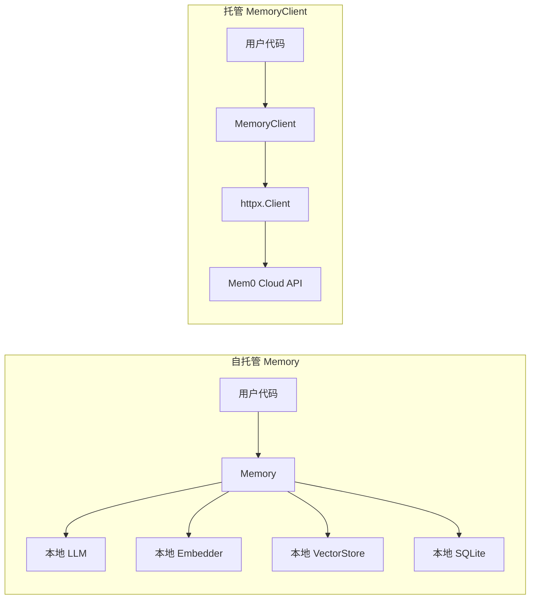
```mermaid
flowchart LR
    subgraph 自托管 Memory
        direction TB
        U1[用户代码] --> M1[Memory]
        M1 --> L1[本地 LLM]
        M1 --> E1[本地 Embedder]
        M1 --> V1[本地 VectorStore]
        M1 --> D1[本地 SQLite]
    end

    subgraph 托管 MemoryClient
        direction TB
        U2[用户代码] --> M2[MemoryClient]
        M2 --> H2[httpx.Client]
        H2 --> A2[Mem0 Cloud API]
    end
```

### 5.2 MemoryClient API 通信时序图

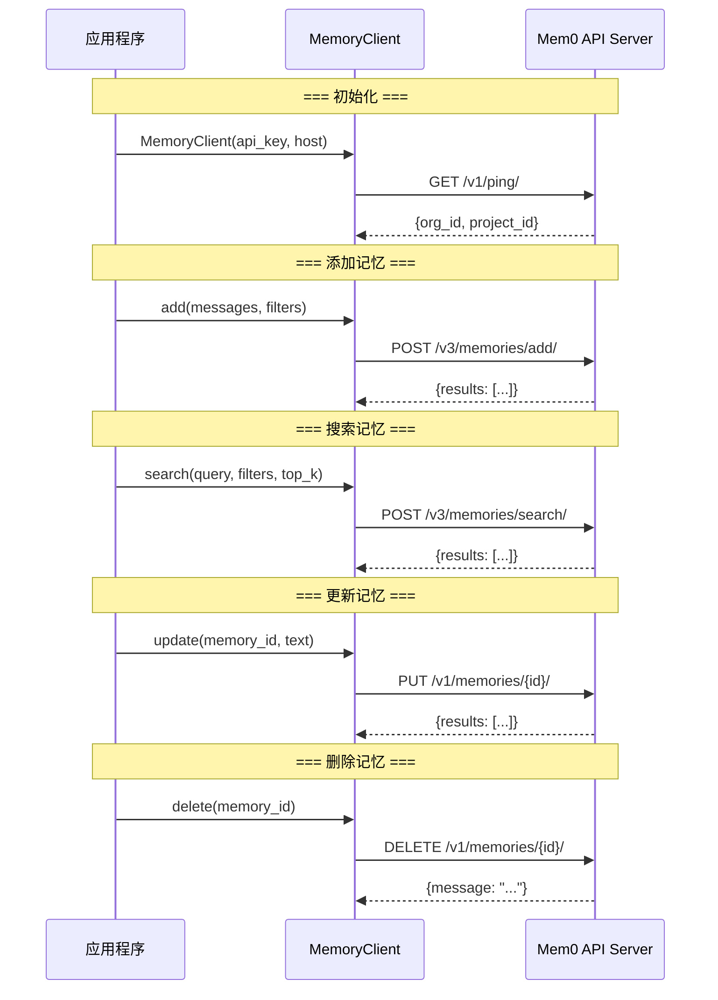
```mermaid
sequenceDiagram
    participant App as 应用程序
    participant Client as MemoryClient
    participant API as Mem0 API Server

    Note over App,API: === 初始化 ===
    App->>Client: MemoryClient(api_key, host)
    Client->>API: GET /v1/ping/
    API-->>Client: {org_id, project_id}

    Note over App,API: === 添加记忆 ===
    App->>Client: add(messages, filters)
    Client->>API: POST /v3/memories/add/
    API-->>Client: {results: [...]}

    Note over App,API: === 搜索记忆 ===
    App->>Client: search(query, filters, top_k)
    Client->>API: POST /v3/memories/search/
    API-->>Client: {results: [...]}

    Note over App,API: === 更新记忆 ===
    App->>Client: update(memory_id, text)
    Client->>API: PUT /v1/memories/{id}/
    API-->>Client: {results: [...]}

    Note over App,API: === 删除记忆 ===
    App->>Client: delete(memory_id)
    Client->>API: DELETE /v1/memories/{id}/
    API-->>Client: {message: "..."}
```

---

## 6. 同步 vs 异步设计

### 6.1 异步策略

AsyncMemory 的核心策略是将所有阻塞 I/O 操作委托到线程池：

```mermaid
flowchart TB
    subgraph AsyncMemory
        A1[async add] --> T1[await asyncio.to_thread<br/>self.vector_store.search]
        A2[async search] --> T2[await asyncio.to_thread<br/>self.embedding_model.embed]
        A3[async delete_all] --> T3[await asyncio.gather<br/>*delete_tasks]
    end

    subgraph 并发控制
        S1[Semaphore(4)<br/>实体增强并发]
        S2[asyncio.gather<br/>批量删除并发]
    end

    T1 --> S1
    T2 --> S1
    T3 --> S2
```

### 6.2 差异对比

| 维度 | Memory (同步) | AsyncMemory (异步) |
|------|---------------|-------------------|
| I/O 操作 | 直接调用 | `await asyncio.to_thread(...)` |
| 实体搜索并发 | `ThreadPoolExecutor(max_workers=4)` | `asyncio.Semaphore(4)` + `asyncio.gather()` |
| delete_all | 顺序逐个删除 | `asyncio.gather(*delete_tasks)` 并发 |
| add() 参数 | 无 `llm` 参数 | 额外支持 `llm` 参数 |
| reset() | 直接操作 | 包含 `gc.collect()` 和客户端关闭 |

---

## 7. 关键设计决策

### 7.1 设计模式总结

| 模式 | 应用位置 | 说明 |
|------|----------|------|
| 工厂模式 | 所有 Provider 创建 | `LlmFactory`/`EmbedderFactory`/`VectorStoreFactory`/`RerankerFactory` |
| 策略模式 | Provider 切换 | 统一接口，运行时可替换 |
| 模板方法 | LLM 参数构建 | `_get_supported_params` → `_get_common_params` |
| 延迟导入 | Provider 加载 | `importlib.import_module` 按需加载 |
| 延迟初始化 | Entity Store | 首次访问时创建 |
| 优雅降级 | 批量操作 | 批量失败 → 逐条回退 |

### 7.2 反幻觉设计

```mermaid
flowchart LR
    A[已有记忆 UUID] --> B[映射为整数 0,1,2...]
    B --> C[整数 ID 传入 LLM Prompt]
    C --> D[LLM 返回整数引用]
    D --> E[整数映射回 UUID]
    E --> F[确保引用的记忆真实存在]
```

### 7.3 Hash 去重设计

```mermaid
flowchart LR
    A[新记忆文本] --> B[MD5(text)]
    B --> C{hash 在已有记忆中?}
    C -->|是| D[跳过, 不重复添加]
    C -->|否| E[添加到 VectorStore]
    E --> F[记录 hash]
```

### 7.4 容错设计

| 场景 | 策略 |
|------|------|
| 批量嵌入失败 | 回退到逐条嵌入 |
| 批量插入失败 | 回退到逐条插入 |
| Reranker 失败 | 回退到原始排序，赋予默认分数 |
| Entity upsert 失败 | 仅 warning，不阻断主流程 |
| BM25 不支持 | `keyword_search` 返回 None，跳过关键词搜索 |
| 视觉模型不可用 | 跳过图像解析，使用原始 URL |

---

## 8. 数据流总览

```mermaid
flowchart TB
    subgraph 输入
        MSG[消息: str/dict/list]
        Q[查询: str]
        MID[memory_id: str]
    end

    subgraph 核心逻辑
        ADD[add]
        SEARCH[search]
        GET[get/get_all]
        UPDATE[update]
        DELETE[delete]
    end

    subgraph 处理管线
        PARSE[parse_messages]
        VISION[parse_vision_messages]
        EMB[Embedder]
        LLM[LLM]
        ENT[EntityExtractor]
        LEM[Lemmatizer]
        SCORE[score_and_rank]
        RERANK[Reranker]
    end

    subgraph 存储层
        VS[VectorStore: 主记忆]
        ES[EntityStore: 实体]
        DB[SQLite: 历史]
    end

    MSG --> ADD
    ADD --> PARSE
    PARSE --> VISION
    VISION --> EMB
    EMB --> VS
    ADD --> LLM
    LLM --> EMB
    ADD --> ENT
    ENT --> ES
    ADD --> DB

    Q --> SEARCH
    SEARCH --> LEM
    SEARCH --> ENT
    SEARCH --> EMB
    EMB --> VS
    LEM --> VS
    ENT --> ES
    VS --> SCORE
    ES --> SCORE
    SCORE --> RERANK

    MID --> GET
    GET --> VS
    MID --> UPDATE
    UPDATE --> EMB
    UPDATE --> VS
    UPDATE --> DB
    UPDATE --> ES
    MID --> DELETE
    DELETE --> VS
    DELETE --> DB
    DELETE --> ES
```
