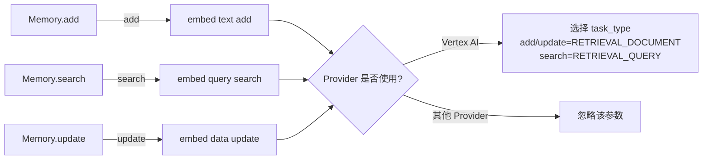
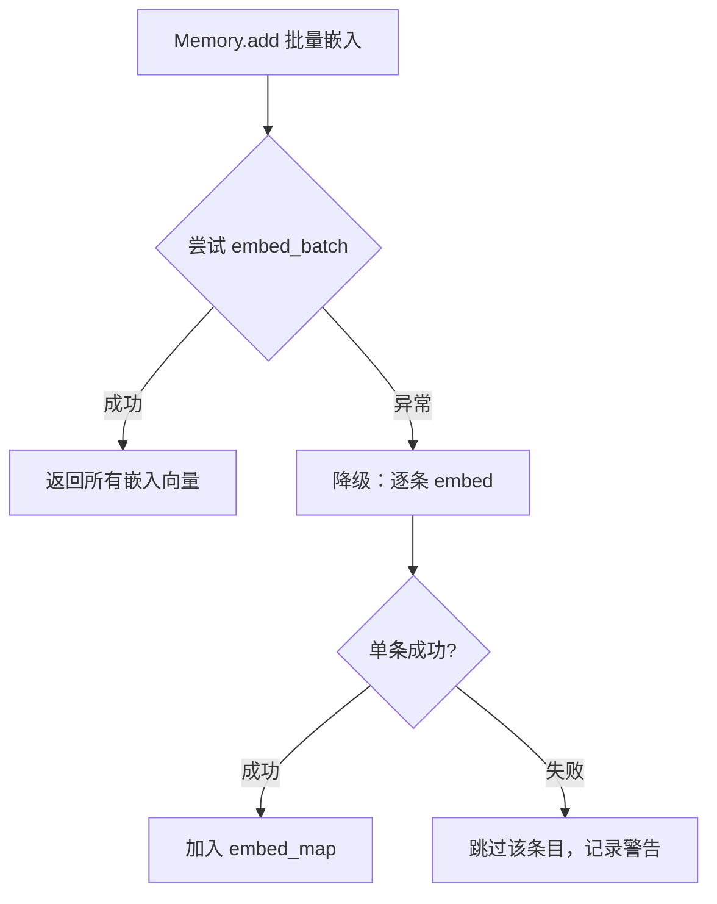
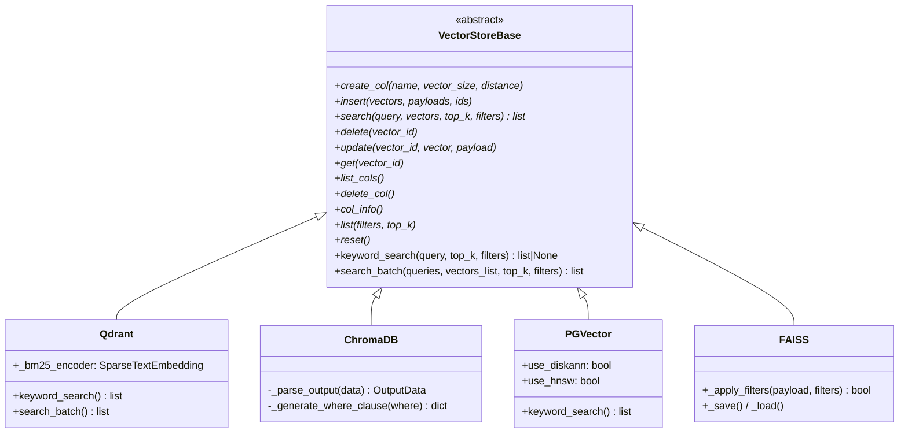
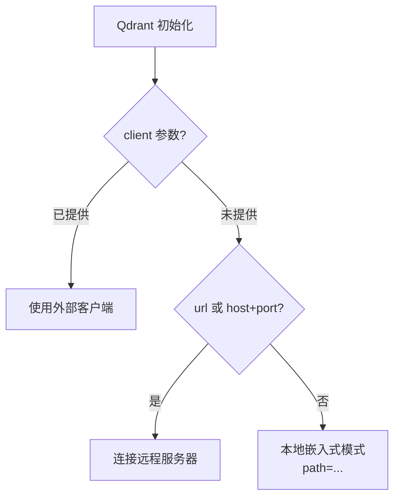
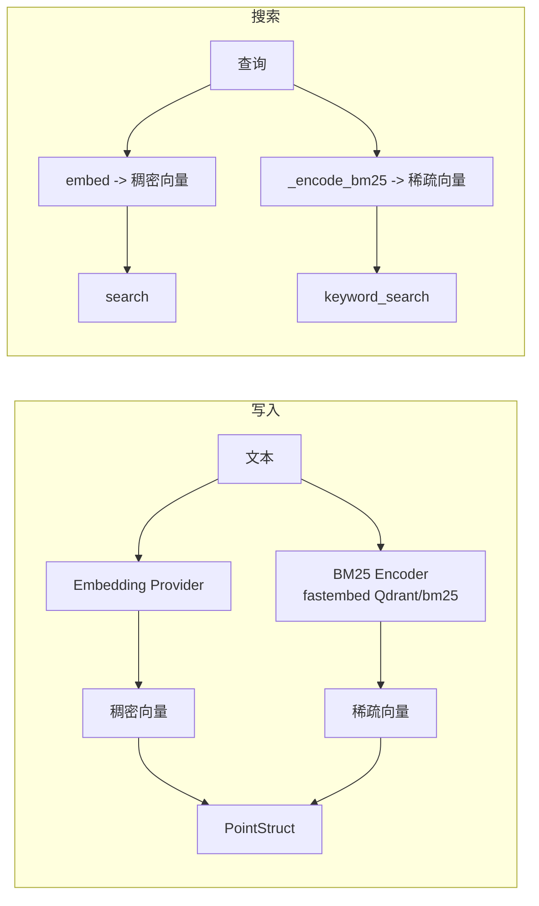
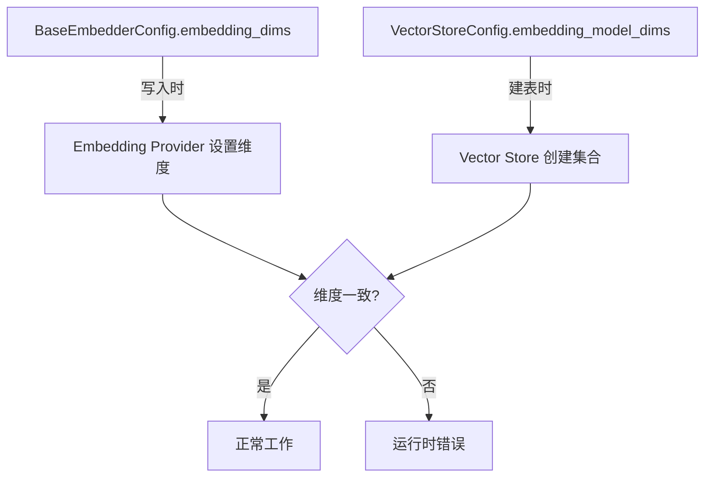
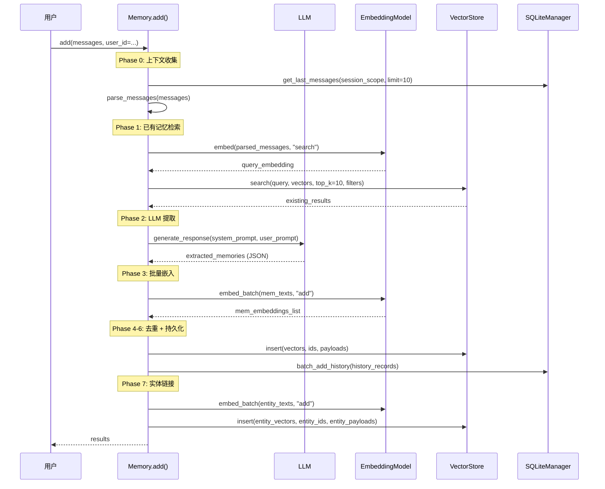
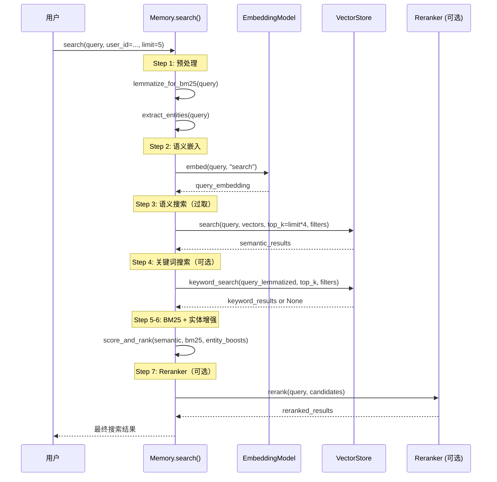

# Mem0 Embeddings 与 Vector Stores 子模块深度解析

---

## 第一部分：Embeddings 模块

### 1.1 模块概述

Embeddings 模块是 Mem0 的向量编码层，负责将文本转换为固定维度的浮点向量。采用 **Provider 模式**，通过统一的抽象基类 `EmbeddingBase` 屏蔽底层差异。

**支持的 11 个 Provider（+ 1 个 Mock）：**

| Provider | 类名 | 默认模型 | 默认维度 |
|----------|------|----------|----------|
| OpenAI | `OpenAIEmbedding` | `text-embedding-3-small` | 1536 |
| Azure OpenAI | `AzureOpenAIEmbedding` | 由部署决定 | 由部署决定 |
| Gemini | `GoogleGenAIEmbedding` | `models/gemini-embedding-001` | 768 |
| Vertex AI | `VertexAIEmbedding` | `gemini-embedding-001` | 256 |
| Together | `TogetherEmbedding` | `togethercomputer/m2-bert-80M-8k-retrieval` | 768 |
| AWS Bedrock | `AWSBedrockEmbedding` | `amazon.titan-embed-text-v1` | 由模型决定 |
| Ollama | `OllamaEmbedding` | `nomic-embed-text` | 512 |
| HuggingFace | `HuggingFaceEmbedding` | `multi-qa-MiniLM-L6-cos-v1` | 自动推断 |
| FastEmbed | `FastEmbedEmbedding` | `thenlper/gte-large` | 自动推断 |
| LM Studio | `LMStudioEmbedding` | `nomic-embed-text-v1.5` | 1536 |
| LangChain | `LangchainEmbedding` | (必须传入) | 由模型决定 |
| Mock | `MockEmbeddings` | - | 10 |

---

### 1.2 EmbeddingBase 基类设计

```mermaid
classDiagram
    class EmbeddingBase {
        <<abstract>>
        +config: BaseEmbedderConfig
        +embed(text, memory_action)* list~float~
        +embed_batch(texts, memory_action) list~list~float~~
    }

    class OpenAIEmbedding {
        +client: OpenAI
        +_pass_dimensions_to_api: bool
        +embed(text, memory_action) list~float~
        +embed_batch(texts, memory_action) list~list~float~~
    }

    class OllamaEmbedding {
        +client: Client
        +embed(text, memory_action) list~float~
        -_ensure_model_exists()
    }

    class HuggingFaceEmbedding {
        +client: OpenAI | None
        +model: SentenceTransformer | None
        +embed(text, memory_action) list~float~
    }

    class VertexAIEmbedding {
        +model: TextEmbeddingModel
        +embedding_types: dict
        +embed(text, memory_action) list~float~
    }

    class AWSBedrockEmbedding {
        +client: boto3.Client
        +embed(text, memory_action) list~float~
    }

    class FastEmbedEmbedding {
        +dense_model: TextEmbedding
        +embed(text, memory_action) list~float~
    }

    class MockEmbeddings {
        +embed(text, memory_action) list~float~
    }

    EmbeddingBase <|-- OpenAIEmbedding
    EmbeddingBase <|-- OllamaEmbedding
    EmbeddingBase <|-- HuggingFaceEmbedding
    EmbeddingBase <|-- VertexAIEmbedding
    EmbeddingBase <|-- AWSBedrockEmbedding
    EmbeddingBase <|-- FastEmbedEmbedding
    EmbeddingBase <|-- MockEmbeddings
```

**核心设计：**
- `embed()` 是抽象方法，每个 Provider 必须实现
- `embed_batch()` 提供默认实现（逐条调用 `embed()`），支持原生批量 API 的 Provider 可覆盖

---

### 1.3 BaseEmbedderConfig 统一胖配置

采用"胖配置"模式，将所有 Provider 的配置参数汇聚到一个类中：

| 参数 | 适用 Provider | 说明 |
|------|-------------|------|
| `model` | 全部 | 模型标识 |
| `api_key` | 云端 Provider | API 密钥 |
| `embedding_dims` | 全部 | 嵌入维度 |
| `ollama_base_url` | Ollama | Ollama 服务地址 |
| `openai_base_url` | OpenAI | OpenAI API 地址 |
| `azure_kwargs` | Azure OpenAI | Azure 部署配置 |
| `huggingface_base_url` | HuggingFace | TEI 服务地址 |
| `vertex_credentials_json` | Vertex AI | GCP 凭证 |
| `memory_add_embedding_type` | Vertex AI | 添加时的嵌入类型 |
| `memory_search_embedding_type` | Vertex AI | 搜索时的嵌入类型 |
| `lmstudio_base_url` | LM Studio | LM Studio 地址 |
| `aws_access_key_id` | AWS Bedrock | AWS 访问密钥 |

---

### 1.4 `memory_action` 参数语义

**Vertex AI** 是唯一真正利用 `memory_action` 的 Provider，根据动作类型选择不同的嵌入任务类型。

---

### 1.5 批量嵌入与优雅降级

| Provider | 原生批量 | 实现方式 |
|----------|---------|---------|
| OpenAI | 是 | 单次 API 调用，100 条分批，按 `index` 排序 |
| Azure OpenAI | 是 | 同 OpenAI |
| 其他 | 否 | 使用基类默认实现（逐条调用 `embed()`） |

---

## 第二部分：Vector Stores 模块

### 2.1 模块概述

Vector Stores 模块是 Mem0 的持久化向量存储层，负责向量的 CRUD 操作和相似性搜索。

**支持的 24 个 Provider：**

| Provider | BM25 支持 | 批量搜索 | 特殊能力 |
|----------|-----------|----------|----------|
| Qdrant | 是 | 是 | 三种部署模式，最完整过滤器 |
| ChromaDB | 否 | 否 | 三种客户端模式 |
| PGVector | 是 | 否 | DiskANN/HNSW 索引，tsvector 全文搜索 |
| Pinecone | 是(稀疏向量) | 否 | Serverless/Pod 部署，命名空间 |
| Milvus | 是(原生BM25) | 否 | v3 双向量字段 |
| Elasticsearch | 是(multi_match) | 否 | 自定义查询回调 |
| Redis | 是(TextQuery) | 否 | redisvl 框架 |
| MongoDB | 是($search) | 否 | Atlas Vector Search |
| Weaviate | 是(bm25()) | 否 | hybrid 混合搜索 |
| FAISS | 否 | 否 | 纯本地，安全反序列化 |
| 其他 | 否 | 否 | - |

---

### 2.2 VectorStoreBase 基类设计

**10 个抽象方法 + 2 个可选方法：**

| 方法 | 类型 | 说明 |
|------|------|------|
| `create_col` | 抽象 | 创建集合/索引 |
| `insert` | 抽象 | 插入向量 |
| `search` | 抽象 | 向量相似性搜索 |
| `delete` | 抽象 | 删除向量 |
| `update` | 抽象 | 更新向量和/或载荷 |
| `get` | 抽象 | 按 ID 获取向量 |
| `list_cols` | 抽象 | 列出所有集合 |
| `delete_col` | 抽象 | 删除集合 |
| `col_info` | 抽象 | 获取集合信息 |
| `list` | 抽象 | 列出向量（带过滤） |
| `reset` | 抽象 | 重置（删除并重建） |
| `keyword_search` | 可选 | BM25/全文搜索，默认返回 `None` |
| `search_batch` | 可选 | 批量搜索，默认逐条调用 `search()` |

**`search()` 分数约定（关键）：** 所有实现必须返回相似性分数（越高越相似 [0,1]）：
- 余弦距离：`score = max(0.0, 1.0 - distance)`
- L2 距离：`score = 1.0 / (1.0 + distance)`

---

### 2.3 Qdrant 深度分析

#### 三种部署模式

#### BM25 混合搜索

#### 过滤器系统

| 操作符 | Qdrant 映射 |
|--------|------------|
| `eq` | `MatchValue` |
| `ne` | `MatchExcept` |
| `gt/gte/lt/lte` | `Range` / `DatetimeRange` |
| `in` | `MatchAny` |
| `nin` | `MatchExcept` |
| `contains/icontains` | `MatchText` |
| `AND` | `Filter.must` |
| `OR` | `Filter.should` |
| `NOT` | `Filter.must_not` |

---

### 2.4 ChromaDB 深度分析

- **距离转换**：L2 距离 → 相似性 `score = 1.0 / (1.0 + distance)`
- **过滤器转换**：`eq` → `$eq`，`gt` → `$gt`，`NOT` 不支持，`contains` 降级为 `$eq`
- **三种客户端模式**：外部客户端 / ChromaDB Cloud / 本地或服务器

---

## 第三部分：协作机制

### 3.1 维度契约

### 3.2 写入时序图（Memory.add → VectorStore.insert）

### 3.3 搜索时序图（Memory.search → VectorStore.search）

