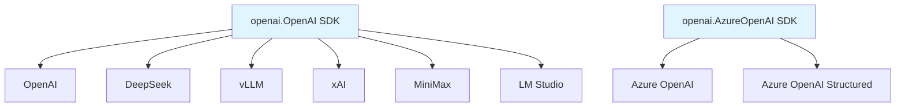
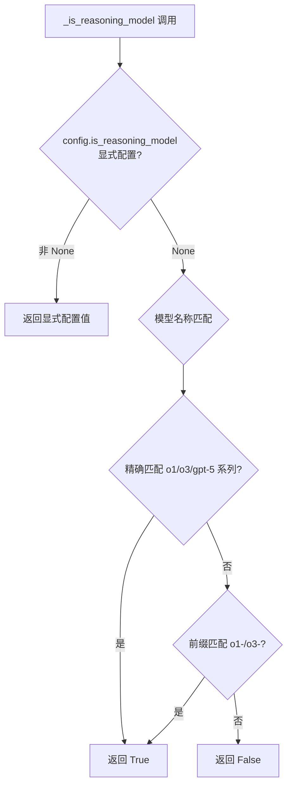
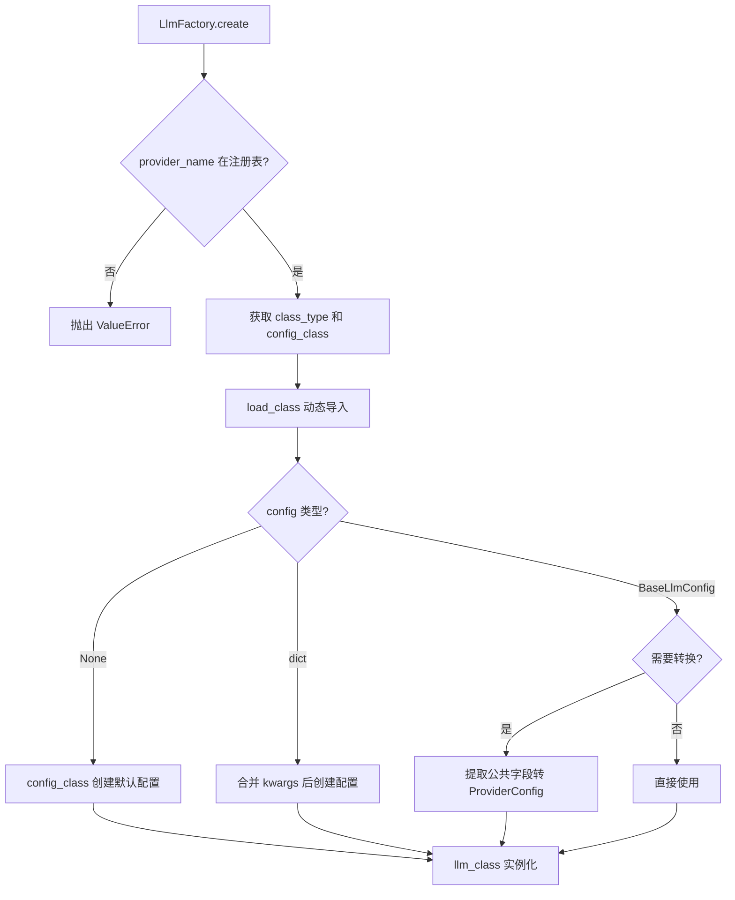
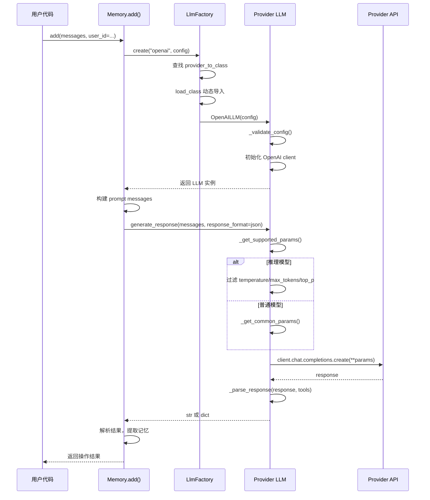

# Mem0 LLM 子模块深度解析

## 1. 模块概述

### 1.1 职责

`mem0/llms/` 子模块是 Mem0 的 **LLM 抽象层**，负责将不同大语言模型提供商的 API 差异封装在统一的接口背后。上层业务（如 `Memory.add()`、`Memory.search()`）只需调用 `generate_response()` 方法，无需关心底层是 OpenAI、Anthropic 还是 Ollama。

### 1.2 支持的 Provider（18 个）

| # | Provider | 类名 | 默认模型 | 客户端 SDK |
|---|----------|------|----------|-----------|
| 1 | OpenAI | `OpenAILLM` | `gpt-5-mini` | `openai.OpenAI` |
| 2 | Anthropic | `AnthropicLLM` | `claude-3-5-sonnet-20240620` | `anthropic.Anthropic` |
| 3 | Ollama | `OllamaLLM` | `llama3.1:70b` | `ollama.Client` |
| 4 | Gemini | `GeminiLLM` | `gemini-2.0-flash` | `google.genai.Client` |
| 5 | DeepSeek | `DeepSeekLLM` | `deepseek-chat` | `openai.OpenAI` (兼容) |
| 6 | Groq | `GroqLLM` | `llama-3.3-70b-versatile` | `groq.Groq` |
| 7 | Together | `TogetherLLM` | `mistralai/Mixtral-8x7B-Instruct-v0.1` | `together.Together` |
| 8 | LiteLLM | `LiteLLM` | `gpt-5-mini` | `litellm` |
| 9 | LangChain | `LangchainLLM` | (必须传入 `BaseChatModel`) | `langchain` |
| 10 | Azure OpenAI | `AzureOpenAILLM` | `gpt-5-mini` | `openai.AzureOpenAI` |
| 11 | AWS Bedrock | `AWSBedrockLLM` | `anthropic.claude-3-5-sonnet-20240620-v1:0` | `boto3` |
| 12 | vLLM | `VllmLLM` | `Qwen/Qwen2.5-32B-Instruct` | `openai.OpenAI` (兼容) |
| 13 | xAI | `XAILLM` | `grok-2-latest` | `openai.OpenAI` (兼容) |
| 14 | MiniMax | `MiniMaxLLM` | `MiniMax-M2.7` | `openai.OpenAI` (兼容) |
| 15 | LM Studio | `LMStudioLLM` | `Meta-Llama-3.1-70B-Instruct-IQ2_M.gguf` | `openai.OpenAI` (兼容) |
| 16 | Sarvam | `SarvamLLM` | `sarvam-m` | `requests` (原生 HTTP) |
| 17 | OpenAI Structured | `OpenAIStructuredLLM` | `gpt-5-mini` | `openai.OpenAI` (beta parse) |
| 18 | Azure Structured | `AzureOpenAIStructuredLLM` | `gpt-5-mini` | `openai.AzureOpenAI` |

---

## 2. 基类设计

```mermaid
classDiagram
    class LLMBase {
        <<abstract>>
        +config: BaseLlmConfig
        +__init__(config: Optional~Union~BaseLlmConfig, Dict~)
        +_validate_config()
        +_is_reasoning_model(model: str) bool
        +_get_supported_params(**kwargs) Dict
        +_get_common_params(**kwargs) Dict
        +generate_response(messages, tools, tool_choice, **kwargs)*
    }

    class OpenAILLM {
        +client: OpenAI
        +generate_response(messages, response_format, tools, tool_choice, **kwargs)
        -_parse_response(response, tools)
    }

    class AnthropicLLM {
        +client: Anthropic
        #_get_common_params(**kwargs) Dict
        +generate_response(messages, response_format, tools, tool_choice, **kwargs)
    }

    class OllamaLLM {
        +client: Client
        +generate_response(messages, response_format, tools, tool_choice, **kwargs)
    }

    class GeminiLLM {
        +client: genai.Client
        -_reformat_messages(messages)
        -_reformat_tools(tools)
        +generate_response(messages, response_format, tools, tool_choice)
    }

    class AWSBedrockLLM {
        +client: boto3.client
        +provider: str
        +supports_tools: bool
        -_format_messages_anthropic(messages)
        -_format_messages_cohere(messages)
        -_format_messages_amazon(messages)
        +generate_response(messages, response_format, tools, tool_choice, stream, **kwargs)
    }

    class LangchainLLM {
        +langchain_model: BaseChatModel
        +generate_response(messages, response_format, tools, tool_choice)
    }

    LLMBase <|-- OpenAILLM
    LLMBase <|-- AnthropicLLM
    LLMBase <|-- OllamaLLM
    LLMBase <|-- GeminiLLM
    LLMBase <|-- AWSBedrockLLM
    LLMBase <|-- LangchainLLM
```



**公共能力：**

| 方法 | 职责 |
|------|------|
| `_validate_config()` | 配置校验，检查 `model` 是否存在 |
| `_is_reasoning_model(model)` | 推理模型检测（o1/o3/gpt-5 系列），支持 `is_reasoning_model` 配置项显式覆盖 |
| `_get_supported_params(**kwargs)` | 推理模型仅保留 messages/response_format/tools/tool_choice/reasoning_effort |
| `_get_common_params(**kwargs)` | 构建通用参数字典（temperature/max_tokens/top_p），子类可覆写 |

---

## 3. 配置体系

### 3.1 三层配置架构

```mermaid
classDiagram
    class LlmConfig {
        +provider: str = "openai"
        +config: Optional~dict~ = {}
    }

    class BaseLlmConfig {
        <<abstract>>
        +model: Optional~Union~str, Dict~
        +temperature: float = 0.1
        +api_key: Optional~str~
        +max_tokens: int = 2000
        +top_p: float = 0.1
        +top_k: int = 1
        +enable_vision: bool = False
        +vision_details: str = "auto"
        +reasoning_effort: Optional~str~
        +is_reasoning_model: Optional~bool~
    }

    class OpenAIConfig {
        +openai_base_url: Optional~str~
        +models: Optional~List~str~~
        +route: str = "fallback"
        +openrouter_base_url: Optional~str~
        +store: Optional~bool~
        +response_callback: Optional~Callable~
    }

    class AnthropicConfig {
        +anthropic_base_url: Optional~str~
    }

    class OllamaConfig {
        +ollama_base_url: Optional~str~
    }

    class DeepSeekConfig {
        +deepseek_base_url: Optional~str~
    }

    class AzureOpenAIConfig {
        +azure_kwargs: AzureConfig
    }

    class AWSBedrockConfig {
        +aws_access_key_id: Optional~str~
        +aws_secret_access_key: Optional~str~
        +aws_region: str
        +provider: str
    }

    LlmConfig --> BaseLlmConfig : config dict 传入
    BaseLlmConfig <|-- OpenAIConfig
    BaseLlmConfig <|-- AnthropicConfig
    BaseLlmConfig <|-- OllamaConfig
    BaseLlmConfig <|-- DeepSeekConfig
    BaseLlmConfig <|-- AzureOpenAIConfig
    BaseLlmConfig <|-- AWSBedrockConfig
```

---

## 4. Provider 实现差异分析

### 4.1 核心能力对比

| Provider | Tools 支持 | response_format | 推理模型感知 | 专属 Config |
|----------|-----------|----------------|-------------|------------|
| OpenAI | Yes | Yes | Yes | `OpenAIConfig` |
| Anthropic | Partial | No | No | `AnthropicConfig` |
| Ollama | Yes | JSON only | No | `OllamaConfig` |
| Gemini | Yes | JSON+Schema | No | `BaseLlmConfig` |
| DeepSeek | Yes | Yes | Yes | `DeepSeekConfig` |
| Groq | Yes | Yes | No | `BaseLlmConfig` |
| Together | Yes | Yes | No | `BaseLlmConfig` |
| LiteLLM | Yes | Yes | No | `BaseLlmConfig` |
| LangChain | Yes | No | No | `BaseLlmConfig` |
| Azure OpenAI | Yes | Yes | Yes | `AzureOpenAIConfig` |
| AWS Bedrock | Partial | No | Partial | `AWSBedrockConfig` |
| vLLM | Yes | Yes | Yes | `VllmConfig` |
| xAI | No | Yes | No | `BaseLlmConfig` |
| MiniMax | Yes | Yes | Yes | `MinimaxConfig` |
| LM Studio | Yes | Yes (默认JSON) | Yes | `LMStudioConfig` |
| Sarvam | No | No | No | `BaseLlmConfig` |

### 4.2 消息格式差异

| Provider | system 消息处理 | 特殊处理 |
|----------|---------------|---------|
| OpenAI | 原样传入 | - |
| Anthropic | 提取为独立 `system` 参数 | - |
| Ollama | 原样传入 | JSON 提示追加 |
| Gemini | 提取为 `system_instruction` | 角色映射为 `types.Content` |
| LangChain | 转为 `("system", content)` 元组 | role 映射 |
| Azure OpenAI | 原样传入 | "assistant" -> "ai" 替换 |
| AWS Bedrock | Provider 依赖 | 6 种格式化方法 |

### 4.3 OpenAI 兼容层 Provider



---

## 5. 推理模型处理



推理模型参数过滤：仅保留 `messages`、`response_format`、`tools`、`tool_choice`、`reasoning_effort`，过滤掉 `temperature`、`max_tokens`、`top_p`。

---

## 6. Provider 注册与发现



---

## 7. LLM 调用时序图



---

## 8. API Key 环境变量映射

| Provider | 环境变量 | Base URL 环境变量 |
|----------|---------|-----------------|
| OpenAI | `OPENAI_API_KEY` | `OPENAI_BASE_URL` |
| OpenRouter | `OPENROUTER_API_KEY` | `OPENROUTER_API_BASE` |
| Anthropic | `ANTHROPIC_API_KEY` | - |
| Gemini | `GOOGLE_API_KEY` | - |
| DeepSeek | `DEEPSEEK_API_KEY` | `DEEPSEEK_API_BASE` |
| Groq | `GROQ_API_KEY` | - |
| Together | `TOGETHER_API_KEY` | - |
| Azure OpenAI | `LLM_AZURE_OPENAI_API_KEY` | `LLM_AZURE_ENDPOINT` |
| AWS Bedrock | `AWS_ACCESS_KEY_ID` / `AWS_SECRET_ACCESS_KEY` | `AWS_REGION` |
| vLLM | `VLLM_API_KEY` | `VLLM_BASE_URL` |
| xAI | `XAI_API_KEY` | `XAI_API_BASE` |
| MiniMax | `MINIMAX_API_KEY` | `MINIMAX_API_BASE` |
