# Mem0 Memory 子模块深度解析

## 1. 模块概述

### 1.1 模块职责

Memory 子模块是 mem0 项目的核心，负责为 AI 代理和助手提供持久化、个性化的记忆层。它实现了记忆的添加、搜索、更新、删除和变更历史追踪等完整生命周期管理。

### 1.2 核心类

| 类名 | 职责 |
|------|------|
| `MemoryBase` | 抽象基类，定义 Memory 的公共接口契约 |
| `Memory` | 同步实现，提供完整的记忆 CRUD 操作 |
| `AsyncMemory` | 异步实现，基于 `asyncio.to_thread` 的非阻塞版本 |

### 1.3 文件结构

| 文件 | 职责 |
|------|------|
| `mem0/memory/base.py` | 抽象基类，定义 6 个抽象方法 |
| `mem0/memory/main.py` | Memory / AsyncMemory 完整实现（约 3279 行） |
| `mem0/memory/utils.py` | 工具函数：消息解析、JSON 提取、视觉处理、遥测过滤等 |
| `mem0/memory/storage.py` | SQLiteManager，负责历史记录和消息持久化 |
| `mem0/memory/telemetry.py` | 遥测事件上报 |

---

## 2. 类层次设计

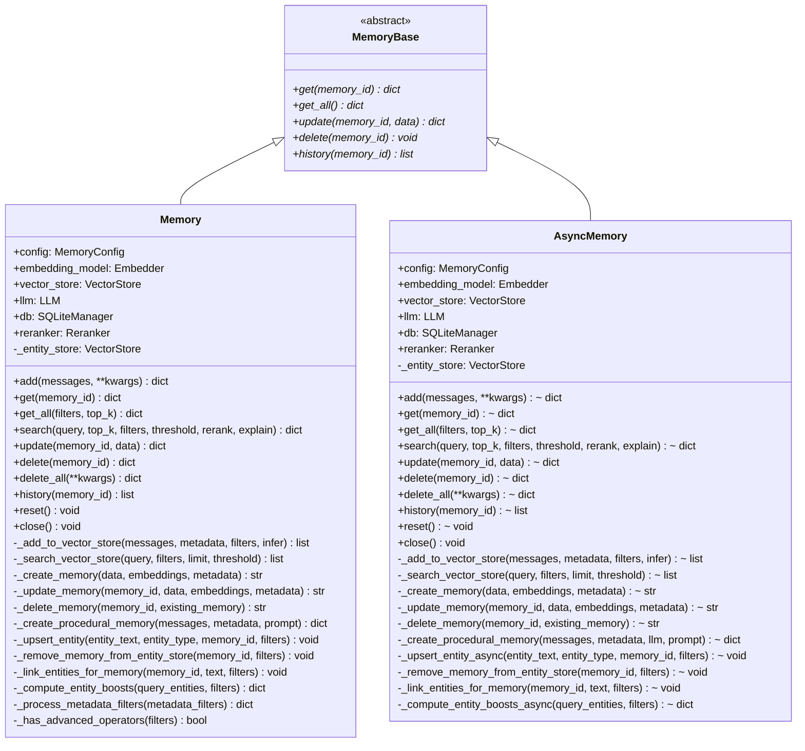

---

## 3. Memory 类核心组件

### 3.1 组件初始化与协作关系

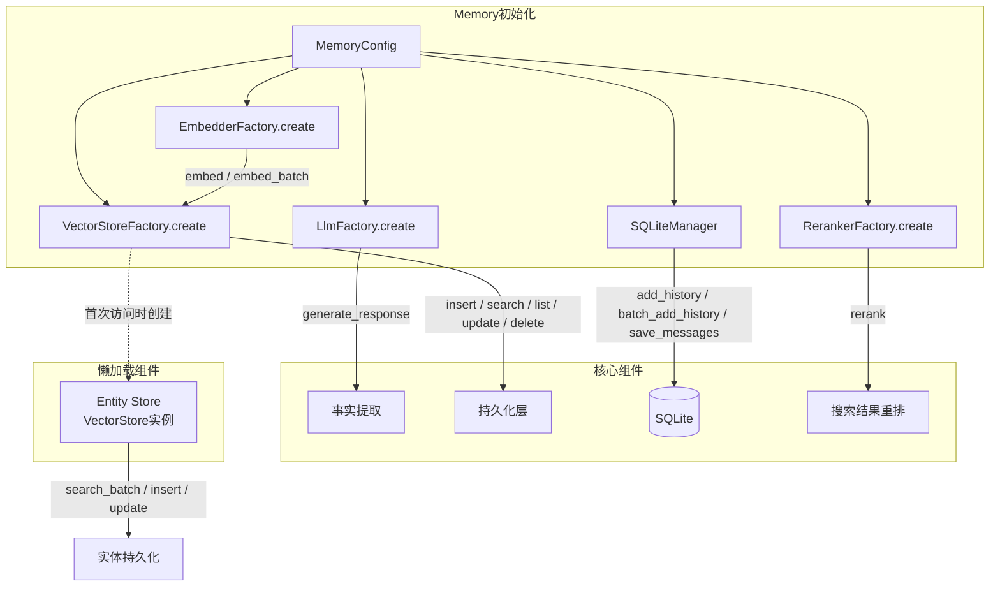

### 3.2 各组件职责

| 组件 | 类型 | 职责 |
|------|------|------|
| `embedding_model` | Embedder | 将文本转为向量，支持单条 `embed()` 和批量 `embed_batch()` |
| `vector_store` | VectorStore | 记忆的向量存储与检索，支持语义搜索和关键词搜索 |
| `llm` | LLM | 事实提取、程序性记忆生成，支持 `response_format` |
| `db` | SQLiteManager | 历史记录持久化、消息保存，线程安全（`threading.Lock`） |
| `reranker` | Reranker（可选） | 搜索结果重排序 |
| `entity_store` | VectorStore（懒加载） | 实体存储，独立集合 `{collection_name}_entities` |

---

## 4. add() 方法完整流程

### 4.1 V3 批量管线 8 阶段详解

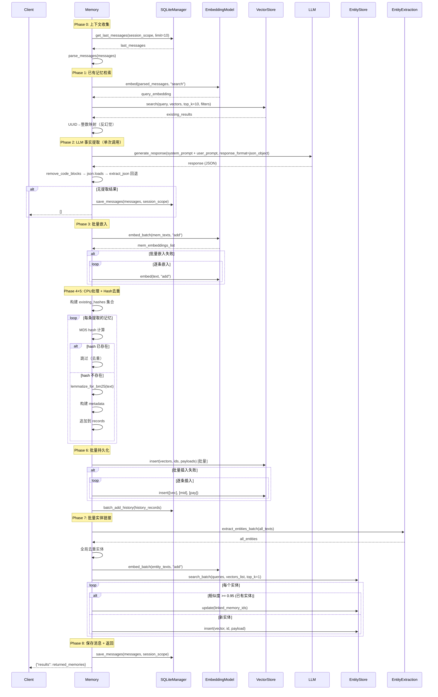

### 4.2 各阶段要点

| 阶段 | 名称 | 核心操作 | 容错策略 |
|------|------|----------|----------|
| Phase 0 | 上下文收集 | 获取最近 10 条消息 + 解析当前消息 | - |
| Phase 1 | 已有记忆检索 | 语义搜索 top_k=10，UUID 映射为整数 | - |
| Phase 2 | LLM 事实提取 | 单次 LLM 调用，`response_format=json_object` | LLM 失败返回空列表 |
| Phase 3 | 批量嵌入 | `embed_batch` 批量向量化 | 失败回退逐条嵌入 |
| Phase 4 | CPU 处理 | 构建 metadata、lemmatize | - |
| Phase 5 | Hash 去重 | MD5 hash 对比已有 + 批次内去重 | - |
| Phase 6 | 批量持久化 | 批量 insert + 批量 history | 批量失败回退逐条 |
| Phase 7 | 实体链接 | 批量提取→批量嵌入→批量搜索→批量写入 | 整体失败仅 warning |
| Phase 8 | 保存返回 | save_messages + 构建返回值 | - |

---

## 5. search() 方法完整流程

### 5.1 混合检索三路信号融合

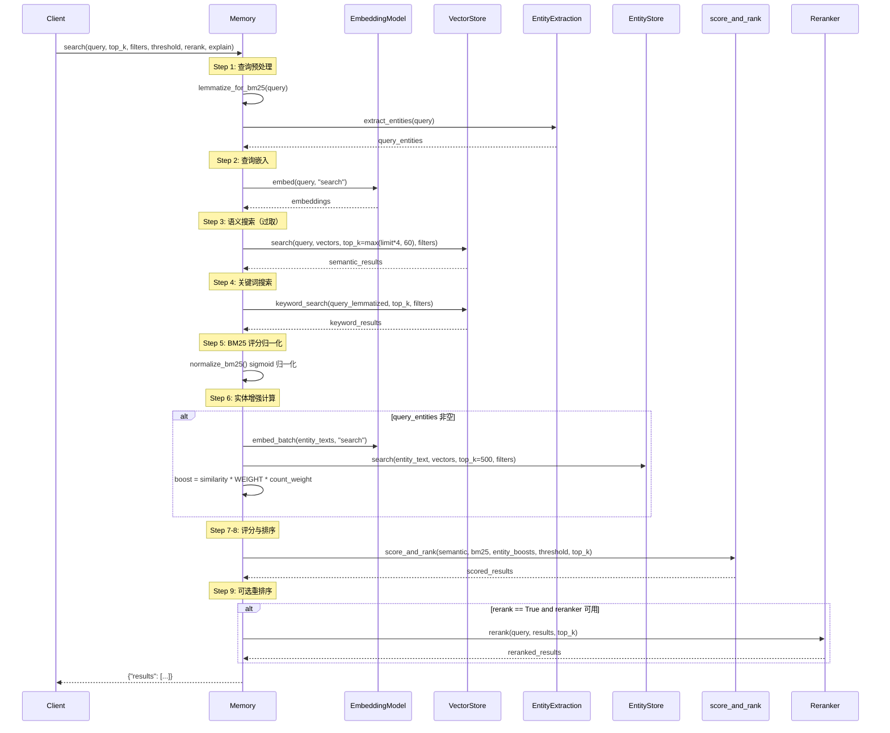

### 5.2 评分公式

```
combined = (semantic_score + bm25_score + entity_boost) / max_possible

其中:
- semantic_score: 向量余弦相似度 [0, 1]
- bm25_score: sigmoid 归一化后的 BM25 分数 [0, 1]
- entity_boost: similarity * ENTITY_BOOST_WEIGHT(0.5) * memory_count_weight [0, 0.5]
- max_possible: 1.0 + (has_bm25 ? 1.0 : 0) + (has_entity ? 0.5 : 0)

阈值门控: semantic_score < threshold 的候选直接排除
```

### 5.3 BM25 自适应参数

| 查询词数 | midpoint | steepness |
|----------|----------|-----------|
| <=3 | 5.0 | 0.7 |
| 4-6 | 7.0 | 0.6 |
| 7-9 | 9.0 | 0.5 |
| 10-15 | 10.0 | 0.5 |
| >15 | 12.0 | 0.5 |

---

## 6. 其他方法流程

### 6.1 get() 流程

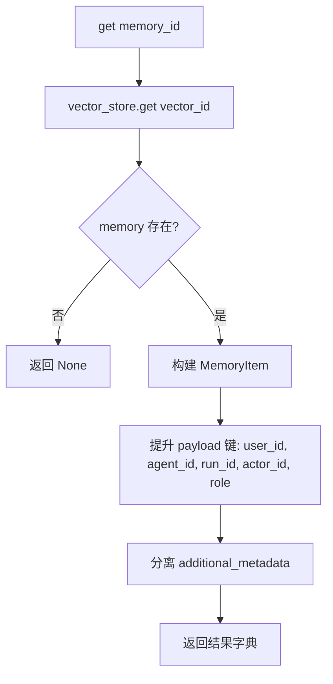

### 6.2 update() 流程

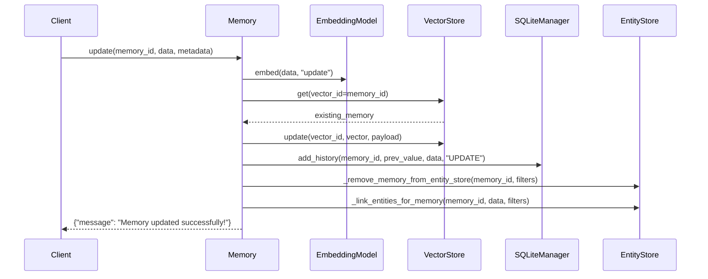

### 6.3 delete() 流程

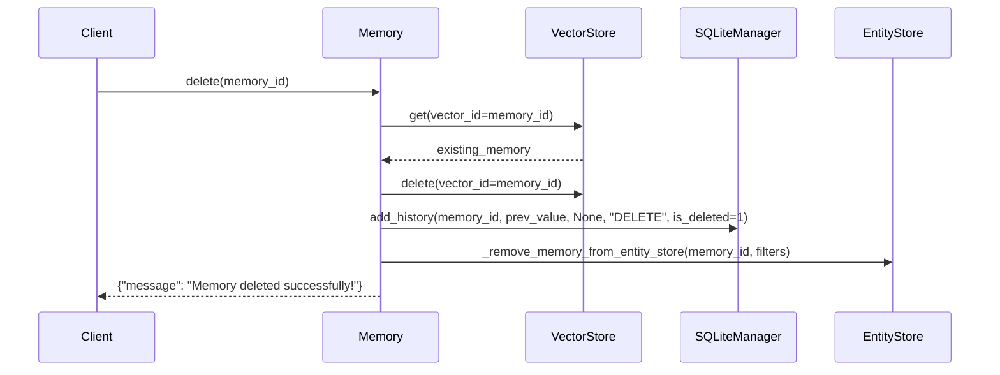

---

## 7. Entity Store 设计

### 7.1 架构概览

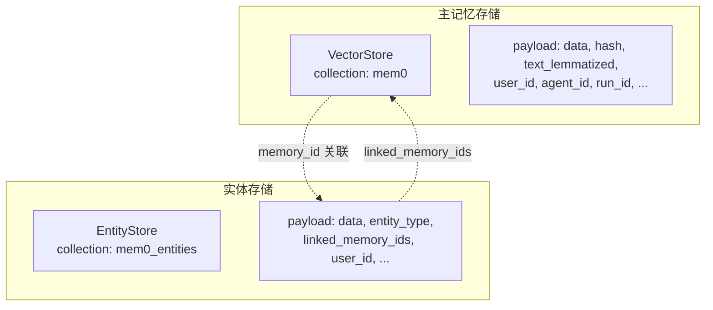

### 7.2 实体提取类型

| 类型 | 说明 | 示例 |
|------|------|------|
| PROPER | 专有名词序列 | "John Smith", "San Francisco" |
| QUOTED | 引号内文本 | "Machine Learning" |
| COMPOUND | 名词复合短语 | "machine_learning", "neural_network" |
| NOUN | 单个名词（回退） | "tennis" |

### 7.3 搜索增强：Entity Boost 计算

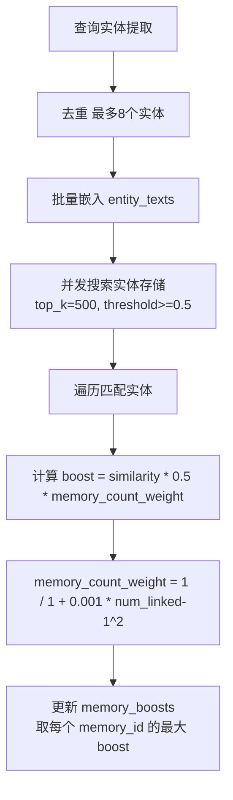

---

## 8. 同步 vs 异步差异

| 方面 | Memory（同步） | AsyncMemory（异步） |
|------|---------------|-------------------|
| 方法签名 | `def add(...)` | `async def add(...)` |
| I/O 调用 | 直接调用 | `await asyncio.to_thread(...)` |
| 实体 boost 并发 | `ThreadPoolExecutor(max_workers=4)` | `asyncio.Semaphore(4)` + `asyncio.gather` |
| delete_all | 逐条同步删除 | `asyncio.gather(*delete_tasks)` 并发删除 |
| 程序性记忆 | 直接调用 `self.llm.generate_response` | 支持 `llm` 参数（LangChain ChatModel） |
| reset | 同步清理 | 异步清理 + `gc.collect()` |

---

## 9. 关键设计决策

### 9.1 反幻觉设计

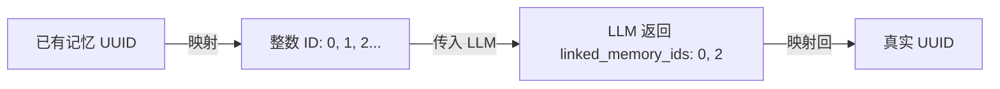

### 9.2 Hash 去重

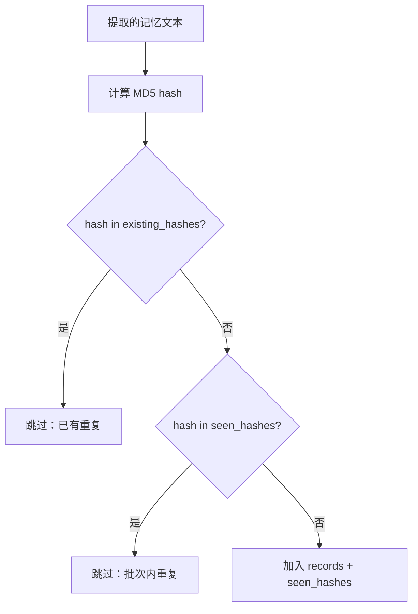

### 9.3 容错机制

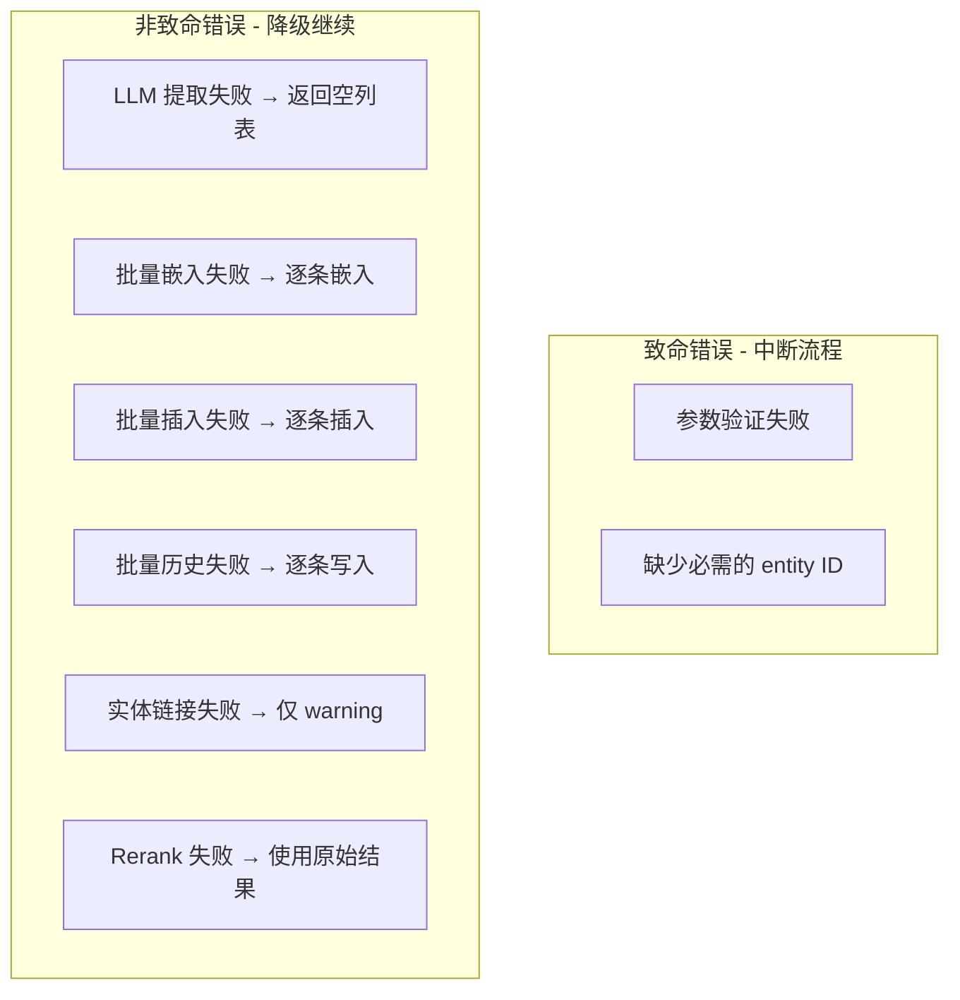

---

## 10. 工具函数详解

### 10.1 函数调用关系图

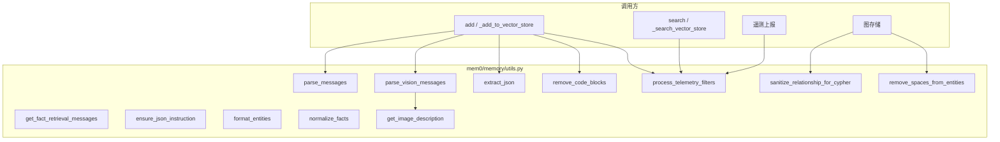

### 10.2 各函数详解

| 函数 | 用途 | 调用链 |
|------|------|--------|
| `parse_messages(messages)` | 将消息列表转为纯文本（`system: ...\nuser: ...`） | `add()` → `_add_to_vector_store()` |
| `parse_vision_messages(messages, llm, vision_details)` | 处理图片消息，调用 LLM 生成描述 | `add()` → `parse_vision_messages()` → `get_image_description()` |
| `extract_json(text)` | 从 LLM 返回文本中提取 JSON（先匹配代码块，再找 `{}`） | `_add_to_vector_store()` → `json.loads` 失败后 |
| `remove_code_blocks(content)` | 移除代码块标记和 `<think...>` 标签 | `_add_to_vector_store()` → `json.loads()` 前 |
| `get_image_description(image_obj, llm, vision_details)` | 调用 LLM 视觉能力获取图片描述 | `parse_vision_messages()` 内部 |
| `process_telemetry_filters(filters)` | 对实体 ID 进行 MD5 哈希脱敏 | 所有公开方法的遥测上报 |
| `sanitize_relationship_for_cypher(relationship)` | 关系文本 Cypher 查询安全化 | 图存储相关 |
| `remove_spaces_from_entities(entity_list)` | 实体文本标准化（小写+下划线） | 图存储相关 |
| `normalize_facts(raw_facts)` | 规范化 LLM 提取的事实（兼容 dict 格式） | 旧版管线 |
| `format_entities(entities)` | 格式化实体三元组为文本 | 图存储相关 |
