# Mem0 Reranker、Client、Config、Utils 子模块深度解析

---

## 一、Reranker 模块

### 1.1 模块概述

Reranker 模块负责对向量检索返回的候选文档进行二次排序（重排），以提升搜索结果的相关性精度。

**5 种 Reranker 对比：**

| 特性 | CohereReranker | SentenceTransformerReranker | HuggingFaceReranker | LLMReranker | ZeroEntropyReranker |
|------|---------------|---------------------------|--------------------|----|-------------------|
| **核心技术** | Cohere Rerank API | Cross-Encoder 交叉编码器 | Transformers 序列分类模型 | LLM 逐文档评分 | ZeroEntropy Rerank API |
| **默认模型** | `rerank-english-v3.0` | `cross-encoder/ms-marco-MiniLM-L-6-v2` | `BAAI/bge-reranker-base` | `gpt-4o-mini` | `zerank-1` |
| **运行方式** | 云端 API | 本地推理 | 本地推理 | 云端 API | 云端 API |
| **离线可用** | 否 | 是 | 是 | 否 | 否 |
| **容错策略** | 返回原序 + score=0.0 | 返回原序 + score=0.0 | 返回原序 + score=0.0 | 单文档失败 score=0.5 | 返回原序 + score=0.0 |

### 1.2 BaseReranker 基类设计

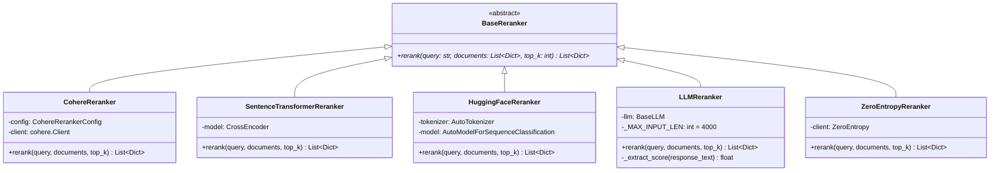

### 1.3 Reranker 在搜索流程中的位置

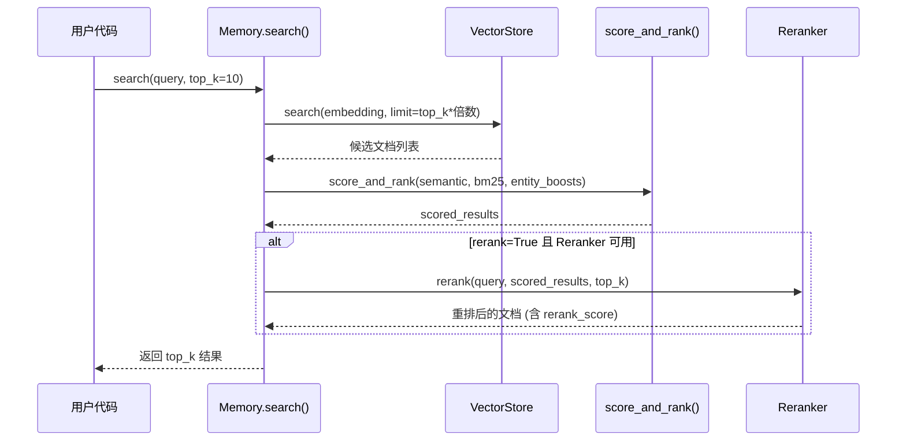

### 1.4 Reranker 配置层次

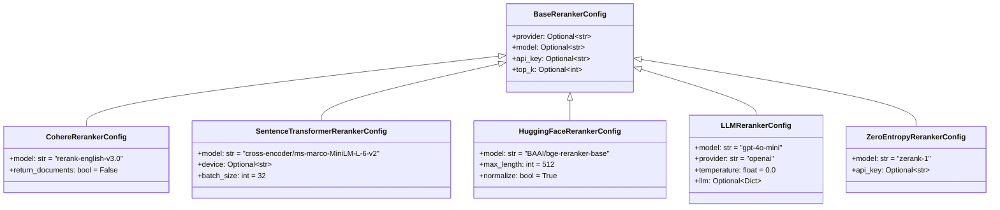

---

## 二、Client 模块

### 2.1 MemoryClient vs AsyncMemoryClient 架构对比

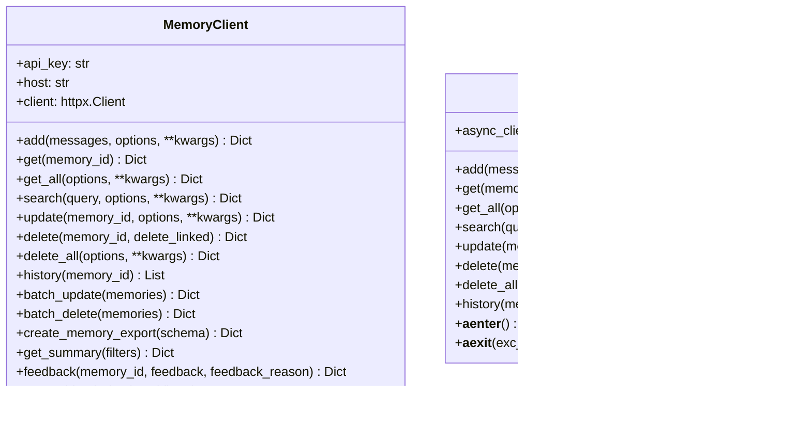

**关键差异：**

| 维度 | MemoryClient | AsyncMemoryClient |
|------|-------------|-------------------|
| HTTP 客户端 | `httpx.Client`（同步） | `httpx.AsyncClient`（异步） |
| 方法修饰 | 普通方法 | `async def` |
| 上下文管理 | 无 | `async with` 支持 |
| API Key 验证 | 使用 `self.client`（httpx） | 使用 `requests`（同步，初始化阶段） |

### 2.2 认证机制

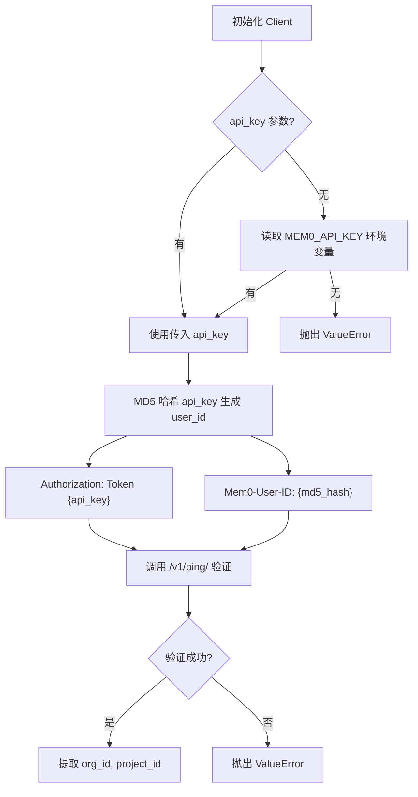

### 2.3 API 端点映射

| 方法 | HTTP | 端点 | 版本 |
|------|------|------|------|
| `add` | POST | `/v3/memories/add/` | v3 |
| `get` | GET | `/v1/memories/{id}/` | v1 |
| `get_all` | POST | `/v3/memories/` | v3 |
| `search` | POST | `/v3/memories/search/` | v3 |
| `update` | PUT | `/v1/memories/{id}/` | v1 |
| `delete` | DELETE | `/v1/memories/{id}/` | v1 |
| `delete_all` | DELETE | `/v1/memories/` | v1 |
| `history` | GET | `/v1/memories/{id}/history/` | v1 |
| `batch_update` | PUT | `/v1/batch/` | v1 |
| `batch_delete` | DELETE | `/v1/batch/` | v1 |
| `feedback` | POST | `/v1/feedback/` | v1 |

### 2.4 请求/响应处理流程

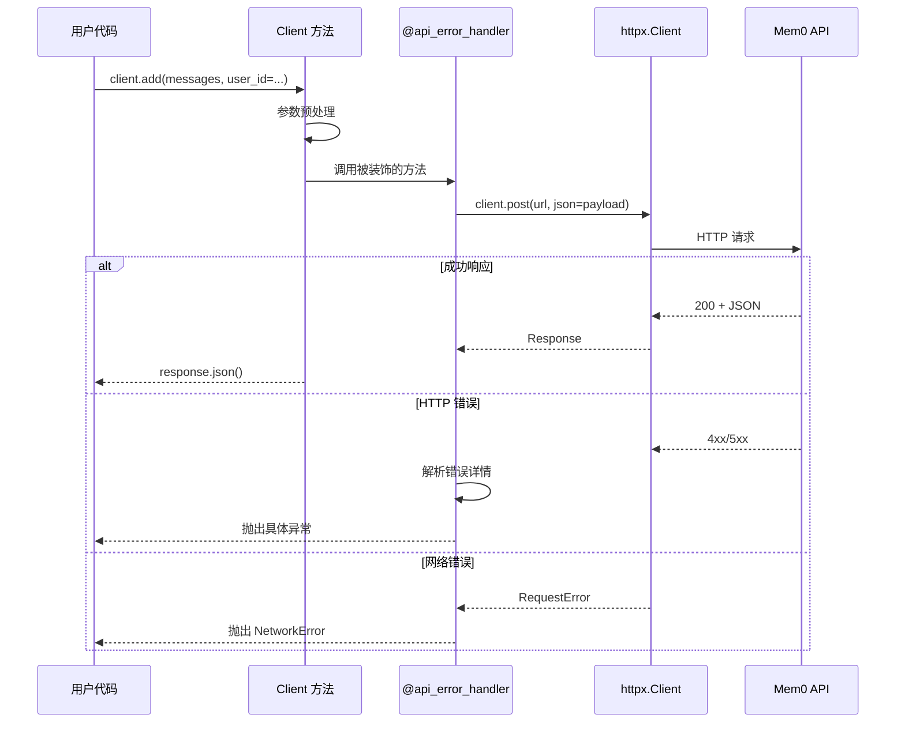

### 2.5 错误处理体系

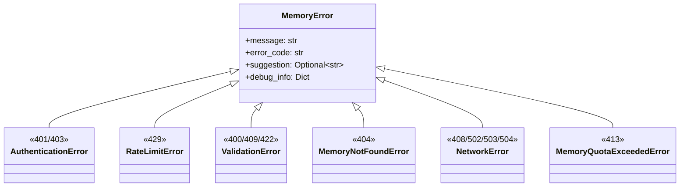

---

## 三、Config 模块

### 3.1 MemoryConfig 完整结构

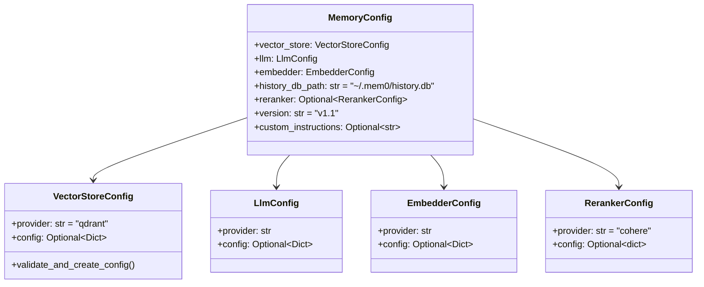

### 3.2 配置到实例的映射流程

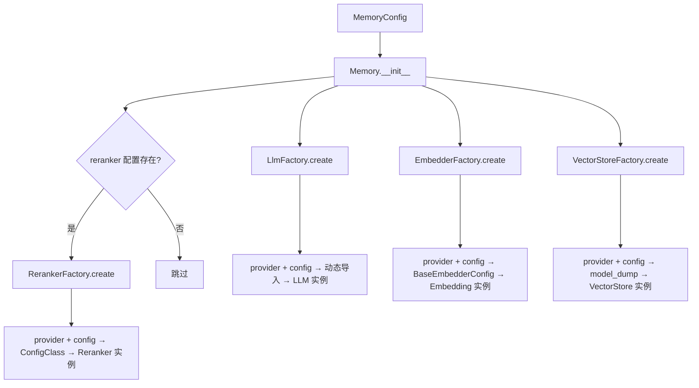

### 3.3 VectorStoreConfig 动态配置加载

```mermaid
flowchart TD
    A[VectorStoreConfig 初始化] --> B{provider 在白名单?}
    B -->|否| C[抛出 ValueError]
    B -->|是| D[动态导入 mem0.configs.vector_stores.{provider}]
    D --> E[获取对应 ConfigClass]
    E --> F{config 是 dict?}
    F -->|是| G{path 未设置且 ConfigClass 有 path?}
    G -->|是| H[自动设置 path = /tmp/{provider}]
    G -->|否| I[直接使用 config]
    F -->|否| J{config 是 ConfigClass 实例?}
    J -->|是| K[直接使用]
    J -->|否| L[抛出 ValueError]
    H --> M[ConfigClass **config]
    I --> M
    K --> M
```

---

## 四、Utils 模块

### 4.1 工厂模式详解

4 个工厂类统一管理 Provider 的实例化：

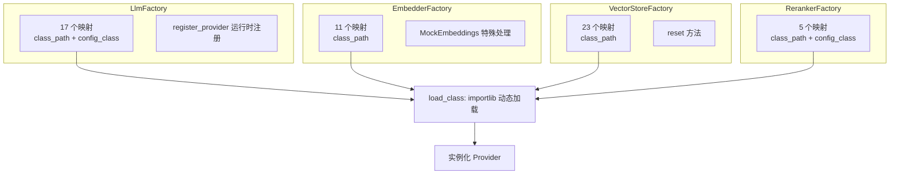

**各工厂注册表对比：**

| 工厂 | 注册表格式 | 配置转换 | 特殊逻辑 |
|------|-----------|---------|---------|
| `LlmFactory` | `(class_path, config_class)` 元组 | dict → ConfigClass; BaseLlmConfig → ProviderConfig | 支持 `register_provider()` |
| `EmbedderFactory` | `class_path` 字符串 | dict → `BaseEmbedderConfig` | `upstash_vector` + `enable_embeddings` → `MockEmbeddings` |
| `VectorStoreFactory` | `class_path` 字符串 | `model_dump()` → dict → `**kwargs` | `reset()` 方法重置实例 |
| `RerankerFactory` | `(class_path, config_class)` 元组 | dict → ConfigClass | 导入失败抛 `ImportError` |

### 4.2 实体提取算法

使用 **spaCy NLP** 管道，四阶段提取：

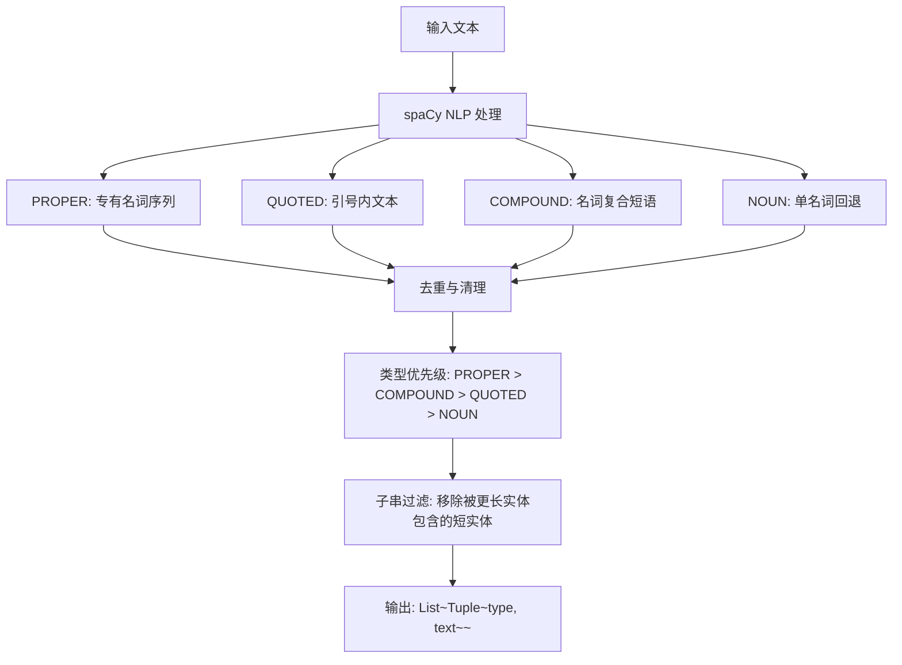

**过滤机制：**
- `_GENERIC_HEADS`：75 个过于通用的名词中心词
- `_NON_SPECIFIC_ADJ`：80+ 个过于模糊的形容词
- `_GENERIC_ENDINGS`：20+ 个通用尾部词
- `_has_artifacts()`：检测格式伪影

### 4.3 评分算法

采用**加性混合评分**，融合三个信号源：

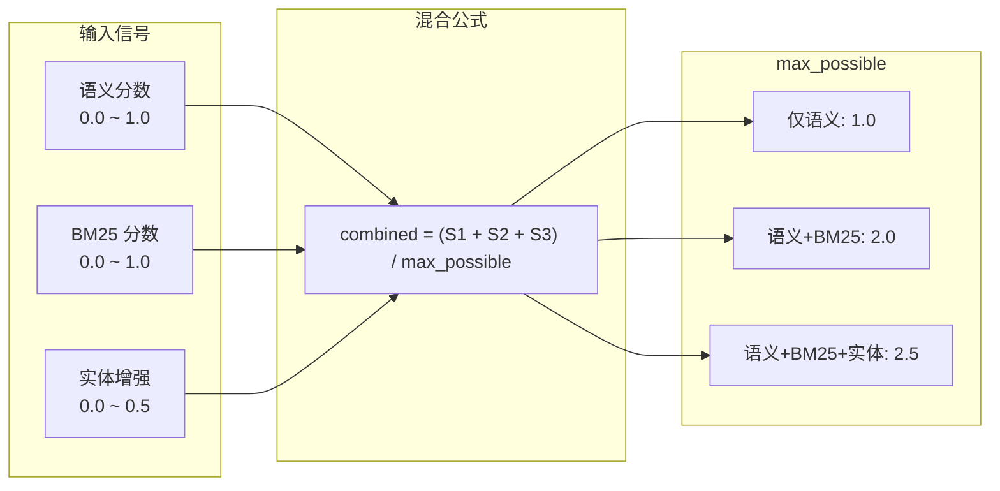

**BM25 归一化（Logistic Sigmoid）：**

```
normalized = 1 / (1 + exp(-steepness * (raw_score - midpoint)))
```

| 查询词数 | midpoint | steepness |
|----------|----------|-----------|
| <= 3 | 5.0 | 0.7 |
| 4-6 | 7.0 | 0.6 |
| 7-9 | 9.0 | 0.5 |
| 10-15 | 10.0 | 0.5 |
| > 15 | 12.0 | 0.5 |

### 4.4 词形还原

`lemmatize_for_bm25()` 为 BM25 全文搜索提供词形还原：

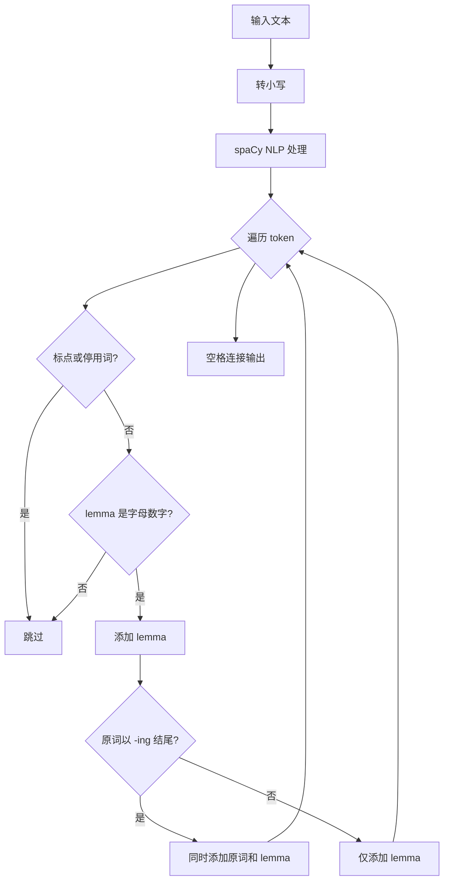

**示例：**
- `"attending meetings regularly"` → `"attend attending meeting meet regularly"`
- `"older memories"` → `"old memory"`

---

## 五、模块间协作关系

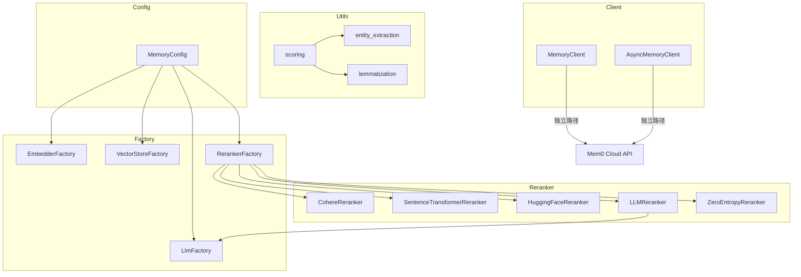

**关键依赖链：**
- `LLMReranker` 内部依赖 `LlmFactory` 创建 LLM 实例
- `scoring` 模块依赖 `lemmatization` 和 `entity_extraction`
- Client 模块完全独立于 OSS 模块，直接与云端 API 通信
