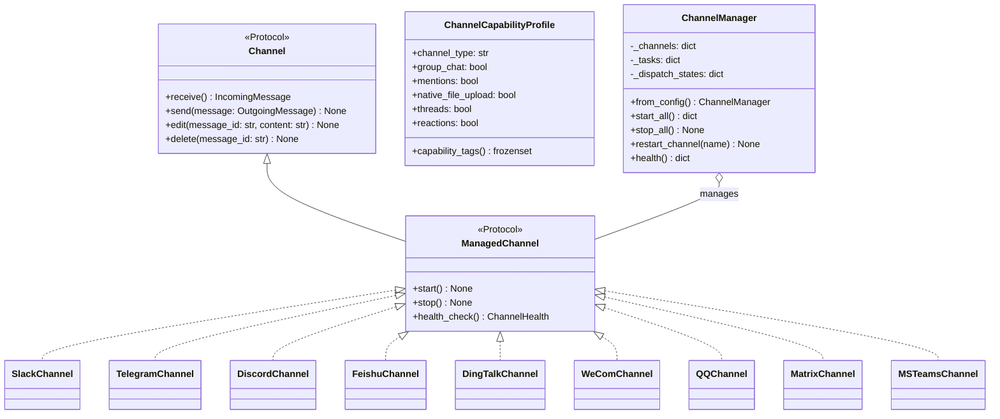
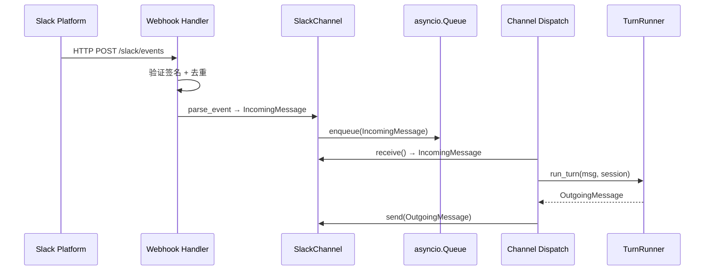
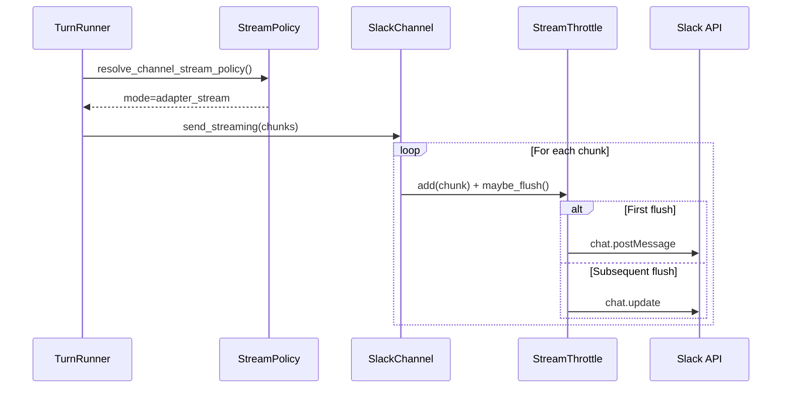
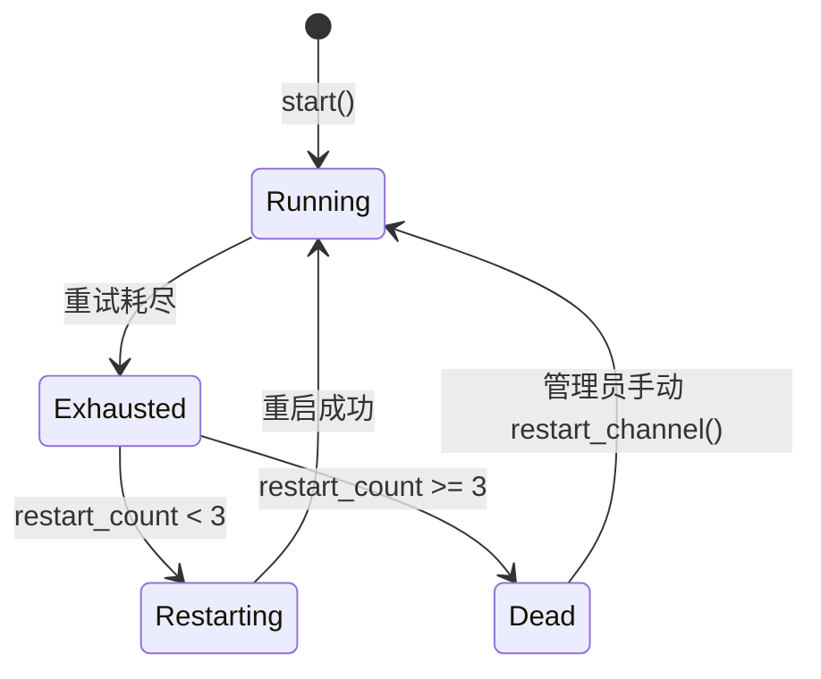

# OpenSquilla Channels 模块深度分析

## 一、模块概述

`opensquilla.channels` 是多平台消息适配层，将 Slack、Telegram、Discord、飞书、钉钉、企业微信、QQ、Matrix、MS Teams 等平台统一抽象为标准化的 `Channel` / `ManagedChannel` 协议。

## 二、Channel 适配器架构

## 三、消息流转流程

### 3.1 入站消息（Webhook 模式）

### 3.2 流式消息发送

## 四、平台适配器一览

| 适配器 | 传输方式 | 流式策略 | 文件上传 |
|---|---|---|---|
| SlackChannel | Webhook / Socket Mode | adapter_stream | 外部上传 |
| TelegramChannel | Polling / Webhook | adapter_stream | sendDocument |
| DiscordChannel | Gateway WebSocket | adapter_stream | multipart |
| FeishuChannel | Webhook / WebSocket | final_only | 图片/文件上传 |
| DingTalkChannel | Stream Mode | adapter_stream (Card) | 不支持 |
| WeComChannel | Webhook (AES) | final_only | media/upload |
| QQChannel | WebSocket (botpy) | final_only | 不支持 |
| MatrixChannel | WebSocket (nio) | adapter_stream | media.upload |
| MSTeamsChannel | Webhook (Bot Framework) | adapter_stream + 降级 | 不支持 |

## 五、调度状态机

## 六、设计模式

| 模式 | 应用 |
|---|---|
| **适配器模式** | 每个平台适配器适配为统一 Channel 协议 |
| **协议驱动设计** | `Channel` / `ManagedChannel` 为 Protocol，非抽象基类 |
| **策略模式** | 流式策略、访问策略、能力声明 |
| **注册表模式** | `ChannelRegistration` + `discover_all()` + `entry_points` |
| **生产者-消费者** | `asyncio.Queue` 解耦入站/出站 |
| **熔断器** | `FloodStrikeBackoff` 429 洪泛退避 |
| **节流器** | `StreamThrottle` 序列化并发编辑 |
