# OpenSquilla 架构设计文档 (Design Document)

> 版本: 0.3.1 | 生成日期: 2026-06-09

## 1. 架构总览

OpenSquilla 采用 **微内核 + 分层解耦 + 事件驱动** 的架构风格。核心是一个统一的 `TurnRunner` 对话循环，所有入口（Web UI、CLI、聊天通道）共享同一执行路径。

### 1.1 分层架构图

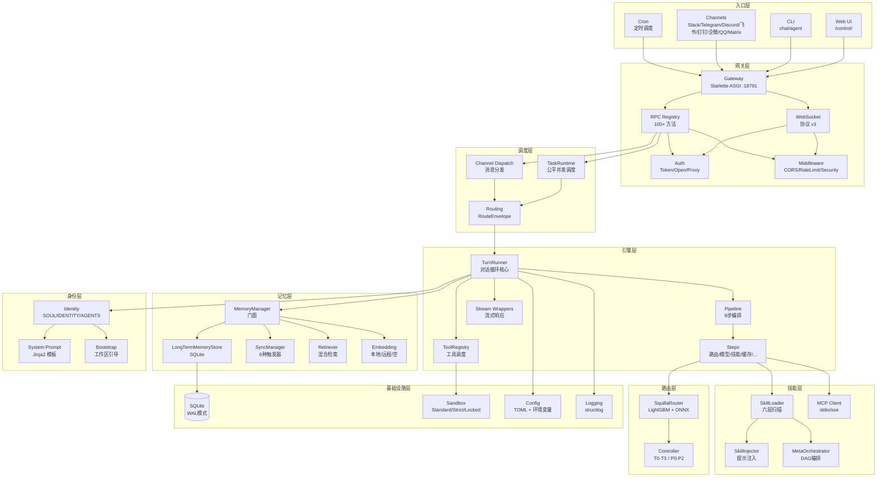

### 1.2 架构原则

| 原则 | 体现 |
|---|---|
| **统一循环** | 所有入口共享同一 `TurnRunner`，工具调度、重试、决策日志行为一致 |
| **本地优先** | 路由分类和嵌入在设备端完成，用户提示不离开本地 |
| **渐进降级** | 路由不可用→默认模型；嵌入不可用→FTS-only；通道断开→状态机恢复 |
| **协议驱动** | Channel/ManagedChannel/InboundTransport 均为 Protocol，非抽象基类 |
| **事件驱动** | Session 事件通过 EventBridge 广播，支持断线重放 |
| **预算控制** | 上下文预算、技能注入预算、工作区文件预算 |

---

## 2. 核心流程设计

### 2.1 对话轮次完整流程

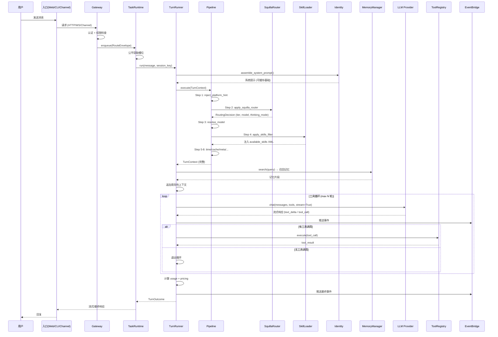

### 2.2 模型路由决策流程

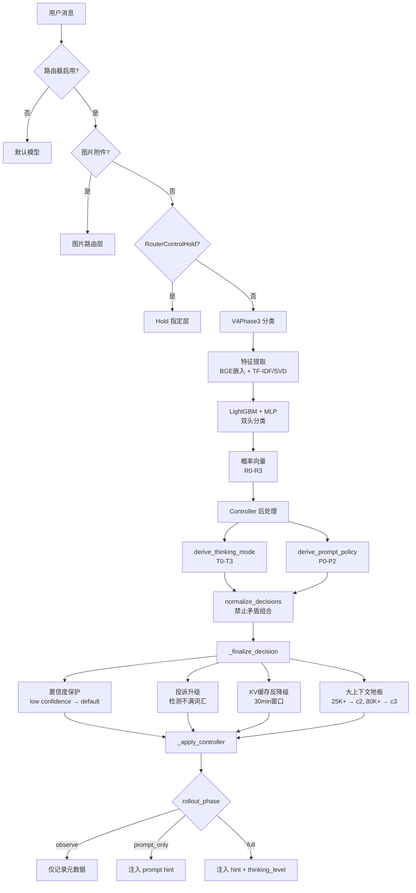

### 2.3 记忆检索流程

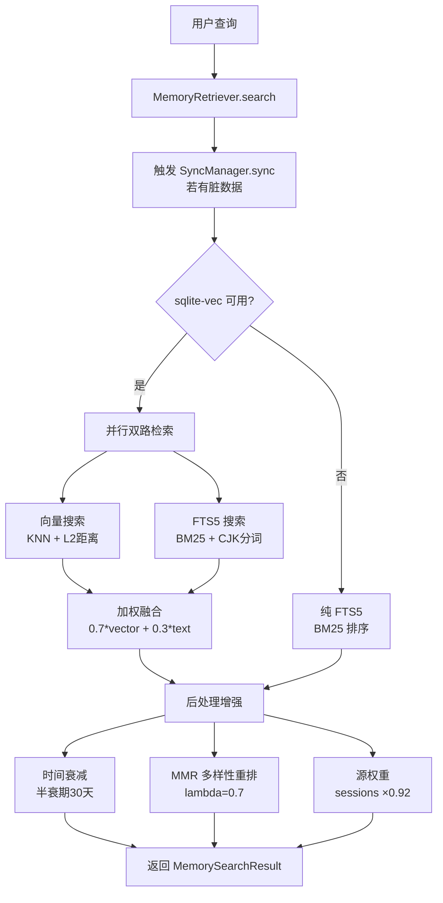

### 2.4 Meta-Skill DAG 编排流程

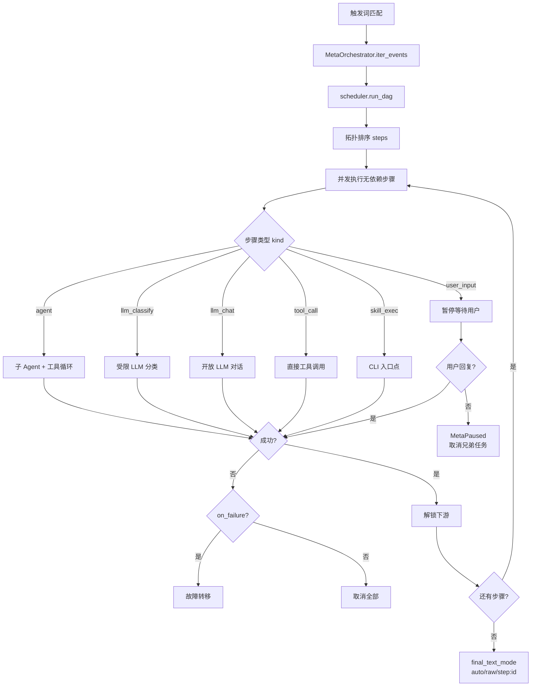

---

## 3. 模块设计

### 3.1 Engine 模块

**职责**: 对话轮次执行的完整生命周期管理

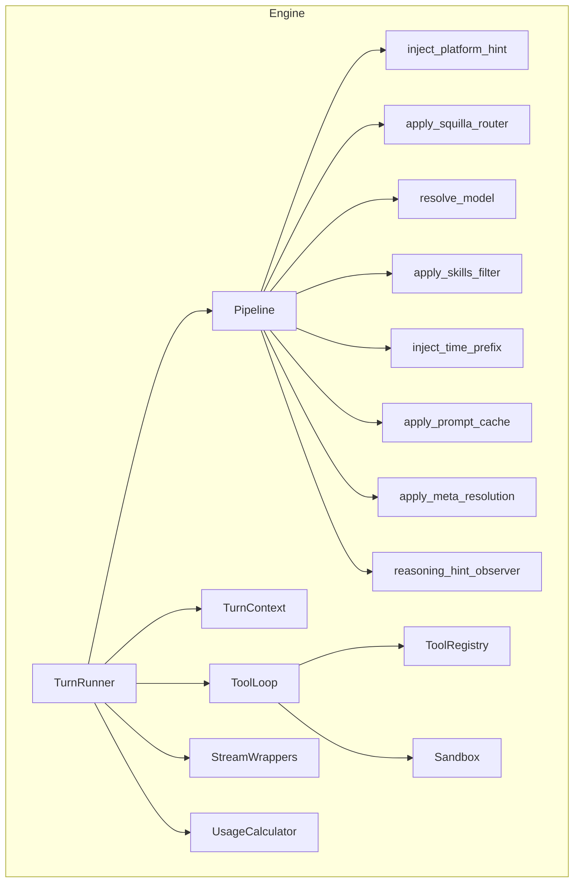

**关键设计决策**:
- Pipeline 模式：步骤可插拔，新增步骤无需修改 TurnRunner
- 工具循环上限：防止无限工具调用
- 流式优先：TurnRunner 返回 `Stream[TurnEvent]`，支持实时推送

### 3.2 Gateway 模块

**职责**: ASGI 应用入口、RPC 分发、Session 管理

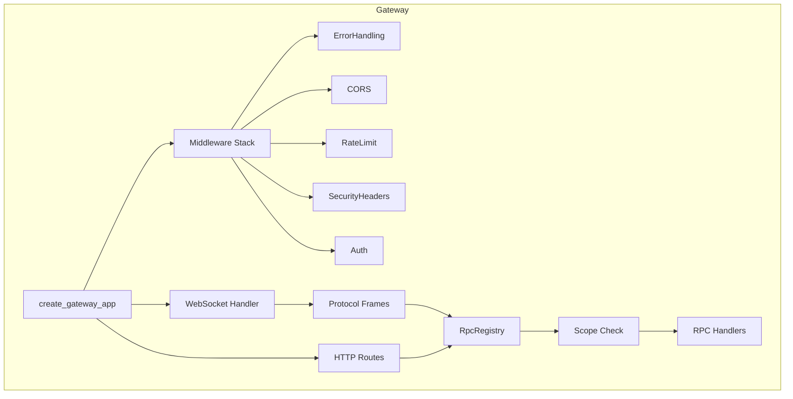

**关键设计决策**:
- 中间件管道：每个中间件独立关注点，可插拔
- RPC 注册表：启动后锁定，防止运行时动态添加
- Session epoch：乐观并发控制，防止过期帧

### 3.3 Channels 模块

**职责**: 多平台消息适配

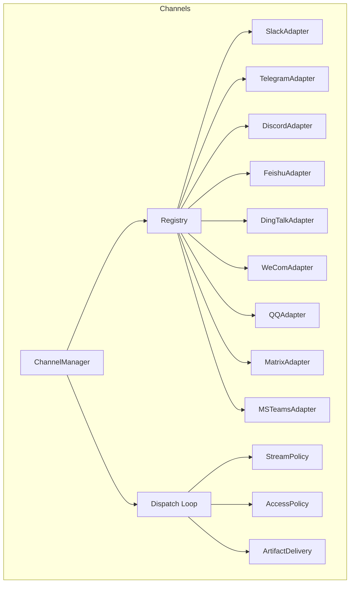

**关键设计决策**:
- Protocol 而非 ABC：适配器无需显式继承
- 能力声明式：`ChannelCapabilityProfile` 运行时查询
- 三种流式策略：适配不同平台能力

### 3.4 SquillaRouter 模块

**职责**: 本地模型路由分类

**关键设计决策**:
- 设备端分类：用户提示不离开本地
- 双头分类：LightGBM 主头 + MLP 辅助头
- 渐进式发布：observe → prompt_only → full
- 四重后处理：置信度保护 + 投诉升级 + 反降级 + 大上下文地板

### 3.5 Memory 模块

**职责**: 持久化记忆存储与检索

**关键设计决策**:
- 混合检索：向量(0.7) + FTS5(0.3) 加权融合
- 降级链：本地嵌入 → 远程嵌入 → FTS-only
- 事件驱动同步：6种触发器，避免全量扫描
- Dream 巩固：证据门控，防止低质量记忆提升

---

## 4. 并发与调度设计

### 4.1 TaskRuntime 公平调度

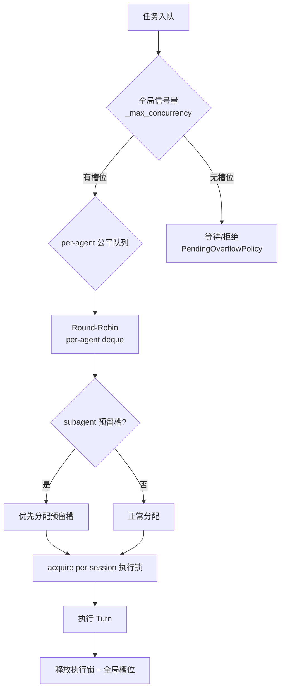

### 4.2 Session 锁层级

| 锁类型 | 粒度 | 用途 |
|---|---|---|
| 全局信号量 | 全局 | 限制最大并发 Turn 数 |
| per-agent RR deque | per-agent | 公平调度不同 agent |
| subagent 预留槽 | per-session | 防止子代理饿死 |
| per-session 执行锁 | per-session | 同一 session 串行执行 |
| per-session 写锁 | per-session | 写操作互斥 |

### 4.3 通道调度状态机

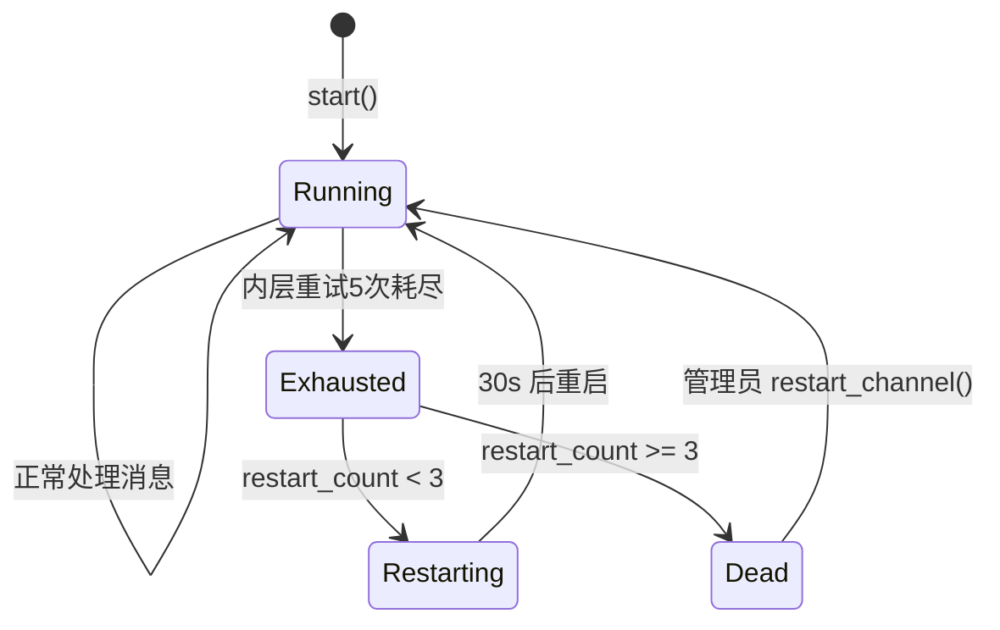

---

## 5. 安全设计

### 5.1 认证与授权

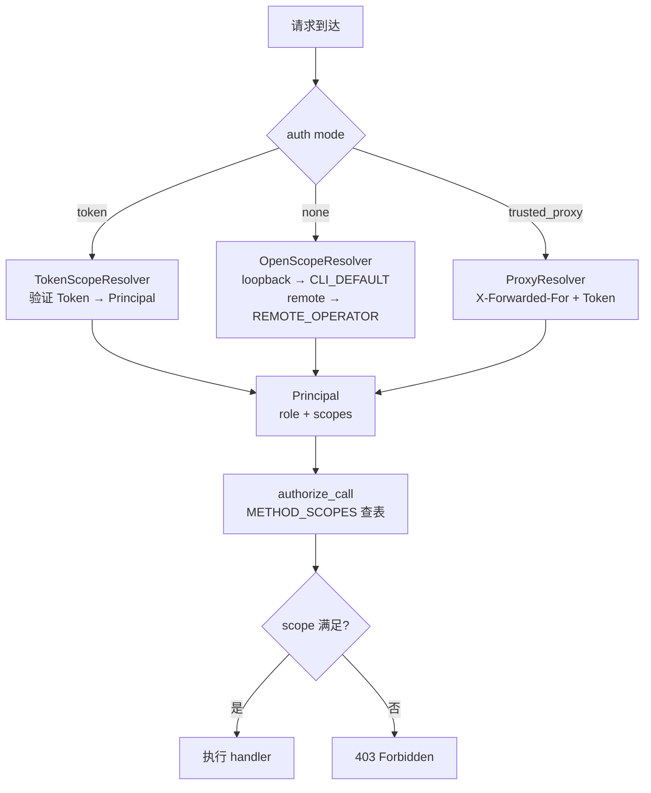

### 5.2 沙箱分层

| 层级 | 策略 | 说明 |
|---|---|---|
| Standard | 默认 | 允许大部分操作，敏感操作需审批 |
| Strict | 受限 | 限制文件系统和网络访问 |
| Locked | 锁定 | 最小权限，仅允许白名单工具 |

### 5.3 注入防护

- 技能元数据 XML 转义，防止逃逸 `<available_skills>` 边界
- 工具结果 XML 转义，防止 prompt injection
- 工作区文件 `scan_for_injection` 扫描
- SSRF 防护：web fetch 限制目标

---

## 6. 数据流设计

### 6.1 消息处理主数据流

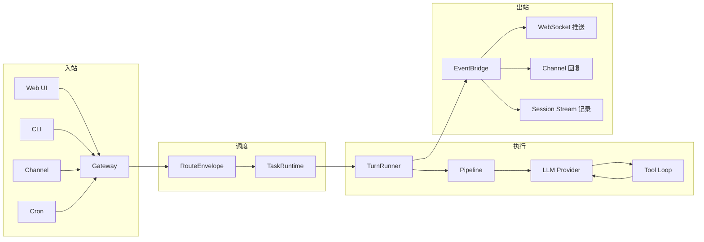

### 6.2 事件重放数据流

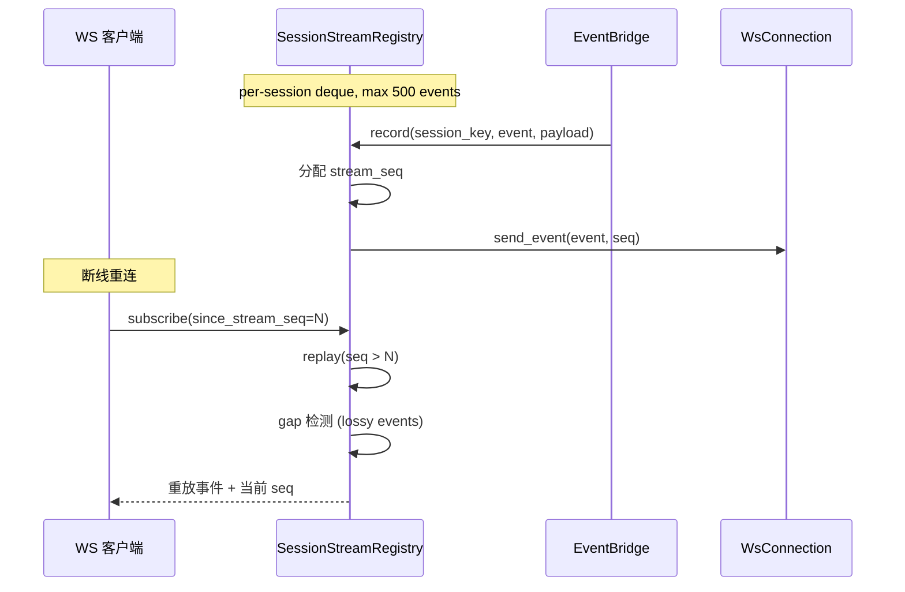

---

## 7. 设计模式汇总

| 模式 | 应用位置 | 说明 |
|---|---|---|
| **Pipeline** | Engine Steps | 步骤可插拔编排 |
| **Strategy** | 路由策略 / 嵌入提供者 / 认证策略 / 流式策略 / 溢出策略 | 运行时切换行为 |
| **Registry** | RPC / Channel / Tool / Agent Task | 统一发现与构建 |
| **Observer/Pub-Sub** | EventBridge / SubscriptionManager | 解耦事件广播 |
| **Middleware Pipeline** | Gateway 中间件栈 | 横切关注点可插拔 |
| **Envelope** | RouteEnvelope | 统一不同来源元数据 |
| **Adapter** | Channel 适配器 | 平台差异适配 |
| **Protocol-Oriented** | Channel / ManagedChannel / InboundTransport | 接口契约 |
| **Facade** | MemoryManager / ServiceContainer | 简化复杂子系统 |
| **State Machine** | Channel 调度 / Session 生命周期 | 状态转换管理 |
| **Circuit Breaker** | FloodStrikeBackoff | 防止雪崩 |
| **Backpressure** | TaskQueueFullError / ChannelInFlightSet | 过载保护 |
| **Fair Scheduling** | TaskRuntime per-agent RR | 公平并发 |
| **Optimistic Concurrency** | Session epoch | 无锁并发控制 |
| **Lazy Load + Double-Check Lock** | 路由模型 / 嵌入模型 | 延迟加载 + 线程安全 |
| **Snapshot Cache** | Skills JSON 快照 | 加速冷启动 |
| **Layered Override** | Skills 六层 / Identity 多来源 | 渐进定制 |
| **DAG Scheduling** | Meta-Skill 步骤图 | 并行编排 |
| **Failover** | Meta-Skill on_failure | 自动故障转移 |
| **Pause/Resume** | Meta-Skill user_input | CAS 原子恢复 |
| **Evidence-Gated** | Dream 记忆巩固 | 质量门控 |
| **Budget Control** | 上下文 / 技能注入 / 工作区文件 | 资源限制 |

---

## 8. 部署架构

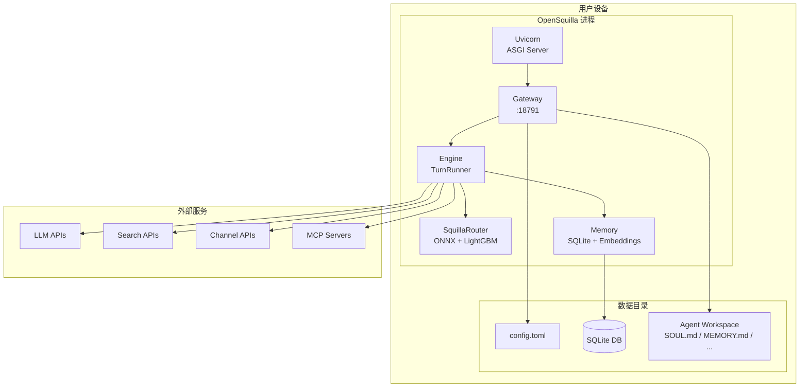

---

## 附录：模块分析文档索引

| 文档 | 路径 |
|---|---|
| Engine 模块分析 | [engine.md](engine.md) |
| Gateway 模块分析 | [gateway.md](gateway.md) |
| Channels 模块分析 | [channels.md](channels.md) |
| Router & Memory 模块分析 | [router-memory.md](router-memory.md) |
| Skills, Identity & MCP 模块分析 | [skills-identity-mcp.md](skills-identity-mcp.md) |
| 项目规格说明 | [spec.md](spec.md) |
