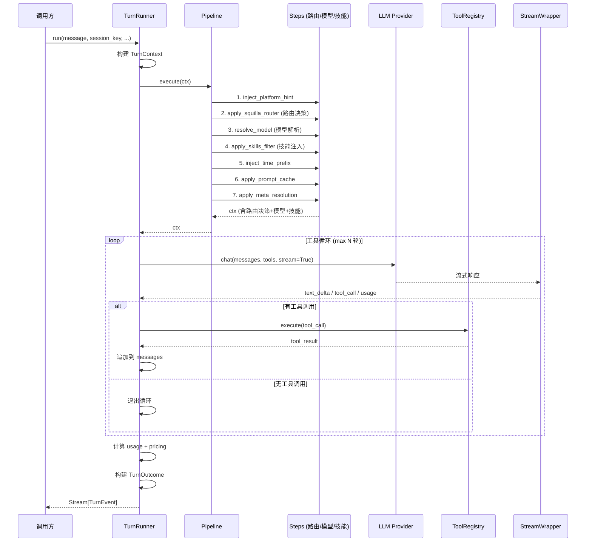
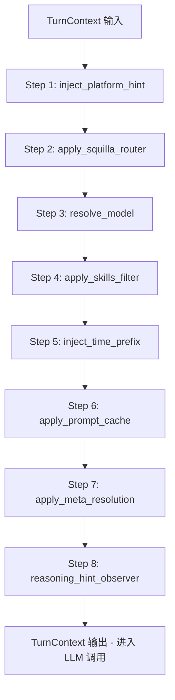
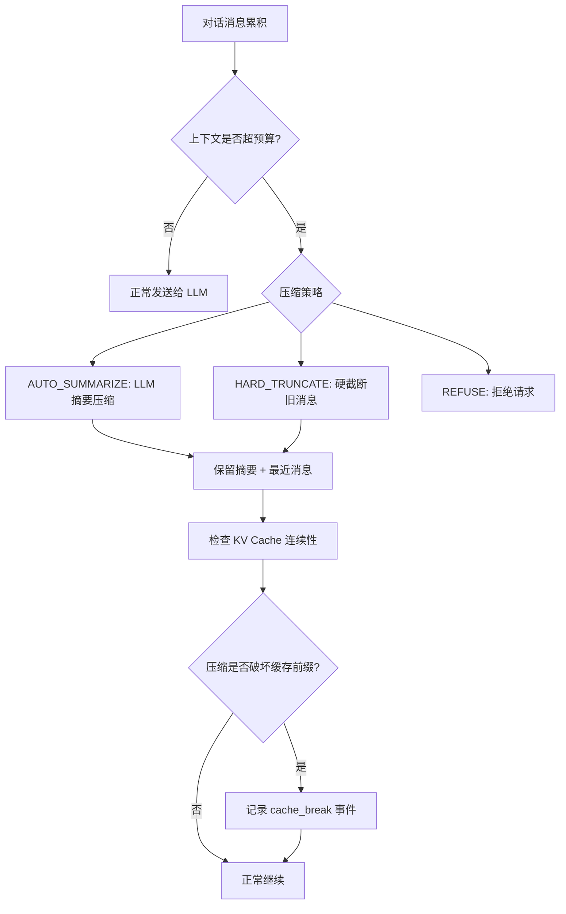
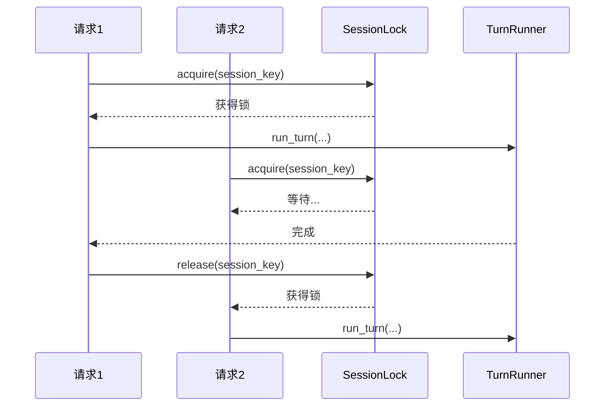
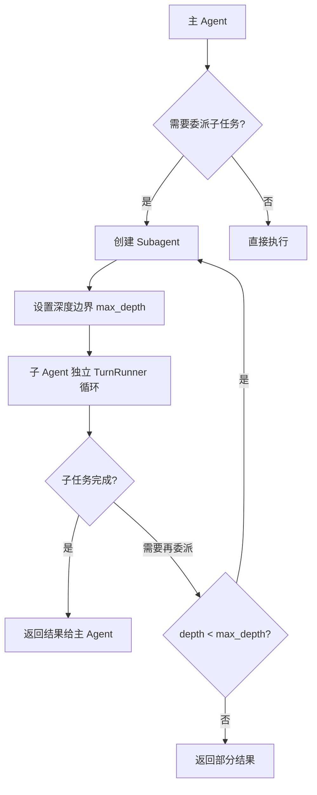

# OpenSquilla Engine 模块深度分析

## 一、模块概述

`opensquilla.engine` 是 OpenSquilla 的核心运行时引擎，负责管理对话轮次（Turn）的完整生命周期，包括上下文构建、模型路由、工具调度、流式响应、压缩与回退等关键流程。

### 目录结构

| 子目录/文件 | 职责 |
|---|---|
| `pipeline.py` | Pipeline 编排：按顺序执行 steps |
| `steps/` | Pipeline 步骤集合（路由、模型解析、技能过滤等） |
| `hooks/` | 钩子机制（默认钩子、类型定义） |
| `turn_runner/` | TurnRunner 核心：输入阶段、附件阶段、上下文、结果 |
| `agent.py` | Agent 管理（251KB，核心大文件） |
| `runtime.py` | 运行时入口（231KB，核心大文件） |
| `context.py` | TurnContext 上下文对象 |
| `context_budget.py` | 上下文预算管理 |
| `compaction_control.py` | 上下文压缩控制 |
| `fallback.py` | 模型回退策略 |
| `history.py` | 对话历史管理 |
| `session_lock.py` | 会话级锁 |
| `subagent.py` | 子代理支持 |
| `stream_wrappers.py` | 流式响应包装器 |
| `tool_result_store.py` | 工具结果存储 |
| `usage.py` | Token 用量统计 |
| `outcome.py` | Turn 结果定义 |
| `pricing.py` | 定价计算 |
| `thinking.py` | 推理模式控制 |
| `turn_control.py` | Turn 控制流 |
| `turn_policy.py` | Turn 策略 |

## 二、核心类/函数列表

| 类/函数 | 文件 | 职责 |
|---|---|---|
| `TurnRunner` | `turn_runner/harness.py` | 对话轮次执行器，协调 pipeline、工具循环、流式输出 |
| `TurnContext` | `context.py` | 每轮对话的上下文对象，携带元数据、路由决策、工具注册表等 |
| `Pipeline` | `pipeline.py` | 步骤编排器，按顺序执行 steps |
| `apply_squilla_router()` | `steps/squilla_router.py` | Pipeline Step 2：模型路由决策 |
| `resolve_model()` | `steps/resolve_model.py` | Pipeline Step：模型解析 |
| `apply_skills_filter()` | `steps/skills_filter.py` | Pipeline Step：技能过滤与注入 |
| `inject_platform_hint()` | `steps/inject_platform_hint.py` | Pipeline Step：平台提示注入 |
| `inject_time_prefix()` | `steps/inject_time_prefix.py` | Pipeline Step：时间前缀注入 |
| `apply_meta_resolution()` | `steps/meta_resolution.py` | Pipeline Step：Meta-Skill 解析 |
| `apply_prompt_cache()` | `steps/prompt_cache.py` | Pipeline Step：提示缓存策略 |
| `InputStage` | `turn_runner/input_stage.py` | 输入预处理阶段 |
| `AttachmentStage` | `turn_runner/attachment_stage.py` | 附件处理阶段 |
| `TurnOutcome` | `turn_runner/outcome.py` | 轮次结果封装 |

## 三、TurnRunner 工作流程

## 四、Pipeline 步骤流程

## 五、上下文管理机制

## 六、会话锁机制

## 七、Agent 与 Subagent

## 八、设计模式

| 模式 | 应用 |
|---|---|
| **Pipeline 模式** | Steps 按顺序执行，每个步骤修改 TurnContext |
| **策略模式** | 路由策略（V4Phase3 / Unavailable）、压缩策略、回退策略 |
| **观察者模式** | Hooks 机制，步骤执行前后触发回调 |
| **锁模式** | SessionLock 保证同一会话的 Turn 串行执行 |
| **流式迭代器** | TurnRunner 返回 Stream[TurnEvent]，支持实时推送 |
| **递归委派** | Subagent 通过深度边界控制递归 |
