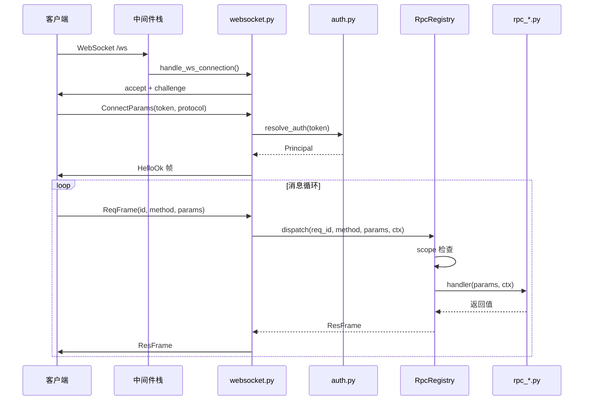
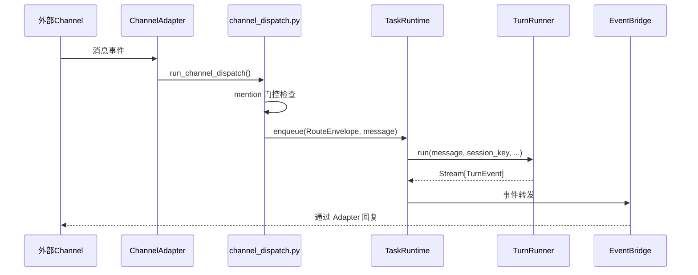
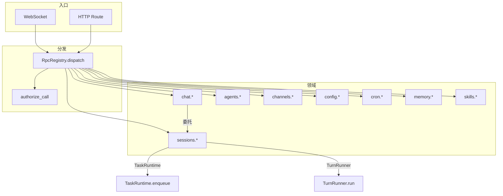
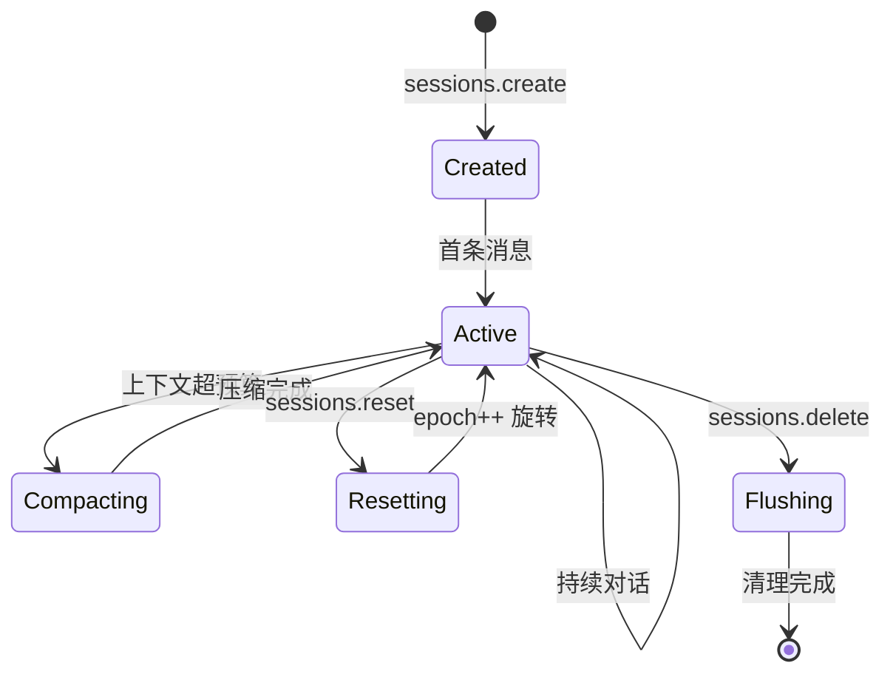

# OpenSquilla Gateway 模块深度分析

## 一、模块概述

`opensquilla.gateway` 是整个系统的网关层，承担 ASGI 应用入口、WebSocket 连接管理、RPC 分发、Session 生命周期管理、Channel 消息调度、认证鉴权、配置管理等核心职责。

| 层次 | 模块 | 职责 |
|---|---|---|
| **应用入口层** | `app.py`, `boot.py`, `control_ui.py` | ASGI 应用工厂、启动编排、Control UI |
| **协议层** | `protocol.py`, `websocket.py` | WebSocket 帧定义、连接管理 |
| **RPC 层** | `rpc/registry.py`, `rpc_*.py` | RPC 方法注册、分发 |
| **Session 层** | `session_lifecycle.py`, `session_services.py`, `session_streams.py`, `session_events.py` | Session 生命周期与事件 |
| **调度层** | `task_runtime.py`, `channel_dispatch.py`, `routing.py` | 任务调度、Channel 分发 |
| **基础设施层** | `auth.py`, `middleware.py`, `config.py`, `scopes.py`, `llm_runtime.py`, `pidlock.py` | 认证、中间件、配置、权限 |

## 二、核心类/函数列表

| 类/函数 | 文件 | 职责 |
|---|---|---|
| `create_gateway_app()` | `app.py` | ASGI 应用工厂 |
| `ServiceContainer` | `boot.py` | 服务容器，持有所有初始化服务 |
| `build_services()` | `boot.py` | 异步初始化所有服务 |
| `start_gateway_server()` | `boot.py` | 完整启动序列 |
| `ReqFrame / ResFrame / EventFrame` | `protocol.py` | WebSocket 协议帧 |
| `WsConnection` | `websocket.py` | WebSocket 连接封装 |
| `ConnectionRegistry` | `websocket.py` | 全局连接注册表 |
| `SubscriptionManager` | `websocket.py` | 三层订阅管理 |
| `RpcRegistry` | `rpc/registry.py` | RPC 方法注册表 + 分发器 |
| `RpcContext` | `rpc/registry.py` | per-request 执行上下文 |
| `TaskRuntime` | `task_runtime.py` | 进程内任务运行时，核心调度器 |
| `RouteEnvelope` | `routing.py` | 规范路由数据信封 |
| `Principal` | `auth.py` | 不可变身份凭证 |
| `GatewayConfig` | `config.py` | Pydantic Settings 主配置类 |
| `EventBridge` | `event_bridge.py` | 解耦的事件广播器 |
| `SessionStreamRegistry` | `session_streams.py` | 内存事件重放缓冲区 |

## 三、请求处理流程

### 3.1 WebSocket 请求处理

### 3.2 Channel 消息分发

## 四、RPC 调用关系图

## 五、Session 生命周期

## 六、设计模式

| 模式 | 应用 |
|---|---|
| **工厂模式** | `create_gateway_app()`, `build_services()` |
| **注册表模式** | `RpcRegistry`, `ConnectionRegistry`, `AgentTaskRegistry` |
| **发布-订阅模式** | `SubscriptionManager`, `EventBridge` |
| **中间件管道** | ErrorHandling → CORS → RateLimit → SecurityHeaders → Auth |
| **信封模式** | `RouteEnvelope` 统一不同来源的请求元数据 |
| **策略模式** | `TokenScopeResolver` / `OpenScopeResolver` 认证策略 |
| **公平调度** | `TaskRuntime._acquire_fair_slot()` per-agent RR |
| **背压模式** | `TaskQueueFullError`, `_ChannelInFlightSet` |
| **乐观并发** | Session epoch 机制 |
