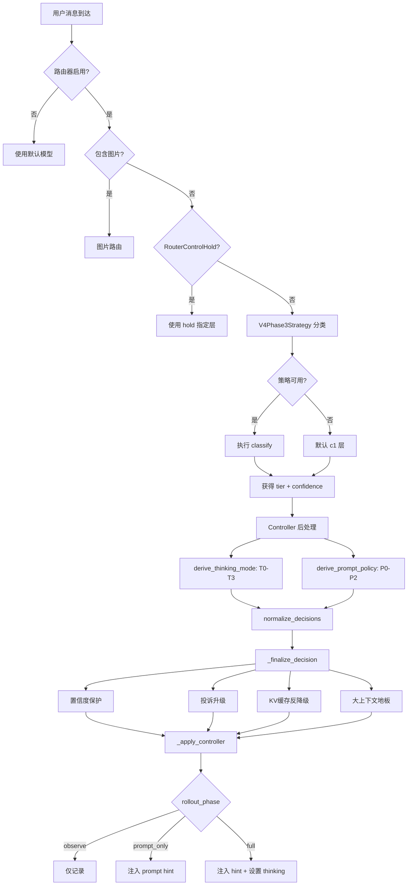
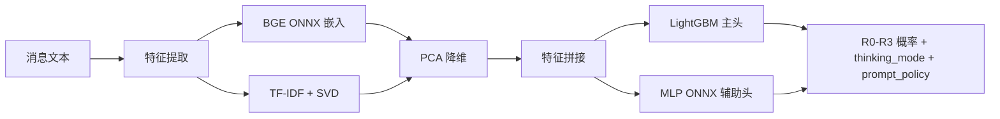
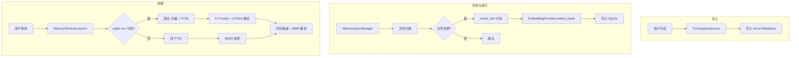

# OpenSquilla SquillaRouter & Memory 模块深度分析

## 一、SquillaRouter 模块概述

SquillaRouter 是 OpenSquilla 的智能模型路由系统，根据消息复杂度自动分类，将请求路由到不同能力等级的模型。

### 1.1 路由分层体系

| 路由类 | 规范层 | 含义 |
|---|---|---|
| R0 | c0 | 最简单 -- 简单问答 |
| R1 | c1 | 默认 -- 常规对话 |
| R2 | c2 | 中等复杂 -- 需要推理 |
| R3 | c3 | 最复杂 -- 深度推理/高风险 |

### 1.2 路由决策流程

### 1.3 LightGBM + ONNX 分类器

**模型资产**：
- `lgbm_main.bin` (39MB) - LightGBM 主分类头
- `mlp/model.onnx` (2.4MB) - MLP 神经网络分类头
- `bge_onnx/model.onnx` (24MB) - BAAI/bge-small-zh-v1.5 语义嵌入
- `features/tfidf.pkl` + `svd.pkl` - TF-IDF 特征 + SVD 降维

---

## 二、Memory 模块概述

Memory 模块是 OpenSquilla 的长期持久化记忆系统，为每个 agent 提供独立的记忆存储、检索和同步能力。

### 2.1 数据流

### 2.2 持久化存储

| 表名 | 用途 |
|---|---|
| `files` | 已索引文件元数据 |
| `chunks` | 文本分块 + 嵌入 |
| `chunks_fts` | FTS5 全文索引 |
| `chunks_vec` | sqlite-vec 向量索引 |
| `embedding_cache` | 嵌入缓存 |
| `meta` | 元数据键值对 |

### 2.3 Embedding 提供者

| 提供者 | 类型 | 模型 |
|---|---|---|
| `LocalEmbeddingProvider` | 本地 ONNX | bge-small-zh-v1.5 |
| `OpenAIEmbeddingProvider` | 远程 API | text-embedding-3-small |
| `OllamaEmbeddingProvider` | 本地 Ollama | nomic-embed-text |
| `NullEmbeddingProvider` | 空实现 | FTS-only |

### 2.4 同步触发机制

| 触发器 | 说明 |
|---|---|
| session-start | 首次访问会话 |
| search | 搜索前脏数据 |
| watch | 文件轮询 (2s 间隔) |
| timer | 定期同步 |
| session-delta | 累积 100KB 或 50 条消息 |
| post-compaction | 压缩后标记脏 |

## 三、设计模式

| 模式 | 应用 |
|---|---|
| **策略模式** | 路由策略、Embedding 提供者策略 |
| **渐进式发布** | rollout_phase: observe → prompt_only → full |
| **优雅降级** | V4不可用→默认c1；嵌入降级链：本地→远程→FTS-only |
| **门面模式** | MemoryManager 聚合所有子组件 |
| **事件驱动同步** | 6种同步触发器 |
| **证据门控** | Dream 记忆巩固通过证据追踪 |
| **双重检查锁定** | 模型权重懒加载 |
