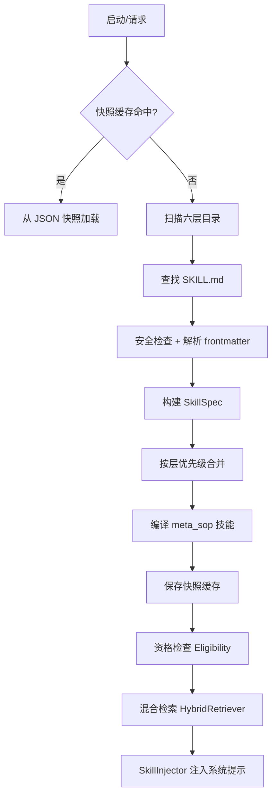
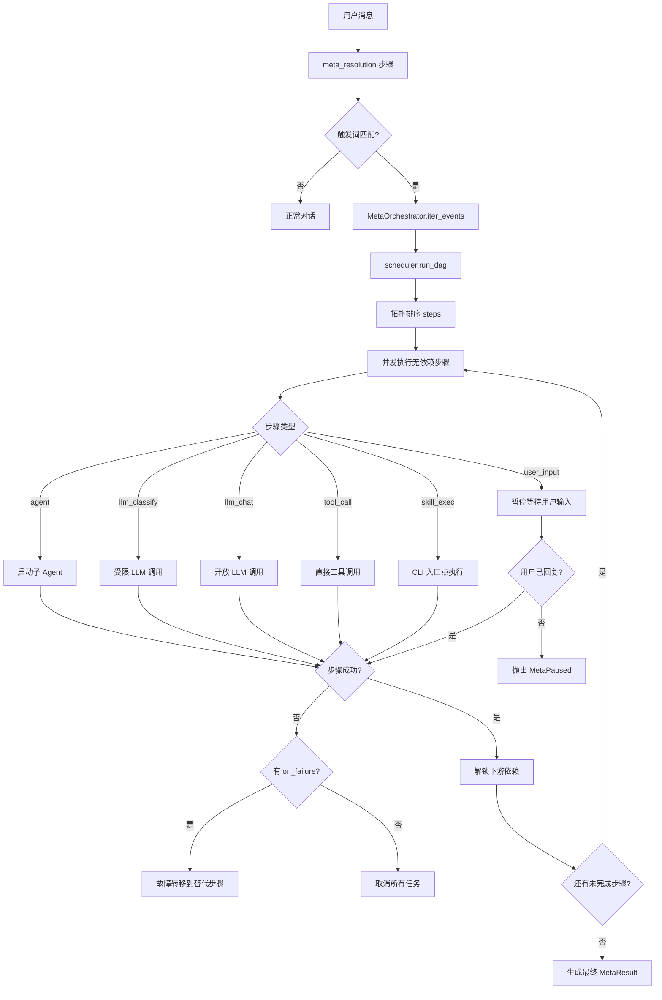
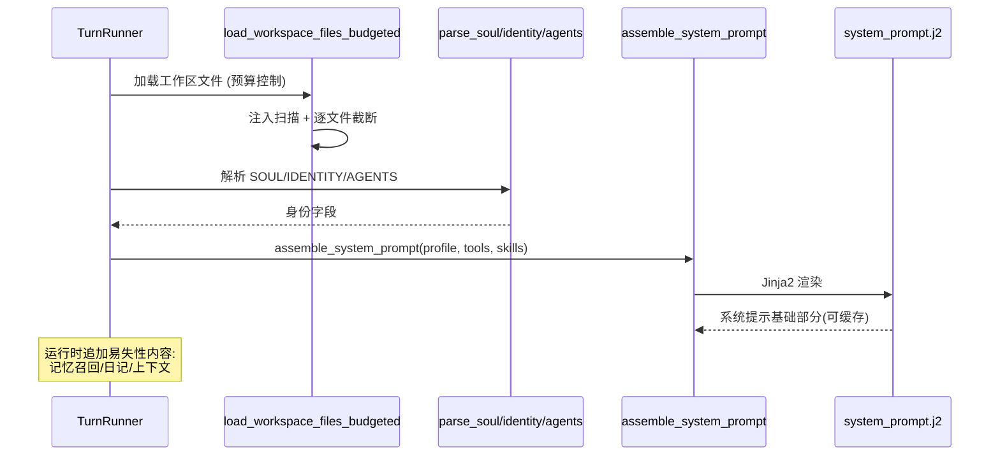
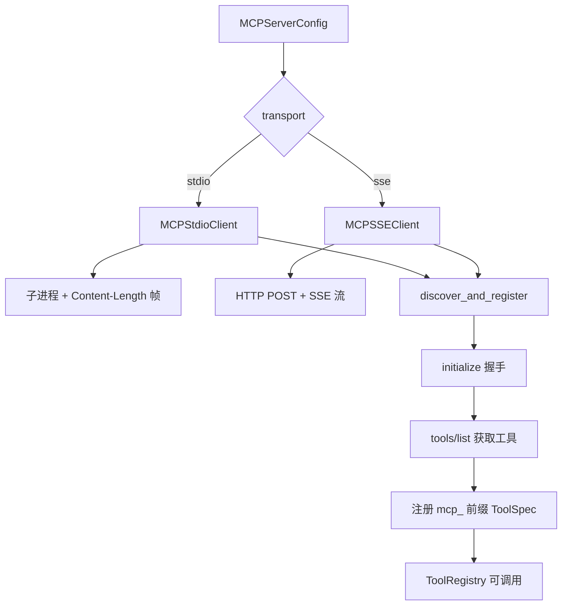

# OpenSquilla Skills, Identity & MCP 模块深度分析

## 一、Skills 系统

### 1.1 六层优先级架构

| 层级 | 枚举值 | 来源目录 | 说明 |
|---|---|---|---|
| 1 | EXTRA | 配置指定 | 最低优先级 |
| 2 | BUNDLED | `skills/bundled/` | 随产品发布 |
| 3 | MANAGED | `~/.opensquilla/skills/` | 社区安装 |
| 4 | PERSONAL | `~/.agents/skills/` | 用户个人 |
| 5 | PROJECT | `{workspace}/.agents/skills/` | 项目级 |
| 6 | WORKSPACE | `{workspace}/skills/` | 最高优先级 |

### 1.2 技能生命周期

### 1.3 核心类

| 类 | 职责 |
|---|---|
| `SkillSpec` | 技能元数据与内容完整数据类 |
| `SkillLoader` | 核心加载器：多层级扫描、快照缓存、frontmatter 解析 |
| `SkillInjector` | 系统提示注入器：全量/紧凑/自动模式 |
| `HybridRetriever` | 混合检索器：词法+语义融合排序 |
| `EligibilityContext` | 资格检查上下文 |

---

## 二、Meta-Skill 工作流程

### SOP 编译流程

---

## 三、Identity 系统

### 3.1 身份文件体系

| 文件 | 内容 |
|---|---|
| `SOUL.md` | 持久人格指导：语气、风格 |
| `IDENTITY.md` | 身份字段：name/emoji/creature/vibe |
| `AGENTS.md` | 项目规则与行为指令 |
| `TOOLS.md` | 工具使用指南 |
| `USER.md` | 用户身份/偏好 |
| `MEMORY.md` | 长期记忆 |
| `BOOTSTRAP.md` | 一次性引导指令 |

### 3.2 提示生成流程

---

## 四、MCP 协议实现

### 4.1 架构

### 4.2 核心类

| 类 | 职责 |
|---|---|
| `MCPClient` | 抽象基类：connect/close/list_tools/call_tool |
| `MCPStdioClient` | Stdio 传输：子进程 + JSON-RPC |
| `MCPSSEClient` | SSE 传输：HTTP + SSE 流 |
| `discover_and_register()` | 连接 → 列举 → 注册到 ToolRegistry |

## 五、设计模式

| 模式 | 应用 |
|---|---|
| **分层覆盖** | Skills 六层目录优先级 |
| **快照缓存** | Skills JSON 快照加速冷启动 |
| **混合检索+降级** | 词法+语义双路，语义失败自动降级 |
| **DAG 并行调度** | Meta-Skill 步骤依赖图并行执行 |
| **故障转移** | Meta-Skill on_failure 替代步骤 |
| **暂停/恢复** | Meta-Skill user_input CAS 原子恢复 |
| **缓存分离** | Identity 可缓存基础 + 易失性后缀 |
| **注入防护** | Skills XML 转义；Identity 工作区扫描 |
| **策略模式** | MCP 传输层抽象 |
| **前缀命名空间** | MCP 工具 mcp_ 前缀 |
