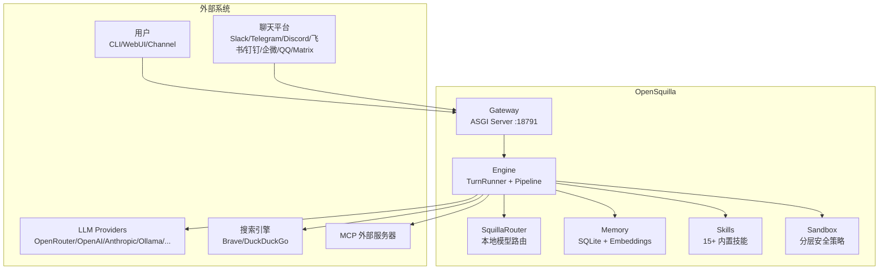
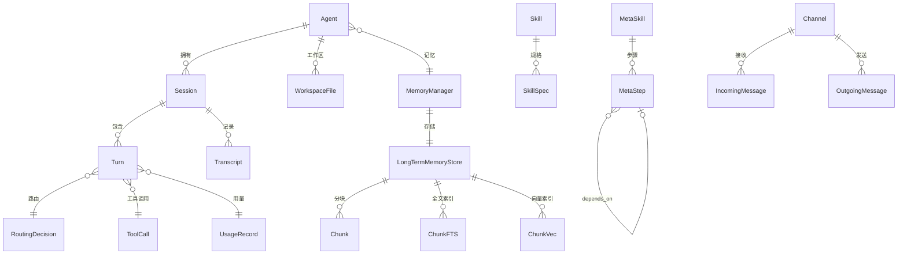

# OpenSquilla 项目规格说明 (Specification)

> 版本: 0.3.1 | 生成日期: 2026-06-09

## 1. 项目概述

OpenSquilla 是一个 **Token 高效的微内核 AI Agent 运行时**，核心理念是"相同预算，更强能力，更好结果"。通过本地模型路由器（SquillaRouter）将每个对话轮次发送到最经济的可用模型，同时提供持久记忆、分层沙箱、内置搜索和设备端嵌入等能力。

### 1.1 产品定位

| 维度 | 描述 |
|---|---|
| 产品类型 | 本地 AI Agent 运行时 |
| 核心价值 | Token 效率优化 + 多模型智能路由 |
| 运行形态 | CLI / Web UI / 多平台聊天通道 |
| 技术栈 | Python 3.12+, Starlette ASGI, SQLite, LightGBM/ONNX |
| 许可证 | Apache 2.0 |

### 1.2 核心差异化能力

1. **SquillaRouter** — 本地 LightGBM + ONNX 分类器，四层路由（c0-c3），分类在设备端完成
2. **自适应推理** — 仅对复杂轮次请求扩展推理，系统提示随任务复杂度缩放
3. **20+ LLM 提供商** — OpenRouter, OpenAI, Anthropic, Ollama, DeepSeek, Gemini 等
4. **持久本地记忆** — SQLite FTS5 + sqlite-vec 混合检索，设备端嵌入
5. **统一 TurnRunner** — Web UI / CLI / 通道共享同一对话循环
6. **分层安全沙箱** — Standard / Strict / Locked 三级策略
7. **Meta-Skill 编排** — DAG 并行调度，支持故障转移和暂停/恢复

---

## 2. 系统边界

### 2.1 系统上下文



### 2.2 用户角色

| 角色 | 访问方式 | 权限 |
|---|---|---|
| Operator (所有者) | CLI / Web UI / Token | 全部权限 (admin) |
| Viewer (只读) | Web UI / Token | 只读权限 (read) |
| Channel 用户 | Slack/飞书等 | 受通道策略约束 |
| Subagent | 内部 | 受深度边界和工具白名单约束 |
| Cron 任务 | 调度器 | 受调度策略约束 |

---

## 3. 功能规格

### 3.1 核心功能矩阵

| 功能域 | 功能 | 优先级 | 状态 |
|---|---|---|---|
| **路由** | 四层模型路由 (c0-c3) | P0 | ✅ |
| **路由** | 渐进式发布 (observe/prompt_only/full) | P0 | ✅ |
| **路由** | 投诉升级 / KV缓存反降级 / 大上下文地板 | P1 | ✅ |
| **对话** | 统一 TurnRunner (Web/CLI/Channel) | P0 | ✅ |
| **对话** | 流式响应 + 工具循环 | P0 | ✅ |
| **对话** | 上下文压缩 (AUTO_SUMMARIZE/HARD_TRUNCATE/REFUSE) | P0 | ✅ |
| **对话** | KV Cache 连续性保护 | P1 | ✅ |
| **记忆** | SQLite FTS5 + sqlite-vec 混合检索 | P0 | ✅ |
| **记忆** | 本地 ONNX 嵌入 (bge-small-zh-v1.5) | P0 | ✅ |
| **记忆** | Dream 记忆巩固 (证据门控) | P2 | ✅ |
| **通道** | 9+ 平台适配器 | P0 | ✅ |
| **通道** | 三种流式策略 (adapter_stream/typing_final/final_only) | P1 | ✅ |
| **技能** | 六层优先级技能系统 | P0 | ✅ |
| **技能** | Meta-Skill DAG 编排 | P1 | ✅ |
| **技能** | SOP 编译器 (自然语言→DAG) | P2 | ✅ |
| **安全** | 分层沙箱 (Standard/Strict/Locked) | P0 | ✅ |
| **安全** | 审批队列 (Human-in-the-loop) | P1 | ✅ |
| **安全** | 拒绝账本 (自动暂停) | P1 | ✅ |
| **调度** | Cron 定时任务 | P1 | ✅ |
| **MCP** | MCP 客户端 (stdio/sse) | P1 | ✅ |
| **MCP** | MCP 服务器模式 | P2 | ✅ |
| **身份** | 可定制人格 (SOUL.md/IDENTITY.md) | P1 | ✅ |

### 3.2 非功能规格

| 维度 | 指标 |
|---|---|
| **冷启动** | 技能快照缓存加速；路由模型延迟加载 |
| **并发** | 全局信号量 + per-agent 公平调度 + subagent 预留槽 |
| **可靠性** | 通道状态机 (running→exhausted→restarting→dead) + 指数退避 |
| **安全性** | Token 认证 / Scope 权限 / CSP 安全头 / SSRF 防护 |
| **可观测性** | 事件重放缓冲区 / 诊断 / 用量统计 / 健康检查 |
| **可扩展性** | entry_points 插件 / MCP 外部工具 / 六层技能覆盖 |

---

## 4. 数据模型

### 4.1 核心实体关系



### 4.2 关键数据结构

| 结构 | 用途 | 持久化 |
|---|---|---|
| `TurnContext` | 每轮对话上下文 | 内存 |
| `RouteEnvelope` | 路由信封（统一来源元数据） | 内存 |
| `RoutingDecision` | 路由决策（tier/confidence/thinking_mode） | 内存 + 路由历史 |
| `IncomingMessage` | 标准化入站消息 | 内存 |
| `OutgoingMessage` | 标准化出站消息 | 内存 |
| `SkillSpec` | 技能规格 | JSON 快照 |
| `MetaPlan` | Meta-Skill 编排计划 | SKILL.md frontmatter |
| `Session` | 会话状态 | SQLite |
| `Transcript` | 对话转录 | SQLite |
| `Chunk` | 记忆分块 | SQLite (FTS5 + sqlite-vec) |

---

## 5. 接口规格

### 5.1 WebSocket RPC 协议

**协议版本**: 3

| 帧类型 | 方向 | 字段 |
|---|---|---|
| `ReqFrame` | Client→Server | type=req, id, method, params |
| `ResFrame` | Server→Client | type=res, id, ok, payload, error |
| `EventFrame` | Server→Client | type=event, event, payload, meta, seq |
| `PingFrame` / `PongFrame` | 双向 | 心跳 |

### 5.2 RPC 方法域

| 域 | 方法前缀 | Scope |
|---|---|---|
| Chat | `chat.*` | write |
| Sessions | `sessions.*` | write/read |
| Agents | `agents.*` | admin/write |
| Channels | `channels.*` | admin |
| Config | `config.*` | admin |
| Cron | `cron.*` | admin |
| Memory | `memory.*` | write |
| Skills | `skills.*` | write/read |
| Tools | `tools.*` | read |
| Usage | `usage.*` | read |
| Approvals | `approvals.*` | approvals |
| System | `system.*` | admin |

### 5.3 HTTP 端点

| 端点 | 方法 | 用途 |
|---|---|---|
| `/health` | GET | 存活检查 |
| `/healthz` | GET | 存活检查 (轻量) |
| `/ws` | GET (Upgrade) | WebSocket 连接 |
| `/control/` | GET | Web UI SPA |
| `/api/*` | GET/POST | REST API |

### 5.4 Channel 协议

```python
class Channel(Protocol):
    def receive(self) -> IncomingMessage: ...
    def send(self, message: OutgoingMessage) -> None: ...
    def edit(self, message_id: str, content: str) -> None: ...
    def delete(self, message_id: str) -> None: ...

class ManagedChannel(Channel, Protocol):
    def start(self) -> None: ...
    def stop(self) -> None: ...
    def health_check(self) -> ChannelHealth: ...
```

---

## 6. 配置规格

### 6.1 配置加载顺序

`OPENSQUILLA_GATEWAY_CONFIG_PATH` → `./opensquilla.toml` → `~/.opensquilla/config.toml` → 内置默认值

### 6.2 关键配置项

| 配置域 | 关键项 | 默认值 |
|---|---|---|
| `auth` | mode | "token" |
| `gateway` | listen | "127.0.0.1" |
| `gateway` | port | 18791 |
| `router` | mode | "recommended" |
| `router` | rollout_phase | "full" |
| `memory` | embedding_provider | "auto" |
| `task_runtime` | max_concurrency | 5 |
| `channels` | 各通道配置 | — |
| `mcp` | servers | [] |
| `meta_skill` | enabled | true |

---

## 7. 质量属性

### 7.1 安全性

- Token / 无认证 / 可信代理三种认证模式
- Scope-based 权限控制 (admin/write/read/approvals/proposals)
- CSP / X-Frame-Options / SSRF 防护
- 附件大小限制 + MIME 白名单
- 工具结果 XML 转义防注入
- 拒绝账本自动暂停

### 7.2 可靠性

- 通道调度状态机 + 指数退避 + dead 状态管理员恢复
- 路由器不可用时安全回退到默认模型
- 嵌入提供者降级链：本地 → 远程 → FTS-only
- Session epoch 机制防止过期帧
- WAL 模式 SQLite + busy_timeout

### 7.3 性能

- 技能快照缓存避免冷启动全量扫描
- 路由模型延迟加载 + 双重检查锁定
- 嵌入缓存避免重复计算
- 流式响应实时推送
- 事件重放缓冲区支持断线重连

---

## 8. 约束与假设

| 约束 | 说明 |
|---|---|
| Python >= 3.12 | 使用现代 Python 特性 |
| 本地优先 | 路由分类和嵌入优先在设备端完成 |
| 单进程 | Gateway 为单进程 ASGI，并发通过 asyncio |
| SQLite | 单写者模型，WAL 模式支持并发读 |
| 模型资产 | SquillaRouter 模型通过 Git LFS 分发 |

---

## 附录：模块分析文档索引

| 文档 | 路径 |
|---|---|
| Engine 模块分析 | [engine.md](engine.md) |
| Gateway 模块分析 | [gateway.md](gateway.md) |
| Channels 模块分析 | [channels.md](channels.md) |
| Router & Memory 模块分析 | [router-memory.md](router-memory.md) |
| Skills, Identity & MCP 模块分析 | [skills-identity-mcp.md](skills-identity-mcp.md) |
