# Supermemory 系统设计文档

## 1. 设计理念

Supermemory 的核心设计理念是 **"记忆即上下文"**——将 AI 的无状态交互转化为有状态的个性化体验。系统围绕以下原则构建：

1. **单一记忆结构**：记忆、RAG、用户画像统一在同一数据模型和本体中
2. **自动遗忘**：临时事实过期自动遗忘，矛盾自动解决，噪声不会成为永久记忆
3. **混合检索**：知识库检索（RAG）与个性化上下文（Memory）默认同时返回
4. **框架无关**：通过共享层抽象，支持任意 AI 框架的即插即用集成

---

## 2. 系统分层架构

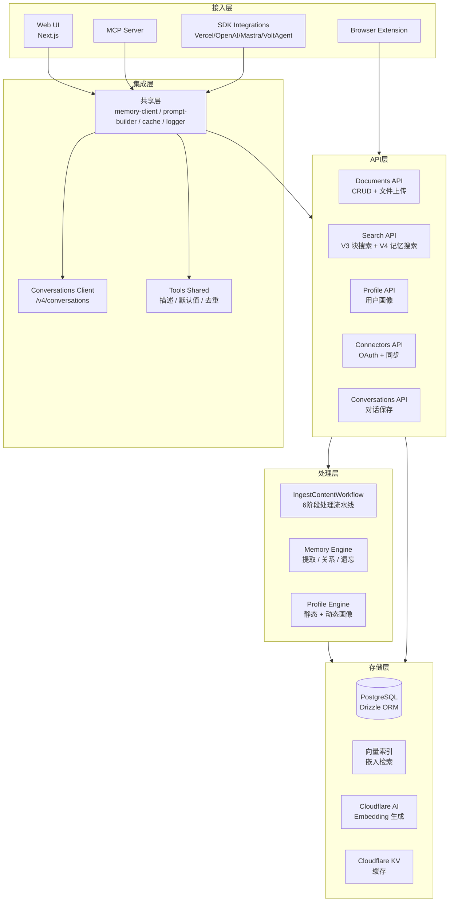

---

## 3. 核心模块设计

### 3.1 内容处理流水线（IngestContentWorkflow）

内容处理是系统的入口，所有内容都经过 6 阶段流水线：

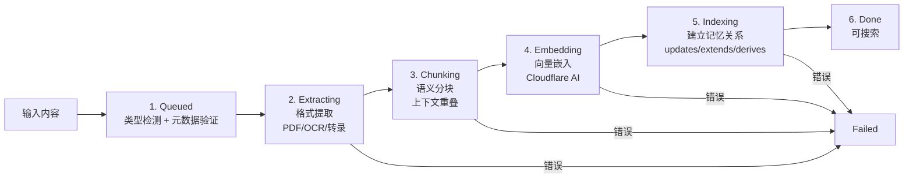

**处理元数据追踪**：

每个文档的 `processingMetadata` 记录完整的处理过程：

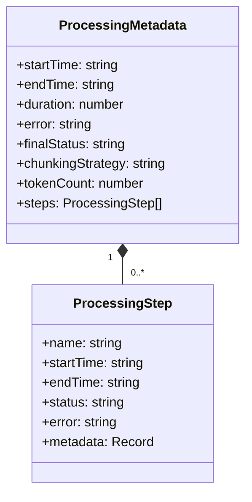

**内容类型处理策略**：

| 输入类型 | 提取方式 | 分块策略 |
|---------|---------|---------|
| text | 直接使用 | 语义分块 |
| url | Web 抓取 + HTML 清理 | 语义分块 |
| pdf | PDF 解析器 | 语义分块 |
| image | OCR | 语义分块 |
| video | 音频转录 | 语义分块 |
| audio | 语音转文字 | 语义分块 |
| code | AST 感知解析 | AST 感知分块 |

---

### 3.2 记忆引擎（Memory Engine）

记忆引擎是系统的核心，负责从内容中提取事实、建立关系、解决矛盾和自动遗忘。

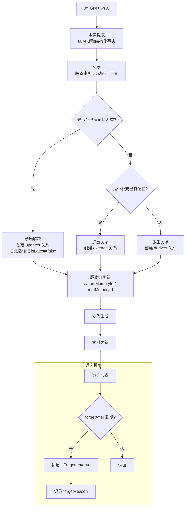

**记忆版本链设计**：

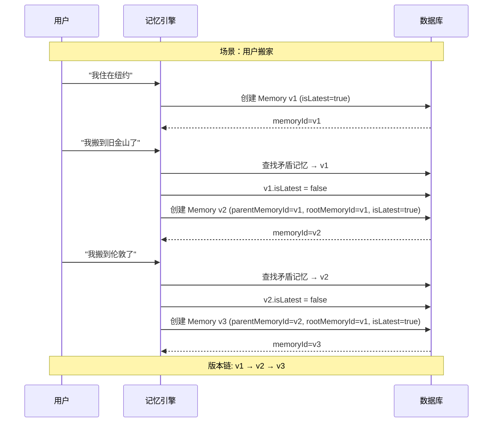

**记忆数据模型**：

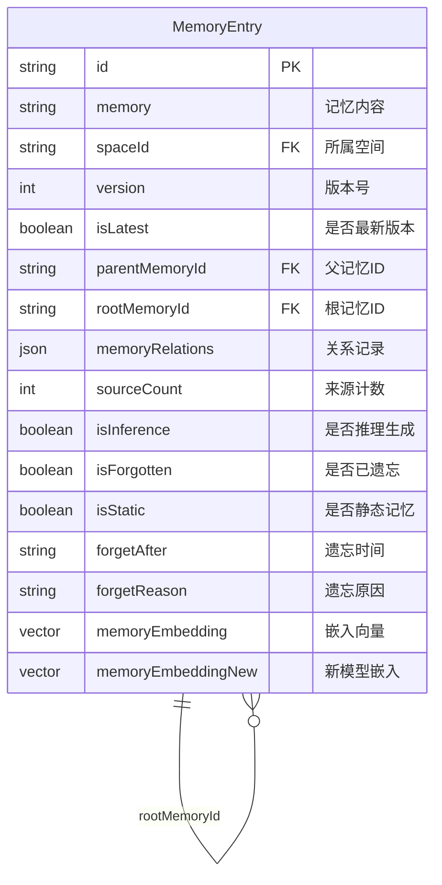

---

### 3.3 用户画像引擎（Profile Engine）

用户画像自动从记忆中构建，分为静态和动态两部分：

```mermaid
flowchart TB
    Memories[所有记忆条目] --> Split{isStatic?}

    Split -->|true| Static[静态画像<br/>永久事实]
    Split -->|false| Dynamic[动态上下文<br/>近期活动]

    Static --> StaticFacts[示例:<br/>- 姓名/职业<br/>- 偏好/习惯<br/>- 长期目标]
    Dynamic --> DynamicFacts[示例:<br/>- 当前项目<br/>- 近期讨论<br/>- 临时上下文]

    StaticFacts --> ProfileAPI[GET /v3/container-tags/:tag/profile]
    DynamicFacts --> ProfileAPI

    ProfileAPI --> Response[响应<br/>{ profile: { static: string[], dynamic: string[] } }]
```

**画像在 AI 集成中的注入流程**：

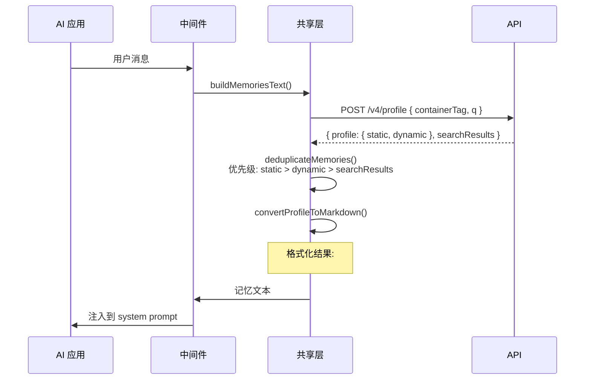

---

### 3.4 搜索系统设计

```mermaid
flowchart TB
    Query[查询文本] --> Rewrite{rewriteQuery?}

    Rewrite -->|是| Rewritten[查询改写<br/>+400ms 延迟]
    Rewrite -->|否| Direct[直接查询]

    Rewritten --> Embed[向量嵌入]
    Direct --> Embed

    Embed --> Search{搜索模式}

    Search -->|V3: 块搜索| ChunkSearch[块级别匹配<br/>chunkThreshold + documentThreshold]
    Search -->|V4: 记忆搜索| MemorySearch[记忆级别匹配<br/>threshold]
    Search -->|hybrid| Both[两者结合]

    ChunkSearch --> Rerank{rerank?}
    MemorySearch --> Rerank
    Both --> Rerank

    Rerank -->|是| Reranked[重排序结果]
    Rerank -->|否| Raw[原始排序]

    Reranked --> Result[返回结果]
    Raw --> Result

    subgraph V3结果
        ChunkResult[文档块结果<br/>chunks[] + documentId + score]
    end

    subgraph V4结果
        MemoryResult[记忆结果<br/>memory + similarity + context<br/>{ parents, children }]
    end
```

**V4 记忆搜索的关系上下文**：

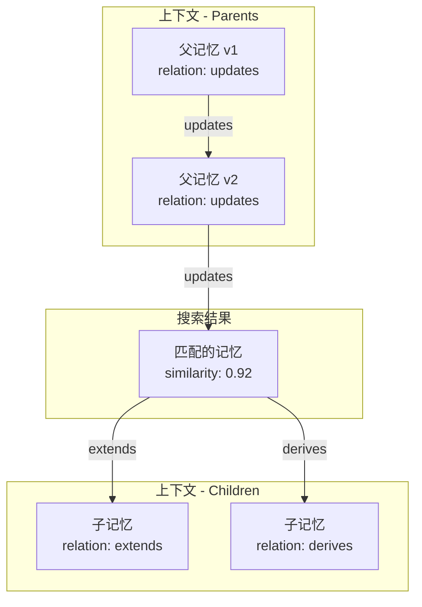

---

### 3.5 多框架集成架构

```mermaid
graph TB
    subgraph 框架适配层
        VercelMW[Vercel AI SDK<br/>Proxy doGenerate/doStream]
        OpenAIMW[OpenAI SDK<br/>Monkey-patch<br/>chat.completions.create<br/>responses.create]
        MastraMW[Mastra<br/>inputProcessors<br/>outputProcessors]
        VoltAgentMW[VoltAgent<br/>onPrepareMessages<br/>onEnd hooks]
        ClaudeMem[Claude Memory<br/>文件系统模拟]
        AITools[AI SDK Tools<br/>函数调用工具]
    end

    subgraph 共享层
        MemoryClient[memory-client.ts<br/>buildMemoriesText()<br/>supermemoryProfileSearch()]
        PromptBuilder[prompt-builder.ts<br/>convertProfileToMarkdown()<br/>formatMemoriesForPrompt()]
        Cache[cache.ts<br/>MemoryCache LRU max=100]
        Logger[logger.ts<br/>createLogger()]
        Context[context.ts<br/>createSupermemoryClient()]
        ToolsShared[tools-shared.ts<br/>TOOL_DESCRIPTIONS<br/>deduplicateMemories()]
        ConvClient[conversations-client.ts<br/>addConversation()]
    end

    subgraph Supermemory API
        ProfileAPI[POST /v4/profile]
        SearchAPI[POST /v4/search<br/>POST /v3/search]
        ConvAPI[POST /v4/conversations]
        MemAPI[POST /v4/memories]
    end

    VercelMW --> MemoryClient
    OpenAIMW --> MemoryClient
    MastraMW --> MemoryClient
    VoltAgentMW --> MemoryClient
    ClaudeMem --> MemoryClient
    AITools --> ToolsShared

    MemoryClient --> ProfileAPI
    MemoryClient --> SearchAPI
    ToolsShared --> SearchAPI

    VercelMW --> ConvClient
    OpenAIMW --> ConvClient
    MastraMW --> ConvClient
    VoltAgentMW --> ConvClient

    ConvClient --> ConvAPI

    MemoryClient --> Cache
    MemoryClient --> PromptBuilder
    MemoryClient --> Context
    VercelMW --> Logger
```

**三种记忆注入模式**：

| 模式 | 数据来源 | 适用场景 |
|------|---------|---------|
| `profile` | 仅用户画像 | 快速上下文注入 |
| `query` | 仅搜索结果 | 精确知识检索 |
| `full` | 画像 + 搜索结果 | 完整上下文（默认） |

**对话保存策略**：

| 模式 | 行为 |
|------|------|
| `always` | 每次 LLM 响应后保存对话 |
| `never` | 不保存对话 |

---

### 3.6 MCP 服务器设计

```mermaid
flowchart TB
    Client[MCP 客户端<br/>Claude/Cursor/VS Code] -->|SSE/Streamable HTTP| MCP[MCP Server<br/>Cloudflare Durable Objects]

    MCP --> Auth{认证方式}
    Auth -->|sm_ 前缀| APIKey[API Key 认证<br/>GET /v3/session]
    Auth -->|OAuth Token| OAuth[OAuth 认证<br/>GET /v3/mcp/session-with-key]

    APIKey --> UserAuth[AuthUser<br/>userId + apiKey]
    OAuth --> UserAuth

    UserAuth --> SMClient[SupermemoryClient]

    subgraph 工具处理
        SMClient --> Memory[memory 工具<br/>save: client.add()<br/>forget: 精确匹配 → 语义搜索]
        SMClient --> Recall[recall 工具<br/>client.search.memories()<br/>searchMode: hybrid]
        SMClient --> Profile[recall + includeProfile<br/>client.profile()]
        SMClient --> Projects[listProjects<br/>GET /v3/projects]
    end

    subgraph 资源处理
        SMClient --> ProfileRes[supermemory://profile<br/>用户画像]
        SMClient --> ProjectsRes[supermemory://projects<br/>项目列表]
    end

    subgraph App UI
        SMClient --> GraphTool[memory-graph<br/>记忆图谱可视化]
        SMClient --> FetchGraph[fetch-graph-data<br/>图谱分页数据]
    end
```

**遗忘双重策略时序**：

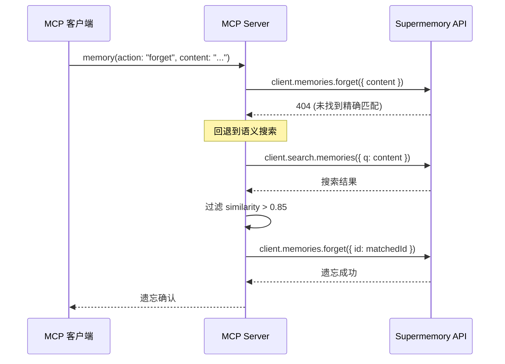

---

### 3.7 记忆图谱可视化设计

```mermaid
flowchart TB
    API[API 数据<br/>documents + memories] --> Hook[useGraphData Hook]

    Hook --> Cluster[集群计算<br/>BFS 连通分量]
    Hook --> Layout[布局计算<br/>文档: 黄金角螺旋<br/>记忆: 多环轨道]
    Hook --> Edges[边计算<br/>derives + updates + extends]

    Cluster --> Nodes[GraphNode[]]
    Layout --> Nodes
    Edges --> GraphEdges[GraphEdge[]]

    Nodes --> Sim[ForceSimulation<br/>d3-force 物理仿真]
    GraphEdges --> Sim

    Sim --> Canvas[GraphCanvas<br/>Canvas 2D 渲染]

    Canvas --> VP[ViewportState<br/>平移/缩放/坐标转换]
    Canvas --> SI[SpatialIndex<br/>网格命中测试]
    Canvas --> IH[InputHandler<br/>鼠标/触摸事件]
    Canvas --> VCI[VersionChainIndex<br/>版本链查询]

    VP --> Render[renderFrame<br/>LOD + 批量渲染]
    SI --> IH
    IH --> Render

    subgraph 渲染优化
        LOD[LOD 机制<br/>缩放 < 0.5: 采样关系边<br/>缩放 < 0.38: 采样派生边]
        Dense[稠密图模式<br/>节点 > 25000 且 缩放 < 0.42<br/>简单圆点渲染]
        Batch[批量渲染<br/>按样式分组<br/>减少 draw call]
    end

    Render --> LOD
    Render --> Dense
    Render --> Batch
```

**节点布局算法**：

```mermaid
flowchart LR
    subgraph 文档节点布局
        DocInput[N 个文档] --> Golden[黄金角螺旋<br/>angle = idx * 137.5°<br/>radius = sqrt(idx+1/count)]
        Golden --> Append[新文档追加<br/>空间网格碰撞检测<br/>最多 8 环 x 18 候选位]
    end

    subgraph 记忆节点布局
        MemInput[文档的记忆] --> Orbit[多环轨道<br/>内环容量 = 周长/84px<br/>半径 = 260 + ring*110]
        Orbit --> Angle[黄金角 + 哈希偏移<br/>均匀分布]
    end
```

---

### 3.8 Web 应用架构

```mermaid
flowchart TB
    subgraph Provider 链
        Theme[ThemeProvider<br/>forcedTheme=dark] --> Autumn[AutumnProvider<br/>计费/订阅]
        Autumn --> Query[QueryProvider<br/>TanStack React Query]
        Query --> Auth[AuthProvider<br/>Better Auth]
        Auth --> PostHog[PostHogProvider<br/>产品分析]
        PostHog --> ErrorTrack[ErrorTrackingProvider<br/>Sentry]
        ErrorTrack --> Nuqs[NuqsAdapter<br/>URL 状态]
    end

    subgraph 主页面路由
        Page[page.tsx<br/>视图路由器] --> ViewMode{?view=}
        ViewMode -->|dashboard| Dashboard[DashboardView<br/>每日亮点 + 记忆]
        ViewMode -->|chat| Chat[ChatSidebar<br/>Nova AI 对话]
        ViewMode -->|graph| Graph[GraphLayoutView<br/>知识图谱]
        ViewMode -->|list| List[MemoriesGrid<br/>记忆网格]
        ViewMode -->|integrations| Integrations[IntegrationsView]
    end

    subgraph URL 驱动的模态
        URLParams[nuqs 参数] --> Add[?add=note|link|file|connect]
        URLParams --> Search[?search=true]
        URLParams --> Doc[?doc=id]
        URLParams --> Thread[?thread=id]
    end

    subgraph 聊天系统
        ChatStore[Zustand + IndexedDB<br/>持久化聊天存储] --> ChatTransport[DefaultChatTransport<br/>POST /chat]
        ChatTransport --> Models[模型系统<br/>GPT-5.1 / Claude / Gemini]
        ChatTransport --> Reasoning[推理模式<br/>instant / thinking]
        ChatTransport --> Queue[消息队列<br/>最多 3 条排队]
    end
```

---

## 4. 数据流设计

### 4.1 端到端记忆流程

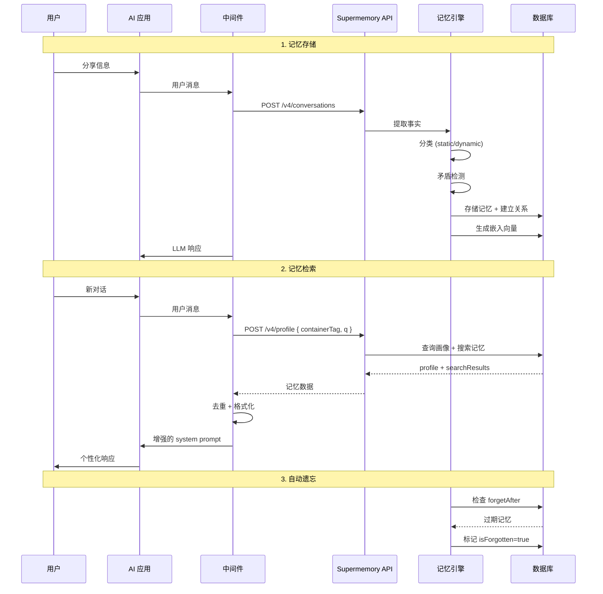

### 4.2 连接器同步流程

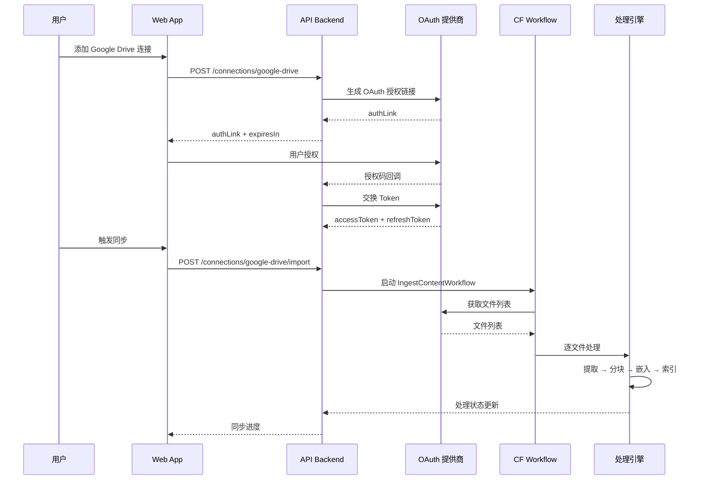

---

## 5. 缓存策略

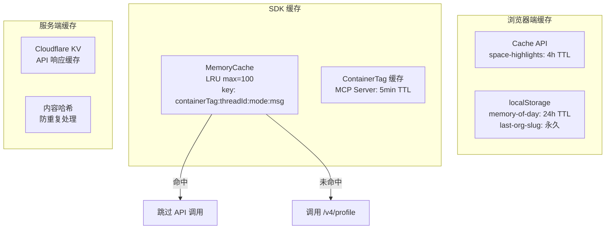

---

## 6. 嵌入模型迁移设计

系统支持无缝的嵌入模型切换，所有嵌入相关表都有双字段设计：

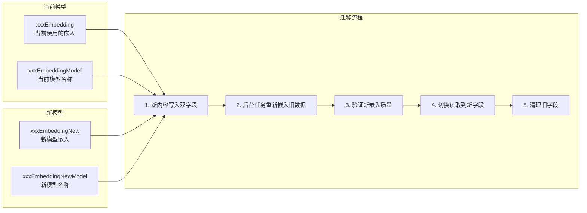

---

## 7. 错误处理策略

```mermaid
flowchart TB
    Error[错误发生] --> Type{错误类型}

    Type -->|API 调用失败| Retry[3 次线性重试]
    Type -->|认证失败| Auth[401 → 重新认证<br/>402 → 升级<br/>403 → 受限]
    Type -->|限流| RateLimit[429 → 等待重试]
    Type -->|记忆检索失败| Skip{skipMemoryOnError?}
    Type -->|内容处理失败| MarkFailed[标记文档 status=failed<br/>记录 processingMetadata.error]

    Skip -->|true| Continue[继续 LLM 调用]
    Skip -->|false| Propagate[向上传播错误]

    Retry -->|成功| Return[返回结果]
    Retry -->|3次失败| Sentry[上报 Sentry]
    Auth --> Sentry
    RateLimit --> Sentry
```

---

## 8. 关键设计决策

| 决策 | 原因 | 影响 |
|------|------|------|
| 记忆与 RAG 统一数据模型 | 避免两套独立系统的复杂性 | 混合搜索自然支持 |
| 版本链而非覆盖更新 | 保留知识演进历史 | 支持时间线回溯和关系推理 |
| 双嵌入字段设计 | 支持无缝模型迁移 | 存储开销增加但迁移零停机 |
| Cloudflare Workers 部署 | 全球低延迟 + 自动扩展 | 冷启动需优化 |
| Canvas 2D 而非 WebGL | 更好的兼容性和调试体验 | 超大图性能受限 |
| LOD + 批量渲染 | 大规模图谱性能优化 | 缩小时细节丢失 |
| LRU 缓存 + 轮次键 | 避免工具调用循环中重复请求 | 缓存一致性需注意 |
| 猴子补丁 OpenAI 客户端 | 最小侵入性集成 | OpenAI SDK 更新可能破坏兼容 |
