# Supermemory 多框架集成模块设计文档

## 1. 模块概述

Supermemory 多框架集成模块 (`packages/tools`) 是连接 Supermemory 记忆服务与各类 AI 框架的桥梁层。它通过统一的共享层抽象核心逻辑（记忆检索、去重、格式化、对话保存），并为每个目标框架提供定制化的集成方案，使开发者只需少量代码即可为 AI 应用注入持久化记忆能力。

### 1.1 设计目标

- **框架无关的核心逻辑**：共享层封装所有与 Supermemory API 的交互，各框架集成只需关注拦截点和消息格式转换
- **最小侵入性**：通过 Proxy、猴子补丁、处理器管道、生命周期钩子等方式，不修改框架源码
- **可配置性**：支持记忆模式、持久化策略、超时控制、自定义提示模板等灵活配置
- **容错性**：记忆检索失败时可选择跳过（降级）或抛出异常，不阻塞主流程

### 1.2 整体架构

```mermaid
graph TB
    subgraph "应用层"
        APP[AI 应用]
    end

    subgraph "框架集成层"
        VERCEL[Vercel AI SDK<br/>Proxy 包装]
        OPENAI[OpenAI SDK<br/>猴子补丁]
        MASTRA[Mastra<br/>Processor 管道]
        VOLTAGENT[VoltAgent<br/>生命周期钩子]
        CLAUDE[Claude Memory<br/>命令映射]
        AISDK[AI SDK Tools<br/>工具定义]
    end

    subgraph "共享层 (shared/)"
        TYPES[types.ts<br/>类型定义]
        LOGGER[logger.ts<br/>日志]
        CACHE[cache.ts<br/>LRU 缓存]
        CONTEXT[context.ts<br/>客户端工厂]
        MEMCLIENT[memory-client.ts<br/>记忆检索核心]
        PROMPTBUILDER[prompt-builder.ts<br/>提示构建]
    end

    subgraph "通用模块"
        TOOLSSHARED[tools-shared.ts<br/>工具常量/去重]
        CONVCLIENT[conversations-client.ts<br/>对话保存]
    end

    subgraph "Supermemory API"
        PROFILE[/v4/profile]
        CONVERSATIONS[/v4/conversations]
        SEARCH[search API]
        MEMORIES[memories API]
        DOCUMENTS[documents API]
    end

    APP --> VERCEL & OPENAI & MASTRA & VOLTAGENT & CLAUDE & AISDK
    VERCEL & OPENAI & MASTRA & VOLTAGENT --> MEMCLIENT & CONTEXT & CACHE & LOGGER & PROMPTBUILDER
    CLAUDE & AISDK --> TOOLSSHARED
    VERCEL & OPENAI & MASTRA & VOLTAGENT --> CONVCLIENT
    MEMCLIENT --> PROFILE
    CONVCLIENT --> CONVERSATIONS
    CLAUDE & AISDK --> SEARCH & MEMORIES & DOCUMENTS
```

---

## 2. 共享层架构

共享层 (`packages/tools/src/shared/`) 是所有框架集成的公共基础，封装了类型定义、日志、缓存、客户端创建、记忆检索与格式化等核心能力。

### 2.1 模块依赖关系

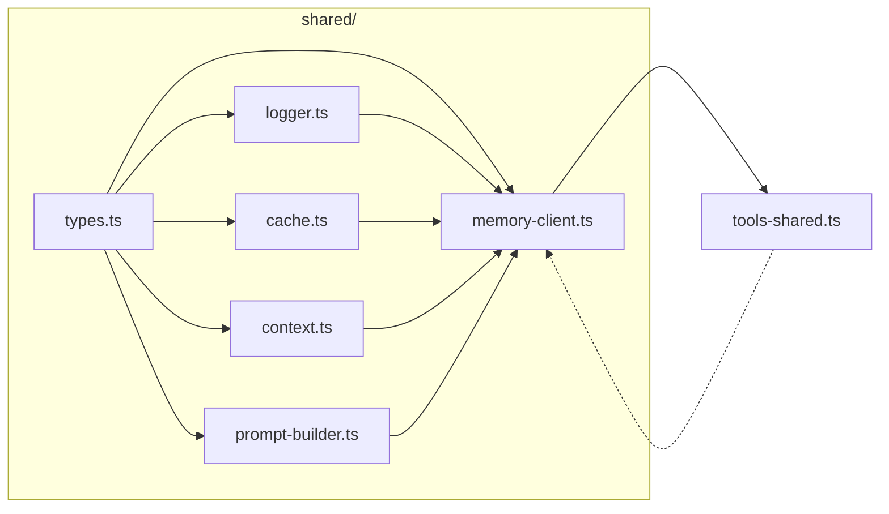

### 2.2 核心类型体系

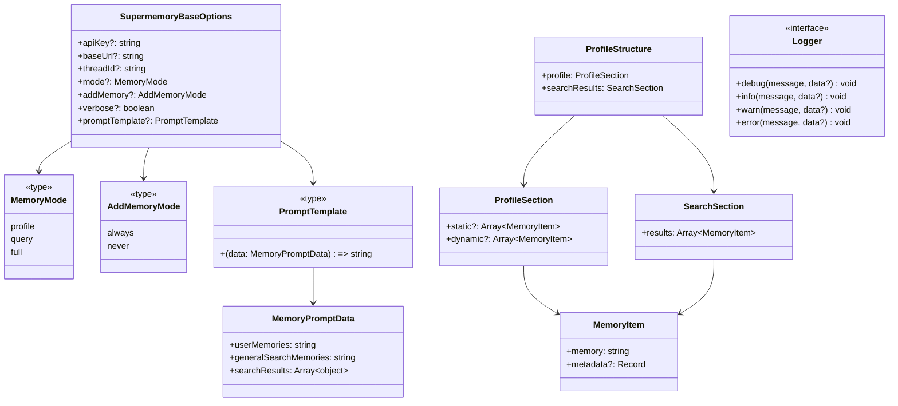

### 2.3 记忆检索核心流程

`buildMemoriesText()` 是共享层最核心的函数，负责从 API 获取记忆、去重、格式化为可注入的字符串。

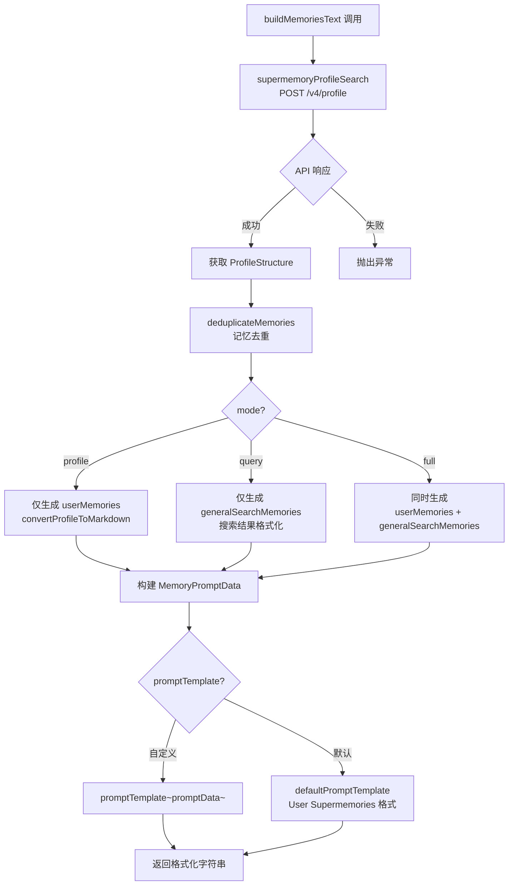

### 2.4 记忆去重算法

`deduplicateMemories()` 按优先级 static > dynamic > searchResults 进行去重，确保同一记忆不会重复出现。

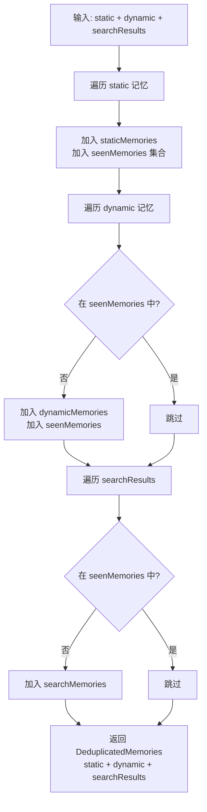

### 2.5 缓存策略

`MemoryCache` 基于 `lru-cache`（max=100），在同一轮对话的工具调用循环中避免重复 API 调用。

```mermaid
flowchart TD
    A[收到 LLM 调用请求] --> B[生成 turnKey<br/>containerTag:threadId:mode:message]
    B --> C{缓存命中?}
    C -->|命中且非新轮次| D[使用缓存记忆<br/>直接注入]
    C -->|未命中或新轮次| E[调用 buildMemoriesText<br/>获取新记忆]
    E --> F[写入缓存<br/>key=turnKey]
    F --> G[注入记忆到提示]

    subgraph "turnKey 生成规则"
        H[containerTag] ~~~ I[threadId/customId]
        I ~~~ J[mode]
        J ~~~ K[normalizedMessage]
        H + I + J + K --> L["containerTag:threadId:mode:message"]
    end
```

### 2.6 日志系统

```mermaid
flowchart LR
    A[createLogger] --> B{verbose?}
    B -->|true| C[输出到 console<br/>带 [supermemory] 前缀]
    B -->|false| D[空操作<br/>所有方法为 no-op]

    C --> E[debug → console.log]
    C --> F[info → console.log]
    C --> G[warn → console.warn]
    C --> H[error → console.error]
```

---

## 3. 各框架集成详细设计

### 3.1 Vercel AI SDK 集成

**入口**: `packages/tools/src/vercel/`
**核心函数**: `withSupermemory(model, options)`

#### 3.1.1 集成机制

通过 ES6 `Proxy` 包装 `LanguageModel` 对象，拦截 `doGenerate` 和 `doStream` 两个核心方法，在调用前注入记忆、在调用后保存对话。

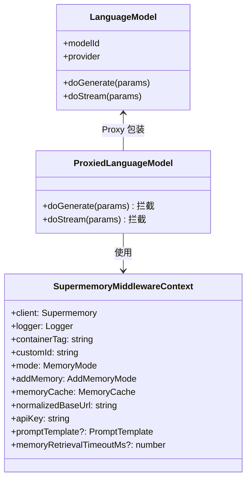

#### 3.1.2 doGenerate 时序图

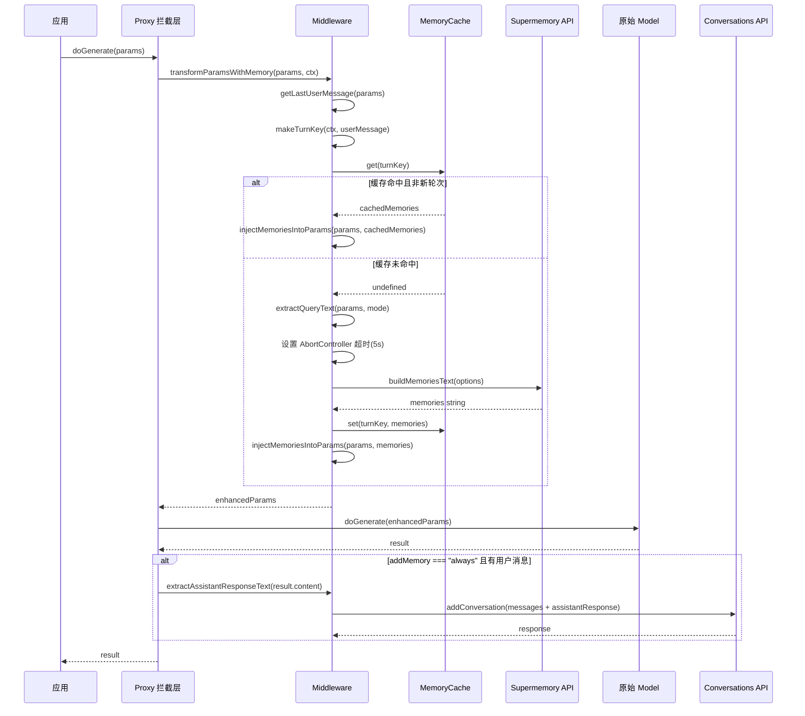

#### 3.1.3 doStream 时序图

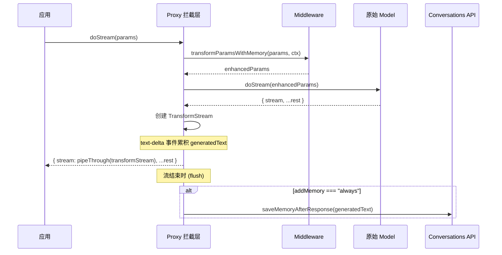

#### 3.1.4 记忆注入策略

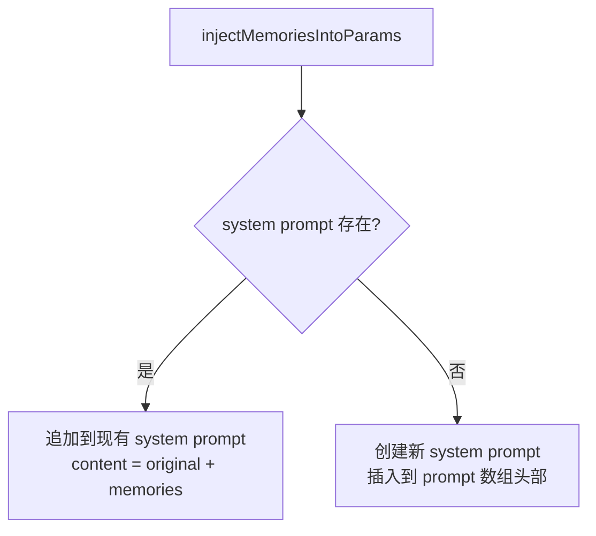

#### 3.1.5 SDK 版本兼容

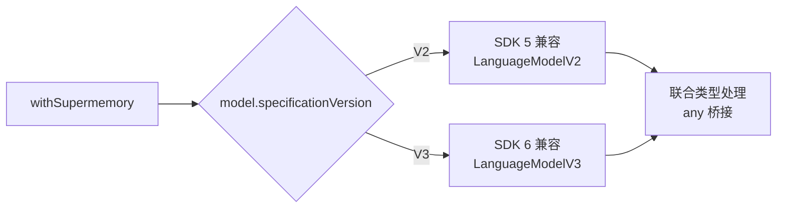

---

### 3.2 OpenAI SDK 集成

**入口**: `packages/tools/src/openai/`
**核心函数**: `withSupermemory(openaiClient, options)`

#### 3.2.1 集成机制

通过猴子补丁（Monkey Patching）替换 `openaiClient.chat.completions.create` 和 `openaiClient.responses.create` 方法，在调用前搜索记忆并注入，在调用后可选保存对话。

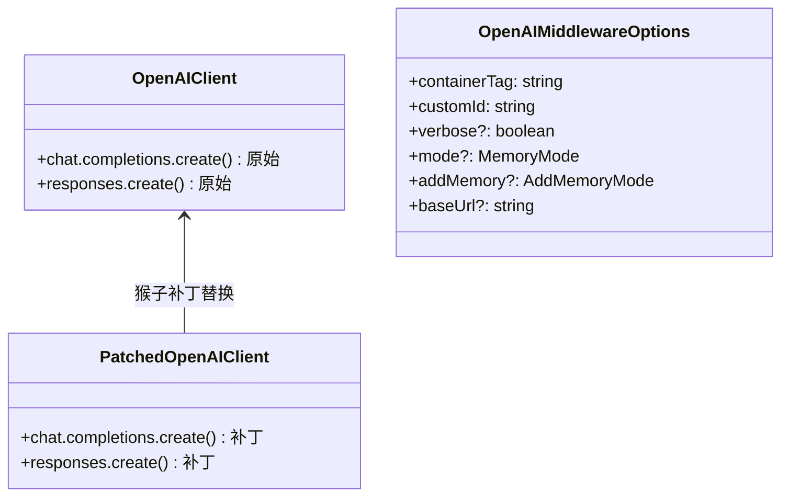

#### 3.2.2 Chat Completions API 时序图

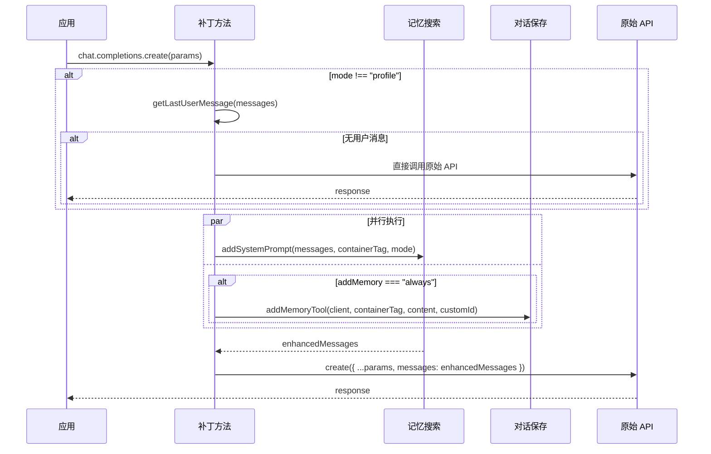

#### 3.2.3 Responses API 时序图

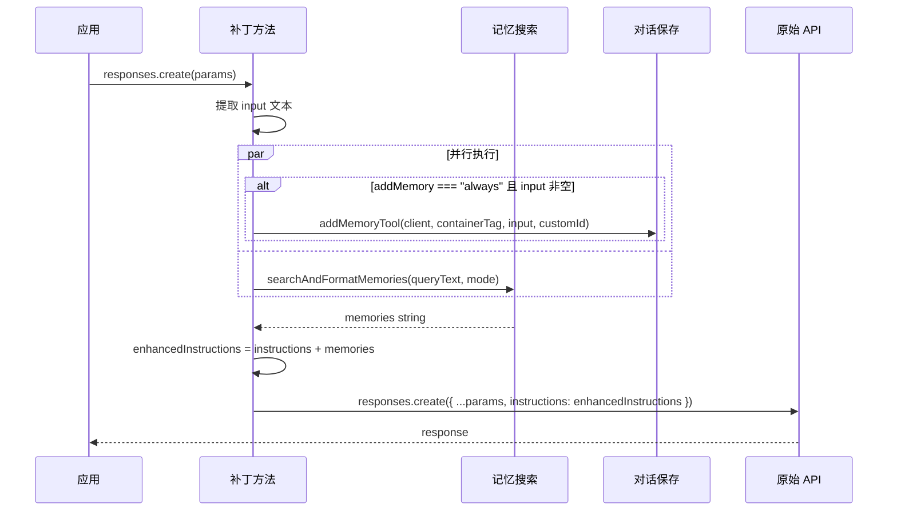

#### 3.2.4 函数调用工具体系

OpenAI 集成提供了 7 个函数调用工具，支持 LLM 主动操作记忆。

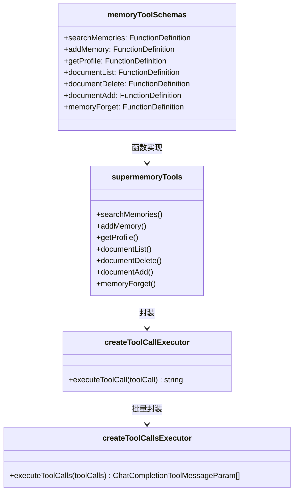

#### 3.2.5 工具调用执行流程

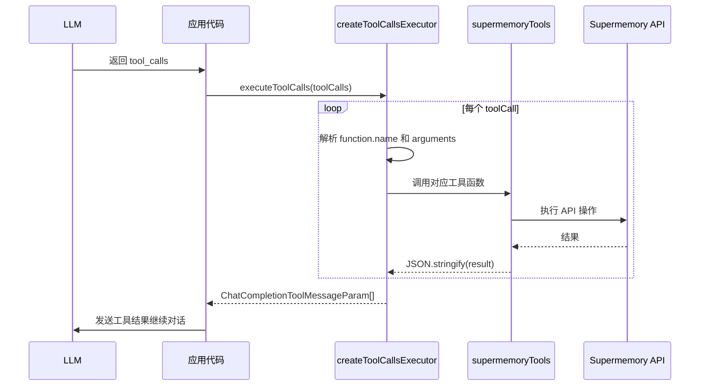

---

### 3.3 Mastra 集成

**入口**: `packages/tools/src/mastra/`
**核心函数**: `withSupermemory(config, options)`

#### 3.3.1 集成机制

通过 Mastra 的 Processor 管道机制，注入 `SupermemoryInputProcessor`（LLM 调用前注入记忆）和 `SupermemoryOutputProcessor`（LLM 响应后保存对话）。由于 Mastra Agent 的属性在构造后不可修改，需在创建 Agent 前增强配置。

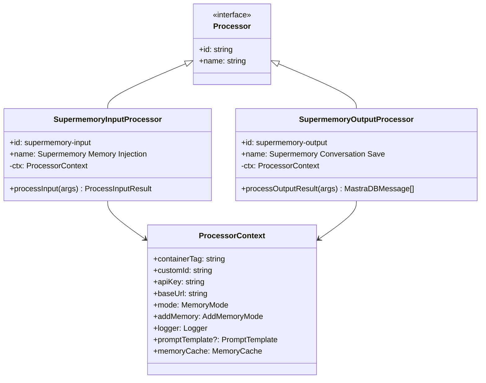

#### 3.3.2 处理器管道时序图

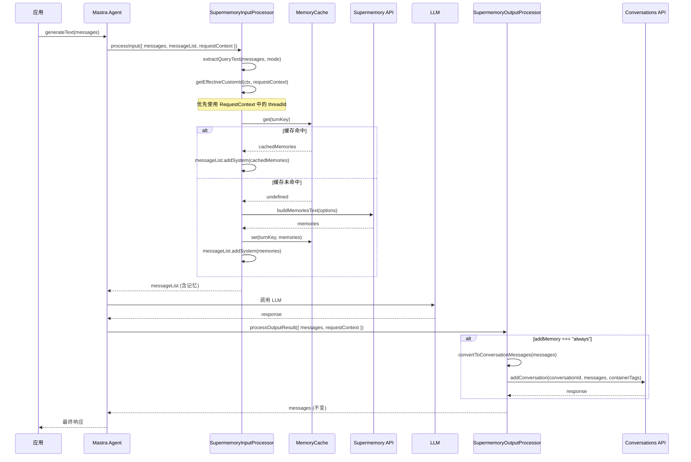

#### 3.3.3 动态 threadId 机制

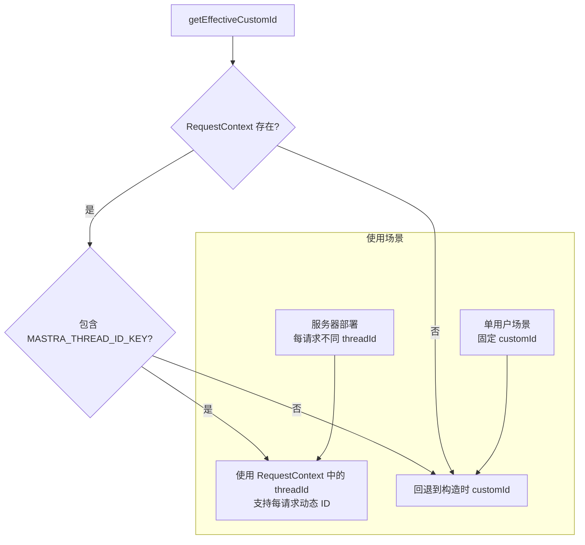

#### 3.3.4 配置增强流程

```mermaid
flowchart TD
    A[withSupermemory(config, options)] --> B[验证 options.containerTag<br/>和 options.customId]
    B --> C[validateApiKey]
    C --> D[创建 SupermemoryInputProcessor]
    C --> E[创建 SupermemoryOutputProcessor]
    D --> F[合并 inputProcessors<br/>Supermemory 放首位]
    E --> G[合并 outputProcessors<br/>Supermemory 放末尾]
    F --> H[返回增强后的 config]
    G --> H
```

---

### 3.4 VoltAgent 集成

**入口**: `packages/tools/src/voltagent/`
**核心函数**: `withSupermemory(options)`

#### 3.4.1 集成机制

通过 VoltAgent 的生命周期钩子（hooks）机制，在 `onPrepareMessages` 钩子中注入记忆，在 `onEnd` 钩子中以 fire-and-forget 方式保存对话。

```mermaid
classDiagram
    class VoltAgentHooks {
        <<interface>>
        +onStart?(args) void
        +onPrepareMessages?(args) messages
        +onEnd?(args) void
    }

    class SupermemoryMiddlewareContext {
        +client: Supermemory
        +logger: Logger
        +containerTag: string
        +customId: string
        +mode: MemoryMode
        +addMemory: AddMemoryMode
        +memoryCache: MemoryCache
        +threshold?: number
        +limit?: number
        +rerank?: boolean
        +rewriteQuery?: boolean
        +filters?: SearchFilters
        +include?: IncludeOptions
        +searchMode?: searchMode
        +metadata?: Record
        +entityContext?: string
    }

    class createSupermemoryHooks {
        +返回 VoltAgentHooks
    }

    VoltAgentHooks <-- createSupermemoryHooks : 创建
    createSupermemoryHooks --> SupermemoryMiddlewareContext : 使用
```

#### 3.4.2 生命周期钩子时序图

```mermaid
sequenceDiagram
    participant App as 应用
    participant Agent as VoltAgent Agent
    participant Hooks as Supermemory Hooks
    participant MW as Middleware
    participant API as Supermemory API
    participant Conv as Conversations API

    App->>Agent: generateText(messages)
    Agent->>Hooks: onPrepareMessages({ messages, context })

    Hooks->>MW: enhanceMessagesWithMemories(inputMessages, ctx, systemMessages)
    MW->>MW: getLastUserMessage(inputMessages)
    MW->>MW: makeTurnKey(ctx, userMessage)

    alt 缓存命中且非新轮次
        MW-->>Hooks: 使用缓存记忆
    else 需要检索
        MW->>MW: extractQueryText(messages, mode)

        alt 使用高级搜索参数
            MW->>API: client.search.memories(advancedParams)
        else 标准搜索
            MW->>API: buildMemoriesText(options)
        end

        API-->>MW: memories
        MW->>MW: injectMemoriesIntoMessages(messages, memories)
    end

    MW-->>Hooks: enhancedMessages
    Hooks-->>Agent: { messages: enhancedMessages }

    Agent->>Agent: 调用 LLM
    Agent->>Hooks: onEnd({ context, output })

    Hooks->>Hooks: 提取 inputMessages + outputText
    Hooks->>Conv: saveConversation(messages, ctx)
    Note over Hooks,Conv: fire-and-forget<br/>不阻塞响应

    Agent-->>App: 最终响应
```

#### 3.4.3 高级搜索参数决策流程

```mermaid
flowchart TD
    A[enhanceMessagesWithMemories] --> B{检测高级搜索参数<br/>threshold/limit/rerank/<br/>rewriteQuery/filters/include/searchMode}
    B -->|有高级参数| C{mode === profile?}
    C -->|是| D[警告: 高级参数在 profile 模式下被忽略]
    C -->|否| E[使用 client.search.memories<br/>带高级参数]
    D --> F[回退到 buildMemoriesText]
    B -->|无高级参数| F

    E --> G[格式化搜索结果<br/>支持 memory 和 chunk 字段]
    G --> H{promptTemplate?}
    H -->|自定义| I[promptTemplate~data~]
    H -->|默认| J[默认格式化模板]

    F --> K[buildMemoriesText 标准流程]
```

#### 3.4.4 UIMessage 兼容处理

```mermaid
flowchart TD
    A[injectMemoriesIntoMessages] --> B{存在 system message?}
    B -->|是| C[提取现有内容<br/>优先从 parts 数组<br/>回退到 content 字符串]
    C --> D[合并: existingContent + memories]
    D --> E[更新 content 和 parts]

    B -->|否| F[创建新 system message<br/>含 id, role, content, parts]
    F --> G[插入到消息数组头部]

    subgraph "UIMessage 格式"
        H["{ id, role, content, parts: [{ type: 'text', text }] }"]
    end
```

#### 3.4.5 钩子合并策略

```mermaid
flowchart TD
    A[mergeHooks] --> B{existingHooks 存在?}
    B -->|否| C[直接使用 supermemoryHooks]
    B -->|是| D{onPrepareMessages 冲突?}
    D -->|是| E[先执行 existing<br/>再执行 supermemory]
    D -->|否| F[使用 supermemory 的]

    E --> G{onEnd 冲突?}
    F --> G
    G -->|是| H[先执行 supermemory<br/>再执行 existing]
    G -->|否| I[使用 supermemory 的]

    H --> J{onStart 冲突?}
    I --> J
    J -->|是| K[先执行 existing<br/>再执行 supermemory]
    J -->|否| L[使用 supermemory 的]
```

---

### 3.5 Claude Memory 集成

**入口**: `packages/tools/src/claude-memory.ts`
**核心类**: `ClaudeMemoryTool`

#### 3.5.1 集成机制

将 Claude 的文件系统式记忆命令映射到 Supermemory 的文档操作 API，实现类文件系统的记忆管理体验。

```mermaid
classDiagram
    class ClaudeMemoryTool {
        -client: Supermemory
        -containerTags: string[]
        -memoryContainerPrefix: string
        +handleCommand(command) MemoryResponse
        +handleCommandForToolResult(command, toolUseId) MemoryToolResult
        -normalizePathToCustomId(path) string
        -isValidPath(path) boolean
        -view(path, viewRange?) MemoryResponse
        -create(path, fileText) MemoryResponse
        -strReplace(path, oldStr, newStr) MemoryResponse
        -insert(path, insertLine, insertText) MemoryResponse
        -delete(path) MemoryResponse
        -rename(path, newPath) MemoryResponse
        -listDirectory(dirPath) MemoryResponse
        -readFile(filePath, viewRange?) MemoryResponse
        -getFileDocument(filePath) object
    }

    class MemoryCommand {
        +command: view|create|str_replace|insert|delete|rename
        +path: string
        +view_range?: number[]
        +file_text?: string
        +old_str?: string
        +new_str?: string
        +insert_line?: number
        +insert_text?: string
        +new_path?: string
    }

    ClaudeMemoryTool --> MemoryCommand : 处理
```

#### 3.5.2 命令处理流程

```mermaid
flowchart TD
    A[handleCommand] --> B{isValidPath?}
    B -->|无效| C[返回错误:<br/>路径必须以 /memories/ 开头]
    B -->|有效| D{command 类型}

    D -->|view| E{路径以 / 结尾?}
    E -->|是| F[listDirectory<br/>搜索所有文件并过滤]
    E -->|否| G[readFile<br/>按 customId 搜索]

    D -->|create| H[client.add<br/>content + customId + metadata]
    D -->|str_replace| I[读取文件 → 替换字符串 → 重新添加]
    D -->|insert| J[读取文件 → 插入行 → 重新添加]
    D -->|delete| K[查找文件 → 删除]
    D -->|rename| L[读取旧文件 → 创建新路径文件 → 删除旧文件]
```

#### 3.5.3 路径规范化与安全验证

```mermaid
flowchart LR
    A["/memories/file.txt"] --> B[去除前导 /]
    B --> C["memories/file.txt"]
    C --> D[替换 / 为 _]
    D --> E["memories_file.txt"]
    E --> F[替换 . 为 _]
    F --> G["memories_file_txt<br/>作为 customId"]

    subgraph "安全验证"
        H{path.startsWith<br/>"/memories/"<br/>或 === "/memories"?}
        I{不包含 "../"<br/>或 "..\\"?}
        H -->|通过| I
        I -->|通过| J[路径合法]
        H -->|失败| K[拒绝]
        I -->|失败| K
    end
```

---

### 3.6 AI SDK Tools 集成

**入口**: `packages/tools/src/ai-sdk.ts`
**核心函数**: `supermemoryTools(apiKey, config)`

#### 3.6.1 集成机制

使用 Vercel AI SDK 的 `tool()` 函数和 `zod` schema 定义 7 个标准工具，可直接传入 `generateText({ tools })` 使用。

```mermaid
classDiagram
    class supermemoryTools {
        +searchMemories: Tool
        +addMemory: Tool
        +getProfile: Tool
        +documentList: Tool
        +documentDelete: Tool
        +documentAdd: Tool
        +memoryForget: Tool
    }

    class Tool {
        +description: string
        +inputSchema: ZodSchema
        +execute(params) result
    }

    supermemoryTools --> Tool : 每个属性

    note for supermemoryTools "每个工具内部创建独立的 Supermemory 客户端\n使用 getContainerTags() 获取容器标签\n支持 strict 模式（可选字段变为必填）"
```

#### 3.6.2 工具调用时序图

```mermaid
sequenceDiagram
    participant App as 应用
    participant AI as AI SDK
    participant Tools as supermemoryTools
    participant Client as Supermemory Client
    participant API as Supermemory API

    App->>AI: generateText({ model, messages, tools })
    AI->>AI: LLM 决定调用工具
    AI->>Tools: execute~toolName~(params)

    Tools->>Client: 对应 API 调用
    Client->>API: HTTP 请求
    API-->>Client: 响应
    Client-->>Tools: 结果

    Tools-->>AI: { success, results/error }
    AI->>AI: 继续生成
    AI-->>App: 最终响应
```

---

## 4. 集成模式对比

### 4.1 拦截机制对比

```mermaid
graph TD
    subgraph "Proxy 模式"
        A1[Vercel AI SDK] --> B1[Proxy 包装 LanguageModel]
        B1 --> C1[拦截 doGenerate/doStream]
        C1 --> D1[不修改原始对象<br/>保持原型链]
    end

    subgraph "猴子补丁模式"
        A2[OpenAI SDK] --> B2[替换 chat.completions.create]
        B2 --> C2[替换 responses.create]
        C2 --> D2[修改原始对象方法<br/>直接替换引用]
    end

    subgraph "Processor 管道模式"
        A3[Mastra] --> B3[InputProcessor + OutputProcessor]
        B3 --> C3[框架原生管道机制]
        C3 --> D3[声明式配置<br/>框架管理生命周期]
    end

    subgraph "钩子模式"
        A4[VoltAgent] --> B4[onPrepareMessages + onEnd]
        B4 --> C4[框架生命周期钩子]
        C4 --> D4[事件驱动<br/>支持钩子合并]
    end

    subgraph "命令映射模式"
        A5[Claude Memory] --> B5[ClaudeMemoryTool 类]
        B5 --> C5[文件系统命令 → API 操作]
        C5 --> D5[独立工具类<br/>无框架拦截]
    end
```

### 4.2 功能特性对比

| 特性 | Vercel AI SDK | OpenAI SDK | Mastra | VoltAgent | Claude Memory | AI SDK Tools |
|------|:---:|:---:|:---:|:---:|:---:|:---:|
| 记忆检索 | ✅ | ✅ | ✅ | ✅ | ❌ | ✅ |
| 记忆注入 | system prompt | system prompt / instructions | messageList.addSystem | system message | N/A | N/A |
| 对话保存 | ✅ | ✅ | ✅ | ✅ | ❌ | ❌ |
| LRU 缓存 | ✅ | ❌ | ✅ | ✅ | ❌ | ❌ |
| 流式支持 | ✅ | ❌ | ❌ | ❌ | ❌ | ❌ |
| 超时控制 | ✅ (5s) | ❌ | ❌ | ❌ | ❌ | ❌ |
| 容错降级 | ✅ skipMemoryOnError | ❌ | ✅ 静默失败 | ✅ 静默失败 | ✅ 返回错误 | ✅ 返回错误 |
| 自定义模板 | ✅ | ❌ | ✅ | ✅ | ❌ | ❌ |
| 高级搜索 | ❌ | ❌ | ❌ | ✅ | ❌ | ❌ |
| 函数调用工具 | ❌ | ✅ (7个) | ❌ | ❌ | ❌ | ✅ (7个) |
| 动态 threadId | ❌ | ❌ | ✅ RequestContext | ❌ | ❌ | ❌ |
| SDK 版本兼容 | V2+V3 | - | - | - | - | - |

### 4.3 记忆注入位置对比

```mermaid
graph LR
    subgraph "注入到 system prompt"
        A[Vercel AI SDK<br/>params.prompt 中 system 消息]
        B[OpenAI Chat Completions<br/>messages 中 system 消息]
        C[Mastra<br/>messageList.addSystem]
        D[VoltAgent<br/>messages 中 system 消息]
    end

    subgraph "注入到 instructions"
        E[OpenAI Responses API<br/>params.instructions]
    end

    subgraph "不注入（工具调用）"
        F[AI SDK Tools<br/>LLM 主动调用]
        G[Claude Memory<br/>LLM 主动调用]
    end
```

---

## 5. 缓存策略详解

### 5.1 缓存架构

```mermaid
flowchart TD
    subgraph "Vercel AI SDK 缓存"
        A1[SupermemoryMiddlewareContext<br/>memoryCache: MemoryCache]
        A1 --> B1[同一 Proxy 实例共享]
        B1 --> C1[工具调用循环中复用]
    end

    subgraph "Mastra 缓存"
        A2[ProcessorContext<br/>memoryCache: MemoryCache]
        A2 --> B2[同一 Processor 实例共享]
        B2 --> C2[Input/Output Processor 共享]
    end

    subgraph "VoltAgent 缓存"
        A3[SupermemoryMiddlewareContext<br/>memoryCache: MemoryCache]
        A3 --> B3[同一 hooks 实例共享]
        B3 --> C3[onPrepareMessages 中复用]
    end

    subgraph "无缓存"
        A4[OpenAI SDK<br/>每次调用重新检索]
    end
```

### 5.2 缓存键生成

```mermaid
flowchart LR
    A[containerTag] --> E["containerTag:threadId:mode:message"]
    B[threadId / customId] --> E
    C[mode] --> E
    D[normalizedMessage<br/>trim + collapse whitespace] --> E

    E --> F[示例:<br/>user-123:conv-456:full:Hello world]
```

### 5.3 缓存命中条件

```mermaid
flowchart TD
    A[收到请求] --> B[生成 turnKey]
    B --> C{cache.get~turnKey~}
    C -->|有值| D{isNewUserTurn?}
    D -->|否 非新轮次| E[缓存命中<br/>使用缓存记忆]
    D -->|是 新轮次| F[缓存未命中<br/>重新检索]
    C -->|无值| F

    F --> G[调用 buildMemoriesText]
    G --> H[cache.set~turnKey, memories~]
    H --> I[注入新记忆]
```

---

## 6. 对话保存流程

### 6.1 保存触发条件

```mermaid
flowchart TD
    A[LLM 响应完成] --> B{addMemory === "always"?}
    B -->|否| C[跳过保存]
    B -->|是| D{存在用户消息?}
    D -->|否| C
    D -->|是| E[转换消息格式]
    E --> F[调用 addConversation API]
    F --> G{API 调用成功?}
    G -->|是| H[记录日志]
    G -->|否| I[记录错误日志<br/>不抛出异常]
```

### 6.2 消息格式转换

各框架将各自的消息格式转换为 `ConversationMessage` 统一格式：

```mermaid
flowchart TD
    subgraph "Vercel AI SDK"
        A1[LanguageModelCallOptions.prompt] --> B1[跳过 system 消息]
        B1 --> C1[处理 text/image 内容]
        C1 --> D1[追加 assistantResponseText]
    end

    subgraph "OpenAI SDK"
        A2[ChatCompletionMessageParam[]] --> B2[保留所有角色]
        B2 --> C2[处理 text/image_url/tool_calls]
        C2 --> D2[使用 /v4/conversations 端点]
    end

    subgraph "Mastra"
        A3[MastraDBMessage[]] --> B3[跳过 system 消息]
        B3 --> C3[处理 content.content / content.parts]
        C3 --> D3[提取 text 类型的 parts]
    end

    subgraph "VoltAgent"
        A4[VoltAgentMessage[]] --> B4[跳过 system 消息]
        B4 --> C4[处理 string / array content]
        C4 --> D4[支持 text + image_url]
    end

    D1 & D2 & D3 & D4 --> E[ConversationMessage[]]
    E --> F[POST /v4/conversations]
```

### 6.3 Conversations API 请求结构

```mermaid
classDiagram
    class AddConversationParams {
        +conversationId: string
        +messages: ConversationMessage[]
        +containerTags?: string[]
        +metadata?: Record~string, string|number|boolean~
        +entityContext?: string
        +apiKey: string
        +baseUrl?: string
    }

    class ConversationMessage {
        +role: user|assistant|system|tool
        +content: string|ContentPart[]
        +name?: string
        +tool_calls?: ToolCall[]
        +tool_call_id?: string
    }

    class ContentPart {
        +type: text|image_url
        +text?: string
        +image_url?: ~url: string~
    }

    class ToolCall {
        +id: string
        +type: function
        +function: ~name, arguments~
    }

    AddConversationParams --> ConversationMessage
    ConversationMessage --> ContentPart
    ConversationMessage --> ToolCall
```

### 6.4 保存时序对比

```mermaid
sequenceDiagram
    participant V as Vercel AI SDK
    participant O as OpenAI SDK
    participant M as Mastra
    participant VT as VoltAgent
    participant API as /v4/conversations

    Note over V: doGenerate 返回后同步保存
    V->>API: saveMemoryAfterResponse<br/>(同步，阻塞响应返回)

    Note over O: 与记忆搜索并行保存
    O->>API: addMemoryTool<br/>(Promise.all 并行)

    Note over M: processOutputResult 中保存
    M->>API: addConversation<br/>(同步，阻塞处理器管道)

    Note over VT: onEnd 中 fire-and-forget
    VT->>API: saveConversation<br/>(异步，不阻塞响应)
    Note over VT: .catch() 处理错误
```

---

## 7. 记忆模式详解

### 7.1 三种记忆模式

```mermaid
flowchart TD
    subgraph "profile 模式"
        A1[仅获取用户画像] --> B1[static: 稳定事实<br/>name, profession, goals]
        A1 --> C1[dynamic: 近期上下文<br/>projects, interests]
        B1 & C1 --> D1[convertProfileToMarkdown]
        D1 --> E1["## Static Profile\n- ...\n\n## Dynamic Profile\n- ..."]
    end

    subgraph "query 模式"
        A2[基于用户消息语义搜索] --> B2[searchResults: 语义相似记忆]
        B2 --> C2[格式化搜索结果]
        C2 --> E2["Search results for user's recent message:\n- memory1\n- memory2"]
    end

    subgraph "full 模式"
        A3[profile + query] --> B3[用户画像 + 语义搜索]
        B3 --> C3[合并两部分结果]
        C3 --> E3["User Supermemories:\n## Static Profile\n- ...\n## Dynamic Profile\n- ...\nSearch results for user's recent message:\n- ..."]
    end
```

### 7.2 模式选择决策树

```mermaid
flowchart TD
    A[选择记忆模式] --> B{需要个性化?}
    B -->|否| C[不需要记忆<br/>或不使用 Supermemory]
    B -->|是| D{需要基于当前查询<br/>检索相关记忆?}
    D -->|否| E[profile 模式<br/>仅获取用户画像]
    D -->|是| F{同时需要用户画像?}
    F -->|否| G[query 模式<br/>仅语义搜索]
    F -->|是| H[full 模式<br/>画像 + 搜索]
```

---

## 8. 错误处理与容错

### 8.1 各框架容错策略

```mermaid
flowchart TD
    subgraph "Vercel AI SDK"
        A1[记忆检索失败] --> B1{skipMemoryOnError?}
        B1 -->|true 默认| C1[降级: 使用原始参数<br/>记录 warn 日志]
        B1 -->|false| D1[抛出异常<br/>阻断 LLM 调用]
    end

    subgraph "OpenAI SDK"
        A2[记忆检索失败] --> C2[抛出异常<br/>阻断 API 调用]
    end

    subgraph "Mastra"
        A3[记忆检索失败] --> C3[静默失败<br/>返回原始 messageList]
    end

    subgraph "VoltAgent"
        A4[记忆检索失败] --> C4[静默失败<br/>返回原始 messages]
        A5[对话保存失败] --> C5[fire-and-forget<br/>仅记录错误日志]
    end

    subgraph "通用"
        A6[对话保存失败] --> C6[仅记录错误日志<br/>不抛出异常]
    end
```

### 8.2 超时控制（仅 Vercel AI SDK）

```mermaid
sequenceDiagram
    participant MW as Middleware
    participant AC as AbortController
    participant API as Supermemory API

    MW->>AC: new AbortController()
    MW->>MW: setTimeout(() => controller.abort(), 5000)
    MW->>API: fetch with signal

    alt 正常响应
        API-->>MW: 响应数据
        MW->>MW: clearTimeout(timeoutId)
    else 超时
        AC->>API: abort()
        API-->>MW: AbortError
        MW->>MW: clearTimeout(timeoutId)
        MW->>MW: skipMemoryOnError ? 降级 : 抛出
    end
```

---

## 9. 工具常量与共享配置

### 9.1 工具描述体系

```mermaid
classDiagram
    class TOOL_DESCRIPTIONS {
        +searchMemories: string
        +addMemory: string
        +getProfile: string
        +documentList: string
        +documentDelete: string
        +documentAdd: string
        +memoryForget: string
    }

    class PARAMETER_DESCRIPTIONS {
        +informationToGet: string
        +includeFullDocs: string
        +limit: string
        +memory: string
        +containerTag: string
        +query: string
        +offset: string
        +status: string
        +documentId: string
        +content: string
        +title: string
        +description: string
        +memoryId: string
        +memoryContent: string
        +reason: string
    }

    class DEFAULT_VALUES {
        +includeFullDocs: true
        +limit: 10
        +chunkThreshold: 0.6
    }

    class CONTAINER_TAG_CONSTANTS {
        +projectPrefix: sm_project_
        +defaultTags: sm_project_default
    }
```

### 9.2 容器标签生成

```mermaid
flowchart TD
    A[getContainerTags~config~] --> B{config.projectId 存在?}
    B -->|是| C["[sm_project_${projectId}]"]
    B -->|否| D{config.containerTags 存在?}
    D -->|是| E[使用自定义 containerTags]
    D -->|否| F["[sm_project_default]"]
```

---

## 10. 模块导出关系

```mermaid
graph TD
    subgraph "主入口 (index.ts)"
        MAIN["@supermemory/tools"]
    end

    subgraph "子路径导出"
        V["@supermemory/tools/ai-sdk<br/>withSupermemory + supermemoryTools"]
        O["@supermemory/tools/openai<br/>withSupermemory + 工具函数"]
        M["@supermemory/tools/mastra<br/>withSupermemory + Processors"]
        VT["@supermemory/tools/voltagent<br/>withSupermemory + hooks"]
        CM["@supermemory/tools/claude-memory<br/>ClaudeMemoryTool"]
    end

    MAIN --> V & O & M & VT & CM

    V --> VERCEL[vercel/index.ts]
    O --> OPENAI[openai/index.ts]
    M --> MASTRA[mastra/index.ts]
    VT --> VOLTAGENT[voltagent/index.ts]
    CM --> CLAUDE[claude-memory.ts]

    VERCEL --> SHARED[shared/]
    OPENAI --> SHARED
    MASTRA --> SHARED
    VOLTAGENT --> SHARED
    CLAUDE --> TOOLSSHARED2[tools-shared.ts]
```
