# Supermemory MCP 服务器模块设计文档

## 1. 模块概述

MCP（Model Context Protocol）服务器是 Supermemory 系统面向 AI 客户端的核心接入层，为 Claude、Cursor、VS Code 等 MCP 客户端提供标准化的记忆与上下文能力。服务器基于 Cloudflare Durable Objects 构建，支持 SSE 和 Streamable HTTP 两种传输协议，通过双模式认证（API Key / OAuth Token）保障安全访问。

### 1.1 核心能力

| 能力 | 说明 |
|------|------|
| 记忆存取 | 保存/遗忘/搜索用户记忆，支持项目级隔离 |
| 用户画像 | 自动维护稳定偏好 + 近期活动，单次调用注入上下文 |
| 记忆图谱 | 交互式力导向图可视化，展示文档与记忆的关系网络 |
| 项目管理 | 列出可用项目，支持项目级记忆隔离与缓存 |
| 上下文注入 | 通过 Prompt 机制将用户上下文注入 AI 系统提示 |

### 1.2 模块在系统中的位置

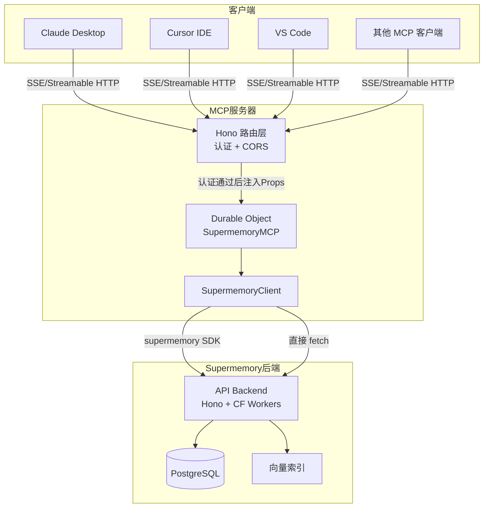

---

## 2. 服务器架构

### 2.1 整体架构

MCP 服务器采用两层架构：外层 Hono 应用负责路由与认证，内层 Durable Object 负责协议处理与业务逻辑。

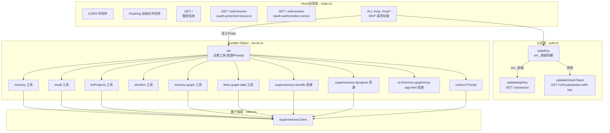

### 2.2 类图

```mermaid
classDiagram
    class McpAgent {
        <<abstract>>
        +ctx: DurableObjectState
        +env: Env
        +props: Props
        +init(): Promise~void~
        +serve(path, options): McpAgentHandler
    }

    class SupermemoryMCP {
        -clientInfo: {name, version} | null
        -cachedContainerTags: string[]
        -containerTagsLastFetchedAt: number | null
        +server: McpServer
        +init(): Promise~void~
        -getClient(containerTag?): SupermemoryClient
        -handleMemory(args): Promise~ToolResult~
        -handleRecall(args): Promise~ToolResult~
        -getClientInfo(): Promise~ClientInfo~
        -getMcpSessionId(): string
        -ensureContainerTagsFresh(): Promise~void~
        -refreshContainerTags(): Promise~void~
        -getContainerTagDescription(): string
    }

    class SupermemoryClient {
        -client: Supermemory
        -containerTag: string
        -bearerToken: string
        -apiUrl: string
        +createMemory(content): Promise~CreateResult~
        +forgetMemory(content): Promise~ForgetResult~
        +search(query, limit, threshold?): Promise~SearchResult~
        +getProfile(query?): Promise~ProfileResponse~
        +getProjects(): Promise~string[]~
        +getDocuments(containerTags?, page, limit): Promise~DocumentsApiResponse~
        -handleError(error): never
    }

    class AuthModule {
        +isApiKey(token): boolean
        +validateApiKey(apiKey, apiUrl): Promise~AuthUser | null~
        +validateOAuthToken(token, apiUrl): Promise~AuthUser | null~
    }

    class PostHogModule {
        +init(apiKey): void
        +memoryAdded(props): Promise~void~
        +memorySearch(props): Promise~void~
        +memoryForgot(props): Promise~void~
        +shutdown(): Promise~void~
    }

    class AuthUser {
        +userId: string
        +apiKey: string
        +email?: string
        +name?: string
    }

    class Props {
        +userId: string
        +apiKey: string
        +containerTag?: string
        +email?: string
        +name?: string
    }

    McpAgent <|-- SupermemoryMCP
    SupermemoryMCP --> SupermemoryClient : 创建并使用
    SupermemoryMCP --> PostHogModule : 事件追踪
    AuthModule --> AuthUser : 返回
    SupermemoryMCP ..> Props : 从认证注入
```

### 2.3 路由设计

| 路由 | 方法 | 说明 |
|------|------|------|
| `/` | GET | 返回服务信息（名称、版本、描述、文档链接） |
| `/.well-known/oauth-protected-resource` | GET | OAuth 受保护资源发现，返回授权服务器地址和作用域 |
| `/.well-known/oauth-protected-resource/mcp` | GET | 同上，MCP 子路径变体 |
| `/.well-known/oauth-authorization-server` | GET | 代理主 API 的授权服务器元数据 |
| `/mcp` | ALL | MCP 协议请求入口（含认证） |
| `/mcp/*` | ALL | MCP 协议请求入口（含认证） |

---

## 3. 认证流程

### 3.1 双模式认证时序图

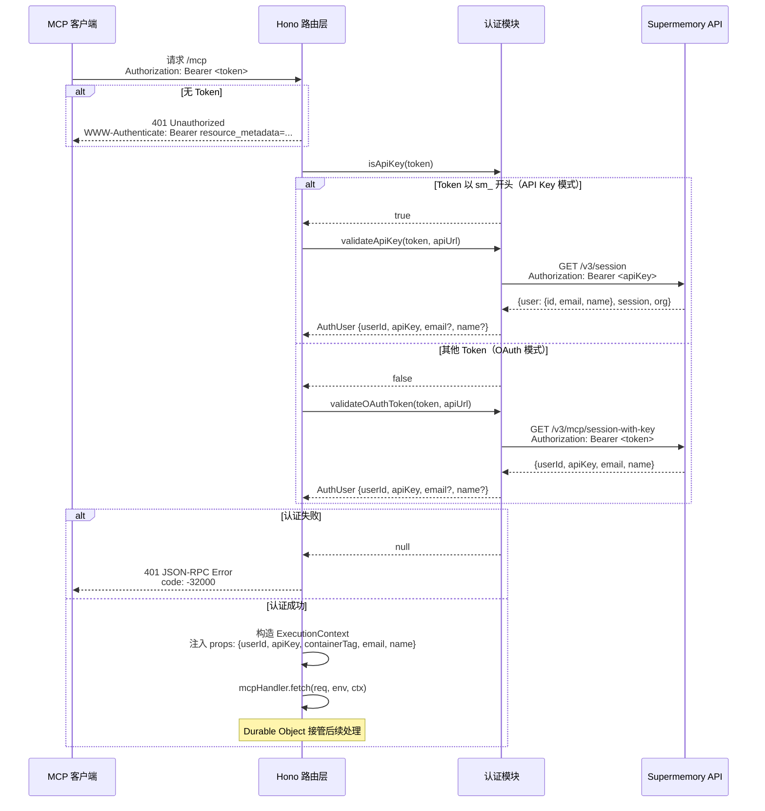

### 3.2 认证判断流程图

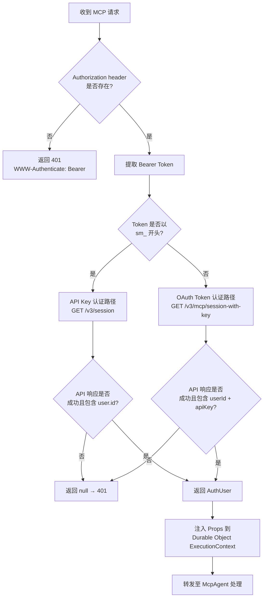

### 3.3 认证错误处理

两种认证路径对 API 返回的错误码有统一的处理逻辑：

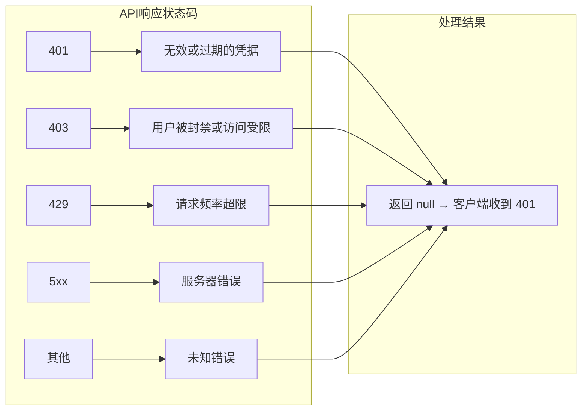

---

## 4. 工具处理流程

### 4.1 工具注册总览

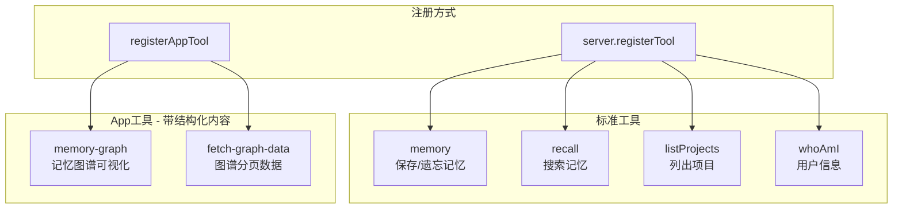

### 4.2 memory 工具流程

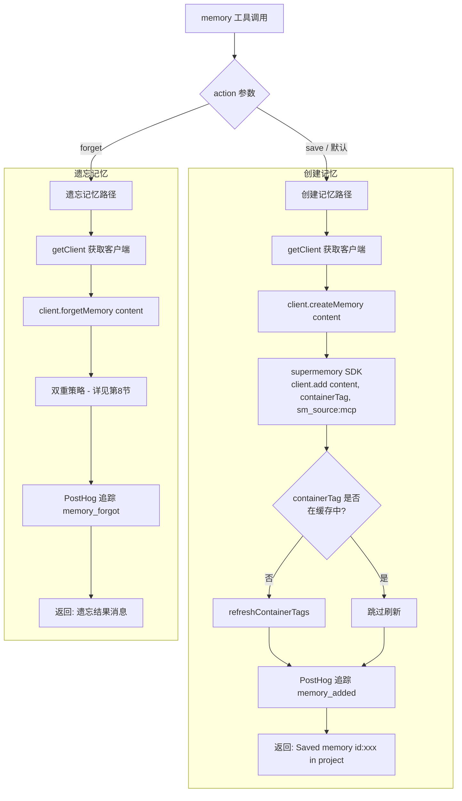

### 4.3 recall 工具流程

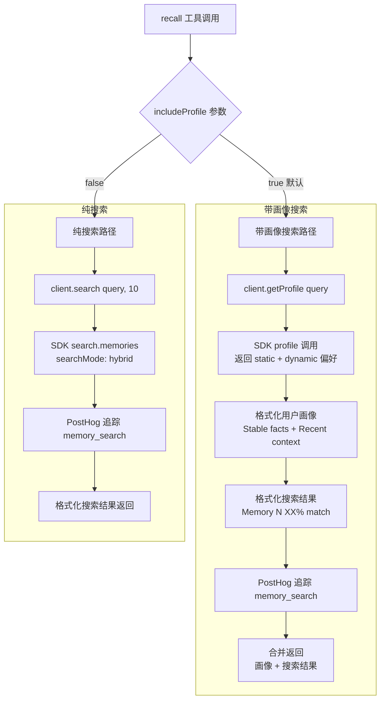

### 4.4 listProjects 工具流程

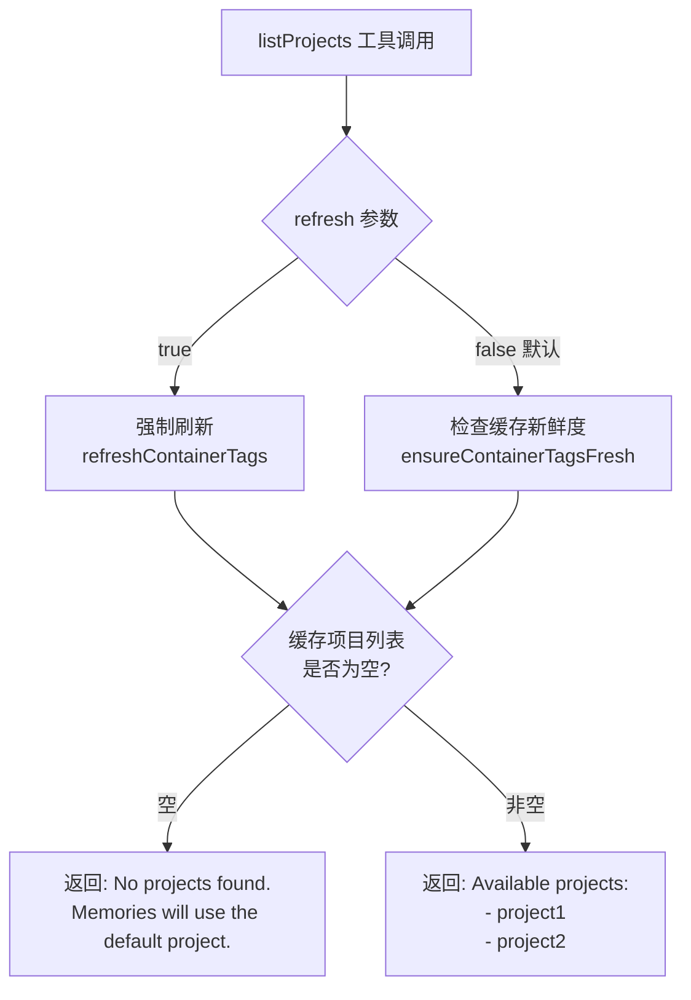

### 4.5 whoAmI 工具流程

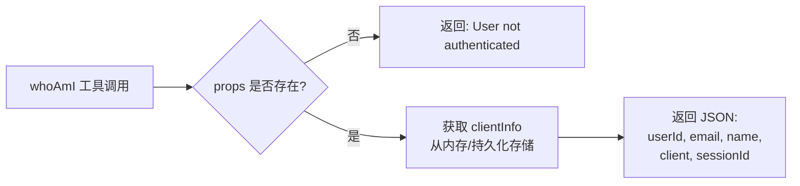

### 4.6 memory-graph 与 fetch-graph-data 工具流程

```mermaid
flowchart TD
    subgraph memory-graph
        A[memory-graph 调用] --> A1[确定 effectiveContainerTag]
        A1 --> A2[client.getDocuments<br/>containerTags, page=1, limit=10]
        A2 --> A3[统计文档数和记忆数]
        A3 --> A4[返回 text + structuredContent<br/>documents + totalCount]
    end

    subgraph fetch-graph-data
        B[fetch-graph-data 调用] --> B1[确定 effectiveContainerTag]
        B1 --> B2[client.getDocuments<br/>containerTags, page, limit]
        B2 --> B3[返回 text + structuredContent<br/>完整分页数据]
    end

    Note1[visibility: app only<br/>仅 App UI 可见] -.-> B

    subgraph App UI 渲染
        A4 --> UI[mcp-app.html<br/>力导向图渲染]
        B3 --> UI
    end
```

---

## 5. 资源处理

### 5.1 资源注册总览

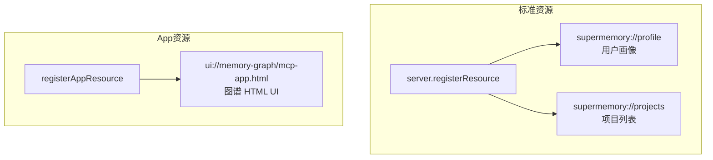

### 5.2 资源处理流程

```mermaid
flowchart TD
    subgraph profile资源
        P1[读取 supermemory://profile] --> P2[client.getProfile]
        P2 --> P3[格式化为 Markdown]
        P3 --> P4{有内容?}
        P4 -->|是| P5["# User Profile\n## Stable Preferences\n- ...\n## Recent Activity\n- ..."]
        P4 -->|否| P6[No profile yet. Start saving memories.]
    end

    subgraph projects资源
        PR1[读取 supermemory://projects] --> PR2[ensureContainerTagsFresh]
        PR2 --> PR3[返回 JSON<br/>{projects: [...]}]
    end

    subgraph graph UI资源
        G1[读取 ui://memory-graph/mcp-app.html] --> G2[返回预编译的<br/>mcp-app.html<br/>MIME: application/vnd.mcp-app]
    end
```

---

## 6. Prompt 注入

### 6.1 context Prompt 流程

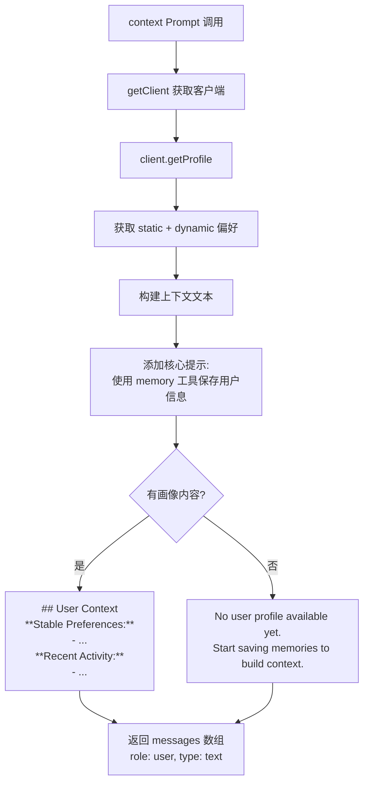

### 6.2 Prompt 注入在对话中的位置

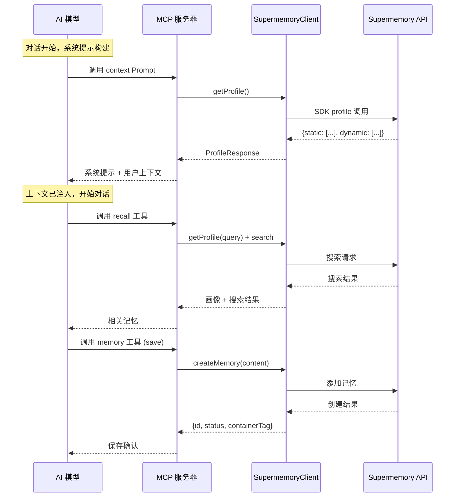

---

## 7. 客户端实现

### 7.1 SupermemoryClient 方法与 API 映射

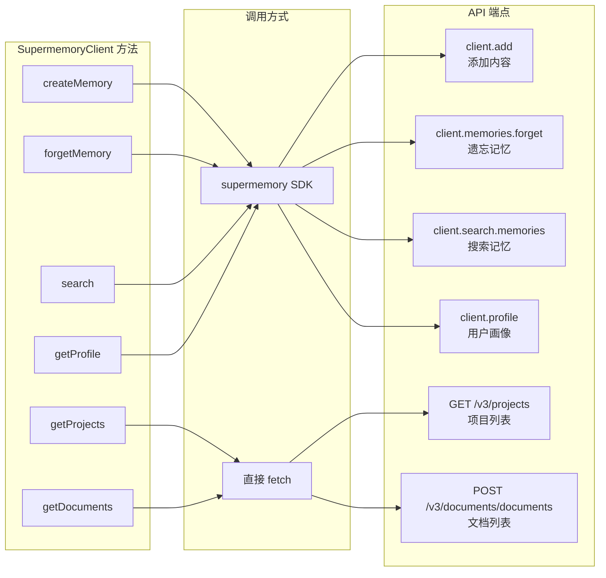

### 7.2 客户端初始化与配置

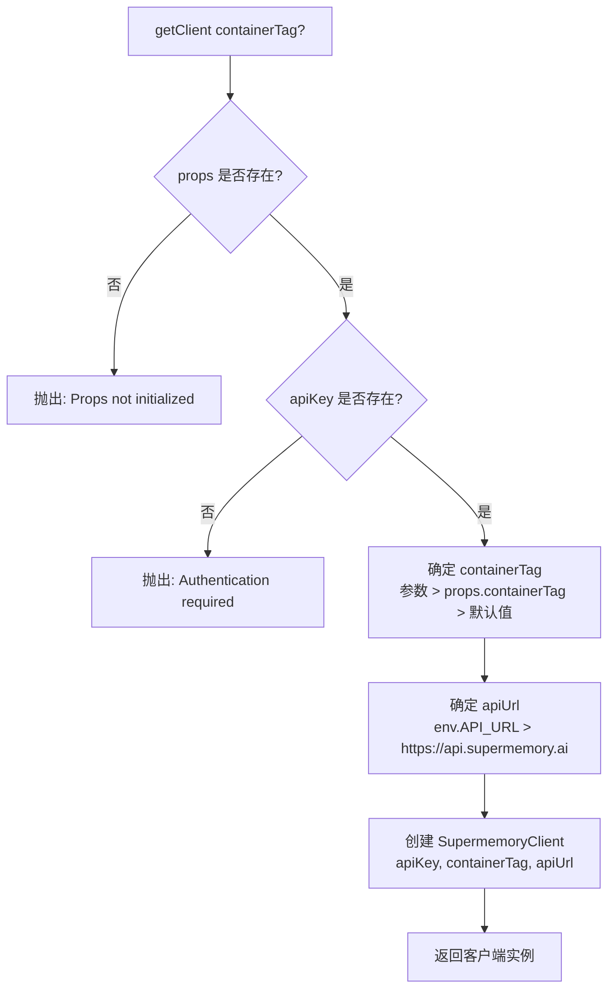

### 7.3 内容限制机制

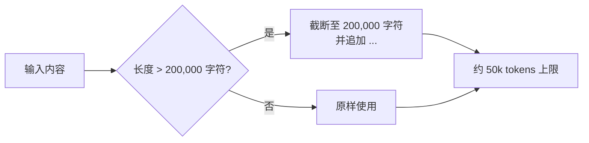

---

## 8. 遗忘双重策略

遗忘操作采用"精确匹配优先，语义搜索兜底"的双重策略，确保记忆能被可靠地删除。

### 8.1 完整流程图

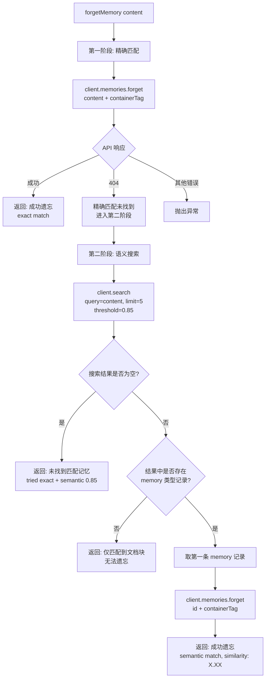

### 8.2 时序图

```mermaid
sequenceDiagram
    participant Server as SupermemoryMCP
    participant Client as SupermemoryClient
    participant SDK as supermemory SDK
    participant API as Supermemory API

    Server->>Client: forgetMemory(content)

    Note over Client: 第一阶段：精确匹配
    Client->>SDK: memories.forget({content, containerTag})
    SDK->>API: DELETE / 遗忘请求 (精确内容匹配)

    alt 精确匹配成功
        API-->>SDK: {id: "xxx"}
        SDK-->>Client: 成功
        Client-->>Server: {success: true, message: "exact match"}
    else 精确匹配 404
        API-->>SDK: 404 Not Found
        SDK-->>Client: Error {status: 404}

        Note over Client: 第二阶段：语义搜索
        Client->>SDK: search.memories({q: content, limit: 5, threshold: 0.85})
        SDK->>API: 搜索请求
        API-->>SDK: 搜索结果
        SDK-->>Client: SearchResult

        alt 有 memory 类型结果
            Client->>SDK: memories.forget({id: memoryToDelete.id, containerTag})
            SDK->>API: DELETE / 遗忘请求 (ID 匹配)
            API-->>SDK: 成功
            SDK-->>Client: 成功
            Client-->>Server: {success: true, message: "semantic match, similarity: 0.XX"}
        else 无 memory 类型结果
            Client-->>Server: {success: false, message: "only chunks matched"}
        end
    else 其他错误
        API-->>SDK: Error
        SDK-->>Client: 抛出异常
        Client->>Client: handleError()
    end
```

---

## 9. 错误处理

### 9.1 错误处理映射

SupermemoryClient 的 `handleError()` 方法将 HTTP 状态码和异常类型统一映射为用户友好的错误消息：

```mermaid
flowchart TD
    A[捕获异常] --> B{异常类型判断}

    B -->|TypeError 且包含<br/>fetch/network| C[Network error.<br/>请检查网络连接]

    B -->|对象含 status 属性| D{HTTP 状态码}
    D -->|400 / 422| E[Invalid request parameters.<br/>请检查输入]
    D -->|401| F[Authentication failed.<br/>请重新认证]
    D -->|402| G[Memory limit reached.<br/>请升级 supermemory.ai]
    D -->|403| H[Access forbidden.<br/>账户可能受限或被封禁]
    D -->|404| I[Memory not found.<br/>可能已被删除]
    D -->|429| J[Rate limit exceeded.<br/>请稍后重试]
    D -->|5xx| K[Server error.<br/>服务可能暂时不可用]

    B -->|Error 实例| L[原样抛出]
    B -->|其他| M[An unexpected error occurred]

    C --> N[throw Error]
    E --> N
    F --> N
    G --> N
    H --> N
    I --> N
    J --> N
    K --> N
    L --> N
    M --> N
```

### 9.2 错误在各层的传播

```mermaid
flowchart TD
    subgraph SupermemoryClient
        A[API 调用失败] --> B[handleError<br/>状态码映射]
        B --> C[throw Error<br/>用户友好消息]
    end

    subgraph SupermemoryMCP 工具处理
        C --> D[catch 捕获]
        D --> E[提取 error.message]
        E --> F[返回 ToolResult<br/>isError: true<br/>text: Error: message]
    end

    subgraph MCP 协议层
        F --> G[封装为 MCP<br/>isError 响应]
        G --> H[客户端收到<br/>错误工具结果]
    end
```

### 9.3 认证层错误处理

认证层（index.ts）的错误处理与客户端层不同，直接返回 HTTP 响应：

```mermaid
flowchart TD
    A[认证失败] --> B{失败原因}

    B -->|无 Token| C[401 Unauthorized<br/>WWW-Authenticate: Bearer resource_metadata=...]
    B -->|API Key 无效| D[401 JSON-RPC Error<br/>code: -32000<br/>message: Invalid or expired API key]
    B -->|OAuth Token 无效| E[401 JSON-RPC Error<br/>code: -32000<br/>message: Invalid or expired token<br/>WWW-Authenticate: Bearer error=invalid_token]
```

---

## 10. 关键设计细节

### 10.1 containerTag 缓存机制

```mermaid
flowchart TD
    A[需要 containerTag 列表] --> B{containerTagsLastFetchedAt<br/>是否存在?}
    B -->|null| C[需要刷新]
    B -->|有值| D{距上次刷新<br/>是否超过 5 分钟?}
    D -->|是| C
    D -->|否| E[使用缓存]

    C --> F[refreshContainerTags]
    F --> G[client.getProjects]
    G --> H[GET /v3/projects]
    H --> I[更新 cachedContainerTags]
    I --> J[更新 containerTagsLastFetchedAt]
    J --> E
```

### 10.2 客户端信息持久化

```mermaid
sequenceDiagram
    participant DO as Durable Object
    participant Storage as ctx.storage
    participant SDK as MCP SDK

    Note over DO: init() 阶段
    DO->>Storage: get("clientInfo")
    alt 存储中有值
        Storage-->>DO: {name, version}
        DO->>DO: this.clientInfo = storedClientInfo
    end

    Note over DO: MCP 连接初始化完成
    DO->>SDK: server.oninitialized 回调
    SDK-->>DO: getClientVersion() → {name, version}
    DO->>DO: this.clientInfo = {name, version}
    DO->>Storage: put("clientInfo", {name, version})

    Note over DO: 后续工具调用
    DO->>DO: getClientInfo()
    DO->>DO: 返回 this.clientInfo
```

### 10.3 PostHog 事件追踪

```mermaid
flowchart TD
    subgraph 追踪事件
        MA[memory_added<br/>记忆保存]
        MS[memory_search<br/>记忆搜索]
        MF[memory_forgot<br/>记忆遗忘]
    end

    subgraph 通用属性
        UID[userId]
        SRC[source: mcp]
        VER[mcp_server_version: 4.0.0]
        CN[mcp_client_name]
        CV[mcp_client_version]
        SID[sessionId]
        CT[containerTag]
    end

    subgraph 事件特有属性
        MA_P[type: note<br/>project_id<br/>content_length]
        MS_P[query_length<br/>results_count<br/>search_duration_ms<br/>container_tags_count]
        MF_P[content_length]
    end

    MA --> UID
    MA --> MA_P
    MS --> UID
    MS --> MS_P
    MF --> UID
    MF --> MF_P
```

### 10.4 containerTag 优先级与项目隔离

```mermaid
flowchart TD
    A[确定 effectiveContainerTag] --> B{工具参数中<br/>是否指定 containerTag?}
    B -->|是| C[使用参数值]
    B -->|否| D{props 中是否有<br/>mcpRootContainerTag?}
    D -->|是| E[使用 props.containerTag<br/>来自 x-sm-project header]
    D -->|否| F[使用默认值<br/>sm_project_default]

    C --> G[项目级隔离]
    E --> G
    F --> G

    subgraph 项目隔离效果
        G --> H[记忆保存到指定项目]
        G --> I[搜索范围限定在项目内]
        G --> J[图谱仅展示项目数据]
    end
```

### 10.5 hasRootContainerTag 对 Schema 的影响

当通过 `x-sm-project` header 指定了根 containerTag 时，工具的输入 Schema 会动态调整：

```mermaid
flowchart TD
    A[init 阶段] --> B{hasRootContainerTag<br/>= !!props.containerTag}

    B -->|true| C[memory Schema<br/>不含 containerTag 字段]
    B -->|true| D[recall Schema<br/>不含 containerTag 字段]
    B -->|true| E[memory-graph Schema<br/>不含 containerTag 字段]

    B -->|false| F[memory Schema<br/>含可选 containerTag 字段]
    B -->|false| G[recall Schema<br/>含可选 containerTag 字段]
    B -->|false| H[memory-graph Schema<br/>含可选 containerTag 字段]

    C --> I[项目已固定<br/>用户无需选择]
    F --> J[项目未固定<br/>用户可选择项目]
```

---

## 11. OAuth 发现机制

MCP 服务器实现了完整的 OAuth 2.0 受保护资源发现，使 MCP 客户端能够自动发现授权方式：

```mermaid
sequenceDiagram
    participant Client as MCP 客户端
    participant MCPServer as MCP 服务器
    participant MainAPI as Supermemory 主 API

    Note over Client: 1. 发现受保护资源
    Client->>MCPServer: GET /.well-known/oauth-protected-resource
    MCPServer-->>Client: {resource, authorization_servers, scopes_supported, bearer_methods_supported}

    Note over Client: 2. 发现授权服务器（部分客户端直接在 MCP 域名查找）
    Client->>MCPServer: GET /.well-known/oauth-authorization-server
    MCPServer->>MainAPI: GET /.well-known/oauth-authorization-server
    MainAPI-->>MCPServer: 授权服务器元数据
    MCPServer-->>Client: 代理返回元数据

    Note over Client: 3. 发起 OAuth 授权流程
    Client->>MainAPI: OAuth 授权请求
    MainAPI-->>Client: 授权码 / Token

    Note over Client: 4. 使用 Token 访问 MCP
    Client->>MCPServer: POST /mcp<br/>Authorization: Bearer <oauth_token>
    MCPServer->>MainAPI: GET /v3/mcp/session-with-key<br/>验证 Token 并获取 API Key
    MainAPI-->>MCPServer: {userId, apiKey, email, name}
    MCPServer-->>Client: MCP 响应
```

---

## 12. 完整请求生命周期

一个典型的 MCP 客户端与 Supermemory MCP 服务器的完整交互生命周期：

```mermaid
sequenceDiagram
    participant Client as MCP 客户端
    participant Hono as Hono 路由层
    participant Auth as 认证模块
    participant DO as SupermemoryMCP<br/>Durable Object
    participant ClientLib as SupermemoryClient
    participant API as Supermemory API
    participant PostHog as PostHog

    Note over Client,API: === 连接建立 ===

    Client->>Hono: POST /mcp (初始化请求)<br/>Authorization: Bearer sm_xxx
    Hono->>Auth: validateApiKey(sm_xxx)
    Auth->>API: GET /v3/session
    API-->>Auth: {user: {id, email, name}}
    Auth-->>Hono: AuthUser
    Hono->>DO: fetch(req, env, ctx with props)

    DO->>DO: init()<br/>注册工具/资源/Prompt
    DO->>DO: 从 storage 读取 clientInfo
    DO->>ClientLib: getProjects() → 刷新 containerTag 缓存

    DO-->>Client: 初始化成功响应

    Note over Client,API: === 客户端信息捕获 ===

    DO->>DO: oninitialized 回调
    DO->>DO: 保存 clientInfo 到 storage

    Note over Client,API: === 记忆保存 ===

    Client->>Hono: POST /mcp (memory save)<br/>x-sm-project: my-project
    Hono->>Auth: 验证 Token
    Auth-->>Hono: AuthUser
    Hono->>DO: fetch with props.containerTag = my-project

    DO->>ClientLib: createMemory(content)
    ClientLib->>API: client.add(content, containerTag, sm_source:mcp)
    API-->>ClientLib: {id, status}
    ClientLib-->>DO: {id, status, containerTag}

    DO->>PostHog: memoryAdded 事件
    DO-->>Client: Saved memory (id: xxx) in my-project

    Note over Client,API: === 记忆搜索 ===

    Client->>Hono: POST /mcp (recall)
    Hono->>DO: fetch with props

    DO->>ClientLib: getProfile(query)
    ClientLib->>API: client.profile(containerTag, q)
    API-->>ClientLib: {static, dynamic, searchResults}
    ClientLib-->>DO: ProfileResponse

    DO->>PostHog: memorySearch 事件
    DO-->>Client: 画像 + 搜索结果

    Note over Client,API: === 记忆遗忘 ===

    Client->>Hono: POST /mcp (memory forget)
    Hono->>DO: fetch with props

    DO->>ClientLib: forgetMemory(content)
    ClientLib->>API: memories.forget(content) → 404
    ClientLib->>API: search(content, 5, 0.85)
    API-->>ClientLib: 搜索结果
    ClientLib->>API: memories.forget(id)
    API-->>ClientLib: 成功
    ClientLib-->>DO: {success, message, containerTag}

    DO->>PostHog: memoryForgot 事件
    DO-->>Client: 遗忘结果
```
