# 记忆引擎核心模块设计文档

## 1. 模块概述

记忆引擎（Memory Engine）是 Supermemory 项目的核心模块，负责用户记忆的全生命周期管理——从记忆的提取、存储、版本管理，到遗忘、去重、检索与画像生成。其设计目标是让 AI 系统像人类一样"记住"用户信息，并能在合适的时机遗忘过时信息。

### 核心职责

| 职责 | 说明 |
|------|------|
| 记忆存储 | 持久化用户记忆，支持多空间、多组织隔离 |
| 版本管理 | 通过版本链追踪记忆的更新演化 |
| 遗忘机制 | 基于时间或原因自动遗忘过时记忆 |
| 去重合并 | 跨来源去重，保证记忆唯一性 |
| 语义检索 | 基于嵌入向量的语义搜索 |
| 画像生成 | 区分静态画像与动态上下文 |

### 模块架构总览

```mermaid
graph TB
    subgraph 记忆引擎
        ME[Memory Engine]
        ME --> ME_Store[记忆存储层]
        ME --> ME_Version[版本链管理]
        ME --> ME_Forget[遗忘机制]
        ME --> ME_Dedup[去重引擎]
        ME --> ME_Search[语义检索]
        ME --> ME_Profile[画像生成]
        ME --> ME_Cache[记忆缓存]
    end

    subgraph 外部接口
        API_CONV[/v4/conversations]
        API_PROFILE[/v4/profile]
        API_PROFILE_V3[/v3/container-tags/:tag/profile]
    end

    ME_Store --> API_CONV
    ME_Search --> API_PROFILE
    ME_Profile --> API_PROFILE
    ME_Profile --> API_PROFILE_V3
    ME_Cache --> ME_Search
```

---

## 2. 数据模型

### 2.1 MemoryEntry 完整字段

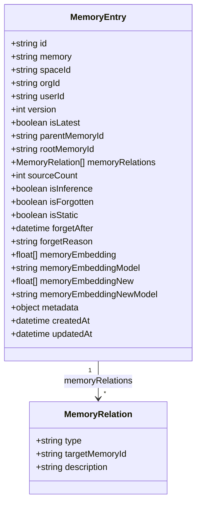

### 2.2 字段分组说明

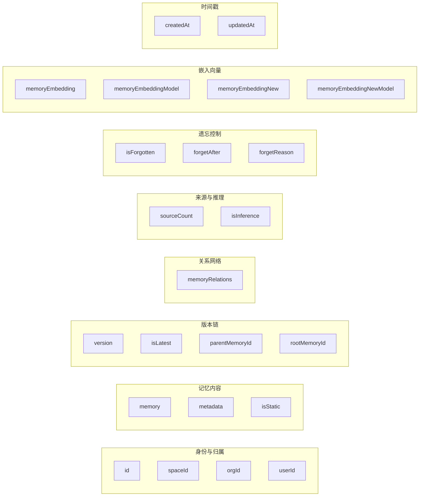

---

## 3. 记忆关系类型

### 3.1 三种关系类型

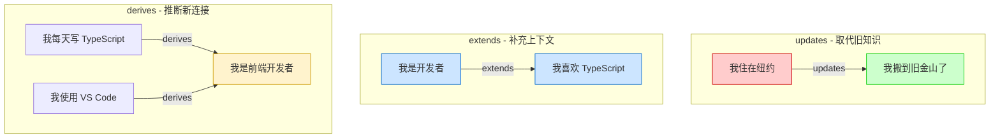

### 3.2 关系类型对比

| 关系类型 | 语义 | 旧记忆状态 | 典型场景 |
|----------|------|-----------|---------|
| `updates` | 新信息取代旧知识 | `isLatest=false` | 搬家、换工作、偏好变更 |
| `extends` | 补充信息添加上下文 | 保持 `isLatest=true` | 兴趣扩展、技能补充 |
| `derives` | 从模式分析推断新连接 | 保持不变 | 行为模式推断 |

### 3.3 关系处理流程

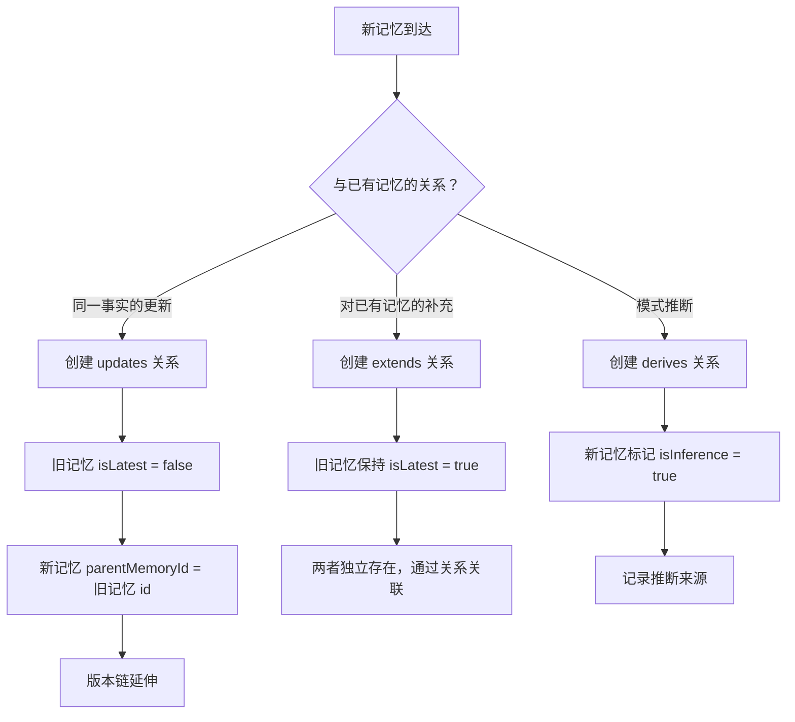

---

## 4. 记忆版本链

### 4.1 版本链数据结构

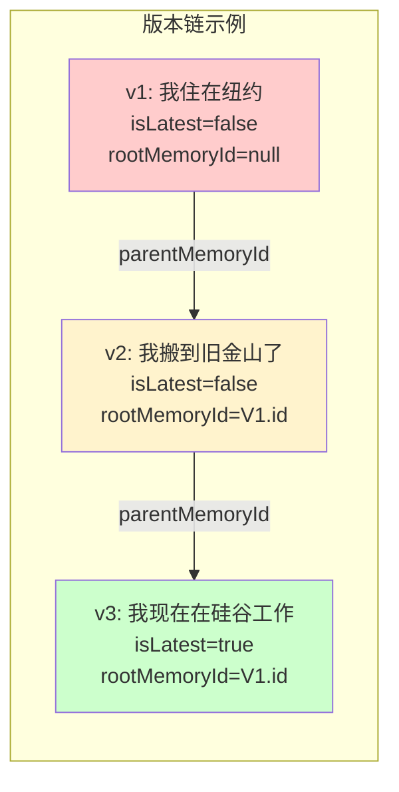

### 4.2 VersionChainIndex 类

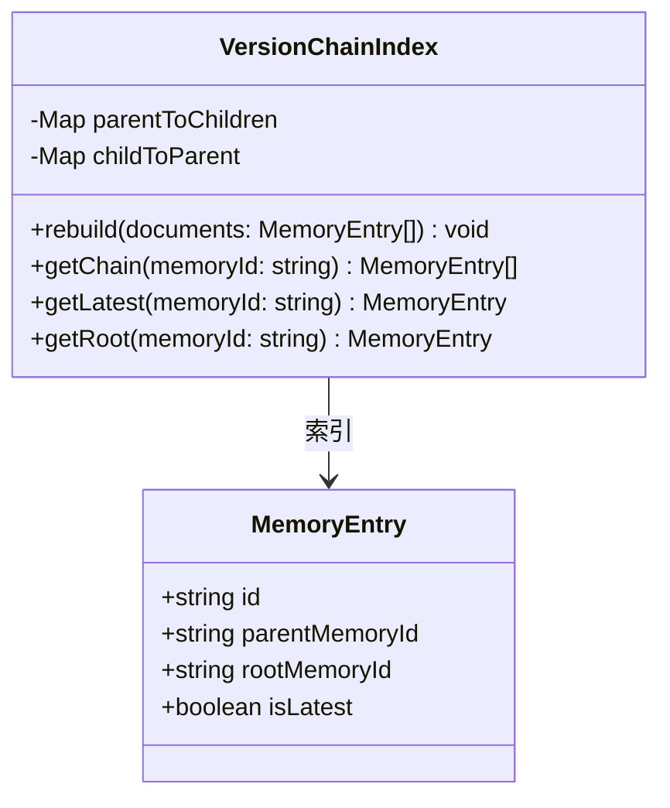

### 4.3 版本链构建流程

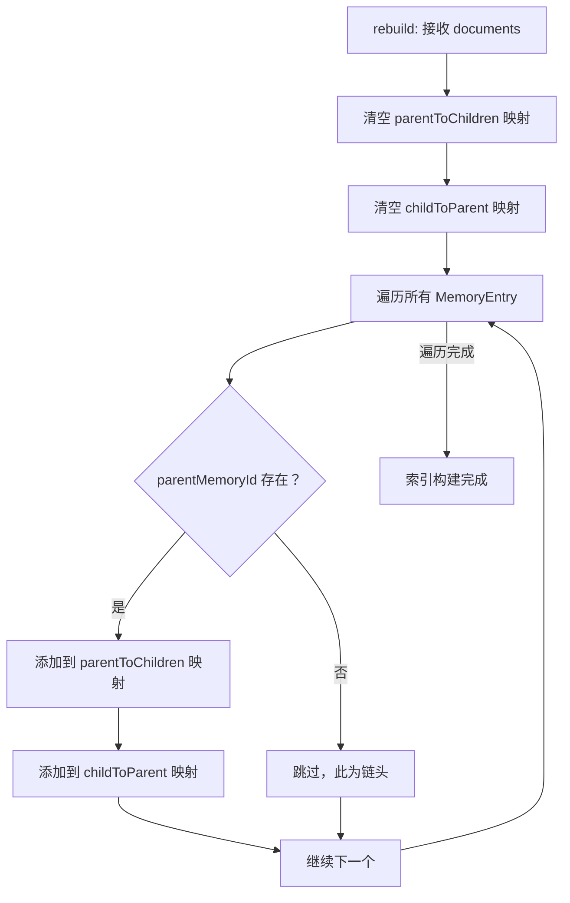

### 4.4 版本链遍历流程

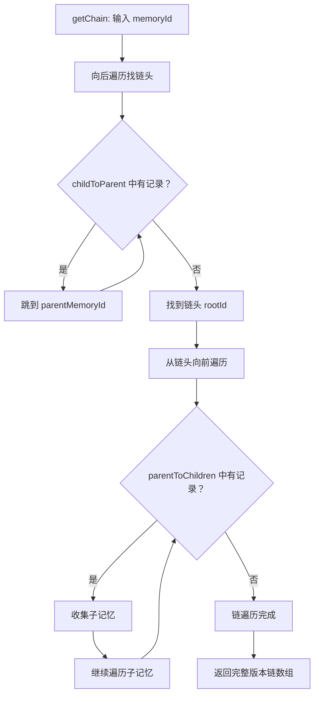

### 4.5 版本更新时序

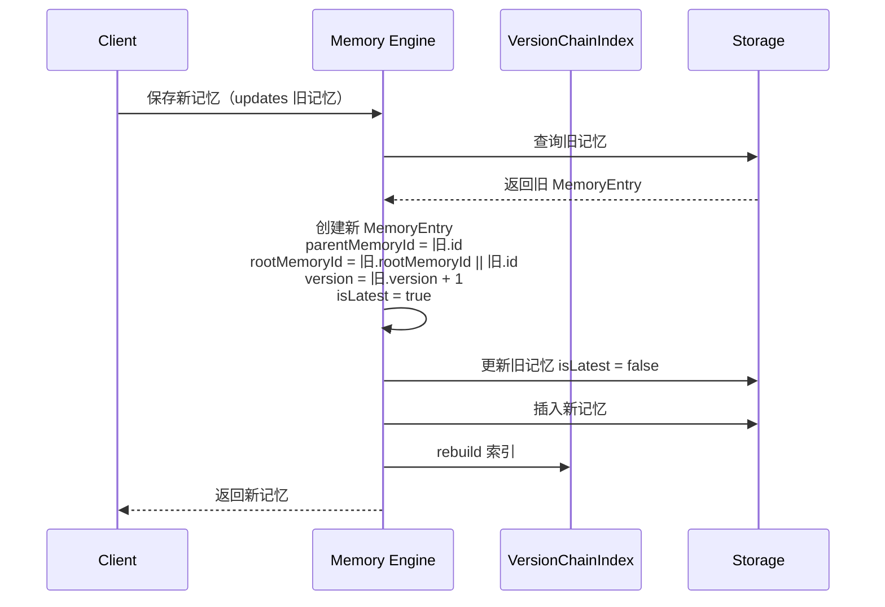

---

## 5. 遗忘机制

### 5.1 遗忘状态机

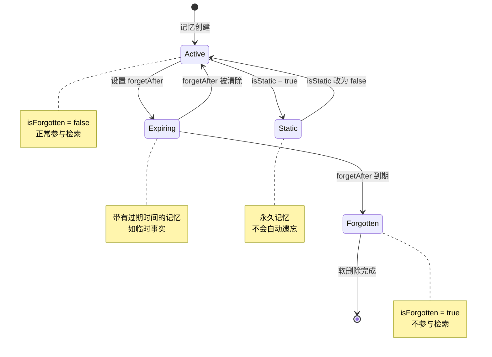

### 5.2 遗忘流程

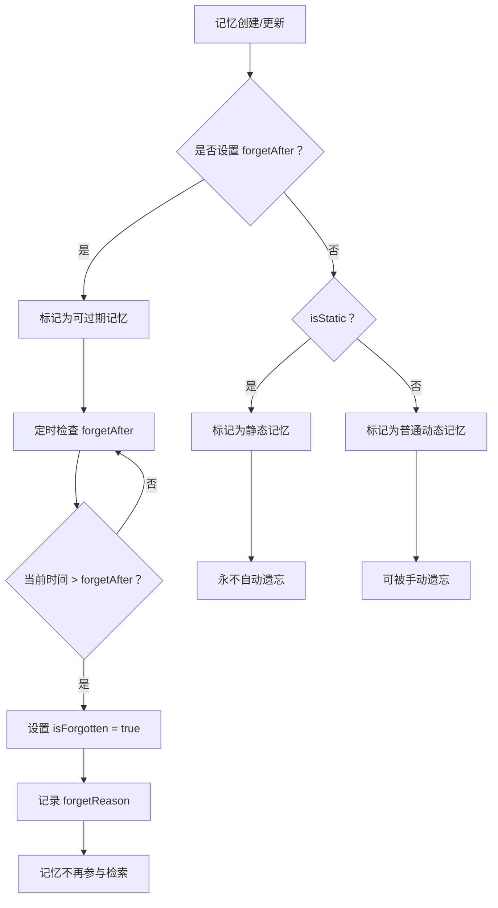

### 5.3 遗忘场景示例

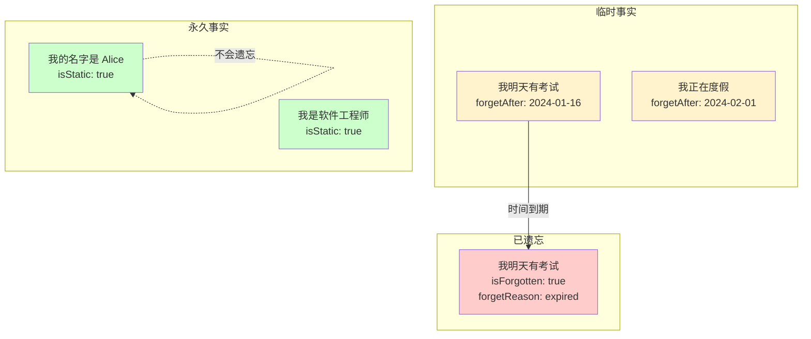

---

## 6. 记忆去重

### 6.1 去重流程

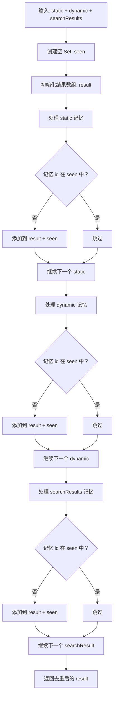

### 6.2 去重优先级

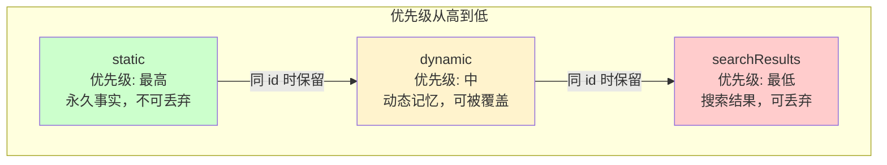

### 6.3 去重算法伪代码

```mermaid
flowchart LR
    A["deduplicateMemories(static, dynamic, searchResults)"] --> B["seen = new Set()"]
    B --> C["result = []"]
    C --> D["for m of static"]
    D --> E["if !seen.has(m.id)"]
    E --> F["seen.add(m.id); result.push(m)"]
    F --> G["for m of dynamic"]
    G --> H["if !seen.has(m.id)"]
    H --> I["seen.add(m.id); result.push(m)"]
    I --> J["for m of searchResults"]
    J --> K["if !seen.has(m.id)"]
    K --> L["seen.add(m.id); result.push(m)"]
    L --> M["return result"]
```

---

## 7. 对话记忆保存

### 7.1 对话保存时序

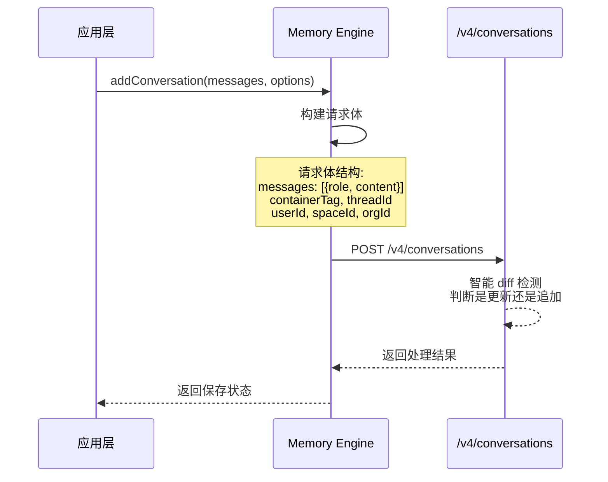

### 7.2 消息结构

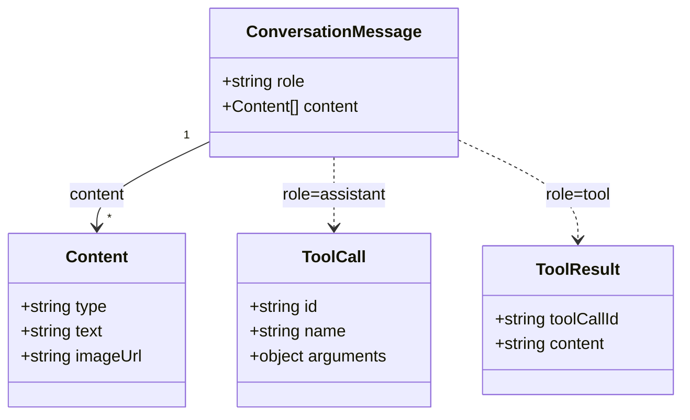

### 7.3 支持的消息角色

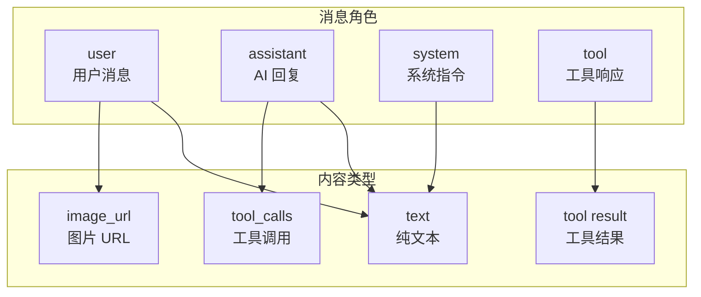

### 7.4 后端智能处理

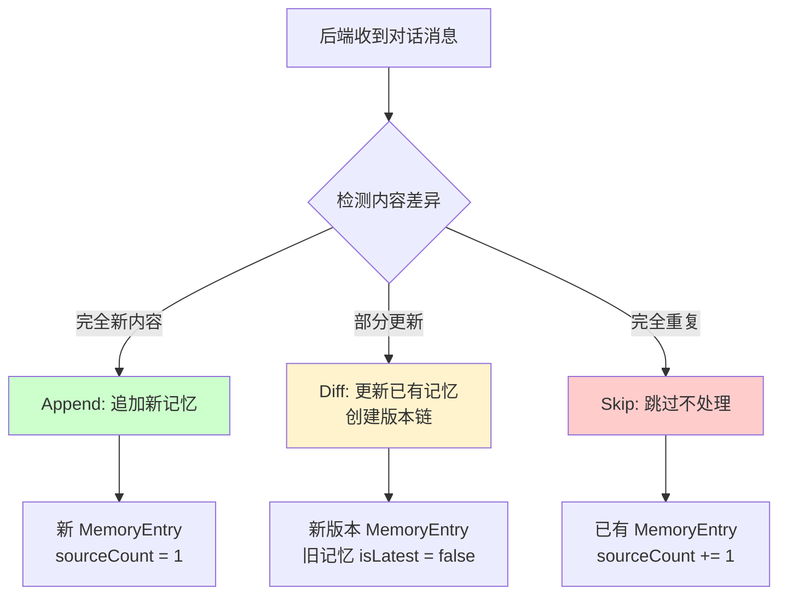

---

## 8. 记忆检索流程

### 8.1 完整检索时序

```mermaid
sequenceDiagram
    participant App as 应用层
    participant Engine as Memory Engine
    participant Cache as MemoryCache
    participant API as /v4/profile

    App->>Engine: retrieveMemories(messages, options)
    Engine->>Engine: extractQueryText(messages)

    Engine->>Cache: 检查缓存<br/>key = containerTag:threadId:mode:normalizedMessage

    alt 缓存命中
        Cache-->>Engine: 返回缓存结果
        Engine-->>App: 返回记忆
    else 缓存未命中
        Cache-->>Engine: null

        Engine->>API: POST /v4/profile<br/>{query, containerTag, mode, ...}
        API-->>Engine: {profile: {static, dynamic}, searchResults}

        Engine->>Engine: deduplicateMemories(static, dynamic, searchResults)

        Engine->>Engine: convertProfileToMarkdown(profile)

        Engine->>Cache: 写入缓存

        Engine-->>App: 返回格式化记忆
    end
```

### 8.2 查询文本提取

```mermaid
flowchart TD
    A[输入: messages 数组] --> B[遍历消息]
    B --> C{消息角色}
    C -->|user| D[提取用户消息文本]
    C -->|assistant| E[跳过]
    C -->|system| F[跳过]
    C -->|tool| G[跳过]

    D --> H[拼接所有用户消息]
    H --> I[normalizeMessage: 标准化处理]
    I --> J[返回查询文本]
```

### 8.3 三种检索模式

```mermaid
graph TD
    subgraph 检索模式
        PROFILE["profile 模式<br/>仅获取用户画像<br/>static + dynamic"]
        QUERY["query 模式<br/>仅获取搜索结果<br/>searchResults"]
        FULL["full 模式<br/>画像 + 搜索结果<br/>static + dynamic + searchResults"]
    end

    subgraph 适用场景
        S1["简单对话<br/>不需要额外搜索"]
        S2["知识问答<br/>需要语义搜索"]
        S3["复杂任务<br/>需要完整上下文"]
    end

    PROFILE --> S1
    QUERY --> S2
    FULL --> S3

    style PROFILE fill:#cce5ff
    style QUERY fill:#fff3cd
    style FULL fill:#ccffcc
```

### 8.4 记忆缓存机制

```mermaid
classDiagram
    class MemoryCache {
        -Map~string, CacheEntry~ cache
        -int maxSize
        +get(key: string) CacheEntry
        +set(key: string, value: CacheEntry) void
        +delete(key: string) void
        +clear() void
    }

    class CacheEntry {
        +string key
        +object value
        +datetime timestamp
    }

    MemoryCache "1" --> "*" CacheEntry

    note for MemoryCache "LRU 策略\nmaxSize = 100\nkey = containerTag:threadId:mode:normalizedMessage"
```

### 8.5 缓存键生成流程

```mermaid
flowchart LR
    A[containerTag] --> D[拼接]
    B[threadId] --> D
    C[mode] --> D
    E[normalizedMessage] --> D

    D --> F["containerTag:threadId:mode:normalizedMessage"]

    subgraph normalizedMessage 生成
        N1[原始用户消息] --> N2[去除首尾空白]
        N2 --> N3[转小写]
        N3 --> N4[截断至合理长度]
        N4 --> N5[normalizedMessage]
    end

    N5 --> E
```

---

## 9. 用户画像生成

### 9.1 画像生成流程

```mermaid
flowchart TD
    A[请求用户画像] --> B{API 选择}
    B -->|GET| C["/v3/container-tags/:containerTag/profile"]
    B -->|POST| D["/v4/profile"]

    C --> E[返回 profile]
    D --> F[语义搜索 + 画像生成]
    F --> E

    E --> G[分离 static 和 dynamic]
    G --> H[Static Profile: isStatic=true 的记忆]
    G --> I[Dynamic Context: 最近的动态记忆]

    H --> J[格式化为 Markdown]
    I --> J
    J --> K[注入 system prompt]
```

### 9.2 静态画像 vs 动态上下文

```mermaid
graph TD
    subgraph Static Profile - 永久事实
        S1["姓名: Alice"]
        S2["职业: 软件工程师"]
        S3["偏好: TypeScript, React"]
        S4["语言: 中文、英文"]
    end

    subgraph Dynamic Context - 近期上下文
        D1["最近在重构认证模块"]
        D2["正在学习 Rust"]
        D3["明天有团队会议"]
        D4["刚从旧金山出差回来"]
    end

    S1 -.->|isStatic=true| DB[(记忆存储)]
    S2 -.->|isStatic=true| DB
    D1 -.->|isStatic=false| DB
    D2 -.->|isStatic=false| DB

    style S1 fill:#ccffcc
    style S2 fill:#ccffcc
    style S3 fill:#ccffcc
    style S4 fill:#ccffcc
    style D1 fill:#cce5ff
    style D2 fill:#cce5ff
    style D3 fill:#fff3cd
    style D4 fill:#fff3cd
```

### 9.3 画像 Markdown 格式化

```mermaid
flowchart TD
    A[输入: profile 对象] --> B[构建 Markdown 字符串]
    B --> C{static 数组非空？}
    C -->|是| D[添加 "## 用户画像" 标题]
    D --> E[遍历 static 数组<br/>每条记忆作为列表项]
    C -->|否| F[跳过静态画像]

    E --> G{dynamic 数组非空？}
    F --> G
    G -->|是| H[添加 "## 近期上下文" 标题]
    H --> I[遍历 dynamic 数组<br/>每条记忆作为列表项]
    G -->|否| J[跳过动态上下文]

    I --> K[返回完整 Markdown]
    J --> K
```

### 9.4 画像注入到 Prompt

```mermaid
sequenceDiagram
    participant User as 用户
    participant App as 应用层
    participant Engine as Memory Engine
    participant LLM as 大语言模型

    User->>App: 发送消息
    App->>Engine: retrieveMemories(messages)

    Engine-->>App: 返回 Markdown 格式记忆

    App->>App: 构建 system prompt:<br/>[原始指令] + [记忆画像] + [近期上下文]

    App->>LLM: 发送完整 prompt
    LLM-->>App: 基于记忆上下文生成回复
    App-->>User: 个性化回复
```

---

## 10. 嵌入向量与模型迁移

### 10.1 双嵌入字段设计

```mermaid
classDiagram
    class EmbeddingFields {
        +float[] memoryEmbedding
        +string memoryEmbeddingModel
        +float[] memoryEmbeddingNew
        +string memoryEmbeddingNewModel
    }

    note for EmbeddingFields "memoryEmbedding: 当前使用的嵌入\nmemoryEmbeddingNew: 新模型嵌入（迁移中）\n迁移完成后 New → Embedding"
```

### 10.2 模型迁移流程

```mermaid
stateDiagram-v2
    [*] --> Stable: 正常运行（旧模型）
    Stable --> Migrating: 开始迁移
    Migrating --> Migrating: 计算新嵌入写入 memoryEmbeddingNew
    Migrating --> Switching: 所有记忆完成新嵌入计算
    Switching --> Stable: memoryEmbedding = memoryEmbeddingNew<br/>清空 memoryEmbeddingNew
```

---

## 11. 核心流程综合时序图

### 11.1 记忆完整生命周期

```mermaid
sequenceDiagram
    participant User as 用户
    participant App as 应用层
    participant Engine as Memory Engine
    participant Cache as MemoryCache
    participant VCI as VersionChainIndex
    participant API as Backend API
    participant DB as Storage

    rect rgb(230, 245, 255)
        Note over User, DB: 阶段1: 记忆写入
        User->>App: 发送对话消息
        App->>Engine: addConversation(messages)
        Engine->>API: POST /v4/conversations
        API->>DB: 存储 + diff 检测
        DB-->>API: 返回结果
        API-->>Engine: 返回记忆条目
        Engine->>VCI: rebuild 索引
    end

    rect rgb(255, 245, 230)
        Note over User, DB: 阶段2: 记忆检索
        User->>App: 发送新消息
        App->>Engine: retrieveMemories(messages)
        Engine->>Engine: extractQueryText
        Engine->>Cache: 查询缓存
        Cache-->>Engine: miss
        Engine->>API: POST /v4/profile
        API-->>Engine: {static, dynamic, searchResults}
        Engine->>Engine: deduplicateMemories
        Engine->>Engine: convertProfileToMarkdown
        Engine->>Cache: 写入缓存
        Engine-->>App: 返回格式化记忆
    end

    rect rgb(230, 255, 230)
        Note over User, DB: 阶段3: 遗忘处理
        Engine->>DB: 定时扫描 forgetAfter
        DB-->>Engine: 返回过期记忆
        Engine->>DB: isForgotten = true
        Engine->>DB: forgetReason = "expired"
    end
```

### 11.2 版本更新与检索交互

```mermaid
sequenceDiagram
    participant Client
    participant Engine as Memory Engine
    participant VCI as VersionChainIndex
    participant Dedup as 去重引擎
    participant API as Backend API

    Client->>Engine: 保存记忆 "我搬到旧金山了"
    Engine->>API: 检测到 updates 关系
    API->>Engine: 返回旧记忆 "我住在纽约"

    Engine->>Engine: 旧记忆 isLatest = false<br/>新记忆 parentMemoryId = 旧.id
    Engine->>VCI: rebuild 索引
    VCI->>VCI: 构建父子映射

    Note over Engine: 一段时间后...

    Client->>Engine: 检索记忆
    Engine->>API: POST /v4/profile
    API-->>Engine: static + dynamic + searchResults

    Engine->>Dedup: deduplicateMemories
    Dedup-->>Engine: 去重结果（仅包含 isLatest=true 的记忆）

    Engine-->>Client: 返回 "我搬到旧金山了"（旧记忆已遗忘）
```

---

## 12. 状态图总览

### 12.1 记忆条目完整状态

```mermaid
stateDiagram-v2
    [*] --> Created: 记忆创建

    Created --> Static: isStatic = true
    Created --> Dynamic: isStatic = false
    Created --> Expiring: forgetAfter 已设置

    Static --> Updated: updates 关系触发
    Dynamic --> Updated: updates 关系触发
    Dynamic --> Extended: extends 关系触发
    Expiring --> Forgotten: forgetAfter 到期

    Updated --> Superseded: isLatest = false
    Extended --> Active: 保持 isLatest = true

    Superseded --> [*]: 不再参与检索
    Forgotten --> [*]: isForgotten = true

    note right of Static: 永久事实<br/>姓名、职业、偏好
    note right of Dynamic: 动态记忆<br/>近期活动、上下文
    note right of Expiring: 临时事实<br/>带过期时间
    note right of Superseded: 被新版本取代<br/>版本链中的旧节点
    note right of Forgotten: 已遗忘<br/>不参与检索
```

### 12.2 检索缓存状态

```mermaid
stateDiagram-v2
    [*] --> Empty: 初始状态

    Empty --> Hit: 查询命中
    Empty --> Miss: 查询未命中

    Miss --> Populated: 写入缓存
    Populated --> Hit: 再次查询命中
    Populated --> Evicted: LRU 淘汰

    Hit --> Populated: 返回缓存数据
    Evicted --> Miss: 再次查询

    Hit --> Invalidated: 数据变更
    Invalidated --> Miss: 重新查询

    note right of Populated: 缓存已填充<br/>maxSize = 100
    note right of Evicted: LRU 淘汰<br/>最久未使用
```
