# 记忆图谱可视化模块设计文档

## 1. 模块概述

记忆图谱可视化模块（Memory Graph）是 Supermemory 项目的核心交互界面，负责将用户存储的记忆和文档以力导向图的形式进行可视化呈现。模块基于 Canvas 2D 渲染、d3-force 物理仿真引擎，实现了大规模节点（25000+）的流畅渲染与交互。

### 核心能力

- **力导向布局**：基于 d3-force 的五种力学模型，自动计算节点位置
- **高性能渲染**：LOD 采样、视锥裁剪、批量绘制，支持万级节点
- **丰富交互**：拖拽、平移、缩放、悬停、双击、键盘导航、触摸手势
- **版本链追溯**：记忆的版本演进关系可视化与导航
- **集群着色**：BFS 连通分量检测，自动分配集群颜色

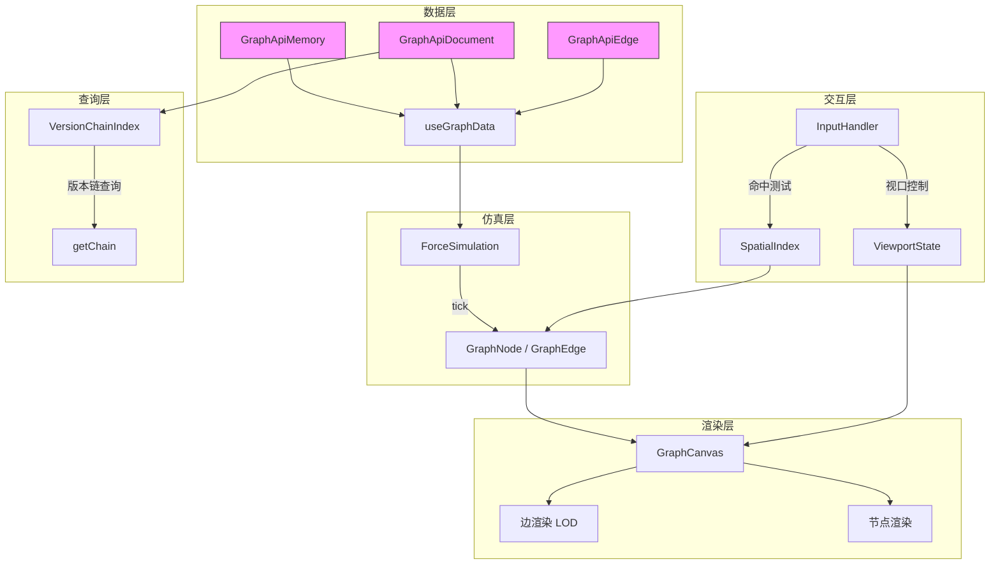

---

## 2. 组件架构

### 2.1 顶层架构

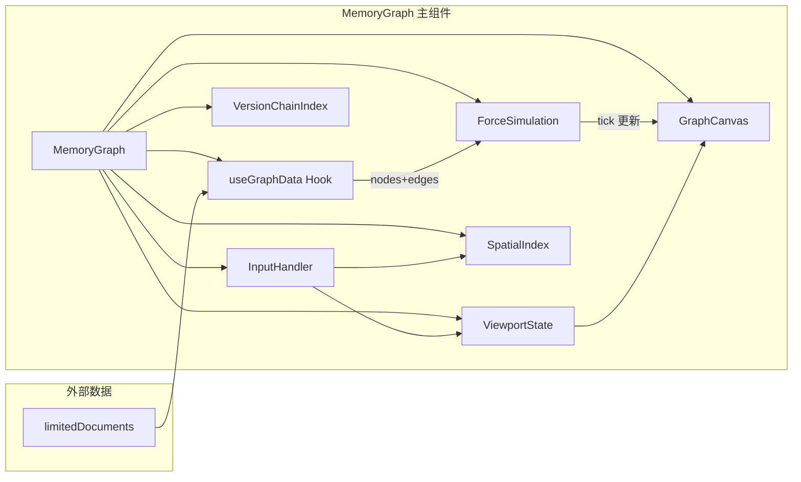

### 2.2 组件职责

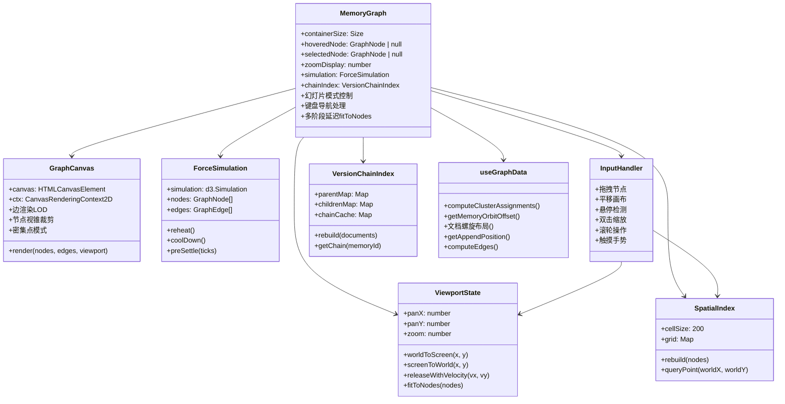

### 2.3 数据流

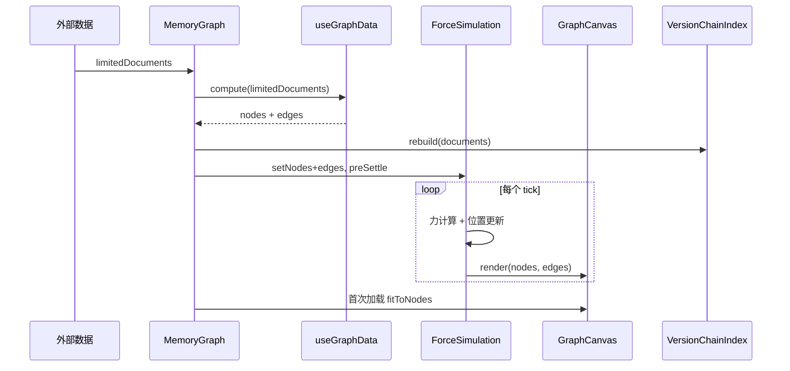

---

## 3. 物理仿真

### 3.1 力学模型

ForceSimulation 基于 d3-force，使用五种力学模型驱动节点布局：

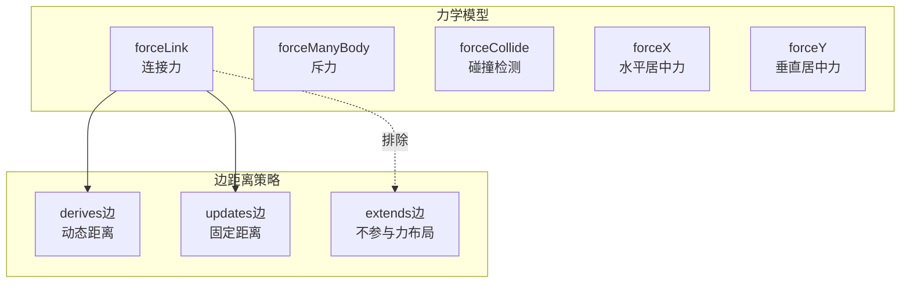

### 3.2 derives 边动态距离

derives 边（文档→记忆）的距离根据文档关联的记忆数量动态计算：

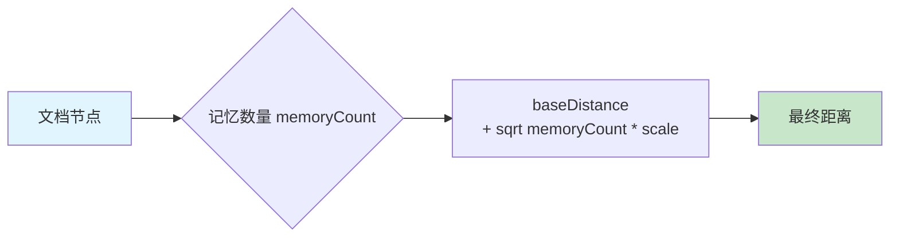

公式：`distance = baseDistance + √(memoryCount) × scale`

记忆越多，文档与记忆之间的距离越大，避免重叠。

### 3.3 仿真生命周期

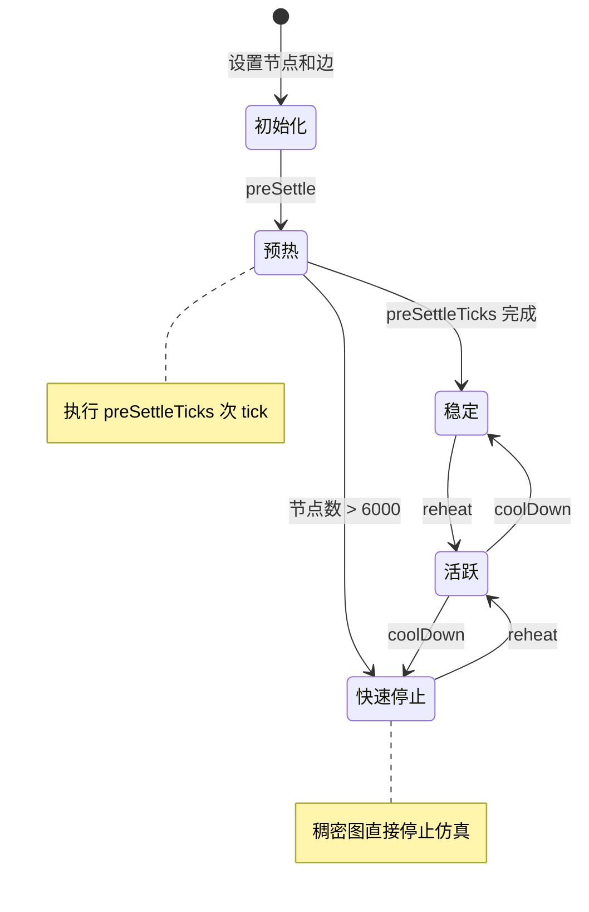

### 3.4 alpha 控制

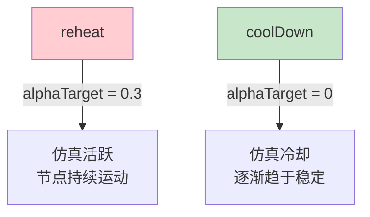

- `reheat()`：设置 `alphaTarget = 0.3`，使仿真重新活跃（如拖拽节点后、幻灯片模式切换时）
- `coolDown()`：设置 `alphaTarget = 0`，使仿真逐渐停止

---

## 4. 渲染管线

### 4.1 渲染流程总览

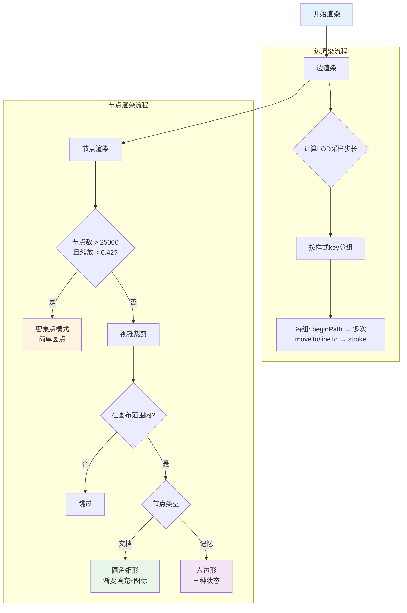

### 4.2 边渲染 LOD 机制

边渲染根据缩放级别和边数量动态调整采样密度：

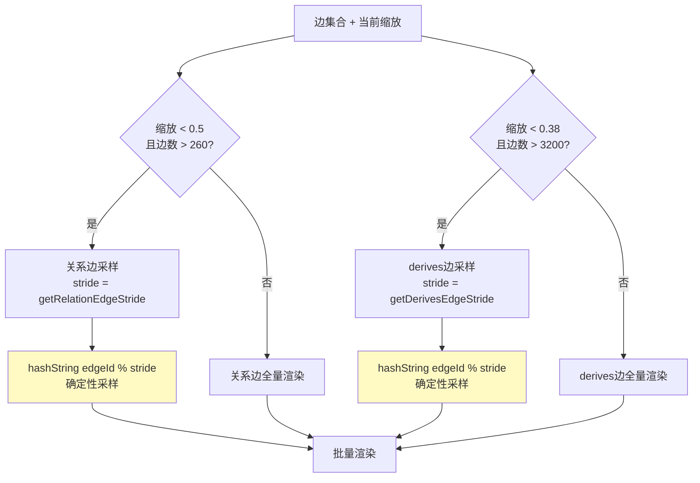

确定性采样保证：同一缩放级别下，同一组边始终被选中或跳过，避免渲染闪烁。

### 4.3 边样式

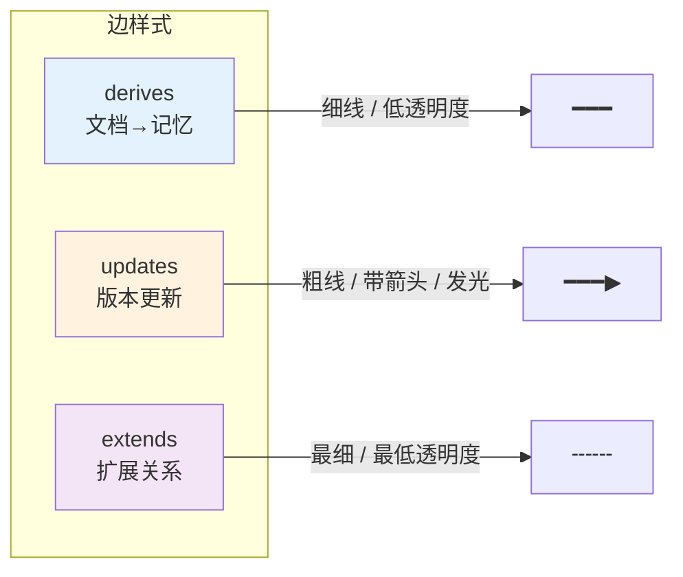

| 边类型 | 线宽 | 透明度 | 箭头 | 发光 |
|--------|------|--------|------|------|
| derives | 细 | 低 | 无 | 无 |
| updates | 粗 | 高 | 有 | 有 |
| extends | 最细 | 最低 | 无 | 无 |

### 4.4 批量渲染策略

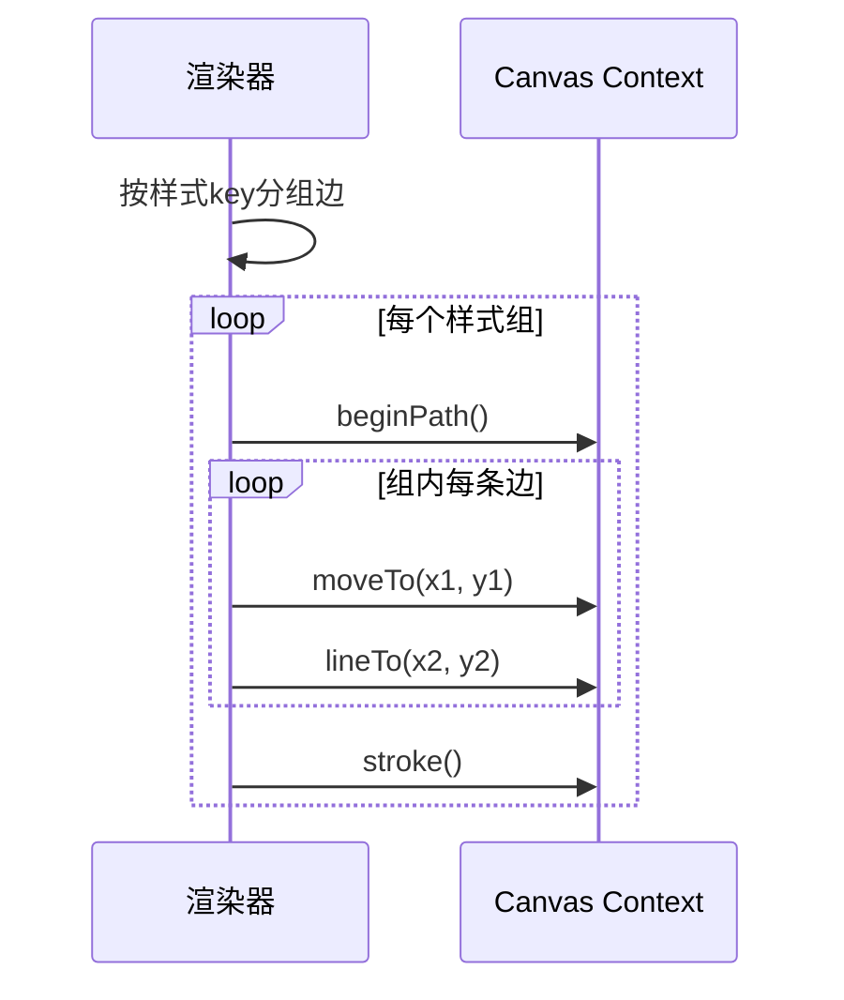

批量渲染将相同样式的边合并到一次 `beginPath → stroke` 调用中，大幅减少绘制指令数。

### 4.5 节点渲染细节

#### 文档节点


#### 记忆节点（六边形）

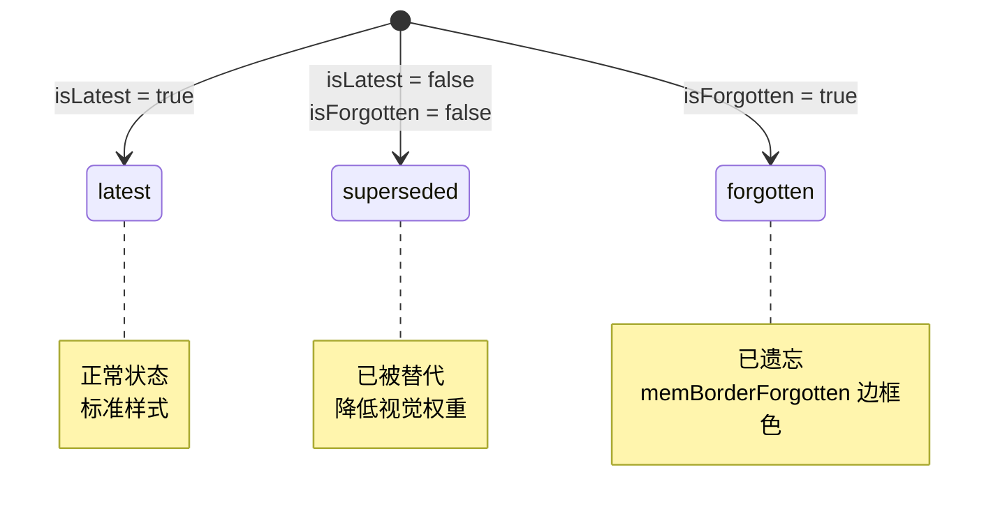

#### 颜色混合

节点填充色通过 `mixHexColors` 与集群颜色混合，实现视觉上的集群归属感：

```
最终颜色 = mixHexColors(节点填充色, 集群颜色)
```

---

## 5. 交互系统

### 5.1 InputHandler 事件处理

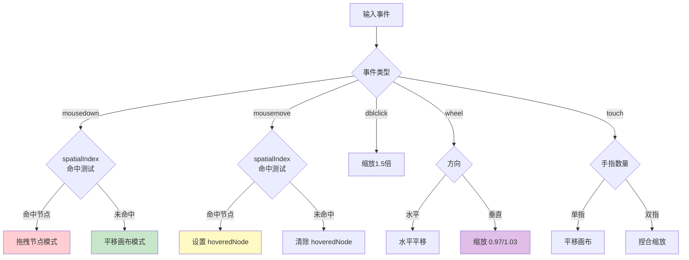

### 5.2 拖拽节点时序

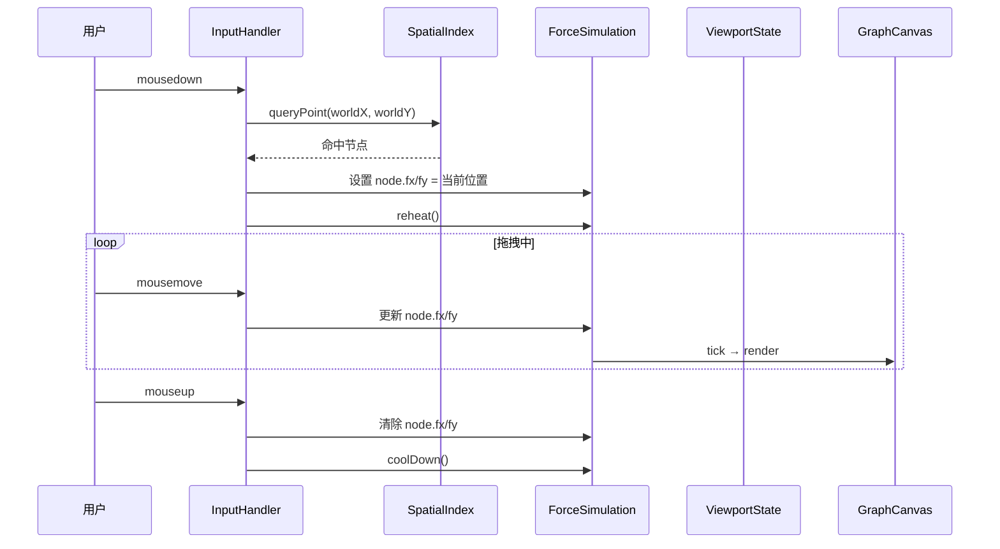

### 5.3 ViewportState 坐标转换

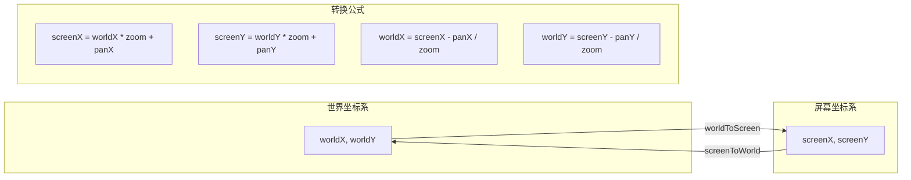

### 5.4 惯性平移

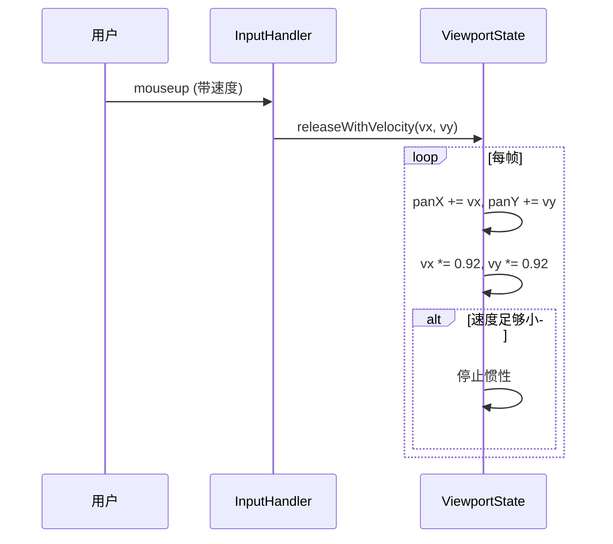

摩擦系数 `0.92`，每帧速度衰减 8%，约 50 帧后停止。

### 5.5 弹簧缩放

```mermaid
flowchart TD
    A[目标缩放 targetZoom] --> B[当前缩放 currentZoom]
    B --> C[差值 = targetZoom - currentZoom]
    C --> D[currentZoom += 差值 × zoomSpring]
    D --> E{差值足够小?}
    E -->|否| B
    E -->|是| F[停止动画]

    note right of D: zoomSpring = 0.15
```

### 5.6 fitToNodes 算法

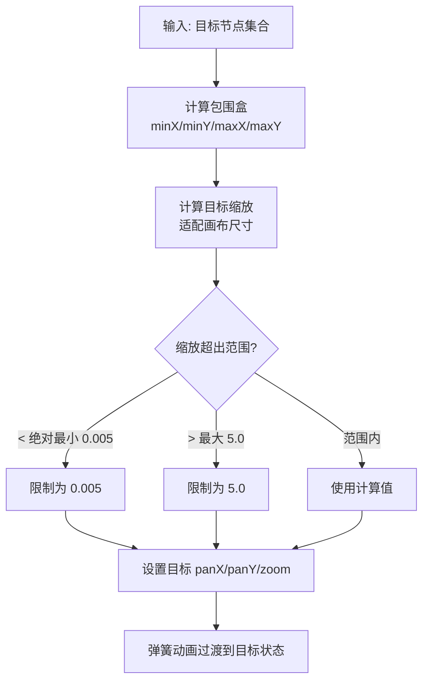

### 5.7 缩放范围

| 参数 | 值 |
|------|-----|
| 绝对最小缩放 | 0.005 |
| 默认最小缩放 | 0.1 |
| 最大缩放 | 5.0 |
| 初始缩放 | 0.5 |

---

## 6. 数据转换

### 6.1 useGraphData Hook 流程

```mermaid
flowchart TD
    A[limitedDocuments] --> B[遍历文档和记忆<br/>生成 GraphNode]
    A --> C[computeClusterAssignments<br/>BFS连通分量]
    A --> D[computeEdges<br/>计算所有边]

    B --> E[文档螺旋布局]
    B --> F[记忆轨道布局<br/>getMemoryOrbitOffset]

    C --> G[分配集群颜色<br/>10种颜色]
    G --> B

    D --> H[derives边<br/>文档→记忆]
    D --> I[关系边<br/>updates/extends]

    B --> J[记忆边框颜色]
    J --> K{记忆状态}
    K -->|已遗忘| L[memBorderForgotten]
    K -->|7天内过期| M[memBorderExpiring]
    K -->|1天内创建| N[memBorderRecent]

    style A fill:#e3f2fd
    style C fill:#fff9c4
    style D fill:#f3e5f5
```

### 6.2 集群分配（BFS 连通分量）

```mermaid
flowchart TD
    A[构建邻接表<br/>基于边关系] --> B[初始化未访问集合]
    B --> C[选择未访问节点作为起点]
    C --> D[BFS遍历]
    D --> E[所有可达节点标记为同一集群]
    E --> F{还有未访问节点?}
    F -->|是| C
    F -->|否| G[分配集群颜色<br/>10种颜色循环]

    style G fill:#c8e6c9
```

### 6.3 数据类型映射

```mermaid
classDiagram
    class GraphApiMemory {
        +id: string
        +memory: string
        +version: number
        +parentMemoryId: string | null
        +rootMemoryId: string | null
        +isForgotten: boolean
        +isLatest: boolean
        +memoryRelations: MemoryRelation[]
    }

    class GraphApiDocument {
        +id: string
        +title: string
        +summary: string
        +documentType: string
        +memories: GraphApiMemory[]
    }

    class GraphApiEdge {
        +source: string
        +target: string
        +edgeType: MemoryRelation
    }

    class GraphNode {
        +type: document | memory
        +x: number
        +y: number
        +size: number
        +borderColor: string
        +clusterKey: string
        +clusterColor: string
        +isHovered: boolean
        +isDragging: boolean
        +vx: number
        +vy: number
        +fx: number | null
        +fy: number | null
    }

    class GraphEdge {
        +source: GraphNode
        +target: GraphNode
        +visualProps: EdgeVisualProps
        +edgeType: MemoryRelation
    }

    class EdgeVisualProps {
        +opacity: number
        +thickness: number
    }

    GraphApiMemory --> GraphNode : 转换
    GraphApiDocument --> GraphNode : 转换
    GraphApiEdge --> GraphEdge : 转换
    GraphEdge --> EdgeVisualProps
```

---

## 7. 版本链

### 7.1 VersionChainIndex 构建

```mermaid
flowchart TD
    A[输入: documents] --> B[遍历所有文档的记忆]
    B --> C{记忆有 parentMemoryId?}
    C -->|是| D[记录到 parentMap<br/>memoryId → parentMemoryId]
    C -->|否| E[该记忆为根节点]
    D --> F[记录到 childrenMap<br/>parentMemoryId → childId[]]
    E --> G[标记为链的根]

    style A fill:#e3f2fd
    style G fill:#c8e6c9
```

### 7.2 getChain 查询

```mermaid
flowchart TD
    A[输入: memoryId] --> B{缓存命中?}
    B -->|是| C[返回缓存链]
    B -->|否| D[向后回溯<br/>沿 parentMemoryId 到根]
    D --> E[向前遍历<br/>沿 childrenMap 找后代]
    E --> F[组装完整链<br/>root → ... → memoryId → ... → latest]
    F --> G[缓存链中每个条目]
    G --> H[返回链]

    style C fill:#c8e6c9
    style H fill:#c8e6c9
```

### 7.3 版本链示例

```mermaid
graph LR
    V1[v1 根] --> V2[v2]
    V2 --> V3[v3]
    V3 --> V4[v4 latest]

    style V1 fill:#e8f5e9
    style V4 fill:#c8e6c9,stroke:#2e7d32,stroke-width:3px
```

查询 `v3` 的链：`[v1, v2, v3, v4]`，且 `v1`、`v2`、`v3`、`v4` 各自缓存此完整链。

### 7.4 键盘版本链导航

```mermaid
flowchart LR
    A[选中记忆节点] --> B[方向键 ←/→]
    B --> C[getChain selectedMemory.id]
    C --> D[在链中定位当前节点]
    D --> E[← 前一个版本]
    D --> F[→ 后一个版本]
    E --> G[选中目标节点<br/>居中显示]
    F --> G
```

---

## 8. 布局算法

### 8.1 文档螺旋布局

文档节点使用黄金角螺旋分布，确保均匀覆盖且无重叠：

```mermaid
flowchart TD
    A[输入: 文档节点列表] --> B[按索引遍历]
    B --> C[angle = idx × 137.5°]
    C --> D[radius = sqrtScale × √ idx+1 / count]
    D --> E[x = centerX + radius × cos angle]
    E --> F[y = centerY + radius × sin angle]

    style A fill:#e3f2fd
    style E fill:#c8e6c9
    style F fill:#c8e6c9
```

黄金角 137.5° 保证螺旋的均匀分布特性。

### 8.2 记忆轨道布局

记忆节点围绕其所属文档节点呈多环分布：

```mermaid
flowchart TD
    A[输入: 文档的记忆列表] --> B[计算内环容量<br/>周长 / 84px]
    B --> C{记忆数 > 内环容量?}
    C -->|否| D[全部放在内环<br/>半径 = 260]
    C -->|是| E[溢出到外环<br/>半径 = 260 + ring × 110]
    E --> F[每环容量递增<br/>周长 / 84px]
    D --> G[均匀分布角度<br/>2π × i / count]
    F --> G

    style D fill:#c8e6c9
    style E fill:#fff3e0
```

```mermaid
graph TD
    subgraph 记忆轨道示意
        DOC((文档节点))
        DOC --- M1[记忆1]
        DOC --- M2[记忆2]
        DOC --- M3[记忆3]
        DOC --- M4[记忆4]
        DOC --- M5[记忆5]
        DOC --- M6[记忆6]
    end

    style DOC fill:#e8f5e9,stroke:#2e7d32,stroke-width:3px
```

### 8.3 getAppendPosition 新节点定位

当新节点加入时，在现有节点外围寻找空位：

```mermaid
flowchart TD
    A[新节点需要位置] --> B[从第1环开始<br/>每环18个候选位]
    B --> C[检查候选位是否与<br/>空间网格中的节点碰撞]
    C --> D{碰撞?}
    D -->|否| E[使用此位置]
    D -->|是| F[下一个候选位]
    F --> G{当前环遍历完?}
    G -->|否| C
    G -->|是| H{环数 < 8?}
    H -->|是| I[进入下一环]
    I --> C
    H -->|否| J[使用最后尝试的位置]

    style E fill:#c8e6c9
    style J fill:#ffcdd2
```

最多搜索 8 环 × 18 候选位 = 144 个位置。

### 8.4 布局算法对比

| 算法 | 适用对象 | 核心思想 | 参数 |
|------|----------|----------|------|
| 黄金角螺旋 | 文档节点 | 均匀螺旋分布 | 角度 137.5°，半径 √(idx/count) |
| 多环轨道 | 记忆节点 | 围绕文档多环排列 | 内环半径 260，环间距 110，间距 84px |
| 空位搜索 | 新增节点 | 外围碰撞检测 | 8环 × 18候选位 |
| 力导向 | 全部节点 | 物理仿真自动布局 | d3-force 五种力 |

---

## 9. SpatialIndex 空间索引

### 9.1 网格划分

```mermaid
flowchart TD
    A[节点集合] --> B[按 cellSize=200 划分网格]
    B --> C[计算节点所属单元格<br/>cellX = floor x / 200<br/>cellY = floor y / 200]
    C --> D[将节点分配到单元格]
    D --> E[哈希检测变化<br/>避免不必要的重建]

    style A fill:#e3f2fd
    style E fill:#c8e6c9
```

### 9.2 命中测试

```mermaid
flowchart TD
    A[queryPoint worldX, worldY] --> B[计算目标单元格]
    B --> C[检查目标单元格<br/>+ 周围8个邻居]
    C --> D[遍历候选节点]
    D --> E{节点类型?}
    E -->|文档| F[矩形命中检测<br/>AABB]
    E -->|记忆| G[圆形命中检测<br/>距离 < 半径]
    F --> H{命中?}
    G --> H
    H -->|是| I[返回命中节点]
    H -->|否| J[继续遍历]

    style I fill:#c8e6c9
```

---

## 10. MemoryGraph 主组件

### 10.1 状态管理

```mermaid
classDiagram
    class MemoryGraphState {
        +containerSize: width × height
        +hoveredNode: GraphNode | null
        +selectedNode: GraphNode | null
        +zoomDisplay: number
        +simulation: ForceSimulation
        +chainIndex: VersionChainIndex
    }
```

### 10.2 键盘导航

```mermaid
flowchart TD
    KEY[键盘事件] --> K{按键}
    K -->|Z| FIT[fitToNodes 适配视图]
    K -->|C| CENTER[居中当前选中节点]
    K -->|+ / =| ZIN[放大]
    K -->|-| ZOUT[缩小]
    K -->|Escape| CANCEL[取消选中]
    K -->|← / →| CHAIN[版本链导航]
    K -->|↑ / ↓| SCROLL[方向滚动]

    style FIT fill:#e8f5e9
    style CENTER fill:#e8f5e9
    style CHAIN fill:#fff3e0
```

### 10.3 幻灯片模式

```mermaid
sequenceDiagram
    participant MG as MemoryGraph
    participant FS as ForceSimulation
    participant VS as ViewportState

    MG->>MG: 随机选取节点
    MG->>VS: 居中到选中节点
    MG->>FS: reheat()

    Note over MG: 等待 3.5 秒

    MG->>MG: 随机选取下一个节点
    MG->>VS: 居中到新节点
    MG->>FS: reheat()

    Note over MG: 循环...
```

### 10.4 首次加载流程

```mermaid
sequenceDiagram
    participant MG as MemoryGraph
    participant UGD as useGraphData
    participant FS as ForceSimulation
    participant VS as ViewportState
    participant GC as GraphCanvas

    MG->>UGD: compute(documents)
    UGD-->>MG: nodes + edges
    MG->>FS: 初始化仿真
    MG->>FS: preSettle

    Note over MG,VS: 多阶段延迟 fitToNodes

    MG->>VS: fitToNodes (阶段1: 短延迟)
    MG->>GC: render

    MG->>VS: fitToNodes (阶段2: 中延迟)
    MG->>GC: render

    MG->>VS: fitToNodes (阶段3: 长延迟)
    MG->>GC: render
```

多阶段延迟适配确保：仿真预热后逐步调整视口，避免一次性跳变。

---

## 11. 性能优化总结

```mermaid
graph TD
    subgraph 渲染优化
        R1[边LOD采样<br/>缩放低时跳过部分边]
        R2[视锥裁剪<br/>画布外节点跳过]
        R3[密集点模式<br/>25000+节点退化为圆点]
        R4[批量渲染<br/>相同样式合并绘制]
    end

    subgraph 仿真优化
        S1[稠密图快速停止<br/>>6000节点跳过预热]
        S2[extends边不参与力布局]
        S3[动态边距离<br/>避免记忆重叠]
    end

    subgraph 查询优化
        Q1[SpatialIndex网格索引<br/>O1命中测试]
        Q2[VersionChainIndex缓存<br/>避免重复遍历]
        Q3[网格哈希变化检测<br/>避免不必要重建]
    end

    style R1 fill:#e3f2fd
    style R2 fill:#e3f2fd
    style R3 fill:#e3f2fd
    style R4 fill:#e3f2fd
    style S1 fill:#e8f5e9
    style S2 fill:#e8f5e9
    style S3 fill:#e8f5e9
    style Q1 fill:#fff3e0
    style Q2 fill:#fff3e0
    style Q3 fill:#fff3e0
```
