# 搜索系统核心模块设计文档

## 1. 模块概述

Supermemory 搜索系统是项目的核心能力模块，负责在海量记忆和文档数据中进行高效的语义检索。系统提供两代搜索接口——V3（文档块级别）和 V4（记忆条目级别），并支持查询改写、重排序、高级过滤等增强能力。

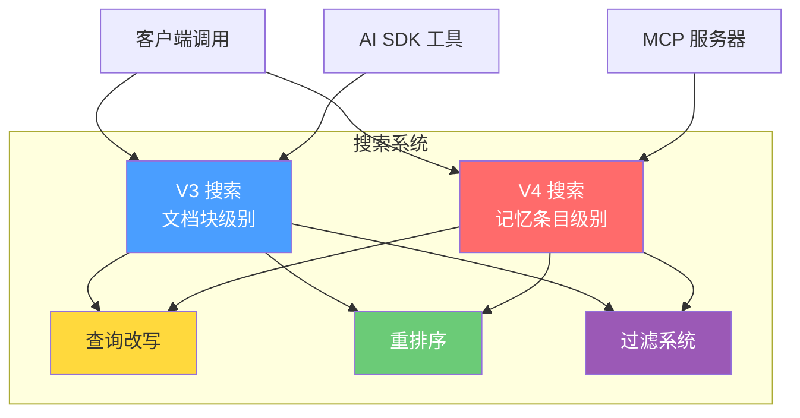

---

## 2. V3 与 V4 搜索对比

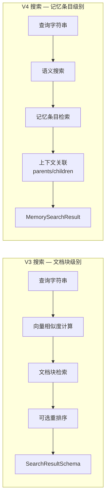

### 核心差异对照

| 维度 | V3 搜索 | V4 搜索 |
|------|---------|---------|
| **检索单位** | 文档块（Chunk） | 记忆条目（Memory） |
| **核心算法** | 向量相似度 | 语义搜索 |
| **容器标签** | `containerTags`（复数，数组） | `containerTag`（单数，字符串） |
| **阈值参数** | `chunkThreshold` + `documentThreshold` | `threshold`（默认 0.6） |
| **结果结构** | chunks 数组 + 文档元数据 | memory + context 关系链 |
| **搜索模式** | 无 | memories / documents / hybrid |
| **关联能力** | 无 | parents/children 关系 |
| **包含选项** | includeFullDocs / includeSummary / onlyMatchingChunks | include: documents / summaries / relatedMemories |

---

## 3. V3 搜索流程

### 3.1 请求参数

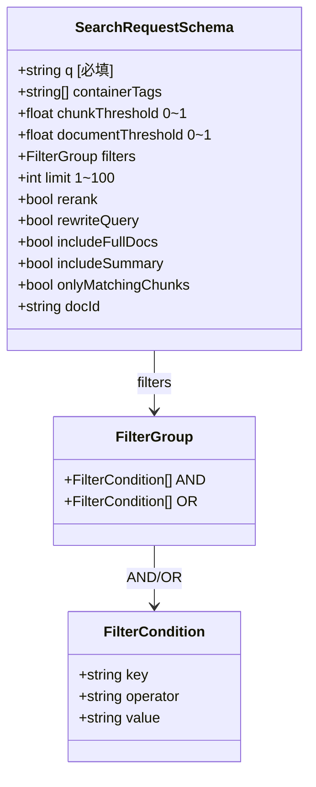

### 3.2 搜索流程

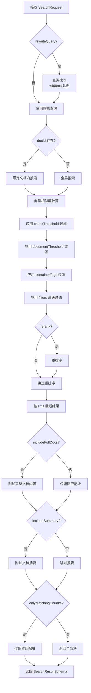

### 3.3 结果结构

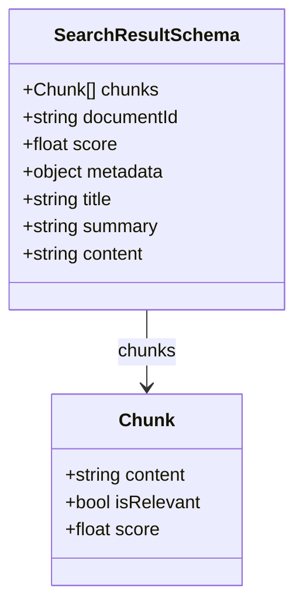

---

## 4. V4 搜索流程

### 4.1 请求参数

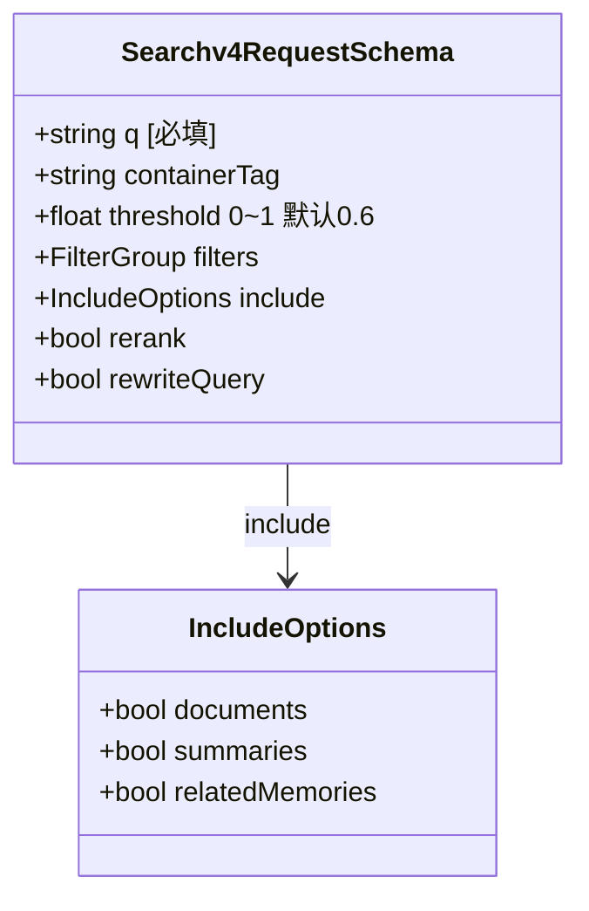

### 4.2 三种搜索模式

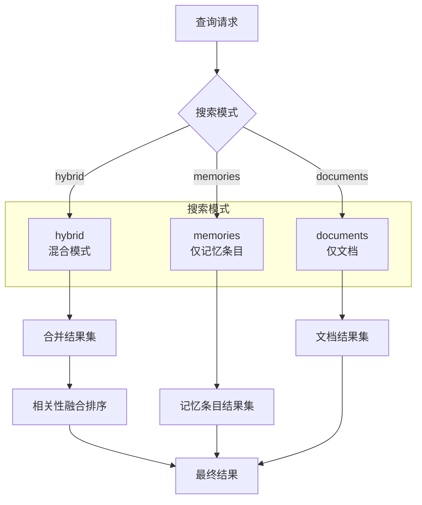

### 4.3 搜索流程

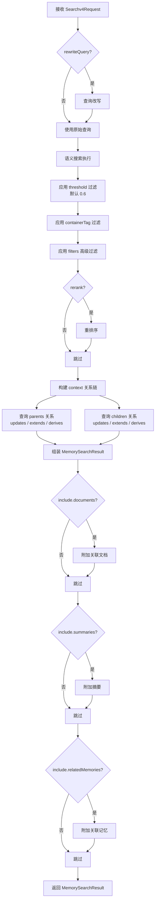

### 4.4 结果结构

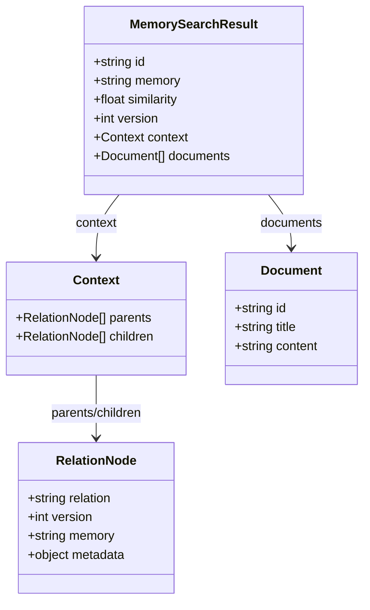

### 4.5 记忆关系链

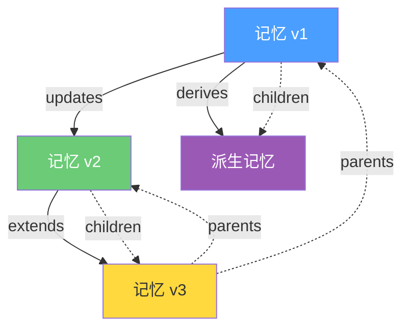

关系类型说明：

| 关系 | 含义 | 方向 |
|------|------|------|
| `updates` | 新版本更新 | 旧 → 新 |
| `extends` | 内容扩展 | 基础 → 扩展 |
| `derives` | 派生关系 | 原始 → 派生 |

---

## 5. 查询改写（rewriteQuery）

查询改写通过 LLM 对用户原始查询进行语义优化，提升检索质量，代价是增加约 400ms 延迟。

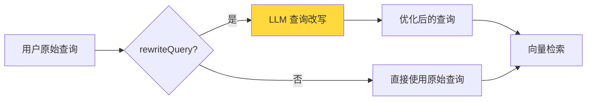

### 改写策略

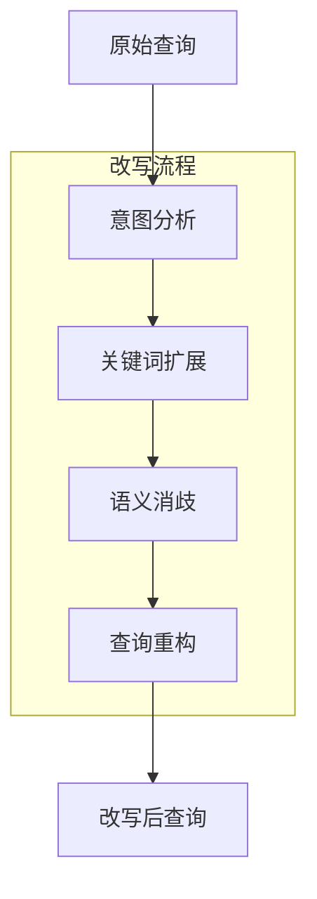

**典型改写示例：**

| 原始查询 | 改写后查询 | 改写类型 |
|----------|-----------|---------|
| "那个API" | "Supermemory API 接口文档" | 消歧 + 扩展 |
| "怎么做" | "如何使用 Supermemory 创建记忆" | 上下文补全 |
| "错误" | "Supermemory 常见错误和异常处理" | 领域限定 |

---

## 6. 重排序（rerank）

重排序对初步检索结果进行二次排序，提升结果相关性。

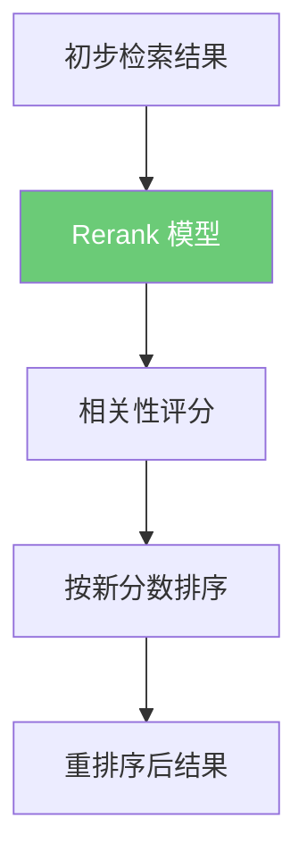

### 重排序在搜索流程中的位置


---

## 7. 过滤系统

### 7.1 过滤层级

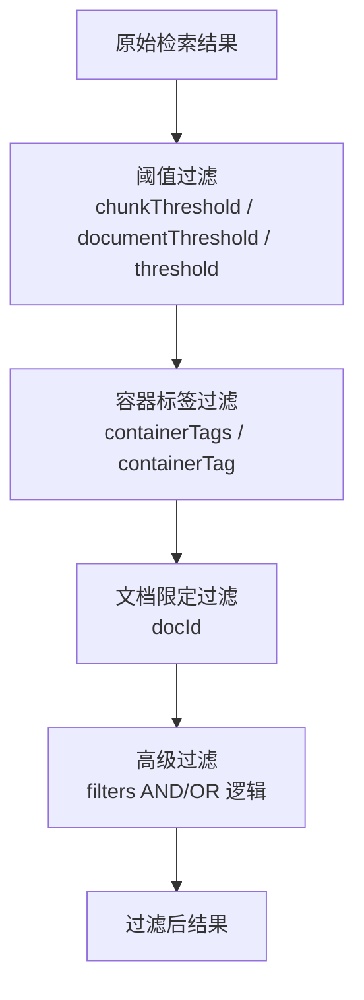

### 7.2 高级过滤 AND/OR 逻辑

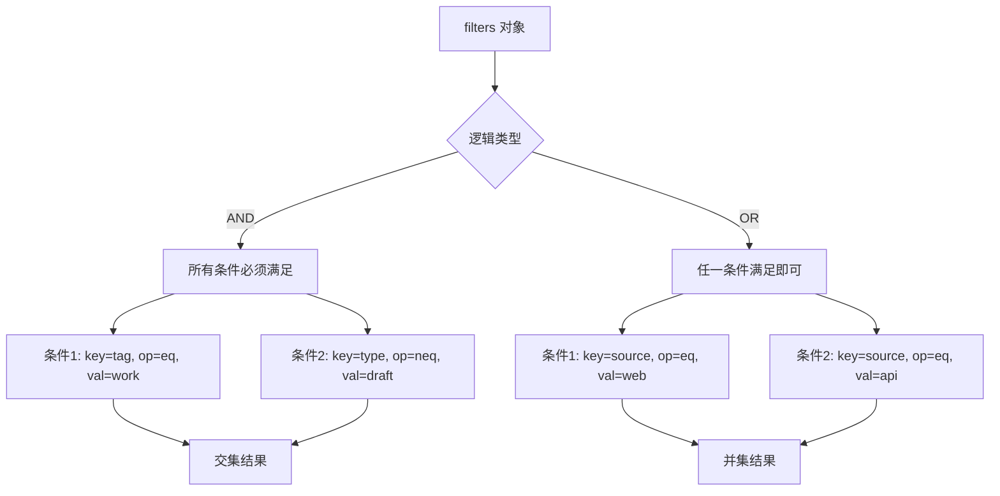

### 7.3 过滤条件结构

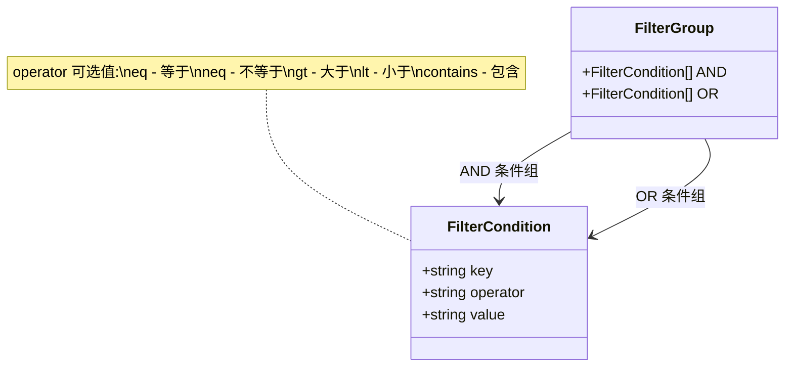

---

## 8. 完整搜索时序图

### 8.1 V3 搜索时序

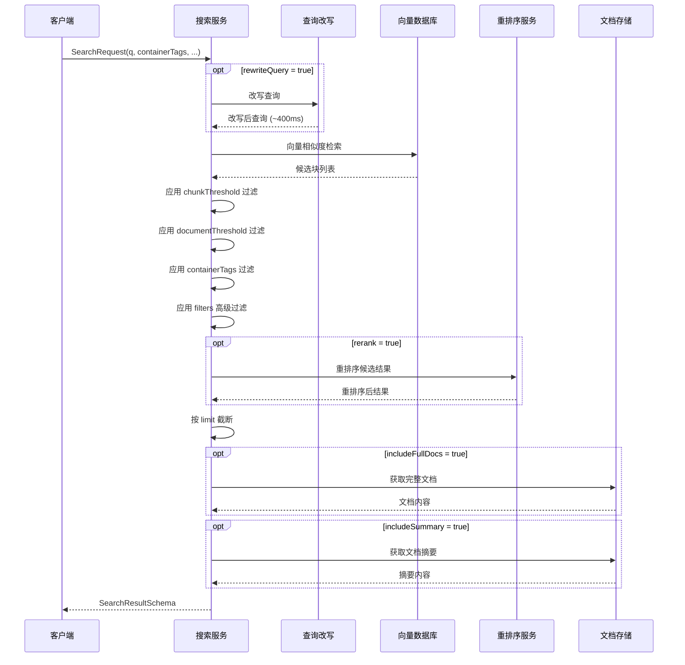

### 8.2 V4 搜索时序

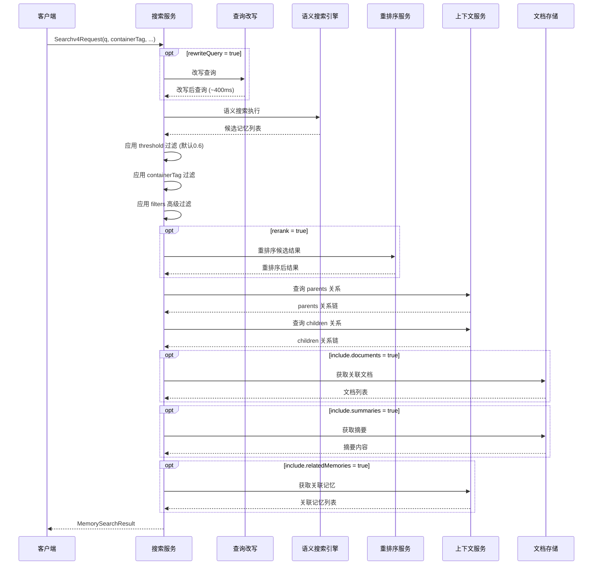

### 8.3 MCP 服务器搜索时序

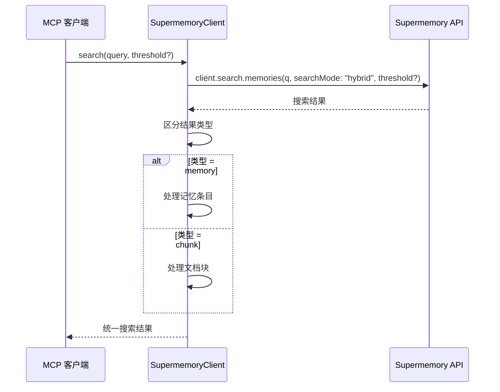

### 8.4 AI SDK 搜索工具时序

```mermaid
sequenceDiagram
    participant AI as AI 模型
    participant Tool as searchMemoriesTool
    participant API as Supermemory API

    AI->>Tool: informationToGet, includeFullDocs?, limit?
    Tool->>Tool: 设置默认参数<br/>includeFullDocs=true, limit=10<br/>chunkThreshold=0.6
    Tool->>API: client.search.execute(params)
    API-->>Tool: 搜索结果
    Tool-->>AI: 格式化结果
```

---

## 9. 外部集成搜索

### 9.1 MCP 服务器搜索

```mermaid
classDiagram
    class SupermemoryClient {
        +search(query, threshold?) SearchResult
    }

    class SearchParams {
        +string q
        +string searchMode "hybrid"
        +float threshold 可选
    }

    class SearchResult {
        +string type memory | chunk
        +object data
    }

    SupermemoryClient --> SearchParams : 构造参数
    SupermemoryClient --> SearchResult : 返回结果
```

MCP 服务器搜索特点：
- 使用 `client.search.memories()` 接口
- 固定 `searchMode: "hybrid"` 混合模式
- 支持可选 `threshold` 参数
- 结果区分 `memory` 和 `chunk` 两种类型

### 9.2 AI SDK 搜索工具

```mermaid
classDiagram
    class searchMemoriesTool {
        +execute(params) SearchResult
    }

    class ToolParams {
        +string informationToGet [必填]
        +bool includeFullDocs 默认true
        +int limit 默认10
    }

    class InternalConfig {
        +float chunkThreshold 0.6
    }

    searchMemoriesTool --> ToolParams : 外部参数
    searchMemoriesTool --> InternalConfig : 内部配置
```

AI SDK 搜索工具特点：
- 使用 `client.search.execute()` 接口
- `informationToGet` 为必填参数
- `includeFullDocs` 默认 `true`
- `limit` 默认 `10`
- `chunkThreshold` 内部固定为 `0.6`

---

## 10. 搜索模式对比总结

```mermaid
graph TB
    subgraph 入口层
        V3_API[V3 API]
        V4_API[V4 API]
        MCP_S[MCP 服务器]
        AI_SDK[AI SDK 工具]
    end

    subgraph 能力层
        QR[查询改写<br/>≈400ms]
        RR[重排序]
        FS[高级过滤<br/>AND/OR]
        CTX[上下文关系链]
    end

    subgraph 检索层
        VEC[向量相似度]
        SEM[语义搜索]
        HYB[混合搜索]
    end

    V3_API --> VEC
    V3_API --> QR
    V3_API --> RR
    V3_API --> FS

    V4_API --> SEM
    V4_API --> QR
    V4_API --> RR
    V4_API --> FS
    V4_API --> CTX

    MCP_S --> HYB
    AI_SDK --> VEC

    style QR fill:#ffd93d,color:#333
    style RR fill:#6bcb77,color:#fff
    style FS fill:#9b59b6,color:#fff
    style CTX fill:#4a9eff,color:#fff
```
