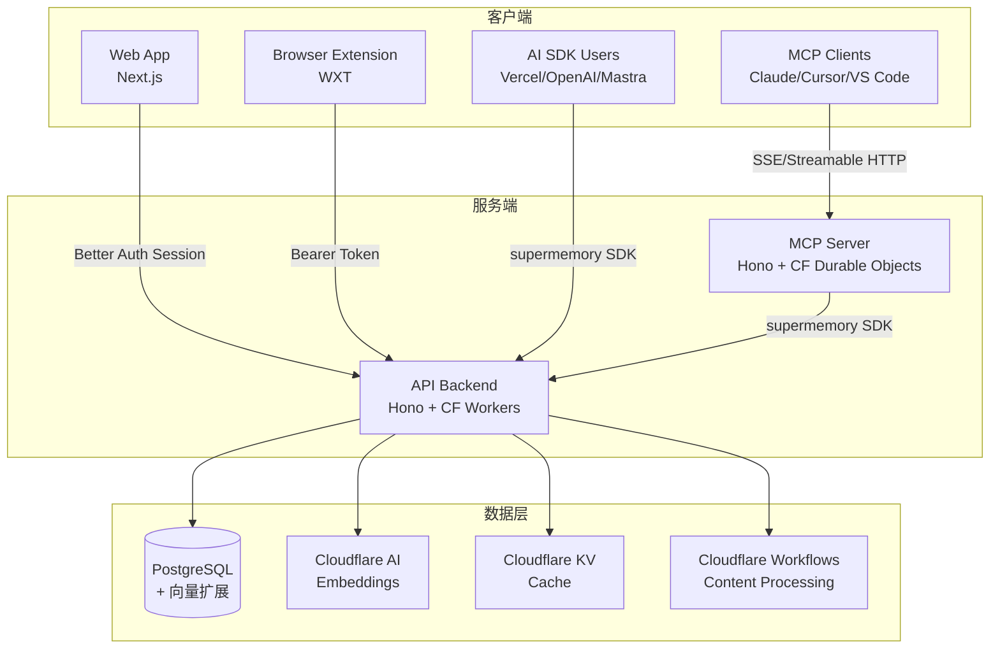
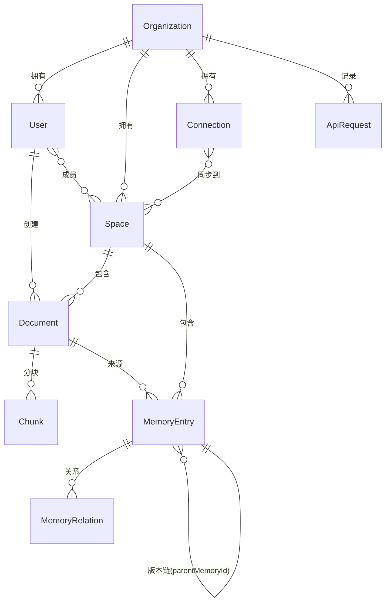
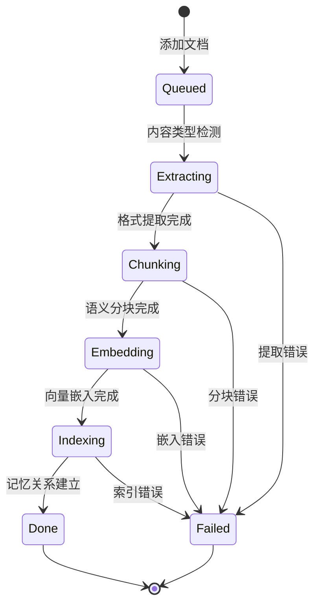
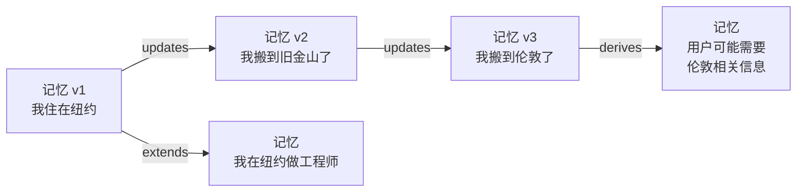
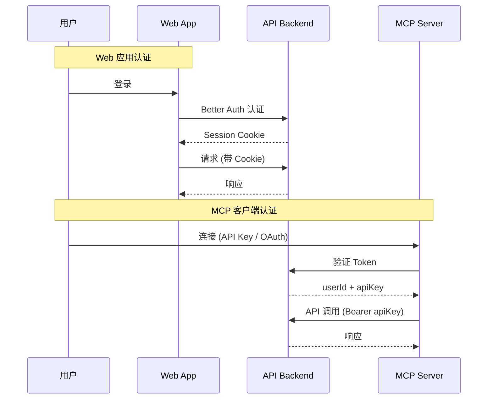
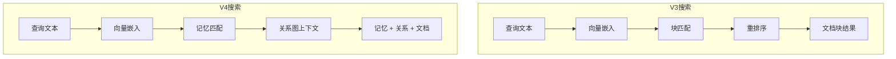
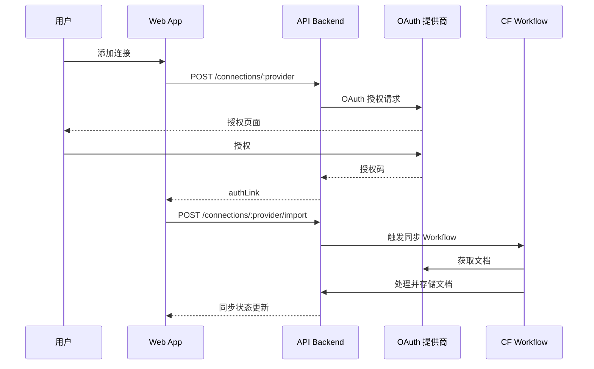
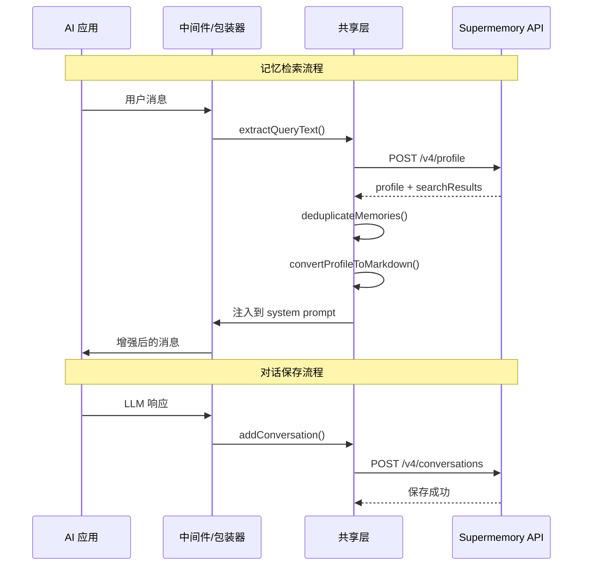

# Supermemory 项目规格说明书

## 1. 项目概述

**Supermemory** 是一个面向 AI 的记忆与上下文引擎，在 LongMemEval、LoCoMo、ConvoMem 三大 AI 记忆基准测试中均排名第一。它为 AI 应用提供完整的上下文栈：记忆提取、用户画像、混合搜索、连接器同步和多模态文件处理。

### 1.1 项目定位

- **面向用户**：通过 Web 应用、浏览器扩展、MCP 服务器和插件为个人提供持久化 AI 记忆
- **面向开发者**：通过 SDK 和 API 为 AI 应用提供记忆、RAG、用户画像和连接器能力

### 1.2 核心价值

| 能力 | 描述 |
|------|------|
| 记忆引擎 | 从对话中提取事实，跟踪更新，解决矛盾，自动遗忘过期信息 |
| 用户画像 | 自动维护用户上下文——稳定事实 + 近期活动，单次调用 ~50ms |
| 混合搜索 | RAG + Memory 单次查询，知识库文档与个性化上下文并存 |
| 连接器 | Google Drive / Gmail / Notion / OneDrive / GitHub 自动同步 |
| 多模态提取器 | PDF、图片(OCR)、视频(转录)、代码(AST 感知分块) |

---

## 2. 技术栈

| 层级 | 技术 |
|------|------|
| 运行时 | Cloudflare Workers (API/MCP), Next.js (Web) |
| 语言 | TypeScript (前端/SDK), Python (Python SDK) |
| 包管理 | Bun (monorepo), pip/uv (Python) |
| Monorepo | Turbo |
| Web 框架 | Next.js (App Router) |
| API 框架 | Hono (API 后端 / MCP 服务器) |
| 数据库 | PostgreSQL + 向量扩展 (Drizzle ORM) |
| 认证 | Better Auth (session + API Key + OAuth) |
| 监控 | Sentry, PostHog |
| 部署 | Cloudflare Workers, Vercel (文档) |
| UI | Radix UI + Tailwind CSS + shadcn/ui |
| 状态管理 | Zustand (IndexedDB 持久化), TanStack React Query |
| 画布渲染 | Canvas 2D (记忆图谱) + d3-force (物理仿真) |

---

## 3. 系统架构总览



---

## 4. Monorepo 结构

```
supermemory/
├── apps/
│   ├── web/                    # Next.js Web 应用（消费者端）
│   ├── mcp/                    # MCP 服务器（Cloudflare Workers）
│   ├── browser-extension/      # 浏览器扩展（WXT）
│   ├── docs/                   # 文档站点（Mintlify）
│   ├── raycast-extension/      # Raycast 扩展
│   └── memory-graph-playground/# 记忆图谱 Playground
├── packages/
│   ├── tools/                  # 多框架集成工具包（核心 SDK 集成）
│   ├── ai-sdk/                 # Vercel AI SDK 独立工具包
│   ├── memory-graph/           # 记忆图谱可视化组件
│   ├── lib/                    # 共享库（API 客户端、认证、类型）
│   ├── validation/             # Zod 验证模式
│   ├── ui/                     # UI 组件库（shadcn/ui）
│   ├── hooks/                  # 共享 React Hooks
│   ├── agent-framework-python/ # Python Agent 框架集成
│   ├── openai-sdk-python/      # Python OpenAI SDK 集成
│   ├── cartesia-sdk-python/    # Python Cartesia SDK 集成
│   ├── pipecat-sdk-python/     # Python Pipecat SDK 集成
│   └── docs-test/              # 文档代码测试
└── package.json                # Monorepo 根配置（Turbo + Bun workspaces）
```

---

## 5. 核心 API 端点

### 5.1 文档与记忆

| 方法 | 端点 | 描述 |
|------|------|------|
| POST | `/v3/documents` | 添加文档/记忆（文本/URL） |
| POST | `/v3/documents/file` | 文件上传（PDF/图片/视频） |
| POST | `/v3/documents/batch` | 批量添加文档 |
| POST | `/v3/documents/list` | 列出记忆 |
| POST | `/v3/documents/documents` | 带记忆条目的文档列表 |
| DELETE | `/v3/documents/:id` | 删除文档 |
| DELETE | `/v3/documents/bulk` | 批量删除 |

### 5.2 搜索

| 方法 | 端点 | 描述 |
|------|------|------|
| POST | `/v3/search` | V3 语义搜索（文档块级别） |
| POST | `/v4/search` | V4 记忆搜索（记忆条目级别，支持关系图上下文） |

### 5.3 用户画像

| 方法 | 端点 | 描述 |
|------|------|------|
| GET | `/v3/container-tags/:containerTag/profile` | 获取用户画像（静态 + 动态） |
| POST | `/v4/profile` | 获取画像 + 搜索结果 |

### 5.4 连接器

| 方法 | 端点 | 描述 |
|------|------|------|
| POST | `/v3/connections/:provider` | 创建连接（OAuth） |
| POST | `/v3/connections/:provider/import` | 触发同步导入 |
| GET | `/v3/connections` | 列出连接 |
| DELETE | `/v3/connections/:connectionId` | 删除连接 |

### 5.5 对话

| 方法 | 端点 | 描述 |
|------|------|------|
| POST | `/v4/conversations` | 保存对话（自动提取记忆） |
| POST | `/v4/memories` | 直接创建记忆条目 |

### 5.6 项目与空间

| 方法 | 端点 | 描述 |
|------|------|------|
| GET | `/v3/projects` | 列出项目 |
| POST | `/v3/projects` | 创建项目 |
| DELETE | `/v3/projects/:projectId` | 删除项目 |

---

## 6. 数据模型

### 6.1 核心实体关系



### 6.2 文档处理状态机



### 6.3 记忆关系类型

| 关系 | 描述 | 示例 |
|------|------|------|
| `updates` | 新信息取代旧知识 | "我搬到旧金山了" 取代 "我住在纽约" |
| `extends` | 补充信息添加上下文 | "我喜欢 TypeScript" 扩展 "我是开发者" |
| `derives` | 从模式分析推断新连接 | 从多次讨论中推断用户偏好 |

### 6.4 记忆版本链



---

## 7. 认证体系

### 7.1 认证方式

| 方式 | 适用场景 | 机制 |
|------|---------|------|
| Better Auth Session | Web 应用 | Cookie-based session |
| API Key (`sm_` 前缀) | 外部 API 调用 | Bearer Token |
| OAuth Token | MCP 服务器 | OAuth 2.0 + API Key 交换 |
| Bearer Token | 浏览器扩展 | 从 Web App postMessage 获取 |

### 7.2 认证流程



---

## 8. 搜索系统

### 8.1 V3 搜索（文档块级别）

- 基于向量相似度的文档块检索
- 支持 chunkThreshold / documentThreshold 双阈值
- 支持 rerank（重排序）和 rewriteQuery（查询改写）
- 支持高级过滤（AND/OR 逻辑）

### 8.2 V4 搜索（记忆条目级别）

- 基于记忆条目的语义搜索
- 返回关系图上下文（parents/children）
- 支持三种搜索模式：`memories`（仅记忆）、`documents`（仅文档）、`hybrid`（混合）
- 返回关联文档信息

### 8.3 搜索模式对比



---

## 9. 连接器系统

### 9.1 支持的连接器

| 连接器 | 类型 | 同步方式 |
|--------|------|---------|
| Google Drive | OAuth | 实时 Webhook |
| Gmail | OAuth | 定时同步 |
| Notion | OAuth | 实时 Webhook |
| OneDrive | OAuth | 定时同步 |
| GitHub | OAuth | 定时同步 |
| Web Crawler | URL | 按需/定时 |
| S3 | 凭证 | 按需 |
| Granola | 凭证 | 按需 |

### 9.2 连接器工作流



---

## 10. MCP 服务器

### 10.1 工具定义

| 工具 | 功能 | 参数 |
|------|------|------|
| `memory` | 保存/遗忘记忆 | content, action(save/forget), containerTag |
| `recall` | 搜索记忆 | query, includeProfile, containerTag |
| `listProjects` | 列出项目 | refresh |
| `whoAmI` | 当前用户信息 | 无 |
| `memory-graph` | 记忆图谱可视化 | containerTag |
| `fetch-graph-data` | 图谱分页数据 | containerTag, page, limit |

### 10.2 资源定义

| URI | 描述 |
|-----|------|
| `supermemory://profile` | 用户画像（静态偏好 + 近期活动） |
| `supermemory://projects` | 项目列表 JSON |
| `ui://memory-graph/mcp-app.html` | 记忆图谱 HTML UI |

### 10.3 Prompt 定义

| 名称 | 描述 |
|------|------|
| `context` | 注入用户上下文到系统提示 |

---

## 11. 多框架集成

### 11.1 集成方式

| 框架 | 集成方式 | 拦截机制 | 包路径 |
|------|---------|---------|--------|
| Vercel AI SDK | `withSupermemory(model, opts)` | Proxy doGenerate/doStream | `packages/tools/src/vercel/` |
| OpenAI SDK | `withSupermemory(client, opts)` | Monkey-patch chat.completions | `packages/tools/src/openai/` |
| Mastra | `withSupermemory(config, opts)` | Processor 管道 | `packages/tools/src/mastra/` |
| VoltAgent | `withSupermemory(opts)` | Hooks (onPrepareMessages/onEnd) | `packages/tools/src/voltagent/` |
| Claude Memory | `ClaudeMemoryTool` 类 | 文件系统模拟 | `packages/tools/src/claude-memory.ts` |
| AI SDK Tools | `supermemoryTools(apiKey, config)` | 函数调用工具 | `packages/tools/src/ai-sdk.ts` |

### 11.2 集成核心流程



---

## 12. 记忆图谱可视化

### 12.1 核心组件

| 组件 | 职责 |
|------|------|
| `MemoryGraph` | 顶层 React 组件，协调所有子系统 |
| `GraphCanvas` | Canvas 2D 渲染画布 |
| `ForceSimulation` | d3-force 物理仿真引擎 |
| `ViewportState` | 平移/缩放/坐标转换 |
| `SpatialIndex` | 空间命中测试（网格划分） |
| `InputHandler` | 鼠标/触摸/手势事件处理 |
| `VersionChainIndex` | 记忆版本链查询 |
| `useGraphData` | 数据转换 Hook |

### 12.2 节点类型

| 类型 | 形状 | 描述 |
|------|------|------|
| 文档节点 | 圆角矩形 + 图标 | 包含标题、类型图标 |
| 记忆节点 | 六边形 | 三种状态：正常(latest)/已被替代(superseded)/已遗忘(forgotten) |

### 12.3 边类型

| 类型 | 样式 | 描述 |
|------|------|------|
| `derives` | 细、低透明度 | 文档 -> 记忆的派生关系 |
| `updates` | 粗、带箭头、发光 | 记忆更新关系 |
| `extends` | 最细、最低透明度 | 记忆扩展关系 |

---

## 13. 非功能性需求

### 13.1 性能

- 用户画像获取 ~50ms
- 记忆检索默认 5 秒超时
- 记忆图谱支持 >6000 节点（稠密图静态布局）
- Canvas 渲染支持 LOD（细节层次）优化
- LRU 缓存（max=100）减少重复记忆检索

### 13.2 可靠性

- API 请求 3 次线性重试
- 嵌入模型无缝迁移（双字段设计）
- 记忆检索失败时可选继续（`skipMemoryOnError`）
- 错误追踪（Sentry）+ 产品分析（PostHog）

### 13.3 安全

- 所有 API 调用需认证
- 路径穿越防护（Claude Memory Tool）
- OAuth Token 安全交换
- 内容哈希防重复处理
