# AI 记忆项目综合对比分析

> 本文档对 15 个 AI 记忆项目进行系统化对比分析，按"大型知识库类"与"个人 Agent 类"两大分类展开，涵盖架构图、维度对比、相似性/差异性分析及演进趋势。

---

## 第一部分：项目分类总览表

| 项目名称 | 分类 | 核心架构风格 | 主要存储 | 核心特性 |
|---|---|---|---|---|
| **Graphiti** | 大型知识库 | 知识图谱 + 多图数据库驱动 | Neo4j / FalkorDB / Kuzu / Neptune | 多图数据库后端、知识图谱构建与维护、命名空间隔离、社区检测与摘要 |
| **MemForest** | 大型知识库 | B+树森林 + 管线式处理 | FAISS + JSONL + JSON | 多用户森林隔离、事实抽取与去重管线、TD+BU 双路检索、Beam Search 浏览 |
| **Khoj** | 大型知识库 | Web 应用 + Django ORM | PostgreSQL + pgvector | 全栈 Web 应用、对话/内容/搜索多模块、定时任务调度、多 LLM 集成 |
| **Supermemory** | 大型知识库 | 云原生 + 流水线处理 | PostgreSQL + Cloudflare AI/KV | 6 阶段内容处理流水线、记忆引擎提取/关系/遗忘、用户画像引擎、浏览器扩展 |
| **Mem0** | 大型知识库 | Provider 抽象 + 托管/自托管双模式 | 22 种向量存储 + SQLite | 极致 Provider 可插拔（17 LLM / 11 Embedding / 22 VS）、托管云平台、异步支持 |
| **Basic Memory** | 大型知识库 | 文件优先 + 同步协调 | SQLite / Postgres + Markdown | Markdown 文件即知识库、双向同步（文件↔数据库）、MCP/CLI/API 三入口 |
| **A-mem** | 个人 Agent | 分层记忆系统 + LLM 控制 | ChromaDB + 内存字典 | 简洁分层架构、LLM 统一控制器（OpenAI/Ollama）、记忆笔记数据模型 |
| **AgenticMemory** | 个人 Agent | 标准/健壮双轨 + 混合检索 | ChromaDB / SentenceTransformer | 标准/Robust 双系统、7 种 LLM 控制器、混合检索（Embedding+BM25）、解析验证层 |
| **SimpleMem** | 个人 Agent | 自动路由 + 多引擎后端 | LanceDB + SQLite + FAISS | 自动路由（Text/Omni/Evolve/Cross）、多模态记忆、自演化优化、跨会话支持 |
| **OpenClaw** | 个人 Agent | 插件化 + 文件即记忆 | Markdown + SQLite FTS5 | MEMORY.md 长期记忆、Dreaming 深度整合、8 种 Embedding 后端、Wiki 知识库编译 |
| **TencentDB-Agent-Memory** | 个人 Agent | 管道分层 + 宿主适配 | SQLite + sqlite-vec + 腾讯云向量库 | L0→L3 四级记忆管道、宿主无关适配层、上下文卸载 4 级压缩、RRF 融合检索 |
| **agentmemory** | 个人 Agent | 事件驱动 + 多路由 | SQLite + BM25/Vector/Graph 索引 | 53 MCP Tools + 128 REST 端点、6 种记忆操作、图谱模块、14 种生命周期 Hook |
| **Hermes** | 个人 Agent | 三层知识 + Agent 循环 | SQLite FTS5 + Markdown | 会话/跨会话/程序性三层记忆、技能系统、外部记忆 Provider 可插拔 |
| **Letta** | 个人 Agent | 服务化 + 多 Agent 类型 | PostgreSQL + pgvector + Redis | 企业级服务架构、V2/V3 Agent + Sleeptime/Voice/Ephemeral、沙箱执行、多 SDK |
| **OpenSquilla** | 个人 Agent | 网关调度 + 8 步编排 | SQLite WAL | 全渠道接入（8+平台）、8 步 Pipeline 编排、LightGBM 路由、技能六层扫描、DAG 编排 |

---

## 第二部分：各项目核心架构图

### 1. A-mem

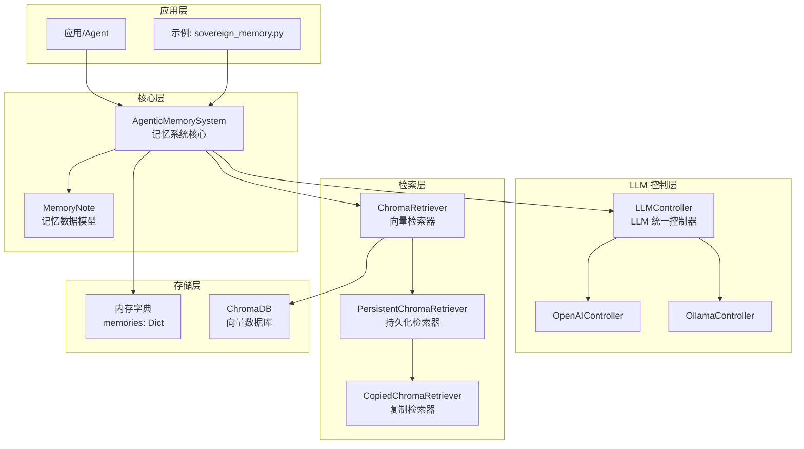

### 2. AgenticMemory

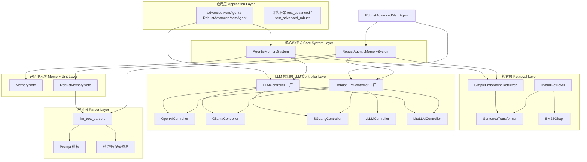

### 3. MemForest

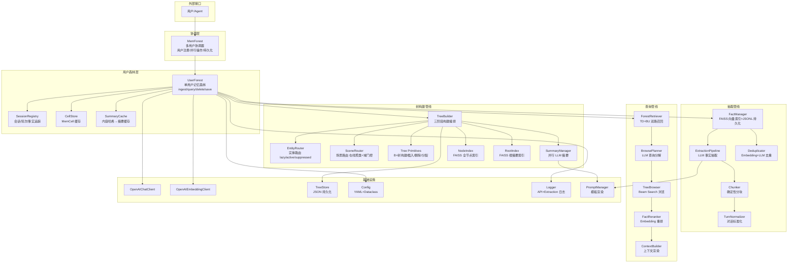

### 4. OpenClaw

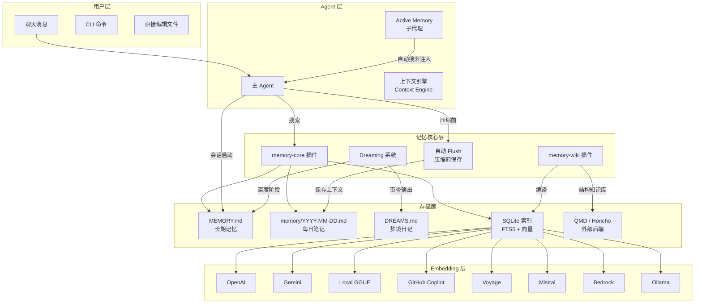

### 5. SimpleMem

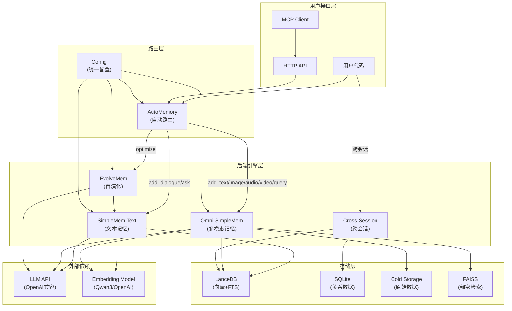

### 6. TencentDB-Agent-Memory

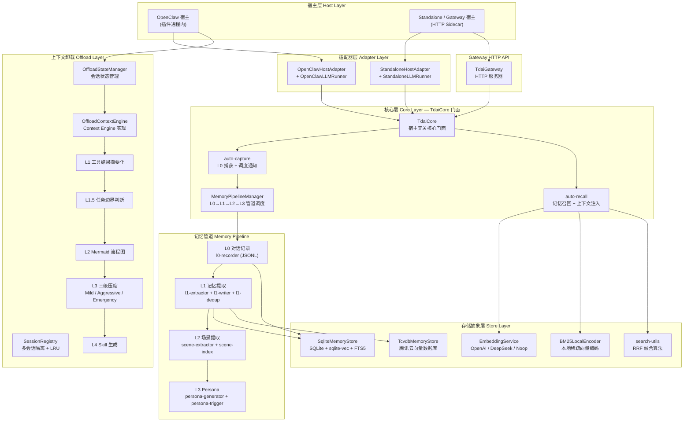

### 7. agentmemory

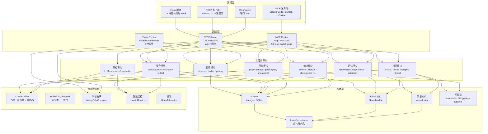

### 8. Basic Memory

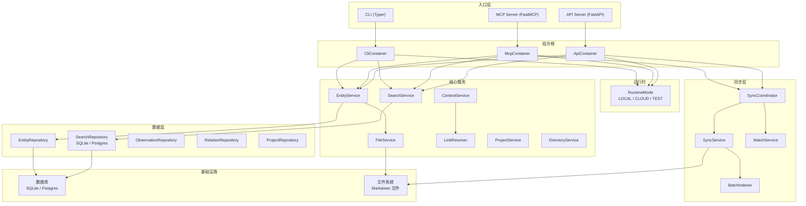

### 9. Graphiti

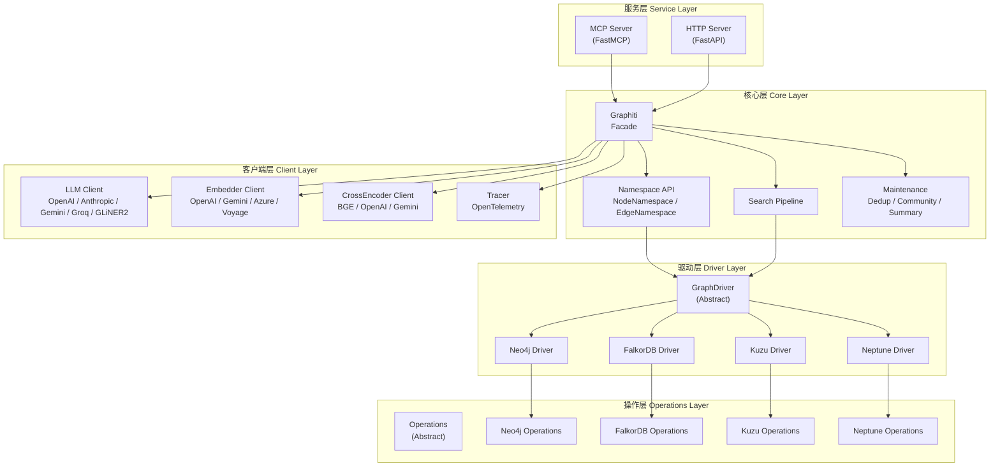

### 10. Hermes

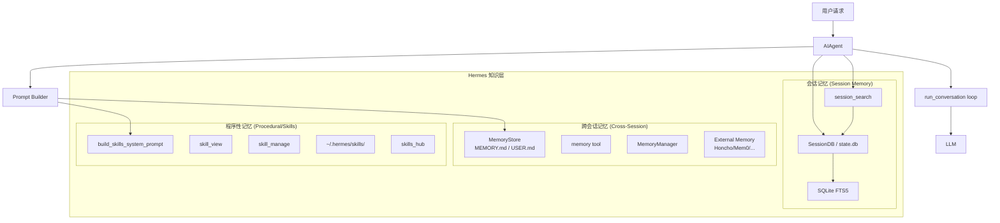

### 11. Khoj

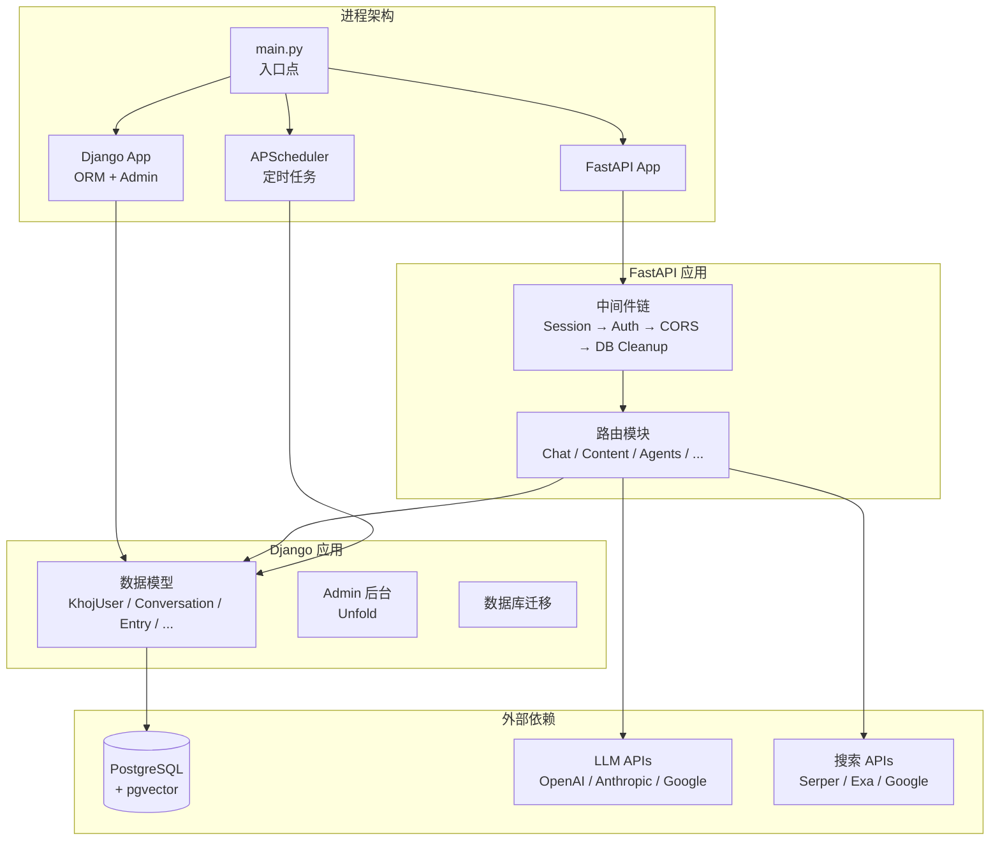

### 12. Letta

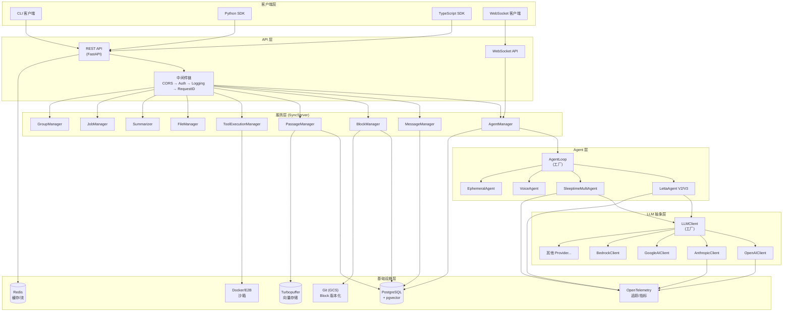

### 13. Mem0

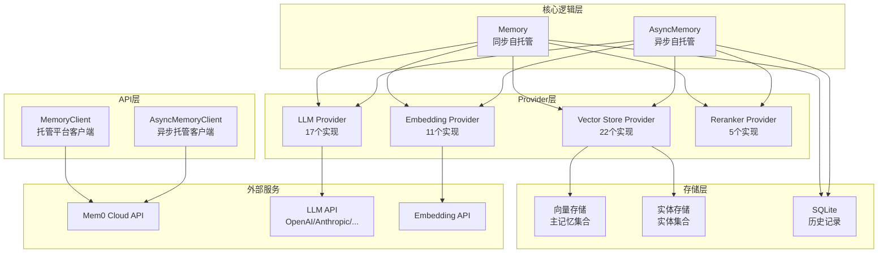

### 14. OpenSquilla

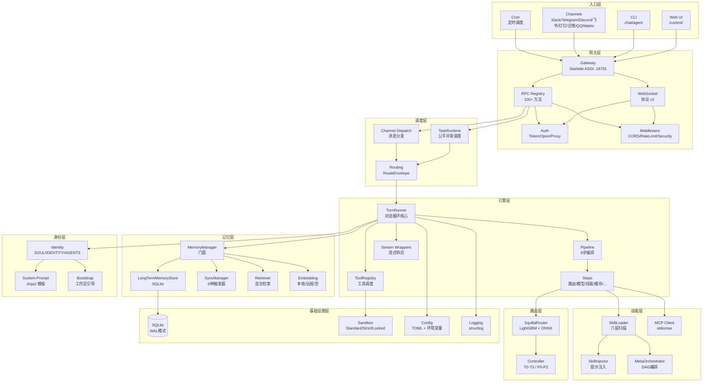

### 15. Supermemory

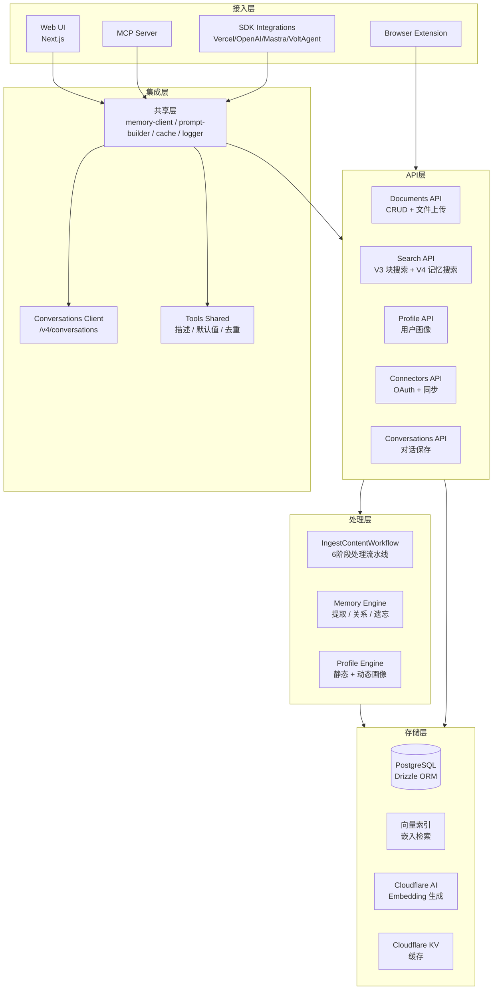

---

## 第三部分：大型知识库类项目架构对比

| 维度 | Graphiti | MemForest | Khoj | Supermemory | Mem0 | Basic Memory |
|---|---|---|---|---|---|---|
| **架构风格** | 知识图谱 Facade + 多驱动抽象 | B+树森林 + 三管线（抽取/构建/查询） | Web 全栈（FastAPI + Django） | 云原生流水线 + 多接入层 | Provider 抽象 + 托管/自托管双模式 | 文件优先 + 同步协调（文件↔DB 双向） |
| **存储后端** | Neo4j / FalkorDB / Kuzu / Neptune（4 种图数据库） | FAISS + JSONL + JSON | PostgreSQL + pgvector | PostgreSQL + Cloudflare AI/KV | 22 种向量存储 + SQLite | SQLite / Postgres + Markdown 文件 |
| **知识表示** | 节点/边/社区（图结构） | 事实 → B+树节点 → 森林（层次树结构） | Entry 实体 + 对话历史（关系型） | 文档块 → 记忆 → 关系 → 画像（多层结构） | 记忆 + 实体 + 关系（向量+实体混合） | Entity + Observation + Relation（Markdown 语义三元组） |
| **索引策略** | 图遍历 + 向量索引 + 社区检测 | FAISS 全节点索引 + 根摘要索引 + 事实向量索引 | pgvector 向量索引 + Django ORM | 向量嵌入索引 + Drizzle ORM 查询 | 向量存储原生索引 + 实体集合索引 | SQLite FTS5 全文 + 向量索引 + 文件路径映射 |
| **检索方式** | 图遍历 + 向量搜索 + 重排序 | TD（自顶向下）+ BU（自底向上）双路召回 + Beam Search + 重排 | 向量相似度 + 全文搜索 + 混合 | V3 块搜索 + V4 记忆搜索 | 向量搜索 + 实体关联 + Reranker 重排 | 全文搜索 + 语义搜索 + 上下文构建 |
| **扩展性设计** | 驱动/操作双层抽象，新增图数据库只需实现 Driver + Operations | 管线式设计，各阶段可独立替换 | Django 迁移 + FastAPI 路由模块化 | Cloudflare Workers 无服务器 + API 模块化 | Provider 工厂模式，17 LLM / 11 Embedding / 22 VS 可插拔 | 运行时模式（LOCAL/CLOUD/TEST）+ 组合根依赖注入 |
| **多用户支持** | 命名空间隔离（NodeNamespace / EdgeNamespace） | 多用户森林协调器，用户注册/并行操作/持久化 | Django 用户模型 + 会话隔离 | 用户画像引擎 + OAuth 连接器 | 托管平台多租户 + 自托管用户 ID 过滤 | 项目隔离 + 多项目支持 |

---

## 第四部分：个人 Agent 类项目架构对比

| 维度 | A-mem | AgenticMemory | SimpleMem | OpenClaw | TencentDB-Agent-Memory | agentmemory | hermes | letta | opensquilla |
|---|---|---|---|---|---|---|---|---|---|
| **架构风格** | 分层记忆系统 + LLM 控制 | 标准/健壮双轨 + 混合检索 | 自动路由 + 多引擎后端 | 插件化 + 文件即记忆 | 管道分层 + 宿主适配 | 事件驱动 + 多路由 | 三层知识 + Agent 循环 | 服务化 + 多 Agent 类型 | 网关调度 + 8 步编排 |
| **存储后端** | ChromaDB + 内存字典 | ChromaDB / SentenceTransformer | LanceDB + SQLite + FAISS | Markdown + SQLite FTS5 | SQLite + sqlite-vec + 腾讯云向量库 | SQLite + BM25/Vector/Graph 索引 | SQLite FTS5 + Markdown | PostgreSQL + pgvector + Redis + Turbopuffer | SQLite WAL |
| **记忆层次** | 单层（MemoryNote） | 双层（MemoryNote / RobustMemoryNote） | 四引擎（Text/Omni/Evolve/Cross） | 三层（MEMORY.md / 每日笔记 / 梦境） | 四级管道（L0→L1→L2→L3） | 六模块（捕获/压缩/记忆/搜索/整合/图谱） | 三层（会话/跨会话/程序性） | 多层（Block/Passage/Message/Summary） | 单层（LongTermMemoryStore） |
| **LLM 集成** | LLMController（OpenAI/Ollama） | 7 种控制器（OpenAI/Ollama/SGLang/vLLM/LiteLLM） | OpenAI 兼容 API | 8 种 Embedding 后端 | OpenAI / DeepSeek / Noop | 7 种 LLM Provider + 降级链 + 熔断器 | LLM（通过 Agent 循环） | 4+ Provider（OpenAI/Anthropic/Google/Bedrock） | 多模型路由（LightGBM + ONNX） |
| **上下文管理** | LLM 控制记忆增删改 | 解析验证层 + 启发式修复 | 自演化优化 + 跨会话迁移 | 上下文引擎 + Dreaming 整合 + 自动 Flush | 4 级上下文卸载（摘要→边界→流程图→压缩→Skill） | 压缩模块 + 整合模块 | Prompt Builder + 记忆注入 | Summarizer + Block 版本化 + 上下文窗口管理 | 8 步 Pipeline 编排 + 流式响应 |
| **工具/集成** | 无 | 评估框架 | MCP + HTTP API | CLI + Chat + 文件编辑 + Wiki + 外部后端 | OpenClaw 插件 + HTTP Gateway | 53 MCP Tools + 128 REST + 14 Hook + Web Viewer | 技能系统 + 外部记忆 Provider | CLI + Python/TS SDK + WebSocket + 沙箱 + MCP | 8+ 渠道 + 100+ RPC + 技能六层扫描 + MCP |
| **部署模式** | Python 库 | Python 库 | Python 库 + MCP + HTTP | CLI + 插件模式 | 插件进程内 + HTTP Sidecar | MCP Server + REST Server + Web Viewer | CLI + Agent 循环 | REST API + WebSocket + 多 SDK + Docker | ASGI 网关 + 多渠道 + CLI + Web UI |

---

## 第五部分：两类架构的相似性分析

### 1. 分层架构（Layered Architecture）

两类项目均采用分层架构，但分层的驱动力不同：

- **大型知识库类**按**知识抽象层级**分层：从原始数据摄入 → 结构化抽取 → 索引构建 → 检索服务 → API 暴露，每一层对应知识从"粗糙"到"精细"的转化过程。例如 Graphiti 的驱动/操作双层抽象、MemForest 的抽取/构建/查询三管线、Supermemory 的 6 阶段处理流水线。
- **个人 Agent 类**按**记忆生命周期/可用性**分层：从即时对话 → 短期工作记忆 → 长期持久记忆 → 元认知/技能，每一层对应记忆从"易失"到"持久"的演化过程。例如 TencentDB-Agent-Memory 的 L0→L3 四级管道、Hermes 的会话/跨会话/程序性三层、OpenClaw 的 MEMORY.md / 每日笔记 / 梦境三层。

**共同本质**：分层是为了管理复杂性——将不同关注点隔离到不同层级，使每层可独立演化。

### 2. 混合检索（Hybrid Retrieval）

两类项目均采用混合检索策略，但侧重点不同：

- **大型知识库类**侧重**结构化 + 非结构化**结合：Graphiti 的图遍历 + 向量搜索 + 重排序、MemForest 的 TD+BU 双路召回 + Beam Search + Embedding 重排、Mem0 的向量搜索 + 实体关联 + Reranker 重排。核心诉求是在大规模知识库中兼顾**精确结构化查询**与**模糊语义匹配**。
- **个人 Agent 类**侧重**精确 + 模糊**结合：AgenticMemory 的 Embedding + BM25 混合检索、agentmemory 的 BM25 / Vector / Graph / Hybrid 四模式、TencentDB-Agent-Memory 的 RRF 融合检索。核心诉求是在有限上下文窗口中**最大化相关记忆的召回率**。

**共同本质**：单一检索模式无法覆盖所有查询意图，混合检索通过多路召回 + 融合排序提升鲁棒性。

### 3. LLM 驱动处理（LLM-Driven Processing）

两类项目均深度依赖 LLM，但应用场景不同：

- **大型知识库类**将 LLM 用于**知识抽取与结构化**：Graphiti 的实体/关系抽取与社区摘要、MemForest 的事实抽取与去重、Supermemory 的记忆提取/关系/遗忘引擎。LLM 是将非结构化数据转化为结构化知识的"加工引擎"。
- **个人 Agent 类**将 LLM 用于**记忆演化与决策**：A-mem/AgenticMemory 的 LLM 控制记忆增删改、SimpleMem 的自演化优化、agentmemory 的压缩/整合/反思。LLM 是驱动记忆生命周期管理的"决策中枢"。

**共同本质**：LLM 提供了传统规则系统无法实现的语义理解能力，是两类系统"智能"的核心来源。

### 4. 向量化存储（Vector Storage）

两类项目均采用向量化存储，但选型倾向不同：

- **大型知识库类**注重**多样性和规模**：Graphiti 支持 4 种图数据库、Mem0 支持 22 种向量存储、Khoj/Supermemory 使用 PostgreSQL + pgvector。选型驱动力是**企业级部署的灵活性和可扩展性**。
- **个人 Agent 类**注重**轻量和本地化**：A-mem/AgenticMemory 使用 ChromaDB、OpenClaw/Hermes 使用 SQLite FTS5、OpenSquilla 使用 SQLite WAL。选型驱动力是**零运维和快速启动**。

**共同本质**：向量嵌入是连接语义空间与存储空间的桥梁，是语义检索的基础设施。

### 5. 记忆演化/整合（Memory Evolution/Consolidation）

两类项目均实现了记忆的动态演化，但目标不同：

- **大型知识库类**侧重**知识融合与去重**：Graphiti 的去重/社区检测/摘要维护、MemForest 的 Embedding+LLM 去重、Supermemory 的遗忘引擎。核心目标是保持知识库的**一致性和精简性**。
- **个人 Agent 类**侧重**记忆压缩与提炼**：SimpleMem 的 EvolveMem 自演化、agentmemory 的 consolidate/crystallize/reflect、TencentDB-Agent-Memory 的 4 级上下文压缩。核心目标是**在有限上下文窗口中保留最关键信息**。

**共同本质**：记忆不是静态的，必须随时间和交互不断演化，否则会退化为噪声。

---

## 第六部分：两类架构的差异性分析

### 1. 知识表示粒度

| | 大型知识库类 | 个人 Agent 类 |
|---|---|---|
| **粒度** | 粗粒度、高度结构化 | 细粒度、半结构化 |
| **典型表示** | Graphiti 的节点/边/社区图、MemForest 的 B+树森林、Basic Memory 的语义三元组 | A-mem 的 MemoryNote、OpenClaw 的 Markdown 片段、Hermes 的会话/跨会话/技能三层 |
| **原因** | 大型知识库需要支持复杂查询（多跳推理、聚合统计），粗粒度结构化表示才能支撑高效遍历和推理 | 个人 Agent 的记忆来源是碎片化的对话和交互，细粒度半结构化表示更灵活，能保留原始语义的丰富性 |

### 2. 存储选型

| | 大型知识库类 | 个人 Agent 类 |
|---|---|---|
| **选型倾向** | 企业级分布式 | 轻量本地化 |
| **典型方案** | Neo4j/PostgreSQL/Cloudflare（Graphiti/Khoj/Supermemory） | SQLite/ChromaDB/Markdown（OpenClaw/Hermes/A-mem） |
| **原因** | 大型知识库面向多用户、高并发、大数据量场景，必须依赖分布式存储的横向扩展能力和事务一致性保证 | 个人 Agent 面向单用户、低并发场景，零运维、快速启动是首要需求，嵌入式数据库和文件系统足以胜任 |

### 3. 检索复杂度

| | 大型知识库类 | 个人 Agent 类 |
|---|---|---|
| **复杂度** | 多跳图遍历 | 单跳意图路由 |
| **典型方式** | Graphiti 的图遍历 + 社区检测、MemForest 的 Beam Search 树浏览、Mem0 的实体关联 + Reranker | SimpleMem 的自动路由、OpenSquilla 的 LightGBM 意图路由、Hermes 的 FTS5 全文搜索 |
| **原因** | 大型知识库中的知识呈网状关联，回答复杂问题需要沿关系链多跳遍历；同时大规模数据需要更精细的检索策略（如 Beam Search）来平衡召回率和效率 | 个人 Agent 的记忆量相对有限，单次查询通常只需召回最相关的少量记忆，无需多跳推理；意图路由即可将查询分发到正确的记忆子集 |

### 4. 多租户需求

| | 大型知识库类 | 个人 Agent 类 |
|---|---|---|
| **需求强度** | 核心需求 | 非核心 |
| **典型实现** | Graphiti 的命名空间隔离、MemForest 的多用户森林协调器、Khoj 的 Django 用户模型、Supermemory 的 OAuth 连接器 | 大多数个人 Agent 项目无多租户设计；TencentDB-Agent-Memory 的 SessionRegistry 提供多会话隔离但非多用户 |
| **原因** | 大型知识库本质是共享知识基础设施，必须支持多用户/多团队/多项目的数据隔离与权限控制 | 个人 Agent 天然是单用户的，记忆的归属主体是唯一的 Agent 实例，多租户不是核心需求 |

### 5. 上下文管理策略

| | 大型知识库类 | 个人 Agent 类 |
|---|---|---|
| **策略** | 检索增强 | 上下文工程 |
| **典型方式** | Graphiti 的搜索管线返回结构化上下文、Khoj 的内容模块构建检索上下文、Mem0 的 Reranker 精排后注入 | TencentDB-Agent-Memory 的 4 级上下文卸载（摘要→边界→流程图→压缩）、OpenClaw 的 Dreaming 整合 + 自动 Flush、Letta 的 Summarizer + Block 版本化 |
| **原因** | 大型知识库的上下文管理目标是"找到最相关的知识片段"，核心挑战是检索质量 | 个人 Agent 的上下文管理目标是"在有限窗口中装下最关键的信息"，核心挑战是压缩与取舍——这是上下文工程的核心问题 |

### 6. 一致性要求

| | 大型知识库类 | 个人 Agent 类 |
|---|---|---|
| **要求** | 强一致性 | 最终一致性 |
| **典型体现** | Graphiti 的去重/社区检测确保图谱无冲突、MemForest 的 Embedding+LLM 双重去重、Basic Memory 的文件↔DB 双向同步 | agentmemory 的 consolidate/crystallize 异步整合、SimpleMem 的 EvolveMem 后台优化、OpenClaw 的 Dreaming 离线整合 |
| **原因** | 大型知识库作为共享知识基础设施，不一致的知识会导致错误的推理结果，影响所有用户 | 个人 Agent 的记忆是私有的、渐进演化的，短暂的不一致不会造成严重后果，异步整合反而能避免阻塞主交互流程 |

---

## 第七部分：架构演进趋势

### 1. 从静态存储到动态演化

早期记忆系统以"存取"为核心，记忆一旦写入便不再变化。当前趋势是记忆具有**生命周期**：创建 → 激活 → 整合 → 衰退 → 遗忘。Supermemory 的遗忘引擎、agentmemory 的 crystallize/reflect、SimpleMem 的 EvolveMem 都体现了这一趋势。未来记忆系统将更接近人类记忆的动态特性——记忆不是被存储的，而是被不断重构的。

### 2. 从单一检索到混合路由

从简单的向量相似度搜索，演进到 BM25 + 向量 + 图遍历的多路混合检索，再进一步演进到**智能路由**——系统自动判断查询意图，选择最优检索路径。OpenSquilla 的 LightGBM + ONNX 路由、SimpleMem 的 AutoMemory 自动路由、MemForest 的 BrowsePlanner 查询分解，都指向"检索即推理"的方向。

### 3. 从扁平记忆到分层架构

从单一的记忆存储，演进到按生命周期/可用性/抽象级别分层的多级记忆体系。TencentDB-Agent-Memory 的 L0→L3 四级管道、Hermes 的会话/跨会话/程序性三层、Letta 的 Block/Passage/Message/Summary 多层结构，都体现了"不同层级的记忆服务于不同时间尺度的需求"这一设计哲学。

### 4. 从中心化到可插拔架构

从紧耦合的单体系统，演进到高度可插拔的模块化架构。Mem0 的 17 LLM / 11 Embedding / 22 VS Provider 工厂、Graphiti 的驱动/操作双层抽象、agentmemory 的 7 种 LLM Provider + 降级链 + 熔断器，都体现了"面向接口编程，而非面向实现编程"的原则。可插拔架构降低了切换成本，提高了系统韧性。

### 5. 从独立系统到协议化集成

从各自为政的独立系统，演进到基于标准协议的互联互通。MCP（Model Context Protocol）成为事实标准——Basic Memory、agentmemory、Supermemory 均提供 MCP Server；Letta 提供 Python/TS 双 SDK；OpenSquilla 支持 8+ 渠道接入。协议化集成使记忆系统从"孤岛"变为"基础设施"，可被任何 Agent 框架调用。

### 6. 从通用设计到场景特化

从"一刀切"的通用记忆方案，演进到针对特定场景的特化设计。Letta 的 SleeptimeMultiAgent（后台整理）、VoiceAgent（语音场景）、EphemeralAgent（临时任务）；OpenSquilla 的 Controller 分级（T0-T3 / P0-P2）；TencentDB-Agent-Memory 的上下文卸载 4 级压缩，都是针对特定场景的深度优化。场景特化意味着在通用性与性能之间选择了性能。

### 7. 上下文工程成为核心能力

随着 LLM 上下文窗口从 4K 扩展到 128K+，"如何填充上下文"比"上下文有多大"更重要。上下文工程（Context Engineering）正在取代提示工程（Prompt Engineering）成为核心能力。TencentDB-Agent-Memory 的 4 级上下文卸载、Letta 的 Summarizer + Block 版本化、OpenClaw 的 Dreaming 整合 + 自动 Flush，都在解决同一个问题：**在有限的注意力预算内，最大化上下文的信息密度**。未来，上下文工程将成为 Agent 系统的核心竞争力。
